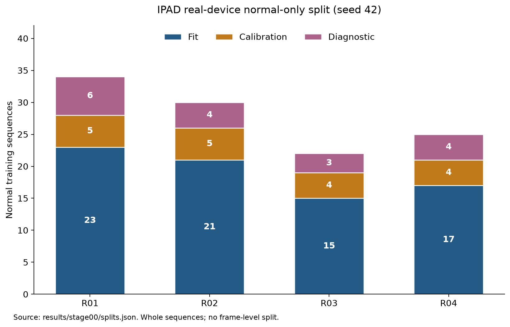

# IPAD × DINOv3 / V-JEPA 2.1

정상 공정 영상으로 위상별 프로토타입 메모리를 구성하고, **디코더 없이 특징 잔차와 시간적 위상 이탈**로 이상을 탐지한다.
IPAD 실제 장비 R01–R04에서 두 백본의 **온라인·오프라인** 정확도와 실제 알람 지연을 비교한다.

`16프레임 → 백본 특징 → 위상 예측 → 정상 메모리 검색 → 특징·시간 점수 → 알람`

## 현재 공개 결과

**고정 백본의 두 모델 × 두 모드 × 네 장비 비교를 3 seeds로 완료했다. LoRA·IPAD 전체 기준선·추가 실험·실시간 측정은 진행 중이다.**
학습 111개 영상/50,642프레임, 실제 테스트 66개 영상/33,462프레임을 확인했다. 정상 분할은 fit 76개·검증 18개·진단 17개다.
R02/12·13·14는 정확한 라벨 정렬이 미확정이다. ±1 인덱스 가정에 따른 18프레임 제외와 오프셋 민감도를 [Stage 00](docs/STAGE00.md)에 기록했다. 고정 백본 비교는 같은 31,728개 유효 테스트 프레임을 사용한다.



네 장비 동일 가중치 Macro4이며, 각 장비의 seed 0/1/2 지표를 먼저 평균했다. 아래는 주 방법 P3의 결과다.

| 백본 | 모드 | P3 Macro AUROC / AP (%) | p95 전체 지연 | 지속 FPS |
|---|---|---:|---:|---:|
| DINOv3-L | 오프라인 | 64.15 / 55.10 | — | — |
| DINOv3-L | 온라인 | 66.37 / 55.92 | — | — |
| V-JEPA 2.1-L | 오프라인 | 55.59 / 47.14 | — | — |
| V-JEPA 2.1-L | 온라인 | 56.35 / 48.39 | — | — |

| P3 온라인−오프라인 | AUROC 차이 / 95% CI (pp) | AP 차이 / 95% CI (pp) |
|---|---:|---:|
| DINOv3-L | +2.22 (+0.13..+4.33) | +0.82 (-0.68..+2.43) |
| V-JEPA 2.1-L | +0.76 (-1.64..+3.26) | +1.25 (-0.08..+2.87) |

온라인 P3의 V-JEPA−DINOv3 차이는 AUROC **-10.02 (-14.49..-5.18)pp**, AP **-7.52 (-12.08..-2.00)pp**다. CI는 장비별 영상 단위 paired bootstrap 1,000회로 계산했다. 정상 학습 경계와 별도 head·메모리가 모드별로 다르므로, 전체 프로토콜의 비교다. 아래 실시간 부분 측정은 한 장비·seed의 결과이며 이 Macro4 표의 속도 수치를 채우지 않는다.

DINOv3-L 온라인 R01 seed 0의 **BF16 전체 재계산**은 전체 테스트 15개 영상을 30 FPS FIFO로 재생해 **지속 16.46 FPS, p50/p95 전체 지연 3.47/7.17초, peak allocated VRAM 1,577.67 MiB**를 기록했다. 프레임 drop 없이 큐가 증가했으며 CSV에서 입력·지연·정상 q99·점수·알람·GT 지표를 검증했다. [실제 비용·큐 그래프와 이벤트 결과](docs/STAGE05.md#첫-실제-fifo-측정) 및 [원본 CSV·검증 기록](results/stage05/runtime/frozen/dinov3-l/online/R01/seed0/bf16/full)을 제공한다. 한 번의 파일 재생 측정이며 전체 세-seed·최대 FPS·카메라 성능·최적화 동등성을 뜻하지 않는다.


P3의 개선은 장비별로 달랐다. R01 DINOv3 P3는 전역 메모리 P0보다 낮았고, R03 V-JEPA P3는 AUROC 50% 부근이었다. V-JEPA 온라인 P2 평균이 P3보다 높다. 테스트에 맞춰 점수 부호·선택 epoch·임계값을 바꾸지 않았다. P0–P3 전체 수치, 장비별 편차, ROC/PR, 위상·시계열 그래프와 해석은 [오프라인 Stage 02](docs/STAGE02.md), [온라인·모드 비교 Stage 03](docs/STAGE03.md)에 제공한다.

IPAD 공개 모델의 **R01 세 seeds**는 각각 50 epoch 학습·평가를 완료했다. 평균 AUROC/AP는 B0 픽셀 **81.51/59.79%**, B1 특징 잔차 **68.72/50.65%**다. 같은 3,295개 평가 프레임의 DINOv3 LoRA P3 **80.21/71.53%**와 직접 비교하면, B0 대비 두 차이 CI는 0을 포함하고 B1 대비 AP 차이는 **+20.88pp [3.46, 33.69]**였다. V-JEPA LoRA P3는 두 IPAD 기준선보다 낮았다. [동일 프레임의 여섯 방법 비교·paired CI·그래프·재현 차이](docs/STAGE01.md#ipad와-특징-기반-p3의-동일-프레임-직접-비교)를 제공한다. 한 장비·오프라인의 전체 프로토콜 비교이며 디코더 제거만의 효과나 동등성을 입증하지 않는다.

시간 이력 5·15·31의 144개 고정 백본 조건도 같은 정상 보정·평가 구간에서 비교했다. 온라인 두 백본의 장기 이력 개선량은 AUROC/AP 모두 CI에 0을 포함했다. [상세 수치·그래프·재현 검증](docs/ABLATION_HISTORY.md)을 제공하며 기본 이력 5를 유지한다.

이웃 수 k=1·5·10의 **144개 고정 백본 조건**을 완료했다. k=5의 기존 48개 실험 점수·알람과 정상 임계값을 검증했다. DINOv3 오프라인 k=10의 Macro4 개선량은 AUROC/AP **+0.72/+0.43pp**였으나 모든 백본·모드에서 일관된 우위는 없었다. [전체 수치·paired CI·그래프·검증 근거](docs/ABLATION_NEIGHBOURS.md)를 제공하며 기본 k=5를 유지한다.

메모리 크기 1,024/2,048/4,096개와 위상 8/16 bins의 **192개 조건**도 GPU 평가·독립 검증을 완료했다. 기본 48조건의 메모리·점수·알람을 정확히 재현하고 정상 q99 192개를 재계산했다. V-JEPA의 4,096개 조건은 오프라인/온라인 Macro4 AUROC·AP가 기본 대비 **+4.79/+3.49pp, +3.26/+2.94pp**였고 두 모드의 두 paired CI 모두 0을 포함하지 않았다. DINOv3의 4,096개 차이는 두 모드의 두 CI 모두 0을 포함했다. [전체 수치·paired CI·6개 그래프·검증 근거](docs/ABLATION_MEMORY.md)를 제공하며 기본 16 bins·2,048개를 유지한다.

8·16프레임 비교는 신규 정상 헤드/메모리를 학습하는 **48개 조건 중 6개**를 검증했다. DINOv3 오프라인 R01·R02 각각 세 seeds를 완료했다. 8프레임 P3 AUROC/AP는 R01 **44.71/32.20%**, R02 **78.16/62.84%**다. 16프레임 대비 R01 차이 **−2.31/−1.01pp**의 두 CI는 0을 포함하지만 R02 차이 **−1.68/−2.26pp**의 두 CI는 음수였다. [장비별 수치·paired CI·그래프·입력 문맥·재현 명령](docs/ABLATION_CLIP_FRAMES.md)을 제공한다. 전체 Macro4와 실시간 결과는 아직 없다.

패치·공간 평균 특징의 **96개 조건** 중 DINOv3 오프라인 R01의 세-seed 쌍을 검증했다. 두 표현 모두 정상 fit stride 1·공유 head를 사용한 P3 AUROC/AP는 패치 **75.75/59.49%**, 평균 **71.45/55.26%**이며 두 paired CI는 0을 포함한다. [부분 결과·CI·그래프·통제 조건·재현 명령](docs/ABLATION_REPRESENTATION.md)을 제공한다. 기존 stride 4 P3와 다른 학습 조건이며 전체 Macro4는 아직 없다. R02 seed 0의 20-epoch 공유 위상 헤드 산출물도 감사했다. [정상 학습 곡선·검증 범위](docs/ABLATION_REPRESENTATION.md#r02-seed-0의-공유-위상-헤드-학습-산출물)를 제공하며 두 표현의 메모리·테스트 평가는 아직 남아 있다.

작은 **DINOv3-B / V-JEPA 2.1-B**의 온라인 24조건 중 DINOv3 R01 세 seeds를 독립 검증했다. P3 AUROC/AP는 B **43.86/31.35%**, 대응하는 L **53.69/36.92%**이며 B−L paired CI는 두 지표 모두 0보다 낮다. [부분 결과·CI·정확도/파라미터 그래프·모델 출처·재현 경로](docs/SMALL_BACKBONES.md)를 제공한다. 이 결론은 R01 온라인에 한정하며 전체 Macro4·실시간 성능은 아직 없다.

정상 진단 17개 영상에 고정한 **49시나리오**(시간·외관·모든 혼합 조합)의 전체 GPU 평가도 시작했다. [변환/증거 유형 도식·규칙·코드](docs/DIAGNOSTICS.md)를 제공하며 실제 confusion·Macro-F1은 검증 후 공개한다.

두 백본의 **R01 오프라인 LoRA seeds 0/1/2**를 모두 20 epoch 학습·선택 특징/메모리 재구성·전체 테스트·독립 검증했다. 같은 3,295개 GT target에서 각 seed 지표를 평균한 주 P3 결과다.

| R01 오프라인 P3 | 고정 백본 AUROC / AP (%) | LoRA AUROC / AP (%) |
|---|---:|---:|
| DINOv3-L | 47.01 / 33.21 | **80.21 / 71.53** |
| V-JEPA 2.1-L | 37.58 / 28.83 | **37.98 / 29.76** |

LoRA의 V-JEPA−DINOv3 차이는 **AUROC −42.24pp [−51.30, −33.33], AP −41.76pp [−50.26, −29.44]**다. 고정 백본 대비 DINOv3 P3 개선은 **+33.20/+38.32pp**이고 두 paired CI가 양수였으며, V-JEPA의 **+0.40/+0.93pp** 차이는 두 CI에 0을 포함했다. [백본 비교·학습/개별/세-seed 그래프·전체 P0–P3·검증 근거](docs/STAGE04.md#r01-오프라인-첫-두-백본-세-seed-lora-비교)를 제공한다. **한 장비·오프라인 결과**이며 전체는 **13/48조건** 완료했다. 다른 장비·온라인 LoRA·Macro4·실시간 비교는 남아 있다. CI는 1,000회 paired 영상 재표집이며 seed 자체를 재표집하지 않았다.

고정 정상 q99·3프레임 연속 알람에서 R01 오프라인 DINOv3 LoRA는 8개 GT 구간 중 seed별 **8·8·7개**를 탐지했지만 정상 프레임 알람 비율은 평균 **5.79%**였다. V-JEPA LoRA는 **0·1·2개**, 정상 알람 비율 **1.05%**였다. [고정 백본 48조건·LoRA 6조건의 캐시 알람 검증·장비/모드별 그래프](docs/STAGE05.md#캐시의-고정-임계값-알람-coverage)를 제공한다. 공통 프레임 구간의 결과이며 실시간 지연·온라인 EOF 탐지를 뜻하지 않는다.

순차 이벤트 평가와 30 FPS FIFO 측정 코드는 [Stage 05](docs/STAGE05.md)에 있다. `—`는 해당 전체 비교에서 미측정이다.

실시간 파일 재생은 **DINOv3-L 온라인 R01 seeds 0/1에서 여섯 실행**을 완료했다. seed 0의 30 FPS 도착·FIFO·drop 없음에서 BF16 full/buffer는 **16.46/17.05 FPS**, target p95 **7,172/6,314 ms**였고 점수·알람이 정확히 일치했다. 별도 FP32 full/reuse는 **5.09/29.91 FPS**, p95 **44,064/37.64 ms**였으나 **reuse는 세 영상에서 사전 점수 게이트에 실패**했다(알람 불일치 0). [비교 그래프·전체 trace·실패 근거](docs/STAGE05.md#같은-조건의-버퍼특징-재사용-실측)를 제공하며 seed 1 BF16 full/buffer도 **17.24/18.25 FPS**, p95 **6,424/5,614 ms**로 gate를 통과했으나 고정 q99에서 이벤트 8개를 모두 미탐했다. 전체 장비·시드·백본·LoRA의 실시간 비교는 남아 있다. FP32 실패 pair의 3,400 target 재검사에서 위상 bin 전환은 0개였고 raw 점수 gate 위반 3개를 확인했다. [실패 지점 그래프·원인 범위](docs/STAGE05.md#fp32-재사용-점수-불일치의-trace-진단)를 제공한다. 세 실패 지점의 별도 GPU 캡처는 원래 raw 점수를 정확히 재현했다. [특징·이웃 선택 진단과 그래프](docs/STAGE05.md#gpu-검색-중간값-캡처와-독립-비교)에서 FP64 거리만으로는 두 지점의 불일치가 남았으며 원래 parity 실패를 유지한다.

R02 오프라인 두 백본도 **seeds 0/1/2의 20-epoch 학습·전체 평가·독립 감사**를 완료했다. 주 P3의 세-seed 평균이다.

| R02 오프라인 P3 | 고정 AUROC / AP (%) | LoRA AUROC / AP (%) |
|---|---:|---:|
| DINOv3-L | 79.84 / 65.11 | **83.11 / 70.23** |
| V-JEPA 2.1-L | 63.10 / 42.55 | **66.09 / 49.15** |

고정 대비 DINOv3 차이는 **+3.28/+5.13pp**로 두 paired CI가 양수였다. V-JEPA 차이는 **+2.99/+6.60pp**이며 AUROC CI는 0을 포함하고 AP CI는 양수였다. LoRA의 V-JEPA−DINOv3 차이는 **AUROC -17.02pp [-26.15, -8.17], AP -21.08pp [-35.63, -4.68]**다. [세-seed 평균·전체 P0–P3·paired CI·학습/개별/백본 그래프](docs/STAGE04.md#r02-오프라인-두-백본의-세-seed-lora-비교)를 제공한다. 정상 encoder/head·메모리·보정을 함께 바꾸는 프로토콜 비교다.

고정 q99의 R02 평균 구간 탐지율은 DINOv3 **36.67→48.33%**, V-JEPA **25.00→33.33%**였다. 정상 경보 프레임 비율은 각각 **0.7400→0.4419%**, **0.1278→0.1704%**였다. [전체 60조건·개별 seed·평균·알람 그래프](docs/STAGE05.md#r02-v-jepa의-세-seed-고정-임계값-알람-집계)를 제공한다. 알람 평균에는 CI를 계산하지 않았고 실제 FPS·방출 지연을 뜻하지 않는다.

모든 seed에서 개선된 결과는 아니다. V-JEPA seed 1은 ranking AP 개선에도 q99 구간 탐지 **7→3개**, 정상 경보 **3→20프레임**이었다. [단일 결과·점수 분포 분석](docs/STAGE05.md#v-jepa-r02-seed-1의-점수-분포와-q99-통과)을 함께 제공한다. Seed 2의 P3는 **61.86/40.69%**, 고정 대비 **−2.09/−1.68pp**이며 두 CI는 0을 포함했다. q99 구간 탐지는 **5→4개**, 정상 경보는 **20→3프레임**이었다. [단일 seed 탐지·오탐 비교](docs/STAGE05.md#v-jepa-r02-seed-2의-고정-임계값-알람-비교)를 보존한다. R02/12·13·14 정렬은 미확정이며 기존 공통 18프레임 제외 규칙을 유지했다.

**주 LoRA 13/48조건·4/16 세-seed 그룹** 완료 상태다. R01·R02 두 백본과 R03 DINOv3 seed 0의 오프라인 결과이며, 후속 seed·장비·온라인 LoRA·Macro4·전체 실시간 비교는 남아 있다. DINOv3 R03 seed 0의 **20 epoch·6,420 updates** 정상 학습도 완료했고 CE 기준 epoch **19**을 선택했다. 17개 테스트·독립 검증을 완료한 P3 AUROC/AP는 **62.66/56.68%**다. 고정 백본 대비 **+1.58/+4.25pp**, 두 paired CI는 각각 **0 포함/0 포함**다. 고정 q99에서 구간 탐지는 **6→10/17개**, 정상 경보는 **45→107프레임**으로 함께 늘었다. [탐지·오탐 그래프](docs/STAGE05.md#dinov3-r03-seed-0의-고정-임계값-알람-비교)를 제공한다. [전체 점수·CI·ROC/PR·궤적](docs/STAGE04.md#dinov3-r03-오프라인-seed-0의-완료된-전체-평가)를 제공한다.

LoRA teacher 손실 가중치 **0 대 1** 비교의 신규 48조건도 별도 경로에서 시작했다. 기존 가중치 1과 같은 데이터·seed·학습 코드로 가중치 0을 학습하고 선택 특징·메모리·보정을 다시 구성한다. [통제 조건·손실 도식·실행/검증 근거](docs/ABLATION_TEACHER_WEIGHT.md)를 제공하며 완료된 정확도·CI는 아직 없다.

전체 LoRA와 teacher 0/1 비교의 [독립 검증·집계·그래프 명령](docs/STAGE04.md)은 완료된 seed를 검사하고, 같은 조건의 seeds 0/1/2가 모두 검증된 그룹만 평균·CI·시각화에 포함한다. 전체 Macro4는 네 장비가 모두 완료되어야 제공한다.

완료된 DINOv3 LoRA R01 오프라인 seed 0의 재생성 가능한 특징 배열 **86개·6.38 GiB**를 사용자 승인 조건에 따라 정리했다. metadata/target·선택 모델·메모리·결과를 보존하고 사후 재검증을 통과했다. [용량/보존 그래프·의존성 확인·실행 근거와 학습 재개 명령](docs/STAGE04.md#첫-실제-캐시-정리와-사후-재검증)을 제공한다.


## 재현 환경

```bash
uv venv --python python3.12 .venv
source .venv/bin/activate
export UV_CACHE_DIR="$PWD/artifacts/uv-cache"
export MPLCONFIGDIR="$PWD/artifacts/mpl-cache"
export CUDA_CACHE_PATH="$PWD/artifacts/cuda-cache"
mkdir -p artifacts/tmp
export TMPDIR="$PWD/artifacts/tmp"
uv pip install torch==2.8.0 torchvision==0.23.0 --index-url https://download.pytorch.org/whl/cu128
uv pip install -e '.[test,gpu]'
export IPAD_DATA_ROOT=/absolute/path/to/IPAD_dataset/IPAD_dataset
python scripts/bootstrap_upstreams.py
ipad-audit --data-root "$IPAD_DATA_ROOT"
ipad-plot-audit
python -m pytest -q
```

CUDA 학습·검증은 GPU 접근이 허용된 환경에서 실행한다. 이 작업 환경에서는 샌드박스 내부 드라이버 접근이 제한됐으며, 샌드박스 밖에서 RTX PRO 6000과 BF16 연산을 확인했다.

## 모델 준비

```bash
python scripts/download_models.py --model vjepa21-l
python scripts/download_models.py --model dinov3-l --user-mirror
```

가중치는 `artifacts/weights`에 저장하며 Git에서 제외한다. [DINOv3 공식 README](https://github.com/facebookresearch/dinov3#pretrained-models)는 모델 사용 승인 후 이메일의 URL 사용을 안내한다.
기본 공식 주소는 HTTP 403, [공식 Hugging Face 모델](https://huggingface.co/facebook/dinov3-vitl16-pretrain-lvd1689m)은 수동 승인/인증이 필요했다.
사용자가 지정한 [PIA-SPACE-LAB 배포 경로](https://huggingface.co/PIA-SPACE-LAB/dinov3-vitl-pretrain-lvd1689m)에서 동일 파일을 취득했다.
로컬 SHA256 `8aa4cbddda325040fc78db2c272754af6ebe8ff2c55f6ec4f1964d8890f66035`가 미러의 전체 해시와 일치하며, 공식 파일명 해시 접두어 일치와 공식 코드의 엄격한 가중치 로딩도 확인했다. 해당 배포 경로는 공식 Meta 호스팅이 아닌 사용자 제공 미러로 기록한다.

```bash
python scripts/smoke_backbone.py --model vjepa21-l \
  --upstream third_party/vjepa2 \
  --weights artifacts/weights/vjepa2_1_vitl_dist_vitG_384.pt \
  --sequence "$IPAD_DATA_ROOT/R01/training/frames/01"
```

V-JEPA 2.1의 엄격한 가중치 로딩과 실제 정상 16프레임 GPU 연산을 통과했다. 패치 출력은 `1×576×1024`, 위상 입력은 `1×1024`, 백본 학습 파라미터는 0이다.
모델 smoke 결과는 형태·엄격한 가중치 로딩·실제 영상 연산 검증이다. cold forward 시간을 FPS 또는 이상탐지 성능으로 해석하지 않는다.
두 백본 모두 동일한 출력 형태와 백본 고정을 확인했다. 근거는 [환경 메타데이터](results/setup/environment.json), [V-JEPA GPU smoke](results/setup/vjepa21-l_smoke.json), [DINOv3 GPU smoke](results/setup/dinov3-l_smoke.json)에 있다.

CI는 핵심 검증과 업로드 검사를 실행한다. 정상 분할·위상·메모리·LoRA·기준선·resume·업로드 제외, Macro4 비중·paired bootstrap, 온라인 EOF 알람·FIFO 입력·이벤트 지연과 GPU 동시 작업 거부를 확인한다. LoRA 런타임의 선택 adapter·joint head·재구성 메모리와 paired 입력 출처, 이웃 수별 고정 메모리 검색·인과적 알람·PCA layout 보존, 8프레임 입력 경계·padding·공통 평가 구간, 패치/평균 표현의 같은 위상 head·GT/추론 구간과 실제 공간 평균, B 모델의 768차원 캐시·입력 출처·정상 분할도 검증한다. 재생 제어는 CPU 모형으로 검증했으며 실제 GPU 처리량을 입증하지 않는다. 실제 학습·추론 근거는 각 Stage에 별도로 기록한다.

전체 실험 행렬은 [experiment_matrix.yaml](configs/experiment_matrix.yaml)에 고정했다. 이 목록은 전체 요구 범위이며 완료 여부는 실제 결과로 확인한다.

## 실험·업로드 원칙

- 정상 학습 데이터만으로 PCA·메모리·LoRA 구성; 정상 검증으로 임계값 설정.
- 각 장비·seed·백본·모드의 공통 대상 프레임에서 비교; 테스트 영상별 min-max 정규화 금지.
- 온라인 입력은 `[t−15,…,t]`, 오프라인은 `[t−8,…,t+7]`; 실제 알람 지연에는 미래 프레임 대기도 포함.
- 단계별 코드·설정·지표 JSON/CSV·그래프 생성 코드·PNG/SVG를 함께 업로드.
- 원본 영상/이미지, 모델, 체크포인트, 특징 캐시, PCA·메모리 텐서는 업로드하지 않음.
- 업로드 전 `ipad-upload-check`; 파일별 10MiB 이하; 완료된 단계만 완료 태그 생성.

## 구현 상태

| 단계 | 상태 |
|---|---|
| 00 데이터 검증 | 감사·분할·그래프 완료, 라벨 정렬 검토 중 |
| 01 IPAD 기준선 | R01 세 seeds의 50 epoch 학습·평가·평균/paired CI·그래프 완료; 다른 장비·reference 조건 남음 |
| 02 오프라인 비교 | R01–R04 두 백본 3 seeds 완료, 두 백본 Macro4 확보 |
| 03 온라인 비교 | R01–R04 두 백본 3 seeds 완료, 온라인 Macro4 확보; 실시간 측정 남음 |
| 04 LoRA·추가 실험 | LoRA 13/48조건 검증; R01·R02 오프라인 두 백본의 세-seed 평균·paired CI·그래프 공개. 나머지 장비·모드 평가 진행 중 |
| 05 실시간·진단·재현성 | DINOv3 온라인 R01 seeds 0/1 여섯 실행·독립 trace 검증·그래프 완료; BF16 buffer gate 통과, FP32 reuse 점수 gate 실패. 이력·이웃 각각 144개, 메모리/bin 192개 조건·paired CI/그래프 완료; 전체 runtime/동등성·진단·나머지 제거 실험 남음 |

## 출처

[IPAD 논문](https://arxiv.org/abs/2404.15033) · [IPAD 코드](https://github.com/LJF1113/IPAD) · [DINOv3](https://github.com/facebookresearch/dinov3) · [V-JEPA 2.1](https://github.com/facebookresearch/vjepa2)

공식 upstream은 [고정 revision](configs/upstreams.json)으로 로컬에 취득한다. 모델/소스의 원 라이선스와 사용 조건을 따른다.
