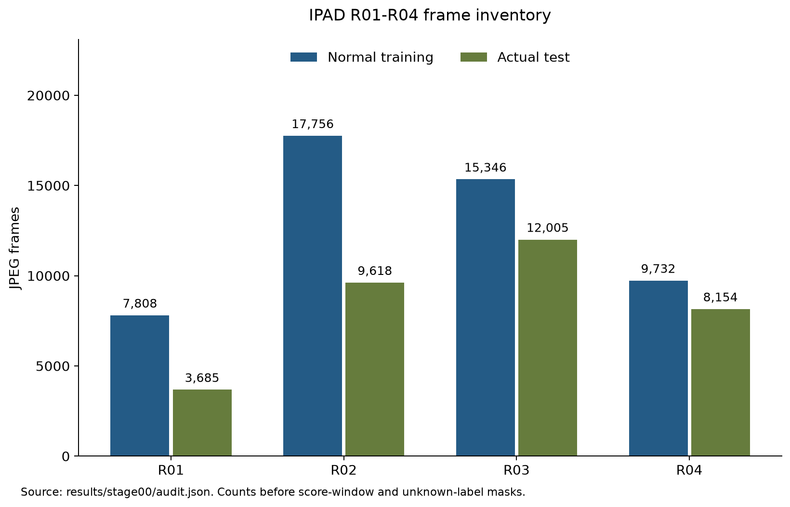
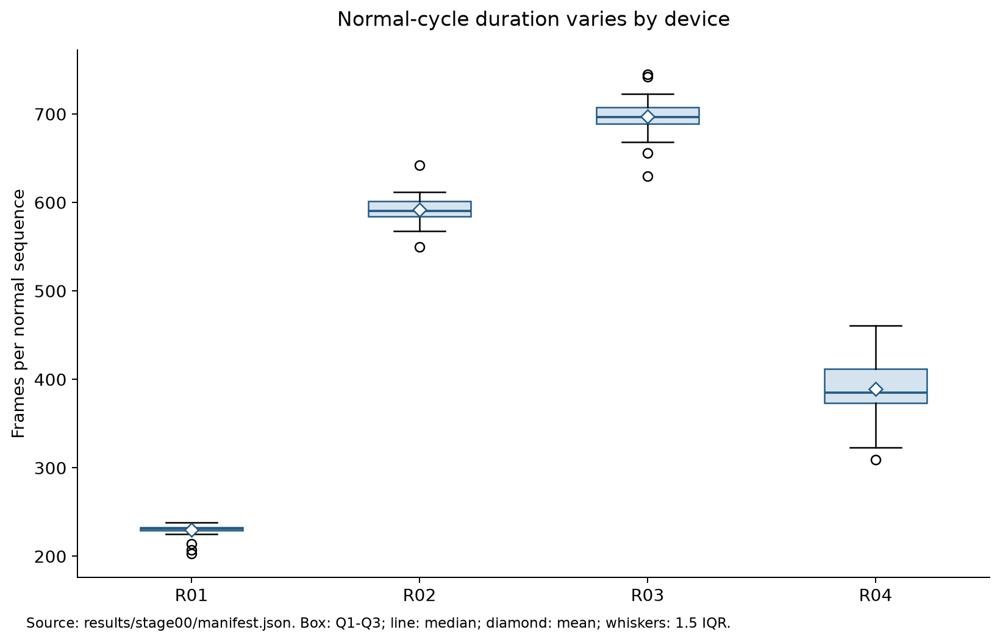

# IPAD × DINOv3 / V-JEPA 2.1

정상 공정 영상으로 위상별 프로토타입 메모리를 구성하고, **디코더 없이 특징 잔차와 시간적 위상 이탈**로 이상을 탐지한다.
IPAD 실제 장비 R01–R04에서 두 백본의 **온라인·오프라인** 정확도와 실제 알람 지연을 비교한다.

`16프레임 → 백본 특징 → 위상 예측 → 정상 메모리 검색 → 특징·시간 점수 → 알람`

## 현재 결과

**R01에서 두 백본의 오프라인 P0–P3 평가를 3개 seed로 완료했다. 네 장비 전체 및 온라인·실시간 비교는 진행 중이다.**
학습 111개 영상/50,642프레임, 실제 테스트 66개 영상/33,462프레임을 확인했다. 분할은 학습 76개·정상 검증 18개·진단 17개다.
R02/12·13·14의 라벨 길이 불일치는 정확한 정렬이 미확정이다. ±1 인덱스 오차 가정의 공통 미확정 18프레임 마스크와 오프셋별 민감도 정책을 [Stage 00](docs/STAGE00.md)에 기록했다.


<details>
<summary>프레임 수와 정상 주기 길이</summary>




</details>

상세 수치·검증 범위는 [Stage 00](docs/STAGE00.md), 원본 결과는 [results/stage00](results/stage00)에 있다.

| 백본 | 모드 | Macro AUROC / AP | p95 전체 지연 | 지속 FPS | 상태 |
|---|---|---|---|---|---|
| DINOv3-L | 오프라인 | — | — | — | R01 P0–P3 3 seeds 평가 완료 |
| DINOv3-L | 온라인 | — | — | — | 구현 완료 부분 검증, 학습 미실행 |
| V-JEPA 2.1-L | 오프라인 | — | — | — | R01 P0–P3 3 seeds 평가 완료 |
| V-JEPA 2.1-L | 온라인 | — | — | — | 구현 완료 부분 검증, 학습 미실행 |

| R01 오프라인 / 3-seed 평균 | DINOv3 AUROC / AP (%) | V-JEPA AUROC / AP (%) |
|---|---:|---:|
| P0 전역 메모리 | 78.51 / 57.30 | 32.90 / 28.38 |
| P1 위상 hard | 45.21 / 32.32 | 24.97 / 25.30 |
| P2 위상 soft | 45.47 / 32.18 | 30.43 / 26.86 |
| P3 + 시간 점수 | 47.01 / 33.21 | 37.58 / 28.83 |


현재 R01에서는 위상 예측이 약하며, 제안한 P3가 DINOv3 전역 메모리보다 낮았다. 테스트 결과에 맞춰 점수 부호나 선택 epoch를 바꾸지 않았다. ROC/PR·시계열·정상 위상 진단·신뢰구간·재현 명령은 [Stage 02](docs/STAGE02.md)에 제공한다. 이 값은 한 장비의 결과이며 Macro4 또는 실시간 성능이 아니다.

`—`는 미실행이며 0점을 뜻하지 않는다. 고정 백본 2×2 비교 후 동일 LoRA 조건과 구성요소 제거 실험을 추가한다.

## 재현 환경

```bash
uv venv --python python3.12 .venv
source .venv/bin/activate
export UV_CACHE_DIR="$PWD/artifacts/uv-cache"
export MPLCONFIGDIR="$PWD/artifacts/mpl-cache"
export CUDA_CACHE_PATH="$PWD/artifacts/cuda-cache"
uv pip install torch==2.8.0 torchvision==0.23.0 --index-url https://download.pytorch.org/whl/cu128
uv pip install -e '.[test,gpu]'
export IPAD_DATA_ROOT=/absolute/path/to/IPAD_dataset/IPAD_dataset
python scripts/bootstrap_upstreams.py
ipad-audit --data-root "$IPAD_DATA_ROOT"
ipad-plot-audit
python -m pytest -q
```

CUDA 학습·검증은 GPU 접근이 허용된 환경에서 실행한다. 이 작업 환경에서는 샌드박스 내부 드라이버 접근이 제한됐으며, 샌드박스 밖에서 RTX PRO 6000과 BF16 연산을 확인했다.

## 모델 준비

```bash
python scripts/download_models.py --model vjepa21-l
python scripts/download_models.py --model dinov3-l --user-mirror
```

가중치는 `artifacts/weights`에 저장하며 Git에서 제외한다. [DINOv3 공식 README](https://github.com/facebookresearch/dinov3#pretrained-models)는 모델 사용 승인 후 이메일의 URL 사용을 안내한다.
기본 공식 주소는 HTTP 403, [공식 Hugging Face 모델](https://huggingface.co/facebook/dinov3-vitl16-pretrain-lvd1689m)은 수동 승인/인증이 필요했다.
사용자가 지정한 [PIA-SPACE-LAB 배포 경로](https://huggingface.co/PIA-SPACE-LAB/dinov3-vitl-pretrain-lvd1689m)에서 동일 파일을 취득했다.
SHA256 `8aa4cbddda325040fc78db2c272754af6ebe8ff2c55f6ec4f1964d8890f66035`의 공식 파일명 해시 접두어 일치와 공식 코드의 엄격한 가중치 로딩을 확인했다. 해당 배포 경로는 공식 Meta 호스팅이 아닌 사용자 제공 미러로 기록한다.

```bash
python scripts/smoke_backbone.py --model vjepa21-l \
  --upstream third_party/vjepa2 \
  --weights artifacts/weights/vjepa2_1_vitl_dist_vitG_384.pt \
  --sequence "$IPAD_DATA_ROOT/R01/training/frames/01"
```

V-JEPA 2.1의 엄격한 가중치 로딩과 실제 정상 16프레임 GPU 연산을 통과했다. 패치 출력은 `1×576×1024`, 위상 입력은 `1×1024`, 백본 학습 파라미터는 0이다.
모델 smoke 결과는 형태·엄격한 가중치 로딩·실제 영상 연산 검증이다. cold forward 시간을 FPS 또는 이상탐지 성능으로 해석하지 않는다.
두 백본 모두 동일한 출력 형태와 백본 고정을 확인했다. 근거는 [환경 메타데이터](results/setup/environment.json), [V-JEPA GPU smoke](results/setup/vjepa21-l_smoke.json), [DINOv3 GPU smoke](results/setup/dinov3-l_smoke.json)에 있다.

핵심 불변식 테스트 35개가 통과했다. 테스트 범위는 정상 영상 분할, 프레임 순서, 온라인 입력 범위, 위상 경계, 메모리 검색·투영, 점수 보정, q/v LoRA gradient, 업로드 파일 제외다. 전체 이상탐지 실험 검증을 완료했다는 의미는 아니다.

전체 실험 행렬은 [experiment_matrix.yaml](configs/experiment_matrix.yaml)에 고정했다. 이 목록은 전체 요구 범위이며 완료 여부는 실제 결과로 확인한다.

## 실험·업로드 원칙

- 정상 학습 데이터만으로 PCA·메모리·LoRA 구성; 정상 검증으로 임계값 설정.
- 각 장비·seed·백본·모드의 공통 대상 프레임에서 비교; 테스트 영상별 min-max 정규화 금지.
- 온라인 입력은 `[t−15,…,t]`, 오프라인은 `[t−8,…,t+7]`; 실제 알람 지연에는 미래 프레임 대기도 포함.
- 단계별 코드·설정·지표 JSON/CSV·그래프 생성 코드·PNG/SVG를 함께 업로드.
- 원본 영상/이미지, 모델, 체크포인트, 특징 캐시, PCA·메모리 텐서는 업로드하지 않음.
- 업로드 전 `ipad-upload-check`; 파일별 10MiB 이하; 완료된 단계만 완료 태그 생성.

## 구현 상태

| 단계 | 상태 |
|---|---|
| 00 데이터 검증 | 감사·분할·그래프 완료, 라벨 정렬 검토 중 |
| 01 IPAD 기준선 | 공식 소스 확보, 학습 미실행 |
| 02 오프라인 비교 | R01 두 백본 P0–P3 3 seeds 완료, R02–R04 특징 추출 중 |
| 03 온라인 비교 | causal window·공통 마스크·시간 점수 구현, 실험 미실행 |
| 04 LoRA·추가 실험 | q/v LoRA 구현·gradient 검증, 실험 미실행 |
| 05 최종 재현성 | 미실행 |

## 출처

[IPAD 논문](https://arxiv.org/abs/2404.15033) · [IPAD 코드](https://github.com/LJF1113/IPAD) · [DINOv3](https://github.com/facebookresearch/dinov3) · [V-JEPA 2.1](https://github.com/facebookresearch/vjepa2)

공식 upstream은 [고정 revision](configs/upstreams.json)으로 로컬에 취득한다. 모델/소스의 원 라이선스와 사용 조건을 따른다.
