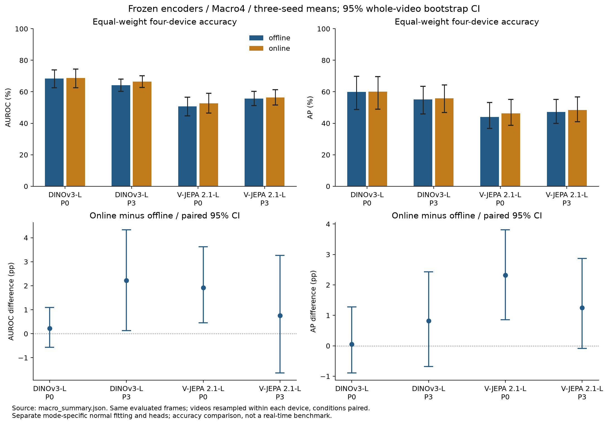

# IPAD × DINOv3 / V-JEPA 2.1

정상 공정 영상으로 위상별 프로토타입 메모리를 구성하고, **디코더 없이 특징 잔차와 시간적 위상 이탈**로 이상을 탐지한다. IPAD R01–R04에서 DINOv3와 V-JEPA 2.1의 온라인·오프라인 정확도 및 실제 알람 지연을 비교한다.

`16프레임 → 백본 특징 → 위상 예측 → 정상 메모리 검색 → 특징·시간 점수 → 알람`

## 핵심 결과

고정 백본 **48/48조건**과 네 장비 Macro4 비교를 완료했다. 주 LoRA는 **24/48조건·8/16 세-seed 그룹**을 검증했다. 아래 정확도는 AUROC / AP (%)이며, 같은 장비·seed·GT target에서 비교한다.

학습 111개 영상/50,642프레임, 테스트 66개 영상/33,462프레임을 감사했다. 정상 fit 76개·calibration 18개·진단 17개를 분리했다. R02/12·13·14의 라벨 정렬은 미확정이며 공통 18프레임 제외 규칙과 민감도 분석을 [Stage 00](docs/STAGE00.md)에 보존했다. 고정 백본 비교의 공통 유효 테스트 프레임은 31,728개다.

| 고정 백본 P3 | 오프라인 Macro4 | 온라인 Macro4 |
|---|---:|---:|
| DINOv3-L | 64.15 / 55.10 | 66.37 / 55.92 |
| V-JEPA 2.1-L | 55.59 / 47.14 | 56.35 / 48.39 |

온라인−오프라인 AUROC 차이는 DINOv3 **+2.22pp [0.13, 4.33]**, V-JEPA **+0.76pp [−1.64, 3.26]**였다. AP 차이의 두 CI는 0을 포함한다. 온라인 P3의 V-JEPA−DINOv3 차이는 AUROC **−10.02pp [−14.49, −5.18]**, AP **−7.52pp [−12.08, −2.00]**였다. CI는 장비별 영상 단위 paired bootstrap 1,000회다. 모드별 정상 head·메모리도 함께 달라지는 전체 프로토콜 비교다.



| 오프라인 P3 · 세-seed 평균 | 고정 백본 | LoRA |
|---|---:|---:|
| R01 DINOv3-L | 47.01 / 33.21 | 80.21 / 71.53 |
| R01 V-JEPA 2.1-L | 37.58 / 28.83 | 37.98 / 29.76 |
| R02 DINOv3-L | 79.84 / 65.11 | 83.11 / 70.23 |
| R02 V-JEPA 2.1-L | 63.10 / 42.55 | 66.09 / 49.15 |
| R03 DINOv3-L | 60.68 / 51.82 | 62.44 / 56.23 |
| R03 V-JEPA 2.1-L | 50.45 / 43.53 | 48.02 / 42.45 |
| R04 DINOv3-L | 69.08 / 70.26 | 74.69 / 77.38 |
| R04 V-JEPA 2.1-L | 71.24 / 73.66 | 61.69 / 65.84 |

LoRA의 효과는 장비와 백본에 따라 달랐다. DINOv3는 R01·R02에서 AUROC/AP 개선의 두 CI가 양수였고 R03에서는 두 CI가 0을 포함했다. V-JEPA는 R02 AP만 양수였고 R01·R03의 두 CI는 0을 포함했다. [R01–R03 전체 P0–P3·paired CI·백본 비교](docs/STAGE04.md#v-jepa-r03-seed-2와-세-seed-백본-비교의-완료된-평가)를 제공한다.

DINOv3 오프라인 네 장비·세 seeds를 완료했다. 동일 가중치 Macro4 P3 AUROC/AP는 고정 **64.15/55.10% → LoRA 75.11/68.84%**이고 차이의 95% CI는 AUROC **+10.96 [+9.12, +13.08]pp**, AP **+13.74 [+9.98, +17.04]pp**다. [R04 세-seed·Macro4 결과·그래프](docs/STAGE04.md#dinov3-r04-세-seed와-오프라인-macro4의-완료된-21조건-집계)를 제공한다. V-JEPA 오프라인 Macro4 P3는 고정 **55.59/47.14% → LoRA 53.45/46.80%**이며, LoRA−고정 AUROC/AP 차이는 **-2.15 [-4.06, -0.32] / -0.34 [-2.22, +1.28]pp**다. LoRA P3의 V-JEPA−DINOv3 차이는 **-21.67 [-25.08, -18.17] / -22.04 [-26.22, -16.25]pp**다. [두 백본 Macro4·paired CI·그래프](docs/STAGE04.md#v-jepa-r04-오프라인-seed-2의-전체-평가와-완료된-24조건-집계)를 제공한다. 온라인 LoRA·teacher 비교·실시간 비교는 남아 있다.

DINOv3 R04 seed 2도 **20 epoch·4,000 updates** 정상 학습을 완료했으며 [학습 곡선·정상 CE 선택 근거](docs/STAGE04.md#dinov3-r04-오프라인-seed-2의-완료된-정상-학습)를 제공한다. Seed 2의 전체 19개 테스트 P3 AUROC/AP는 고정 **69.36/70.29% → LoRA 74.70/77.36%**다. 개별 seed와 세-seed/Macro4 결과는 위 상세 보고서에서 구분한다.

V-JEPA R04 seed 0은 **20 epoch·4,000 updates** 정상 학습을 완료했으며 [학습 곡선·정상 CE 선택 근거](docs/STAGE04.md#v-jepa-r04-오프라인-seed-0의-완료된-정상-학습)를 제공한다. 전체 19개 테스트의 P3 AUROC/AP는 고정 **71.36/74.01% → LoRA 59.93/64.20%**다. [개별 seed 결과·paired CI·그래프](docs/STAGE04.md#v-jepa-r04-오프라인-seed-0의-전체-평가와-완료된-22조건-집계)를 제공한다. 최신 R04 세-seed·백본 비교는 아래 seed 2 절에 연결했다.

V-JEPA R04 seed 1은 **20 epoch·4,000 updates** 정상 학습을 완료했으며 [학습 곡선·정상 CE 선택 근거](docs/STAGE04.md#v-jepa-r04-오프라인-seed-1의-완료된-정상-학습)를 제공한다. 전체 19개 테스트의 P3 AUROC/AP는 고정 **68.29/71.39% → LoRA 60.58/65.50%**다. [개별 seed 결과·paired CI·그래프](docs/STAGE04.md#v-jepa-r04-오프라인-seed-1의-전체-평가와-완료된-23조건-집계)를 제공한다. 최신 R04 세-seed·백본 비교는 아래 seed 2 절에 연결했다.

V-JEPA R04 seed 2는 **20 epoch·4,000 updates** 정상 학습을 완료했으며 [학습 곡선·정상 CE 선택 근거](docs/STAGE04.md#v-jepa-r04-오프라인-seed-2의-완료된-정상-학습)를 제공한다. 전체 19개 테스트의 P3 AUROC/AP는 고정 **74.07/75.57% → LoRA 64.56/67.83%**다. [개별 seed·R04 세-seed·두 백본 오프라인 Macro4·그래프](docs/STAGE04.md#v-jepa-r04-오프라인-seed-2의-전체-평가와-완료된-24조건-집계)를 제공한다.

DINOv3 R01 온라인 seed 0은 **20 epoch·3,340 updates** 정상 학습을 완료했으며 [학습 곡선·정상 CE 선택 근거](docs/STAGE04.md#dinov3-r01-온라인-seed-0의-완료된-정상-학습)를 제공한다. DINOv3 R01 온라인 seed 0의 전체 정확도 평가는 별도 진행 중이다.

IPAD 원 코드의 R01 세 seeds는 각각 **50 epoch** 학습·평가를 완료했다. B0 픽셀 AUROC/AP는 **81.51/59.79%**, B1 특징 잔차는 **68.72/50.65%**였다. DINOv3 LoRA P3와 B0의 차이는 두 CI가 0을 포함하고, B1 대비 AP 차이는 **+20.88pp [3.46, 33.69]**였다. [동일 프레임 직접 비교·그래프·재현 차이](docs/STAGE01.md#ipad와-특징-기반-p3의-동일-프레임-직접-비교)를 제공한다. 학습·입력 등도 다르므로 디코더 제거만의 효과로 해석하지 않는다.

고정 q99·3프레임 연속 알람을 [72개 고정/LoRA 조건](docs/STAGE05.md#v-jepa-r04-seed-2를-포함한-전체-72조건의-캐시-알람-재검증)에서 재검증했다. Ranking 정확도 개선과 구간 탐지·정상 오탐 개선은 일치하지 않을 수 있다. 점수 분포·GT 구간·정상 알람 그래프를 함께 제공한다.

실시간 파일 재생은 **6/240 실행**을 완료했다. DINOv3-L 온라인 R01 seed 0의 30 FPS FIFO·drop 없음에서 BF16 full/buffer는 **16.46/17.05 FPS**, target p95 지연 **7,172/6,314ms**이며 점수·알람 gate를 통과했다. 별도 FP32 reuse는 세 영상의 사전 점수 gate에 실패했다. [전체 trace·지연/큐 그래프·실패 근거](docs/STAGE05.md#같은-조건의-버퍼특징-재사용-실측)를 보존한다. 부분 파일 재생 결과이며 전체 백본·장비 비교 또는 카메라 성능을 뜻하지 않는다.

## 전체 실험 진행

완료 수는 실제 평가·독립 검증 기준이다. 세-seed 평균은 모두 완료된 그룹만, Macro4는 네 장비가 모두 완료된 경우만 제공한다. 계획 전체는 [experiment_matrix.yaml](configs/experiment_matrix.yaml)에 고정했다.

| 실험 | 검증 완료 / 전체 | 상세 결과·그래프 |
|---|---:|---|
| 고정 L 백본 · 두 모드 · 네 장비 · 세 seeds | 48 / 48 | [오프라인](docs/STAGE02.md) · [온라인](docs/STAGE03.md) |
| 주 LoRA · teacher weight 1 · fresh 20 epoch | 24 / 48 | [Stage 04](docs/STAGE04.md) |
| IPAD 통제 기준선 · fresh 50 epoch | 3 / 12 | [Stage 01](docs/STAGE01.md) |
| IPAD 전체 정상 111영상 reference · 50 epoch | 0 / 4 | [Stage 01](docs/STAGE01.md) |
| Teacher weight 0/1 쌍 · 신규 weight 0 평가 | 0 / 48 | [Teacher 비교](docs/ABLATION_TEACHER_WEIGHT.md) |
| 메모리 1,024/2,048/4,096 · 위상 8/16 bins | 192 / 192 | [메모리 비교](docs/ABLATION_MEMORY.md) |
| 시간 이력 5/15/31 | 144 / 144 | [이력 비교](docs/ABLATION_HISTORY.md) |
| 검색 이웃 k=1/5/10 | 144 / 144 | [이웃 비교](docs/ABLATION_NEIGHBOURS.md) |
| 8/16프레임 · 신규 정상 head/메모리 | 6 / 48 | [입력 문맥 비교](docs/ABLATION_CLIP_FRAMES.md) |
| 패치/공간 평균 · 공유 위상 head | 6 / 96 | [특징 표현 비교](docs/ABLATION_REPRESENTATION.md) |
| 작은 B 백본 · 온라인 | 3 / 24 | [백본 크기 비교](docs/SMALL_BACKBONES.md) |
| 정상 진단 · 17영상 · 49시나리오 | 0 / 48 | [진단 규칙·도식](docs/DIAGNOSTICS.md) |
| 실제 FIFO · precision/구현별 실행 | 6 / 240 | [Stage 05](docs/STAGE05.md) |

메모리 4,096개의 V-JEPA Macro4 개선은 두 모드의 AUROC/AP CI가 모두 양수였지만 모든 제거 실험에서 일관된 개선은 없었다. 부분 결과로 기본 설정을 테스트에 맞춰 바꾸지 않으며, 기본은 16프레임·16 bins·2,048개 메모리·k=5·이력 5다.

완료된 DINOv3 LoRA R01 오프라인 seed 0의 재생성 가능한 특징 배열 **86개·6.38 GiB**를 승인 조건에 따라 정리했다. metadata/target·선택 모델·메모리·결과를 보존하고 [사후 재검증·용량 그래프·runtime 구성요소 CPU 검증](docs/STAGE04.md#첫-실제-캐시-정리와-사후-재검증)을 제공한다. 실제 runtime 검증은 별도 진행한다.

## 재현 환경

```bash
uv venv --python python3.12 .venv
source .venv/bin/activate
export UV_CACHE_DIR="$PWD/artifacts/uv-cache"
export MPLCONFIGDIR="$PWD/artifacts/mpl-cache"
export CUDA_CACHE_PATH="$PWD/artifacts/cuda-cache"
mkdir -p artifacts/tmp
export TMPDIR="$PWD/artifacts/tmp"
uv pip install torch==2.8.0 torchvision==0.23.0 --index-url https://download.pytorch.org/whl/cu128
uv pip install -e '.[test,gpu]'
export IPAD_DATA_ROOT=/absolute/path/to/IPAD_dataset/IPAD_dataset
python scripts/bootstrap_upstreams.py
ipad-audit --data-root "$IPAD_DATA_ROOT"
ipad-plot-audit
python -m pytest -q
```

CUDA 학습·검증은 GPU 접근이 허용된 환경에서 실행한다. 이 작업 환경에서는 샌드박스 내부 드라이버 접근이 제한됐으며, 샌드박스 밖에서 RTX PRO 6000과 BF16 연산을 확인했다.

## 모델 준비

```bash
python scripts/download_models.py --model vjepa21-l
python scripts/download_models.py --model dinov3-l --user-mirror
```

가중치는 `artifacts/weights`에 저장하며 Git에서 제외한다. [DINOv3 공식 README](https://github.com/facebookresearch/dinov3#pretrained-models)는 모델 사용 승인 후 이메일의 URL 사용을 안내한다.
기본 공식 주소는 HTTP 403, [공식 Hugging Face 모델](https://huggingface.co/facebook/dinov3-vitl16-pretrain-lvd1689m)은 수동 승인/인증이 필요했다.
사용자가 지정한 [PIA-SPACE-LAB 배포 경로](https://huggingface.co/PIA-SPACE-LAB/dinov3-vitl-pretrain-lvd1689m)에서 동일 파일을 취득했다.
로컬 SHA256 `8aa4cbddda325040fc78db2c272754af6ebe8ff2c55f6ec4f1964d8890f66035`가 미러의 전체 해시와 일치하며, 공식 파일명 해시 접두어 일치와 공식 코드의 엄격한 가중치 로딩도 확인했다. 해당 배포 경로는 공식 Meta 호스팅이 아닌 사용자 제공 미러로 기록한다.

```bash
python scripts/smoke_backbone.py --model vjepa21-l \
  --upstream third_party/vjepa2 \
  --weights artifacts/weights/vjepa2_1_vitl_dist_vitG_384.pt \
  --sequence "$IPAD_DATA_ROOT/R01/training/frames/01"
```

V-JEPA 2.1의 엄격한 가중치 로딩과 실제 정상 16프레임 GPU 연산을 통과했다. 패치 출력은 `1×576×1024`, 위상 입력은 `1×1024`, 백본 학습 파라미터는 0이다.
모델 smoke 결과는 형태·엄격한 가중치 로딩·실제 영상 연산 검증이다. cold forward 시간을 FPS 또는 이상탐지 성능으로 해석하지 않는다.
두 백본 모두 동일한 출력 형태와 백본 고정을 확인했다. 근거는 [환경 메타데이터](results/setup/environment.json), [V-JEPA GPU smoke](results/setup/vjepa21-l_smoke.json), [DINOv3 GPU smoke](results/setup/dinov3-l_smoke.json)에 있다.

CI는 핵심 검증과 업로드 검사를 실행한다. 현재 게시 commit은 **422개 테스트**를 통과했다. CPU 테스트의 성공은 실제 GPU 처리량을 입증하지 않으며 실제 학습·추론 근거는 각 Stage에 기록한다.

## 실험·업로드 원칙

- 정상 학습 데이터만으로 PCA·메모리·LoRA 구성; 정상 검증으로 임계값 설정.
- 각 장비·seed·백본·모드의 공통 대상 프레임에서 비교; 테스트 영상별 min-max 정규화 금지.
- 온라인 입력은 `[t−15,…,t]`, 오프라인은 `[t−8,…,t+7]`; 실제 알람 지연에는 미래 프레임 대기도 포함.
- 단계별 코드·설정·지표 JSON/CSV·그래프 생성 코드·PNG/SVG를 함께 업로드.
- 원본 영상/이미지, 모델, 체크포인트, 특징 캐시, PCA·메모리 텐서는 업로드하지 않음.
- 업로드 전 `ipad-upload-check`; 파일별 10MiB 이하; 완료된 단계만 완료 태그 생성.

## 출처

[IPAD 논문](https://arxiv.org/abs/2404.15033) · [IPAD 코드](https://github.com/LJF1113/IPAD) · [DINOv3](https://github.com/facebookresearch/dinov3) · [V-JEPA 2.1](https://github.com/facebookresearch/vjepa2)

공식 upstream은 [고정 revision](configs/upstreams.json)으로 로컬에 취득한다. 모델/소스의 원 라이선스와 사용 조건을 따른다.
