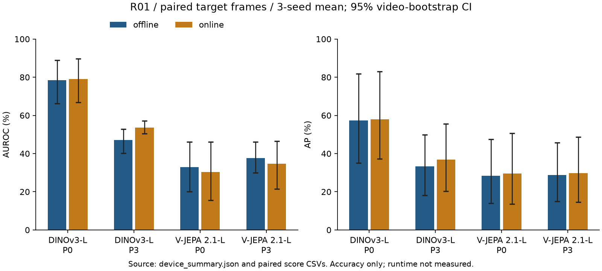

# IPAD × DINOv3 / V-JEPA 2.1

정상 공정 영상으로 위상별 프로토타입 메모리를 구성하고, **디코더 없이 특징 잔차와 시간적 위상 이탈**로 이상을 탐지한다.
IPAD 실제 장비 R01–R04에서 두 백본의 **온라인·오프라인** 정확도와 실제 알람 지연을 비교한다.

`16프레임 → 백본 특징 → 위상 예측 → 정상 메모리 검색 → 특징·시간 점수 → 알람`

## 현재 공개 결과

**두 백본의 네 장비 오프라인 Macro4를 확보했다. 온라인은 R01–R02 두 백본과 R03 V-JEPA를 3개 seed로 평가했다. 나머지 온라인·LoRA·실시간 측정은 진행 중이다.**
학습 111개 영상/50,642프레임, 실제 테스트 66개 영상/33,462프레임을 확인했다. 분할은 학습 76개·정상 검증 18개·진단 17개다.
R02/12·13·14의 라벨 길이 불일치는 정확한 정렬이 미확정이다. ±1 인덱스 오차 가정의 공통 미확정 18프레임 마스크와 오프셋별 민감도 정책을 [Stage 00](docs/STAGE00.md)에 기록했다.


<details>
<summary>프레임 수와 정상 주기 길이</summary>


</details>

상세 수치·검증 범위는 [Stage 00](docs/STAGE00.md), 원본 결과는 [results/stage00](results/stage00)에 있다.

| 백본 | 모드 | P3 Macro AUROC / AP (%) | p95 전체 지연 | 지속 FPS | 상태 |
|---|---|---|---|---|---|
| DINOv3-L | 오프라인 | 64.15 / 55.10 | — | — | R01–R04 P0–P3 3 seeds 완료 |
| DINOv3-L | 온라인 | — | — | — | R01–R02 P0–P3 3 seeds 완료, R03–R04 이 집계에 미포함 |
| V-JEPA 2.1-L | 오프라인 | 55.59 / 47.14 | — | — | R01–R04 P0–P3 3 seeds 완료 |
| V-JEPA 2.1-L | 온라인 | — | — | — | R01–R03 P0–P3 3 seeds 완료, R04 이 집계에 미포함 |

| 장비 / 오프라인 3-seed 평균 | 구성 | DINOv3 AUROC / AP (%) | V-JEPA AUROC / AP (%) |
|---|---|---:|---:|
| R01 | P0 전역 메모리 | 78.51 / 57.30 | 32.90 / 28.38 |
| R01 | P3 위상 soft + 시간 | 47.01 / 33.21 | 37.58 / 28.83 |
| R02 | P0 전역 메모리 | 73.32 / 62.09 | 58.19 / 36.98 |
| R02 | P3 위상 soft + 시간 | 79.84 / 65.11 | 63.10 / 42.55 |
| R03 | P0 전역 메모리 | 54.54 / 47.32 | 45.67 / 37.98 |
| R03 | P3 위상 soft + 시간 | 60.68 / 51.82 | 50.45 / 43.53 |
| R04 | P0 전역 메모리 | 67.53 / 73.09 | 65.87 / 72.88 |
| R04 | P3 위상 soft + 시간 | 69.08 / 70.26 | 71.24 / 73.66 |

R01에서는 약한 위상 예측과 함께 DINOv3 P3가 전역 메모리보다 낮았다. R02에서는 정상 위상 오차가 약 2–3% 주기로 낮고 두 백본의 P3 평균이 P0보다 높지만, 개선량의 신뢰구간에는 0이 포함된다. R03 V-JEPA P3는 AUROC 50% 부근으로 성능이 제한적이다. 테스트 결과로 점수 부호나 선택 epoch를 바꾸지 않았다.
V-JEPA P3의 Macro4 AUROC는 55.59%(95% CI 51.25..60.32)다. P0 대비 +4.93pp(1.41..9.01pp)이며, AP 차이 +3.09pp(−0.41..5.98pp)의 CI에는 0이 포함된다. 절대 성능과 장비별 편차를 함께 고려해야 한다.
DINOv3 P3의 Macro4 AUROC는 64.15%(60.32..68.11)다. P0 대비 −4.32pp(−8.25..+0.70pp)로 개선을 확인하지 못했다. P3의 V-JEPA−DINOv3 차이는 AUROC −8.56pp(−12.68..−4.11pp), AP −7.96pp(−12.24..−2.86pp)다. 이 비교는 고정 백본·오프라인 조건이며 LoRA나 실시간 결과로 확장하지 않는다.


P1/P2·Macro4 그래프·ROC/PR·시계열·위상 진단·paired 신뢰구간은 [Stage 02](docs/STAGE02.md)에 제공한다.

| 장비 / P3 / 3-seed 평균 | 오프라인 AUROC / AP (%) | 온라인 AUROC / AP (%) |
|---|---:|---:|
| R01 / DINOv3-L | 47.01 / 33.21 | 53.69 / 36.92 |
| R01 / V-JEPA 2.1-L | 37.58 / 28.83 | 34.60 / 29.72 |
| R02 / DINOv3-L | 79.84 / 65.11 | 79.89 / 63.73 |
| R02 / V-JEPA 2.1-L | 63.10 / 42.55 | 67.17 / 45.64 |



동일 대상 프레임에서 비교했다. R02 V-JEPA의 온라인−오프라인 차이는 AUROC +4.07pp(+0.26..+8.45pp), AP +3.09pp(+0.14..+5.56pp)다. [Stage 03](docs/STAGE03.md)에 전체 구성·paired CI·그래프를 공개한다. 온라인 전체 Macro4, FPS·알람 지연은 아직 확보하지 않았다.
순차 점수·이벤트 평가와 30 FPS FIFO 재생 측정 코드는 [Stage 05](docs/STAGE05.md)에 제공하며, 실제 GPU 측정과 수치 일치 검증은 남아 있다.

IPAD 공개 코드의 실행 오류를 별도 래퍼에서 수정하고 R01 기준선 seed 0의 50 epoch 학습·평가를 완료했다. 공통 3,295프레임에서 B0 픽셀 점수는 AUROC/AP **80.42/58.74%**, B1 특징 잔차는 **65.70/46.65%**다. 한 seed의 결과이며 3-seed 평균과 구분한다. 신뢰구간·ROC/PR·고정 임계값의 오탐/미탐 사례, B1의 학습 시 디코더 사용 범위는 [Stage 01](docs/STAGE01.md)에 공개한다. seed 1·2는 학습 중이다.

두 백본의 LoRA GPU 예비 학습을 통과하고 R01 20 epoch·3 seeds 실행을 시작했다. 정상-only teacher 손실·선택·특징과 메모리 재구성·예비 검증 범위는 [Stage 04](docs/STAGE04.md)에 기록한다.

`—`는 미실행이며 0점을 뜻하지 않는다. 고정 백본 2×2 비교, 동일 LoRA 조건과 구성요소 제거 실험을 진행한다.

## 재현 환경

```bash
uv venv --python python3.12 .venv
source .venv/bin/activate
export UV_CACHE_DIR="$PWD/artifacts/uv-cache"
export MPLCONFIGDIR="$PWD/artifacts/mpl-cache"
export CUDA_CACHE_PATH="$PWD/artifacts/cuda-cache"
mkdir -p artifacts/tmp
export TMPDIR="$PWD/artifacts/tmp"
uv pip install torch==2.8.0 torchvision==0.23.0 --index-url https://download.pytorch.org/whl/cu128
uv pip install -e '.[test,gpu]'
export IPAD_DATA_ROOT=/absolute/path/to/IPAD_dataset/IPAD_dataset
python scripts/bootstrap_upstreams.py
ipad-audit --data-root "$IPAD_DATA_ROOT"
ipad-plot-audit
python -m pytest -q
```

CUDA 학습·검증은 GPU 접근이 허용된 환경에서 실행한다. 이 작업 환경에서는 샌드박스 내부 드라이버 접근이 제한됐으며, 샌드박스 밖에서 RTX PRO 6000과 BF16 연산을 확인했다.

## 모델 준비

```bash
python scripts/download_models.py --model vjepa21-l
python scripts/download_models.py --model dinov3-l --user-mirror
```

가중치는 `artifacts/weights`에 저장하며 Git에서 제외한다. [DINOv3 공식 README](https://github.com/facebookresearch/dinov3#pretrained-models)는 모델 사용 승인 후 이메일의 URL 사용을 안내한다.
기본 공식 주소는 HTTP 403, [공식 Hugging Face 모델](https://huggingface.co/facebook/dinov3-vitl16-pretrain-lvd1689m)은 수동 승인/인증이 필요했다.
사용자가 지정한 [PIA-SPACE-LAB 배포 경로](https://huggingface.co/PIA-SPACE-LAB/dinov3-vitl-pretrain-lvd1689m)에서 동일 파일을 취득했다.
로컬 SHA256 `8aa4cbddda325040fc78db2c272754af6ebe8ff2c55f6ec4f1964d8890f66035`가 미러의 전체 해시와 일치하며, 공식 파일명 해시 접두어 일치와 공식 코드의 엄격한 가중치 로딩도 확인했다. 해당 배포 경로는 공식 Meta 호스팅이 아닌 사용자 제공 미러로 기록한다.

```bash
python scripts/smoke_backbone.py --model vjepa21-l \
  --upstream third_party/vjepa2 \
  --weights artifacts/weights/vjepa2_1_vitl_dist_vitG_384.pt \
  --sequence "$IPAD_DATA_ROOT/R01/training/frames/01"
```

V-JEPA 2.1의 엄격한 가중치 로딩과 실제 정상 16프레임 GPU 연산을 통과했다. 패치 출력은 `1×576×1024`, 위상 입력은 `1×1024`, 백본 학습 파라미터는 0이다.
모델 smoke 결과는 형태·엄격한 가중치 로딩·실제 영상 연산 검증이다. cold forward 시간을 FPS 또는 이상탐지 성능으로 해석하지 않는다.
두 백본 모두 동일한 출력 형태와 백본 고정을 확인했다. 근거는 [환경 메타데이터](results/setup/environment.json), [V-JEPA GPU smoke](results/setup/vjepa21-l_smoke.json), [DINOv3 GPU smoke](results/setup/dinov3-l_smoke.json)에 있다.

CI는 핵심 검증 **74개**와 업로드 검사를 실행한다. 정상 분할·위상·메모리·LoRA·기준선·resume·업로드 제외, Macro4 비중·paired bootstrap, 온라인 EOF 알람·FIFO 입력·이벤트 지연과 GPU 동시 작업 거부를 확인한다. LoRA 런타임의 선택 adapter·joint head·재구성 메모리와 paired 입력 출처도 검증한다. 재생 제어는 CPU 모형으로 검증했으며 실제 GPU 처리량을 입증하지 않는다. 실제 학습·추론 근거는 각 Stage에 별도로 기록한다.

전체 실험 행렬은 [experiment_matrix.yaml](configs/experiment_matrix.yaml)에 고정했다. 이 목록은 전체 요구 범위이며 완료 여부는 실제 결과로 확인한다.

## 실험·업로드 원칙

- 정상 학습 데이터만으로 PCA·메모리·LoRA 구성; 정상 검증으로 임계값 설정.
- 각 장비·seed·백본·모드의 공통 대상 프레임에서 비교; 테스트 영상별 min-max 정규화 금지.
- 온라인 입력은 `[t−15,…,t]`, 오프라인은 `[t−8,…,t+7]`; 실제 알람 지연에는 미래 프레임 대기도 포함.
- 단계별 코드·설정·지표 JSON/CSV·그래프 생성 코드·PNG/SVG를 함께 업로드.
- 원본 영상/이미지, 모델, 체크포인트, 특징 캐시, PCA·메모리 텐서는 업로드하지 않음.
- 업로드 전 `ipad-upload-check`; 파일별 10MiB 이하; 완료된 단계만 완료 태그 생성.

## 구현 상태

| 단계 | 상태 |
|---|---|
| 00 데이터 검증 | 감사·분할·그래프 완료, 라벨 정렬 검토 중 |
| 01 IPAD 기준선 | R01 seed 0의 50 epoch 학습·B0/B1 평가·CI/그래프 완료, seed 1·2 학습 중; 다른 장비·reference 조건 남음 |
| 02 오프라인 비교 | R01–R04 두 백본 3 seeds 완료, 두 백본 Macro4 확보 |
| 03 온라인 비교 | R01–R02 두 백본·R03 V-JEPA 3 seeds 완료, 나머지 진행 중 |
| 04 LoRA·추가 실험 | 공식 q/v 래퍼·joint 학습·재추출 구현, 두 백본 GPU 예비 학습 통과·전체 학습 실행 중 |
| 05 실시간·진단·재현성 | 순차 알람·FIFO·점수 일치 검증 구현, 실제 GPU 측정·진단·제거 실험 남음 |

## 출처

[IPAD 논문](https://arxiv.org/abs/2404.15033) · [IPAD 코드](https://github.com/LJF1113/IPAD) · [DINOv3](https://github.com/facebookresearch/dinov3) · [V-JEPA 2.1](https://github.com/facebookresearch/vjepa2)

공식 upstream은 [고정 revision](configs/upstreams.json)으로 로컬에 취득한다. 모델/소스의 원 라이선스와 사용 조건을 따른다.
