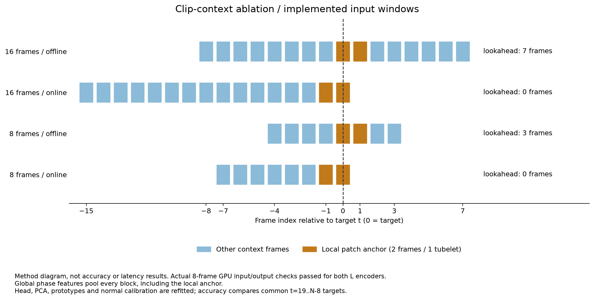

# 8·16프레임 입력 문맥 비교

두 백본 모두 실제 IPAD 정상 영상의 **8프레임 온라인·오프라인 GPU 입력 검증**을 통과했다. 엄격한 가중치 로딩 후 유한한 `1×576×1024` 로컬 특징·`1×1024` 전역 특징을 확인했다. 근거는 [DINOv3 검증](../results/setup/dinov3-l_clip8_smoke.json), [V-JEPA 2.1 검증](../results/setup/vjepa21-l_clip8_smoke.json)에 있으며, 입력 검증을 이상탐지 정확도나 FPS로 해석하지 않는다.

검증 프로세스의 정상 종료를 확인한 뒤 두 백본 × 두 모드 × 네 장치 × 세 seeds의 **48개 신규 조건** 실행기를 시작했다. 현재 첫 DINOv3 오프라인 R01의 실제 특징을 추출하고 있다. 8프레임 입력 경계·정상 학습에서만 허용하는 왼쪽 padding·동일 정확도 평가 구간의 테스트 8개를 통과했다. 아직 8프레임 이상탐지 정확도·CI·FPS 결과는 없다.

## 비교 조건

| 입력 | 오프라인 | 온라인 | 오프라인 미래 대기 |
|---|---|---|---:|
| 16프레임 | `[t−8,…,t+7]` | `[t−15,…,t]` | 7프레임 |
| 8프레임 | `[t−4,…,t+3]` | `[t−7,…,t]` | 3프레임 |

미래 대기는 입력 문맥의 구조이며 실제 처리 지연 측정값이 아니다. 두 온라인 조건은 과거·현재 프레임만 사용한다. 기존 백본 구현에서 로컬 특징은 오프라인의 `t,t+1`, 온라인의 `t−1,t`에 대응한다. DINOv3는 두 프레임 패치 특징의 평균, V-JEPA는 해당 한 tubelet을 사용하며, 전체 clip의 공간·시간 평균으로 위상을 예측한다.



[시각화 생성 코드](../scripts/plot_clip_context.py)와 [실제 GPU 검증·코드·도식 SHA 출처](../results/setup/clip_context_figure_sources.json)를 제공한다. 이 도식은 입력 구간을 보여 주며, 정확도·처리량·실측 지연 그래프가 아니다.

각 8프레임 조건은 원본 RGB 영상에서 새로 인코딩한다. 기존 16프레임 특징을 잘라 대체하지 않는다. 같은 384×384 전처리·공식 encoder·BF16 추론·FP16 저장·정상 fit stride 4를 유지하고, **위상 헤드 20 epoch, PCA 256차원, 16 bins × 128개 프로토타입, 정상 temperature·MAD·q99**를 모두 새로 구성한다. 헤드 선택은 정상 calibration CE로 고정한다. k=5·시간 이력 5·상위 5% 패치·특징/시간 가중치 0.5/0.5도 유지한다.

정확도와 정상 점수 보정은 기존의 **`t=19..N−8` 공통 구간**에서 비교한다. 테스트 정확도에는 원본 GT의 정렬 불확실성 마스크를 추가한다. 8프레임에서 새로 생긴 양끝 프레임으로 정확도를 높이거나 정상 q99의 대상 구간을 바꾸지 않는다. 다만 temperature 계산은 각 clip 조건의 전체 정상 calibration 특징을 이용하는 기존 절차를 따른다.

정상 영상 분할은 fit 76개·calibration 18개·별도 진단 17개다. 진단 영상은 이 비교의 학습·선택·임계값에 사용하지 않는다. clip 길이에 따라 정상 fit 경계가 달라져, 이는 각 입력 문맥에 맞춰 학습·보정을 다시 한 전체 파이프라인 비교다. 동일 헤드를 유지하는 순수 inference 문맥 제거 실험으로 해석하지 않는다.

## 실행 전 입력 개수 검증

[실제 manifest 기반 입력 inventory](../results/setup/clip8_matrix_plan.json)는 실행 계획 검증이며 완료된 실험 결과가 아니다.

| 모드·장치 | 정상 fit 입력 8 / 16 | 정상 calibration 입력 8 / 16 | 정상 q99 공통 프레임 |
|---|---:|---:|---:|
| 오프라인 R01 | 1,294 / 1,248 | 1,127 / 1,087 | 1,032 |
| 오프라인 R02 | 3,084 / 3,042 | 2,904 / 2,864 | 2,809 |
| 오프라인 R03 | 2,594 / 2,564 | 2,803 / 2,771 | 2,727 |
| 오프라인 R04 | 1,630 / 1,596 | 1,578 / 1,546 | 1,502 |
| 온라인 R01 | 1,335 / 1,335 | 1,127 / 1,087 | 1,032 |
| 온라인 R02 | 3,117 / 3,117 | 2,904 / 2,864 | 2,809 |
| 온라인 R03 | 2,618 / 2,618 | 2,803 / 2,771 | 2,727 |
| 온라인 R04 | 1,655 / 1,655 | 1,578 / 1,546 | 1,502 |

두 백본은 이와 같은 입력 inventory를 사용한다. 온라인 정상 fit의 초기 왼쪽 padding은 허용하지만 calibration·test는 완전한 clip만 사용한다. 새 특징은 `artifacts/features_clip8`, 헤드·은행은 `artifacts/runs_clip8`, 공개 평가 로그는 `results/stage05/ablations/clip_frames/T8`에 보관한다. 모델·특징·PCA·프로토타입 텐서는 Git에 올리지 않는다.

## 재현

가중치·고정 upstream·감사된 manifest를 준비한 GPU 환경에서 두 모델의 실제 입력 검증을 먼저 실행한다. 아래 예시에서 모델·가중치·upstream을 바꾸어 V-JEPA 2.1도 확인한다.

```bash
python -m ipad_jepa.clip8_features \
  --data-root "$IPAD_DATA_ROOT" --model dinov3-l --mode offline \
  --weights artifacts/weights/dinov3_vitl16_pretrain_lvd1689m-8aa4cbdd.pth \
  --upstream third_party/dinov3 --devices R01 --splits fit \
  --smoke-only --smoke-out results/setup/dinov3-l_clip8_smoke.json

python scripts/run_clip8_matrix.py --data-root "$IPAD_DATA_ROOT"
```

실행기는 기존 출력 디렉터리가 있으면 중복 실행·덮어쓰기·묵시적 복구를 거부한다. 관찰 타임아웃이나 완료 marker의 부재만으로 재시작하지 않는다. 진행 중에는 특징 reader·백본·학습기·평가기·메모리·manifest·실험 행렬의 SHA를 고정하고 변경 시 다음 조건을 시작하지 않는다. 각 완료 조건에는 정상 학습 로그, P0–P3 프레임 CSV, 정상 보정·메트릭 JSON, 실제 cache metadata·target·head·bank·출력 SHA를 기록한다.

완료한 장치의 세 seeds를 독립 검증한 뒤 P3 평균·영상 단위 paired bootstrap 1,000회·8−16 차이의 95% CI와 그래프를 공개한다. 네 장치가 모두 완료되어야 동일 가중치 Macro4를 보고한다. 실행 중인 부분 결과를 전체 결과로 간주하지 않는다.

[독립 CPU 검증기](../scripts/summarize_clip_ablation.py)는 실제 cache metadata·8프레임 target·입력 형태, 정상 CE에 따른 20-epoch 헤드 선택, head/bank SHA·은행 형태, 정상 MAD·q99, 원본 GT 파일·공통 mask, 위상에서 재계산한 시간 점수·P3 점수·evidence·배치 알람을 확인한다. 기존 16프레임 P3도 정상 q99·실제 GT·CSV 지표를 재검증하고 각 seed의 유효 frame·label 일치를 요구한다. 완료된 세-seed 장치가 없으면 집계를 생성하지 않으며, `--require-full`은 신규 48개 조건 전체를 요구한다.

```bash
python scripts/summarize_clip_ablation.py --require-full
```

CPU 검증은 encoder 특징·GPU 거리·PCA 학습·temperature 표본 거리를 독립 재계산하지 않는다. 이 값들은 고정된 GPU 생성 코드와 실제 cache/head/bank 출처로 연결한다. 특징·모델·은행 텐서는 로컬에 남기므로 원본 데이터와 모델을 준비해 해당 특징과 정상 학습을 재생성해야 전체 출처 검증을 재실행할 수 있다.

이 정확도 비교는 기존 배치 평가기를 사용하며, 해당 CSV의 알람은 공통 보고 구간으로 제한된다. 온라인 마지막 프레임까지의 인과적 탐지·30 FPS FIFO·실제 알람 지연·FPS는 별도 [Stage 05 런타임 검증](STAGE05.md)에서 수행해야 한다. 이 입력 검증이나 특징 생성 시간을 실시간 결과로 사용하지 않는다.
