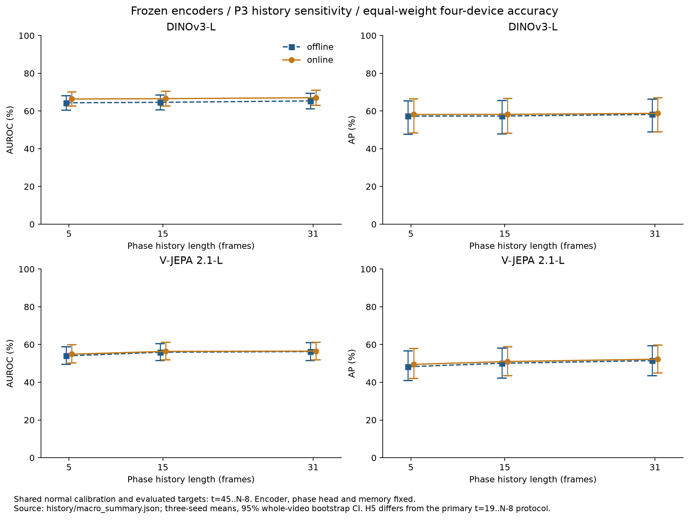
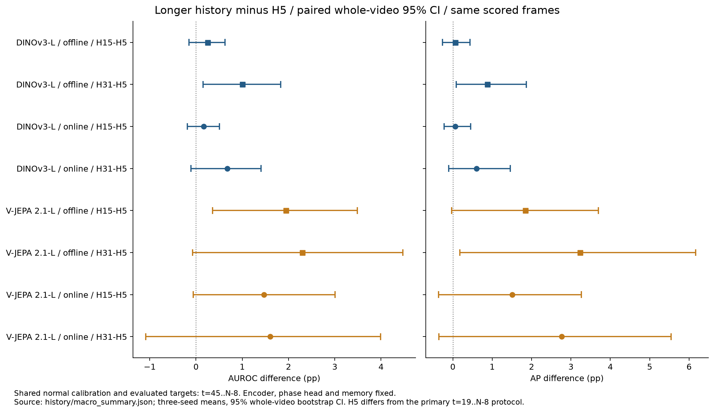

# 시간 이력 길이 OFAT 실험

고정 백본 P3의 시간 이력만 **5·15·31프레임**으로 바꿨다. 두 백본 × 두 모드 × 네 장비 × 3 seeds × 세 이력, 총 **144개 seed 조건**을 평가했다. 같은 seed의 백본·위상 head·PCA·프로토타입·k=5·온도·특징 잔차는 유지했다. 저장된 예측 위상과 특징 잔차에서 시간 점수와 정상 보정을 재계산했으며, GPU 특징 재추출 또는 실시간 처리량 측정이 아니다.

세 이력의 정상 보정과 정확도 평가는 공통 **`t=45..N−8`** 구간을 사용한다. 기존 라벨 미확정 마스크를 그대로 적용해, 66개 테스트 영상의 **30,014프레임(이상 13,314)**을 비교했다. 정상 fit의 장비별 주기 길이 중앙값, P3의 특징·시간 z 점수 0.5/0.5, 정상 검증 q99와 3회 연속 초과 알람 정책을 유지했다. 각 이력의 시간 성분은 정상 검증에서 다시 보정했다.

**이 표의 H5는 기본 실험의 `t=19..N−8` H5 결과와 다르다.** 정상 보정과 평가 구간을 함께 맞춘 비교이므로, 기본 결과와 직접 차이를 계산하거나 기본 결과를 이 값으로 대체하지 않는다. 테스트 결과로 기본 이력 5나 학습·선택 정책을 변경하지 않았다.

## Macro4 결과

각 장비의 3-seed AUROC/AP를 평균한 뒤 네 장비에 동일 가중치를 준다. 장비별 전체 영상을 독립적으로 재표집한 1,000회 paired bootstrap의 percentile 95% CI를 제공한다. seed 점수나 장비 간 프레임을 합치지 않았으며 기각 draw는 0이다. CI는 고정된 세 학습 seed에서의 영상 표본 불확실성이며 새로운 장비나 모든 학습 seed의 변동을 뜻하지 않는다.

| 백본 | 모드 | 이력 | Macro AUROC / 95% CI (%) | Macro AP / 95% CI (%) |
|---|---|---:|---:|---:|
| DINOv3-L | 오프라인 | 5 | 64.35 / 60.37..68.12 | 57.29 / 47.74..65.44 |
| DINOv3-L | 오프라인 | 15 | 64.60 / 60.53..68.48 | 57.35 / 47.75..65.46 |
| DINOv3-L | 오프라인 | 31 | 65.35 / 61.17..69.38 | 58.17 / 48.84..66.31 |
| DINOv3-L | 온라인 | 5 | 66.38 / 62.57..70.17 | 58.17 / 48.34..66.40 |
| DINOv3-L | 온라인 | 15 | 66.55 / 62.62..70.43 | 58.23 / 48.23..66.61 |
| DINOv3-L | 온라인 | 31 | 67.06 / 63.03..70.98 | 58.77 / 48.92..66.99 |
| V-JEPA 2.1-L | 오프라인 | 5 | 53.97 / 49.52..58.84 | 48.23 / 40.89..56.55 |
| V-JEPA 2.1-L | 오프라인 | 15 | 55.91 / 51.49..60.48 | 50.07 / 42.21..58.12 |
| V-JEPA 2.1-L | 오프라인 | 31 | 56.27 / 51.56..60.98 | 51.46 / 43.55..59.30 |
| V-JEPA 2.1-L | 온라인 | 5 | 54.89 / 50.24..59.84 | 49.48 / 42.00..57.92 |
| V-JEPA 2.1-L | 온라인 | 15 | 56.36 / 51.79..61.23 | 50.99 / 43.45..58.81 |
| V-JEPA 2.1-L | 온라인 | 31 | 56.49 / 51.93..61.15 | 52.24 / 44.89..59.69 |



## 이력 5 대비 paired 차이

| 백본 | 모드 | 비교 | AUROC 차이 / 95% CI (pp) | AP 차이 / 95% CI (pp) |
|---|---|---|---:|---:|
| DINOv3-L | 오프라인 | H15−H5 | +0.25 (-0.15..+0.62) | +0.06 (-0.26..+0.43) |
| DINOv3-L | 오프라인 | H31−H5 | +1.00 (+0.16..+1.83) | +0.88 (+0.09..+1.87) |
| DINOv3-L | 온라인 | H15−H5 | +0.17 (-0.19..+0.51) | +0.06 (-0.22..+0.45) |
| DINOv3-L | 온라인 | H31−H5 | +0.68 (-0.11..+1.41) | +0.60 (-0.10..+1.46) |
| V-JEPA 2.1-L | 오프라인 | H15−H5 | +1.94 (+0.36..+3.49) | +1.84 (-0.03..+3.70) |
| V-JEPA 2.1-L | 오프라인 | H31−H5 | +2.30 (-0.07..+4.47) | +3.23 (+0.18..+6.17) |
| V-JEPA 2.1-L | 온라인 | H15−H5 | +1.47 (-0.06..+3.01) | +1.51 (-0.36..+3.26) |
| V-JEPA 2.1-L | 온라인 | H31−H5 | +1.60 (-1.09..+3.99) | +2.77 (-0.35..+5.55) |



오프라인 DINOv3 H31−H5의 AUROC/AP 차이는 각각 **+1.00pp(+0.16..+1.83)**, **+0.88pp(+0.09..+1.87)**였다. 오프라인 V-JEPA는 H15의 AUROC 차이 **+1.94pp(+0.36..+3.49)**와 H31의 AP 차이 **+3.23pp(+0.18..+6.17)**에서 CI가 양수였다. 반면 **온라인 두 백본의 H15·H31 비교는 AUROC와 AP 모두 CI에 0을 포함**한다. 더 긴 이력이 온라인 정확도를 일관되게 높였다고 판단하지 않는다. 여러 민감도 비교에 대한 동시 신뢰구간이나 다중 비교 보정은 적용하지 않았다.

더 긴 이력은 최초 점수의 준비 구간도 늘린다. 온라인 알람 readiness는 H5/H15/H31에서 각각 target 19/29/45 이후이며, 마지막 7프레임도 계속 처리한다. 위 정확도 지표는 세 조건 모두 target 45부터 비교한다. 미확정 GT는 지표 마스크에만 적용하며 점수·알람 streak를 끊지 않는다. readiness를 실제 벽시계 지연 또는 FPS로 해석하지 않는다.

## 검증과 원본 결과

48개 기본 실행의 H5를 원래 `t=19..N−8`에서 재계산해 **정상 시간 점수·정상/테스트 최종 점수의 최대 절대 차이 0, 알람 불일치 0개**를 확인했다. 각 이력의 정상 보정 중앙값/MAD·q99를 공개 CSV에서 다시 계산했고, **144개 임계값**, 정상 영상·target inventory, 특징 잔차/예측 위상의 유지, seed·이력·백본·모드별 공통 테스트 프레임과 GT를 검증했다. 입력 CSV와 구현 SHA256을 기록한다. 이 검증이 원본 GPU 특징의 독립 재추출을 뜻하지는 않는다.

[검증 기록](../results/stage05/ablations/history/validation.json), [Macro4와 paired CI](../results/stage05/ablations/history/macro_summary.json), [장비별 48개 집계](../results/stage05/ablations/history/device_summary.json), [조건별 정상 보정·점수 CSV](../results/stage05/ablations/history)를 공개한다. 코드와 그래프를 재현할 수 있으며 원본 영상·모델·특징 캐시·메모리 텐서는 포함하지 않는다.

```bash
# 전체 고정 백본 결과가 준비된 후, 새 출력 폴더에서 실행
python -m ipad_jepa.history_ablation
python scripts/summarize_history_ablation.py
python scripts/plot_history_ablation.py
```

인과적 prefix 유지·온라인 tail·정상 공통 구간·기본 점수 변조 검출·GT와 알람 입력 분리를 CPU 테스트로 검증했다. 실제 GPU FPS·알람 지연, LoRA 전체 행렬, bin/budget/k/clip/표현/teacher 제거 실험, 작은 백본과 변환 진단은 남아 있다. 전체 Stage 05 완료를 주장하지 않는다.
