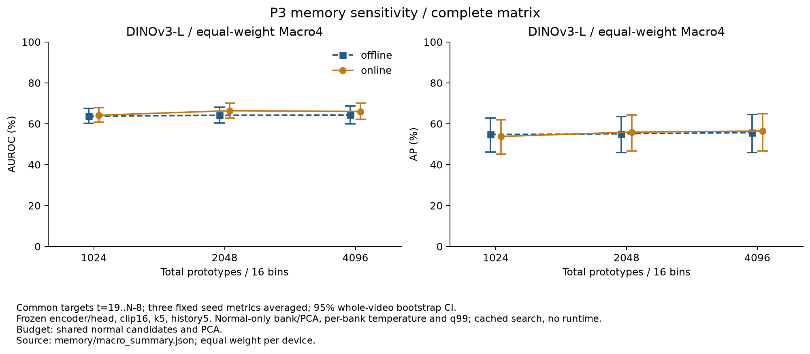
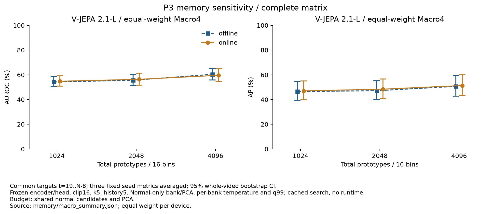
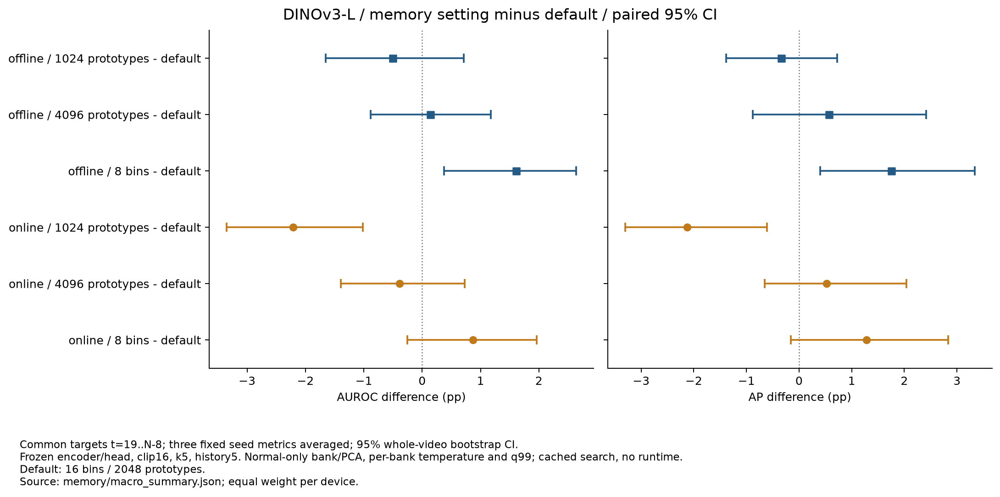
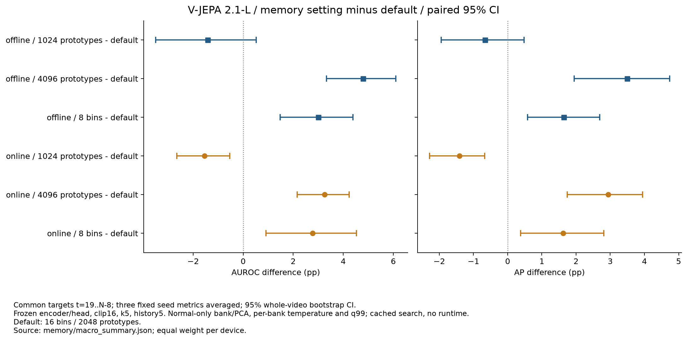
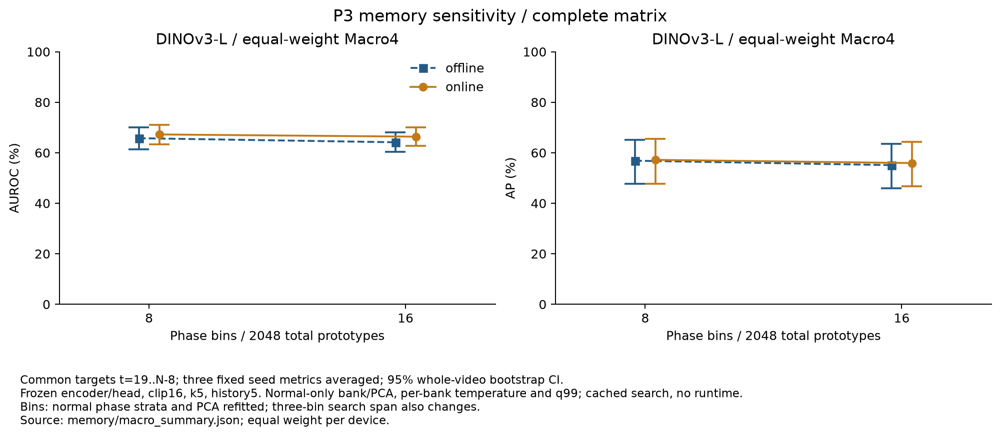
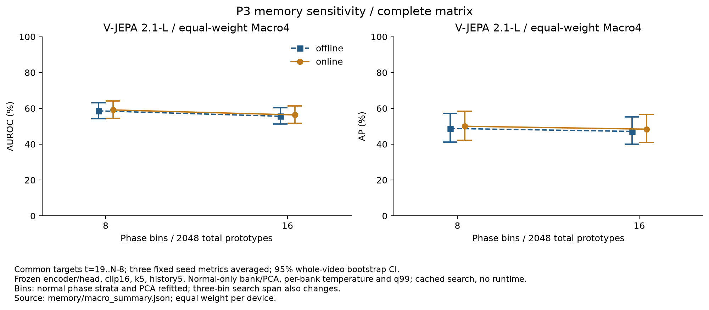

# 프로토타입 수·위상 bin 수 비교

두 백본 × 온라인/오프라인 × 네 장비 × 세 seeds × 네 설정의 **192개 GPU 조건과 독립 검증을 완료했다**. P3 정상 임계값 192개를 재계산하고 기본 조건 48개의 원본 메모리·점수·알람을 정확히 재현했다. 아래는 네 장비를 같은 비중으로 평균한 전체 결과다.

## 비교 조건과 정상 보정

| 설정 | 위상 bins | bin당 프로토타입 | 총 프로토타입 | 변경 요소 |
|---|---:|---:|---:|---|
| B16_M1024 | 16 | 64 | 1,024 | 메모리 크기 |
| B16_M2048 | 16 | 128 | 2,048 | 기본 설정 |
| B16_M4096 | 16 | 256 | 4,096 | 메모리 크기 |
| B8_M2048 | 8 | 256 | 2,048 | 위상 bin 수 |

- 고정 encoder·선택된 위상 head·16프레임 입력·k=5·상위 5% patch 집계·시간 이력 5·특징/시간 가중치 0.5/0.5를 유지한다.
- 정상 fit 영상만으로 영상·위상별 후보를 추출하고, PCA 256차원과 각 bin의 k-center 프로토타입을 재구성한다. 테스트 후보를 채우거나 프로토타입을 반복하지 않는다.
- 16 bins의 메모리 크기 비교는 같은 후보와 PCA를 공유한다. 가장 큰 은행의 k-center prefix를 사용하며, 독립적으로 작은 은행을 학습한 결과와 정확히 같은 prefix임을 테스트했다. 각 bin에서 RNG가 처음 선택하는 중심이 같고 이후 중심 선택은 결정적이다.
- 8 bins 비교는 총 2,048개를 유지한다. 위상 strata별 정상 후보 샘플링과 PCA를 다시 학습하므로 PCA를 고정한 비교로 해석하지 않는다. 같은 인접 세 bins를 검색해 상대 위상 범위도 넓어진다.
- 각 은행의 temperature는 **정상 calibration**에서 영상별 균형 표본 최대 50,000개 패치의 다섯 번째 이웃 제곱거리 중앙값(floor 1e−6)으로 다시 구한다. median/MAD·component q99·P3 q99도 같은 정상 calibration 공통 구간에서 다시 계산한다. 모든 은행과 정상 보정을 고정한 뒤 테스트 점수와 GT를 읽는다.

## 전체 Macro4 결과

각 장비의 seed 0/1/2 지표를 먼저 평균한 뒤 네 장비를 동일 비중으로 평균했다. 표는 AUROC/AP (%)다. 모든 조건은 같은 실제 테스트 66개 영상, 유효 31,728프레임(이상 13,599프레임)의 `t=19..N−8`와 공통 annotation 불확실성 마스크를 사용한다. 전체 절대 지표의 95% CI는 그래프와 [수치 JSON/CSV](../results/stage05/ablations/memory/macro_summary.json)에 있다.

| 백본 | 모드 | 16 bins·1,024 | 기본 16 bins·2,048 | 16 bins·4,096 | 8 bins·2,048 |
|---|---|---:|---:|---:|---:|
| DINOv3-L | 오프라인 | 63.65 / 54.76 | 64.15 / 55.10 | 64.29 / 55.67 | 65.76 / 56.85 |
| DINOv3-L | 온라인 | 64.16 / 53.79 | 66.37 / 55.92 | 65.99 / 56.44 | 67.24 / 57.19 |
| V-JEPA 2.1-L | 오프라인 | 54.17 / 46.48 | 55.59 / 47.14 | 60.38 / 50.64 | 58.59 / 48.78 |
| V-JEPA 2.1-L | 온라인 | 54.80 / 46.98 | 56.35 / 48.39 | 59.60 / 51.34 | 59.12 / 50.01 |




## 기본 설정 대비 paired 차이

단위는 pp다. 장비 안에서 원본 영상 단위로 1,000회 재표본하고, 같은 표본을 세 seeds와 비교 설정에 공유했다. 네 장비의 차이를 동일 비중으로 평균한 percentile 95% CI이며, 고정된 세 학습 seeds에 조건부인 영상 불확실성이다. 다중 비교를 보정하지 않은 탐색적 비교다.

| 백본 | 모드 | 기본 대비 변경 | AUROC 차이 / 95% CI (pp) | AP 차이 / 95% CI (pp) |
|---|---|---|---:|---:|
| DINOv3-L | 오프라인 | 1,024개 | -0.51 (-1.65..+0.71) | -0.34 (-1.38..+0.73) |
| DINOv3-L | 오프라인 | 4,096개 | +0.14 (-0.88..+1.17) | +0.57 (-0.88..+2.42) |
| DINOv3-L | 오프라인 | 8 bins | +1.61 (+0.38..+2.64) | +1.75 (+0.41..+3.34) |
| DINOv3-L | 온라인 | 1,024개 | -2.21 (-3.35..-1.02) | -2.13 (-3.30..-0.61) |
| DINOv3-L | 온라인 | 4,096개 | -0.39 (-1.39..+0.73) | +0.52 (-0.65..+2.04) |
| DINOv3-L | 온라인 | 8 bins | +0.87 (-0.25..+1.96) | +1.28 (-0.15..+2.83) |
| V-JEPA 2.1-L | 오프라인 | 1,024개 | -1.42 (-3.50..+0.52) | -0.67 (-1.94..+0.48) |
| V-JEPA 2.1-L | 오프라인 | 4,096개 | +4.79 (+3.33..+6.10) | +3.49 (+1.94..+4.74) |
| V-JEPA 2.1-L | 오프라인 | 8 bins | +3.00 (+1.47..+4.39) | +1.64 (+0.58..+2.69) |
| V-JEPA 2.1-L | 온라인 | 1,024개 | -1.55 (-2.66..-0.54) | -1.41 (-2.29..-0.67) |
| V-JEPA 2.1-L | 온라인 | 4,096개 | +3.26 (+2.16..+4.24) | +2.94 (+1.74..+3.95) |
| V-JEPA 2.1-L | 온라인 | 8 bins | +2.77 (+0.91..+4.53) | +1.62 (+0.38..+2.81) |




V-JEPA는 4,096개와 8 bins에서 온라인·오프라인의 두 지표가 모두 높아졌고, 네 비교의 두 paired CI 모두 0을 포함하지 않았다. 4,096개에서는 오프라인 AUROC/AP **+4.79/+3.49pp**, 온라인 **+3.26/+2.94pp**였다. DINOv3의 4,096개 차이는 두 모드의 두 CI 모두 0을 포함했다. 1,024개로 줄였을 때 온라인 두 백본의 두 지표는 낮아졌고 CI가 0을 포함하지 않았다. 메모리 변경에 대한 반응은 백본과 모드에 따라 달랐다.

8 bins는 정상 후보 strata·PCA와 인접 세 bins의 검색 위상 범위도 바꾸는 조건이다. DINOv3 오프라인은 +1.61/+1.75pp였으나 온라인의 두 CI는 0을 포함했다. 성능·비용의 최적 설정으로 일반화하지 않으며, 사전 고정한 기본 16 bins·2,048개를 유지한다. 실제 메모리 검색 FPS·GPU VRAM·벽시계 알람 지연은 아직 측정하지 않았다.




## 재구성과 검증

기본 **48개 조건** 모두 PCA 평균·성분·프로토타입과 dtype/stride, 정상 calibration temperature·표본 수를 원본과 정확히 재현했다. 실제 GPU 검색에서 기본 특징·시간·최종 점수 최대 차이는 **0**, 원래 공통 평가 구간의 알람 불일치는 **0개**였다. 전체 192개 실제 은행의 해시·shape와 16 bins 은행의 공통 PCA/prototype prefix를 검사했다.

정상 median/MAD·component q99·P3 q99 **192개**, 실제 annotation 파일 해시·라벨 정렬·공통 유효 구간·점수 정규화·증거 유형·3회 연속 초과 알람을 독립적으로 재계산했다. 온라인 알람은 마지막 7프레임과 미확정 GT 때문에 중단되지 않는다. 기본 원본 알람 비교 게이트는 기존 공통 평가 구간에 적용한다. 전체 장비/seed 지표를 CSV에서 재계산하고 64개 장비/설정 평균과 16개 Macro4를 집계했다.

raw 특징 `rtol=1e−5/atol=1e−7`, 최종 점수 `rtol=1e−5/atol=1e−4`, 시간 점수 `atol=1e−12`, 알람 불일치 0개를 요구했다. 배열은 허용 오차 없이 정확히 비교했다. 첫 R01 공개 스냅샷의 228개 파일도 전체 실행의 해당 조건과 내용 해시가 일치했다. [전체 파일·기본 Macro4 재현·6개 PNG/SVG 검수 근거](../results/stage05/ablations/memory/full_matrix_publication_check.json)를 제공한다.

기존 frozen encoder 특징과 선택된 위상 head를 이용한 은행 재구성·검색 실험이다. CPU 검증은 실제 은행/정상 보정/GT/점수/알람·지표를 검사하며 encoder 재추출이나 GPU 거리 계산 자체를 다시 실행하지 않는다. 정상 temperature 거리 계산은 실제 GPU producer와 은행 해시로 기록한다. 이 결과는 순차 FIFO·실시간 성능의 증명이 아니다.

## 재실행과 공개 자료

```bash
# 모델/실제 데이터/고정 특징·head·원본 은행이 준비된 상태에서 새 경로 사용
python -m ipad_jepa.memory_ablation \
  --out artifacts/tmp/memory_rerun --memory-out artifacts/tmp/memory_rerun_banks
python scripts/summarize_memory_ablation.py \
  --root artifacts/tmp/memory_rerun --memory-root artifacts/tmp/memory_rerun_banks --require-full
python scripts/plot_memory_ablation.py --root artifacts/tmp/memory_rerun
```

공개 canonical 경로는 `results/stage05/ablations/memory`다. 모델·특징 캐시·은행 NPZ·head PT는 로컬에만 보관한다. 재검증에는 공개 해시와 같은 실제 로컬 은행·원본 데이터가 필요하다.

- [전체 Macro4·paired CI](../results/stage05/ablations/memory/macro_summary.json), [64개 장비/설정·장비별 차이](../results/stage05/ablations/memory/device_summary.json)
- [192개 정상 보정·실제 은행·GT·점수·알람 검증](../results/stage05/ablations/memory/validation.json), [GPU 전체 완료 기록](../results/stage05/ablations/memory/completion.json)
- [그래프 출처·PNG/SVG 해시](../results/stage05/ablations/memory/figure_sources.json)
- [GPU 재구성·검색](../src/ipad_jepa/memory_ablation.py), [독립 검증·집계](../scripts/summarize_memory_ablation.py), [그래프 생성](../scripts/plot_memory_ablation.py)
- [첫 R01 12조건 스냅샷](../results/stage05/ablations/memory/snapshots/first_group) — 과거 부분 결과, 전체 Macro4와 구분

나머지 OFAT·LoRA·진단·실시간 측정이 남아 있으므로 Stage 05 전체 완료를 선언하지 않는다.
