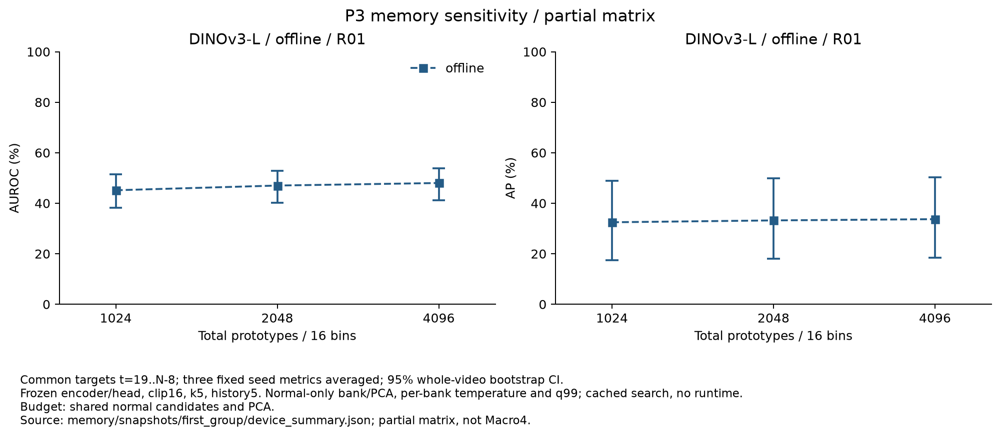
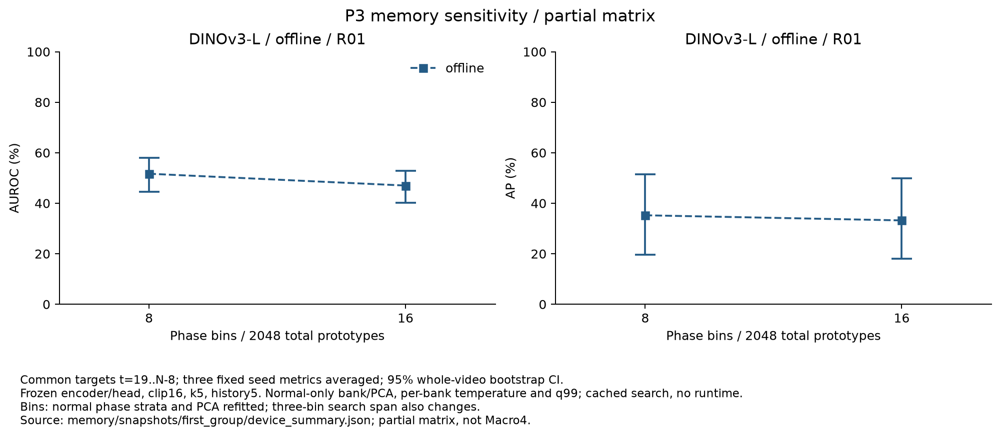
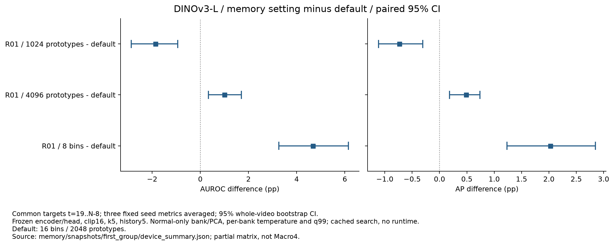

# 프로토타입 수·위상 bin 수 비교

고정 백본 P3의 메모리 구조를 한 요소씩 바꾼다. 현재 공개 결과는 **DINOv3-L / 오프라인 / R01 / seed 0·1·2**, 네 메모리 설정의 **12개 seed 조건**이다. 전체 두 백본 × 두 모드 × 네 장비 × 세 seeds × 네 설정, **192개 조건**의 GPU 평가는 완료됐고 독립 검증·집계·전체 그래프 생성이 진행 중이다. 아래 공개 수치는 검증을 마친 첫 12개 조건의 스냅샷이다. 현재 결과는 R01 한 장비의 결과이며 네 장비 Macro4가 아니다.

## 비교 조건과 정상 보정

| 설정 | 위상 bins | bin당 프로토타입 | 총 프로토타입 | 변경 요소 |
|---|---:|---:|---:|---|
| B16_M1024 | 16 | 64 | 1,024 | 메모리 크기 |
| B16_M2048 | 16 | 128 | 2,048 | 기본 설정 |
| B16_M4096 | 16 | 256 | 4,096 | 메모리 크기 |
| B8_M2048 | 8 | 256 | 2,048 | 위상 bin 수 |

- 고정 encoder·선택된 위상 head·16프레임 입력·k=5·상위 5% patch 집계·시간 이력 5·특징/시간 가중치 0.5/0.5를 유지한다.
- 정상 fit 영상만으로 영상·위상별 후보를 추출하고, PCA 256차원과 각 bin의 k-center 프로토타입을 재구성한다. 테스트 후보를 채우거나 프로토타입을 반복하지 않는다.
- 16 bins의 메모리 크기 비교는 같은 후보와 PCA를 공유한다. 가장 큰 은행의 k-center prefix를 사용하며, 독립적으로 작은 은행을 학습한 결과와 정확히 같은 prefix임을 테스트했다. 각 bin에서 RNG가 처음 선택하는 중심이 같고 이후 중심 선택은 결정적이다.
- 8 bins 비교는 총 2,048개를 유지한다. 위상 strata별 정상 후보 샘플링과 PCA를 다시 학습하므로 PCA를 고정한 비교로 해석하지 않는다. 같은 인접 세 bins를 검색해 상대 위상 범위도 넓어진다.
- 각 은행의 temperature는 **정상 calibration**에서 영상별 균형 표본 최대 50,000개 패치의 다섯 번째 이웃 제곱거리 중앙값(floor 1e−6)으로 다시 구한다. median/MAD·component q99·P3 q99도 같은 정상 calibration 공통 구간에서 다시 계산한다. 모든 은행과 정상 보정을 고정한 뒤 테스트 점수와 GT를 읽는다.

## R01 오프라인 결과

테스트 15개 영상, 유효 3,295프레임, 이상 1,227프레임의 `t=19..N−8` 구간이다. 각 seed의 AUROC/AP를 구한 뒤 평균했다. 괄호는 영상 단위 bootstrap 1,000회(기각 0회), percentile 95% CI이며 세 개의 고정 학습 seeds에 조건부인 영상 불확실성이다.

| 설정 | AUROC / 95% CI (%) | AP / 95% CI (%) |
|---|---:|---:|
| B16_M1024 | 45.15 (38.13..51.37) | 32.48 (17.45..48.98) |
| B16_M2048 | 47.01 (40.29..52.83) | 33.21 (18.07..49.84) |
| B16_M4096 | 48.02 (41.20..53.80) | 33.70 (18.35..50.24) |
| B8_M2048 | 51.69 (44.62..57.95) | 35.24 (19.62..51.39) |




## 기본 설정 대비 paired 차이

같은 영상 재표본과 같은 seeds에서 지표 차이를 계산했다. 단위는 pp이며 다중 비교 보정 없는 탐색적 CI다.

| 비교 | AUROC 차이 / 95% CI (pp) | AP 차이 / 95% CI (pp) |
|---|---:|---:|
| B16_M1024 − B16_M2048 | -1.86 (-2.86..-0.93) | -0.73 (-1.12..-0.31) |
| B16_M4096 − B16_M2048 | +1.01 (+0.34..+1.70) | +0.49 (+0.18..+0.74) |
| B8_M2048 − B16_M2048 | +4.68 (+3.26..+6.14) | +2.03 (+1.24..+2.85) |



R01 오프라인에서는 메모리를 1,024개로 줄이면 두 지표가 낮아졌고, 4,096개로 늘리거나 8 bins로 바꾸면 높아졌다. 이 세 비교의 두 CI는 모두 0을 포함하지 않았다. 8 bins의 AUROC/AP 차이는 +4.68/+2.03pp지만 절대 AUROC는 51.69%다. 이 결과를 다른 장비·모드·백본으로 일반화하거나 테스트에 맞춰 기본 16 bins·2,048개를 변경하지 않는다.

## 재구성과 검증

세 seeds 모두 재구성한 기본 메모리의 PCA 평균·성분·프로토타입, dtype·stride가 저장된 원본과 **정확히 일치**했다. 정상 calibration의 기본 temperature와 표본 수도 정확히 재현했다. 실제 GPU 검색에서 기본 설정의 특징·시간·최종 점수 최대 차이는 **0**, 기존 공통 구간의 알람 불일치는 **0개**였다.

독립 검증에서는 실제 로컬 은행의 해시·shape·기본 배열과 원본의 일치·16 bins 조건의 공통 PCA와 prototype prefix를 검사했다. 정상 임계값 **12개**, 실제 annotation·정렬·유효 구간·점수 정규화·증거 유형·3회 연속 초과 알람을 직접 재계산했다. 온라인 알람은 EOF 마지막 7프레임이나 미확정 GT 때문에 중단되지 않는다. 기본 알람 재현 게이트는 기존 평가 공통 구간에 적용한다.

raw 특징 `rtol=1e−5/atol=1e−7`, 최종 점수 `rtol=1e−5/atol=1e−4`, 시간 점수 `atol=1e−12`, 기존 알람 불일치 0개를 요구했다. 배열 비교는 허용 오차 없이 정확한 일치다. 구현 테스트는 독립적으로 학습한 작은 은행과 큰 은행 prefix의 동일성, 입력 예산 오류와 원본 배열 보존을 포함한다.

공개 스냅샷의 228개 조건 파일은 별도의 첫 GPU 실행과 전체 행렬의 첫 그룹에서 내용 해시가 모두 일치했다. [수치·그래프 검사와 파일 일치 근거](../results/stage05/ablations/memory/snapshots/first_group/publication_check.json)를 제공한다.

기존 encoder 특징 캐시와 위상 예측을 사용한 메모리 재구성·검색 실험이다. encoder를 다시 추출한 검증이나 실제 FPS·벽시계 지연 측정은 아니다. 은행별 temperature의 실제 GPU 정상 거리 계산은 소스와 은행 해시로 기록하며, CPU 검증은 그 거리 계산을 독립적으로 다시 실행하지 않는다.

## 재실행

```bash
# 새 공개 결과·로컬 은행 경로에서 전체 행렬 실행
python -m ipad_jepa.memory_ablation \
  --out artifacts/tmp/memory_rerun --memory-out artifacts/tmp/memory_rerun_banks
python scripts/summarize_memory_ablation.py \
  --root artifacts/tmp/memory_rerun --memory-root artifacts/tmp/memory_rerun_banks --require-full

# 이번 공개 스냅샷의 그래프 재생성
python scripts/plot_memory_ablation.py \
  --root results/stage05/ablations/memory/snapshots/first_group
```

실제 모델·캐시·원본/재구성 은행이 필요하다. 은행 NPZ와 모델 가중치는 Git에 포함하지 않는다. CPU 검증을 다시 실행할 때 공개 스냅샷의 은행 해시와 같은 로컬 은행을 `--memory-root`로 지정해야 한다.

- [세-seed 수치·paired CI](../results/stage05/ablations/memory/snapshots/first_group/device_summary.json)
- [실제 은행·정상 임계값·GT·점수·알람·출처 검증](../results/stage05/ablations/memory/snapshots/first_group/validation.json)
- [그래프 출처와 파일 해시](../results/stage05/ablations/memory/snapshots/first_group/figure_sources.json)
- [메모리 재구성·검색](../src/ipad_jepa/memory_ablation.py), [독립 검증·집계](../scripts/summarize_memory_ablation.py), [그래프 코드](../scripts/plot_memory_ablation.py)
- [프레임 점수·정상 보정·완료 기록](../results/stage05/ablations/memory/snapshots/first_group)

전체 192개 메모리 조건의 독립 검증·결과 공개와 나머지 OFAT·LoRA·진단·실시간 측정이 남아 있으므로 Stage 05 완료를 선언하지 않는다.
