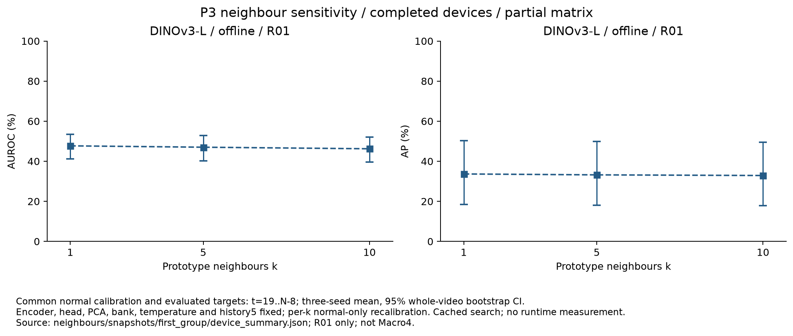
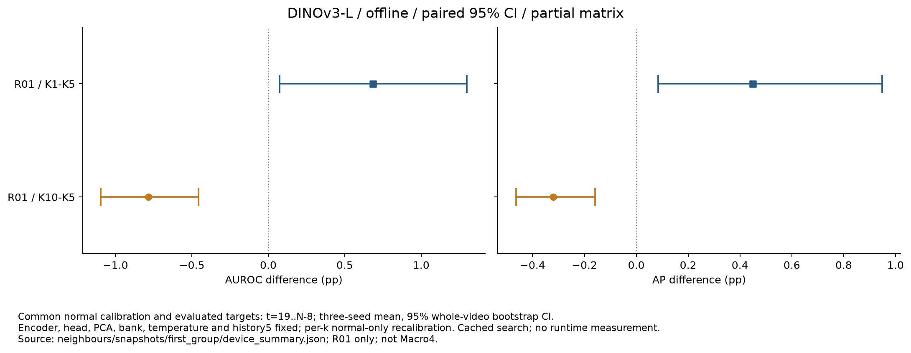

# 이웃 수 k=1·5·10 비교

고정 백본의 P3에서 검색 이웃 수만 바꾼다. 현재 공개 스냅샷은 **DINOv3-L / 오프라인 / R01 / seed 0·1·2**, 총 9개 seed 조건이다. 두 백본 × 두 모드 × 네 장비 × 세 seeds × 세 이웃 수의 전체 144개 조건의 추가 검증·집계·공개는 진행 중이다. 이 문서의 수치를 전체 장비 Macro4 결과로 해석하지 않는다.

## 고정한 조건

- 기존 정상 fit 영상에서 구성한 encoder·위상 head·PCA 256차원·16 bins × 128 prototypes를 재사용한다. 검색 범위는 예측 위상 bin과 양옆 bin이다.
- 이웃 거리 soft weighting과 상위 5% patch 집계를 유지하고 `k`만 1·5·10으로 바꾼다. `k=1`은 같은 위상 검색 범위의 hard nearest neighbour와 같다.
- temperature는 **기존 정상 calibration의 다섯 번째 이웃 제곱거리 중앙값**으로 고정한다. 영상별로 균형 있게 뽑은 50,000개 정상 패치에서 구한 값이며, k별 temperature를 다시 맞추지 않는다.
- 시간 이력 5, 정상 fit의 주기 길이 중앙값, 특징·시간 가중치 0.5/0.5를 유지한다.
- 각 k의 특징 분포가 달라지므로 median·MAD·component q99·P3 q99를 같은 **정상 calibration 영상**에서 다시 구한다. 모든 calibration을 고정한 뒤 테스트를 처리한다.

median·MAD·q99 보정과 정확도 평가는 주 방법과 같은 `t=19..N−8` 구간을 사용한다. 실제 온라인 알람은 마지막 7프레임도 계속 계산하며, EOF·미확정 GT를 알람 중단 조건으로 사용하지 않는다. k=5의 기존 알람과 비교하는 재현 게이트는 기존의 공통 구간에 적용한다.

## R01 오프라인 결과

실제 테스트 15개 영상, 유효 3,295프레임, 이상 1,227프레임이다. 각 seed에서 전체 유효 프레임의 AUROC/AP를 계산하고 세 지표를 평균했다. seed 점수나 서로 다른 장비 프레임을 합쳐 지표를 만들지 않는다. 괄호는 영상 단위 bootstrap 1,000회의 percentile 95% CI다.

| k | AUROC / 95% CI (%) | AP / 95% CI (%) |
|---:|---:|---:|
| 1 | 47.69 (41.16..53.48) | 33.66 (18.36..50.34) |
| 5 | 47.01 (40.29..52.83) | 33.21 (18.07..49.84) |
| 10 | 46.23 (39.53..52.05) | 32.89 (17.78..49.50) |



각 비교에는 같은 영상 재표본과 같은 seeds를 사용한다. 차이의 CI는 각각의 CI 경계를 빼서 만들지 않고, paired 재표본의 지표 차이에서 계산한다.

| 비교 | AUROC 차이 / 95% CI (pp) | AP 차이 / 95% CI (pp) |
|---|---:|---:|
| k=1 − k=5 | +0.68 (+0.07..+1.30) | +0.45 (+0.08..+0.95) |
| k=10 − k=5 | -0.78 (-1.10..-0.46) | -0.32 (-0.46..-0.16) |



이 장비·모드에서는 k=1의 차이가 양수이고 k=10의 차이가 음수였다. 전체 행렬의 결과와 다중 비교 보정은 아직 없으며, 이 테스트 결과로 기본 k=5를 변경하지 않는다. 차이와 별개로 R01 P3의 낮은 절대 정확도도 함께 읽어야 한다.

## 재현과 검증

기존 k=5를 실제 GPU로 다시 검색했으며, 세 seeds 모두 **특징·시간·최종 점수의 최대 차이 0, 기존 공통 구간의 알람 불일치 0개**였다. 정상 임계값 9개는 CSV에서 직접 재계산했다. 고정 위상·GT·유효 프레임·정상 보정·스트리밍 알람을 검사하고, 원본 결과·은행·head·특징 캐시의 해시를 기록했다.

은행 복원 중 PCA 배열을 기본 C layout으로 복사한 실행에서 FP32 검색 점수의 재현 게이트가 실패했다. 저장된 Fortran layout을 `copy(order='K')`로 유지한 후 정확히 재현됐다. FP32 행렬 곱의 반올림은 배열 stride에 따라 달라질 수 있으므로 같은 복원 방식을 런타임 로더에도 적용했고, 실제 로더의 PCA stride 보존을 CPU 회귀 테스트로 확인했다. 실제 런타임의 점수·알람 동등성과 FPS·지연은 별도로 측정해야 한다.

허용 오차는 raw 특징 `rtol=1e−5/atol=1e−7`, 최종 점수 `rtol=1e−5/atol=1e−4`, 시간 점수 `atol=1e−12`, 기존 구간의 알람 불일치 0개다. 실패한 계산을 통과시키기 위해 허용 오차를 확대하지 않았다.

기존 특징 캐시와 고정 위상 예측을 사용한 검색 실험이다. encoder를 독립적으로 재추출한 검증이나 실시간 처리량 측정은 아니다. 공개 스냅샷의 171개 파일은 별도로 검증한 첫 GPU 실행과 내용 해시가 모두 같음을 확인했다. 이후 조건은 이번 스냅샷에서 제외했다.

```bash
# 전체 검색: 새 출력 디렉터리만 허용하며 기존 결과를 덮어쓰지 않는다.
python -m ipad_jepa.neighbour_ablation --out artifacts/tmp/neighbour_rerun_full

# 완료된 세-seed 장비 그룹만 검증·집계한다.
python scripts/summarize_neighbour_ablation.py --root artifacts/tmp/neighbour_rerun_full
# 전체 144개 조건 완료를 요구할 때는 --require-full을 추가한다.

# 이번 공개 스냅샷의 그래프 재생성
python scripts/plot_neighbour_ablation.py \
  --root results/stage05/ablations/neighbours/snapshots/first_group
```

첫 그룹만 새 로컬 경로에서 재실행하려면 `--model dinov3-l --mode offline --device R01 --out artifacts/tmp/neighbour_rerun`을 검색 명령에 함께 지정한다. 실제 파일·캐시·메모리가 필요하며 모델 파일과 특징 tensor는 Git에 포함하지 않는다.

- [세-seed 수치와 paired CI](../results/stage05/ablations/neighbours/snapshots/first_group/device_summary.json)
- [정상 q99·점수·출처 검사](../results/stage05/ablations/neighbours/snapshots/first_group/validation.json), [공개 파일 일치 근거](../results/stage05/ablations/neighbours/snapshots/first_group/canonical_match.json)
- [검색 코드](../src/ipad_jepa/neighbour_ablation.py), [검증·집계 코드](../scripts/summarize_neighbour_ablation.py), [그래프 코드](../scripts/plot_neighbour_ablation.py)
- [그래프 출처·파일 해시·보고용 버전](../results/stage05/ablations/neighbours/snapshots/first_group/figure_sources.json), [같은 버전의 임시 CPU 보고 환경](../results/setup/cpu_reporting_runtime.json)
- [k별 정상 보정과 실제 프레임 점수](../results/stage05/ablations/neighbours)

전체 행렬·다른 OFAT·LoRA·진단·실시간 측정이 남아 있으므로 Stage 05 완료를 선언하지 않는다.
