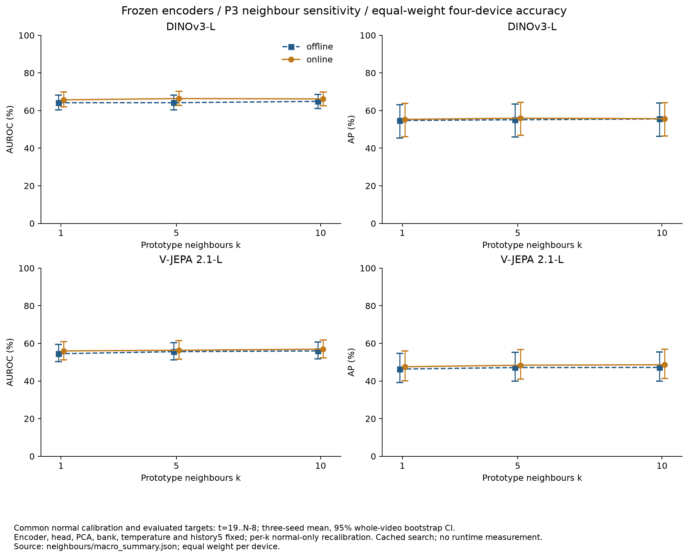
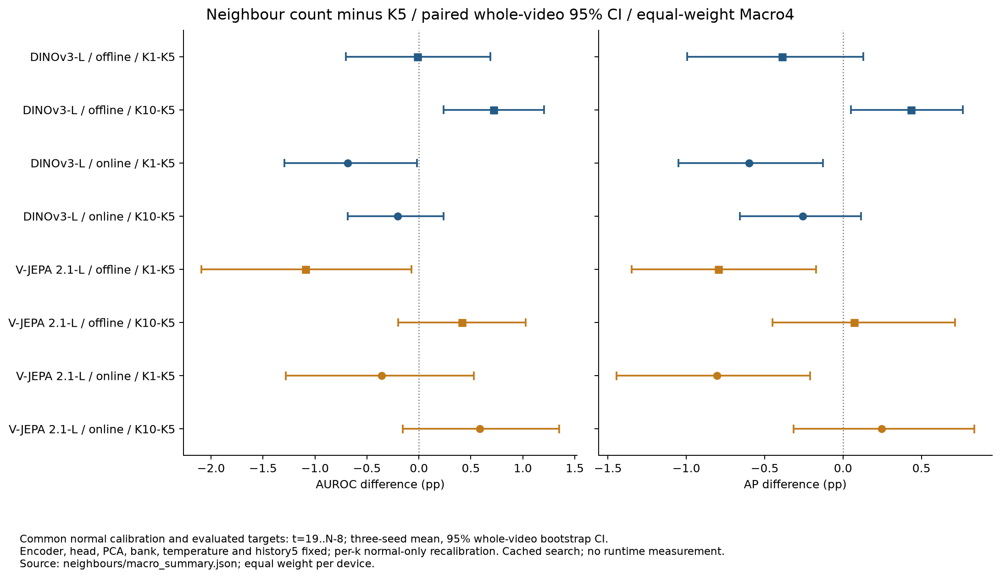

# 이웃 수 k=1·5·10 비교

고정 백본의 P3에서 검색 이웃 수만 바꿨다. **두 백본 × 오프라인·온라인 × 네 장비 × 세 seeds × k=1·5·10**, 총 **144개 seed 조건**을 실제 GPU로 계산하고 검증했다. 장비별 48개 세-seed 조건과 동일 비중 Macro4 12개 조건을 공개한다.

## 고정한 조건

- 기존 정상 fit 영상에서 구성한 encoder·위상 head·PCA 256차원·16 bins × 128 prototypes를 재사용한다. 검색 범위는 예측 위상 bin과 양옆 bin이다.
- 이웃 거리 soft weighting과 상위 5% patch 집계를 유지하고 `k`만 1·5·10으로 바꾼다. `k=1`은 같은 위상 검색 범위의 hard nearest neighbour와 같다.
- temperature는 **기존 정상 calibration의 다섯 번째 이웃 제곱거리 중앙값**으로 고정한다. 영상별로 균형 있게 뽑은 50,000개 정상 패치에서 구한 값이며, k별 temperature를 다시 맞추지 않는다.
- 시간 이력 5, 정상 fit의 주기 길이 중앙값, 특징·시간 가중치 0.5/0.5를 유지한다.
- 각 k의 특징 분포가 달라지므로 median·MAD·component q99·P3 q99를 같은 **정상 calibration 영상**에서 다시 구한다. 모든 calibration을 고정한 뒤 테스트를 처리한다.

median·MAD·q99 보정과 정확도 평가는 주 방법과 같은 `t=19..N−8` 구간을 사용한다. 실제 온라인 알람은 마지막 7프레임도 계속 계산하며, EOF·미확정 GT를 알람 중단 조건으로 사용하지 않는다. k=5의 기존 알람과 비교하는 재현 게이트는 기존의 공통 구간에 적용한다.

## 네 장비 동일 비중 결과

테스트 66개 영상, 유효 31,728프레임, 이상 13,599프레임을 사용했다. 각 장비에서 seed별 AUROC/AP의 평균을 구한 뒤 R01·R02·R03·R04를 동일 비중으로 평균했다. 영상 수나 프레임 수로 장비를 가중하지 않는다. 괄호는 각 장비 내부에서 영상을 독립적으로 재표본한 bootstrap 1,000회의 percentile 95% CI다. 동일 재표본을 seeds와 paired 조건에 공유하며, 학습 seed 모집단의 불확실성까지 나타내는 CI는 아니다.

| 백본 | 모드 | k | AUROC / 95% CI (%) | AP / 95% CI (%) |
|---|---|---:|---:|---:|
| DINOv3-L | 오프라인 | 1 | 64.14 (60.27..68.13) | 54.71 (45.45..63.10) |
| DINOv3-L | 오프라인 | 5 | 64.15 (60.32..68.11) | 55.10 (46.01..63.53) |
| DINOv3-L | 오프라인 | 10 | 64.87 (61.06..68.64) | 55.53 (46.33..63.97) |
| DINOv3-L | 온라인 | 1 | 65.69 (61.90..69.75) | 55.31 (46.14..63.89) |
| DINOv3-L | 온라인 | 5 | 66.37 (62.75..70.13) | 55.92 (46.79..64.33) |
| DINOv3-L | 온라인 | 10 | 66.17 (62.48..69.86) | 55.66 (46.44..64.21) |
| V-JEPA 2.1-L | 오프라인 | 1 | 54.50 (50.28..59.42) | 46.35 (39.16..54.79) |
| V-JEPA 2.1-L | 오프라인 | 5 | 55.59 (51.25..60.32) | 47.14 (39.98..55.17) |
| V-JEPA 2.1-L | 오프라인 | 10 | 56.01 (51.83..60.74) | 47.21 (40.01..55.36) |
| V-JEPA 2.1-L | 온라인 | 1 | 55.99 (51.28..60.96) | 47.59 (40.16..55.90) |
| V-JEPA 2.1-L | 온라인 | 5 | 56.35 (51.59..61.37) | 48.39 (41.01..56.66) |
| V-JEPA 2.1-L | 온라인 | 10 | 56.93 (52.33..61.85) | 48.64 (41.31..56.88) |



## k=5 대비 paired 차이

차이의 CI는 개별 CI 경계를 빼서 만들지 않고, 같은 영상 재표본의 지표 차이로 계산했다. 단위는 percentage points(pp)다. 아래 CI에는 다중 비교 보정을 적용하지 않았으므로 탐색적 결과로 해석한다.

| 백본 | 모드 | 비교 | AUROC 차이 / 95% CI (pp) | AP 차이 / 95% CI (pp) |
|---|---|---|---:|---:|
| DINOv3-L | 오프라인 | k=1 − k=5 | -0.01 (-0.70..+0.69) | -0.39 (-1.00..+0.13) |
| DINOv3-L | 오프라인 | k=10 − k=5 | +0.72 (+0.24..+1.21) | +0.43 (+0.05..+0.76) |
| DINOv3-L | 온라인 | k=1 − k=5 | -0.68 (-1.29..-0.02) | -0.60 (-1.05..-0.13) |
| DINOv3-L | 온라인 | k=10 − k=5 | -0.20 (-0.69..+0.24) | -0.26 (-0.66..+0.11) |
| V-JEPA 2.1-L | 오프라인 | k=1 − k=5 | -1.09 (-2.09..-0.07) | -0.80 (-1.35..-0.17) |
| V-JEPA 2.1-L | 오프라인 | k=10 − k=5 | +0.42 (-0.20..+1.03) | +0.07 (-0.45..+0.71) |
| V-JEPA 2.1-L | 온라인 | k=1 − k=5 | -0.36 (-1.28..+0.53) | -0.80 (-1.45..-0.21) |
| V-JEPA 2.1-L | 온라인 | k=10 − k=5 | +0.59 (-0.15..+1.35) | +0.25 (-0.32..+0.84) |



DINOv3 오프라인의 k=10은 AUROC/AP가 각각 +0.72/+0.43pp이고 두 CI가 0을 포함하지 않았다. 반면 DINOv3 온라인과 V-JEPA 오프라인의 k=1은 두 지표가 낮아졌고 두 CI가 0을 포함하지 않았다. V-JEPA 온라인의 k=10 개선량은 두 CI 모두 0을 포함했다. 모든 백본·모드에 통용되는 이웃 수의 우위는 확인되지 않았으며, 이 테스트 결과로 기본 k=5를 변경하지 않는다.

R01 DINOv3 오프라인만 보면 k=1의 AUROC/AP는 +0.68/+0.45pp였다. 전체 Macro4에서는 -0.01/-0.39pp이고 두 CI가 0을 포함한다. 장비 하나의 결과를 전체 결론으로 확대하지 않는다. 첫 9개 조건의 [공개 스냅샷](../results/stage05/ablations/neighbours/snapshots/first_group/device_summary.json)과 [독립 실행 파일 일치 근거](../results/stage05/ablations/neighbours/snapshots/first_group/canonical_match.json)는 보존했다.

## 재현과 검증

기존 k=5를 실제 GPU로 다시 검색했으며, **48개 원본 seed 조건 모두 특징·시간·최종 점수의 최대 차이 0, 기존 공통 구간의 알람 불일치 0개**였다. 정상 임계값 **144개**를 CSV에서 직접 재계산했다. 원본 annotation과 정렬, 위상·유효 프레임·정상 보정·스트리밍 알람을 검사하고, 원본 결과·은행·head·특징 캐시의 해시를 기록했다. k=5의 네 백본·모드 Macro4 평균과 CI 경계 24개도 기존 P3와 1e−12 이내로 일치했다.

은행 복원 중 PCA 배열을 기본 C layout으로 복사한 실행에서 FP32 검색 점수의 재현 게이트가 실패했다. 저장된 Fortran layout을 `copy(order='K')`로 유지한 후 정확히 재현됐다. FP32 행렬 곱의 반올림은 배열 stride에 따라 달라질 수 있으므로 같은 복원 방식을 런타임 로더에도 적용했고, 실제 로더의 PCA stride 보존을 CPU 회귀 테스트로 확인했다. 실제 런타임의 점수·알람 동등성과 FPS·지연은 별도로 측정해야 한다.

허용 오차는 raw 특징 `rtol=1e−5/atol=1e−7`, 최종 점수 `rtol=1e−5/atol=1e−4`, 시간 점수 `atol=1e−12`, 기존 구간의 알람 불일치 0개다. 실패한 계산을 통과시키기 위해 허용 오차를 확대하지 않았다. 기존 특징 캐시와 고정 위상 예측을 사용한 검색 실험이며 encoder를 독립적으로 재추출한 검증이나 실시간 처리량 측정은 아니다. 오프라인·온라인은 정상 fit/calibration 입력 경계도 달라 전체 프로토콜 비교로 읽어야 한다.

```bash
# 새 출력 디렉터리에서 전체 행렬 재실행
python -m ipad_jepa.neighbour_ablation --out artifacts/tmp/neighbour_rerun_full
python scripts/summarize_neighbour_ablation.py \
  --root artifacts/tmp/neighbour_rerun_full --require-full

# 공개된 검증 수치에서 그래프 재생성
python scripts/plot_neighbour_ablation.py
```

실제 모델·캐시·메모리가 필요하며 가중치와 특징 tensor는 Git에 포함하지 않는다.

- [Macro4와 paired CI](../results/stage05/ablations/neighbours/macro_summary.json), [장비별 수치](../results/stage05/ablations/neighbours/device_summary.json)
- [정상 보정·GT·점수·알람·출처 검증](../results/stage05/ablations/neighbours/validation.json), [전체 완료 기록](../results/stage05/ablations/neighbours/completion.json), [기존 P3 집계 일치와 그래프 검사](../results/stage05/ablations/neighbours/publication_check.json)
- [검색 코드](../src/ipad_jepa/neighbour_ablation.py), [검증·집계 코드](../scripts/summarize_neighbour_ablation.py), [그래프 코드](../scripts/plot_neighbour_ablation.py)
- [그래프 출처·파일 해시·보고용 버전](../results/stage05/ablations/neighbours/figure_sources.json), [같은 버전의 CPU 보고 환경](../results/setup/cpu_reporting_runtime.json)
- [k별 정상 보정과 실제 프레임 점수](../results/stage05/ablations/neighbours)

다른 OFAT·전체 LoRA·진단·실시간 측정이 남아 있으므로 Stage 05 전체 완료를 선언하지 않는다.
