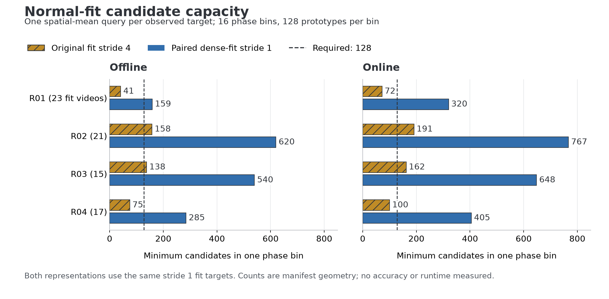
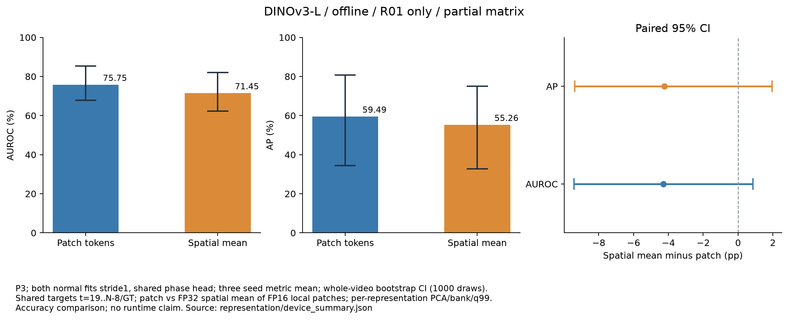

# 패치 특징과 공간 평균 특징의 비교

IPAD 정상 영상의 같은 프레임에서 **576개 공간 패치**와 **그 패치의 공간 평균 1개**로 구성한 메모리를 비교한다. 두 표현 모두 디코더를 사용하지 않는다. 전체 비교는 두 백본 × 온라인·오프라인 × R01–R04 × 세 seeds × 두 표현의 **96개 조건**이다.

전체 **96개 조건 중 DINOv3-L 오프라인 R01의 세-seed 쌍, 6개 조건**은 실제 평가·독립 검증을 완료했다. 나머지 90조건과 전체 Macro4·실시간 처리 성능은 아직 없다. 후보 추출·평균 query·분할 및 캐시 변조 검증의 테스트 10개와 독립 검증 테스트 6개를 통과했다. 아래 후보 수 그래프는 입력 기하를 나타내며 모델 성능 그래프와 구분한다.



## 첫 장비의 세-seed paired 결과

아래는 **R01 오프라인의 부분 결과**다. 두 표현 모두 stride 1로 정상 fit을 추출하고 각 seed의 동일 head·위상/시간 점수를 공유했다. 실제 테스트 15개 영상·유효 3,295프레임·이상 1,227프레임에서 P3를 비교했다.

| 표현 | AUROC / 95% CI (%) | AP / 95% CI (%) |
|---|---:|---:|
| 패치 576개 | 75.75 (67.88..85.31) | 59.49 (34.36..80.65) |
| 공간 평균 1개 | 71.45 (62.24..82.11) | 55.26 (32.69..74.96) |
| 평균−패치 차이 (pp) | −4.30 (−9.42..+0.85) | −4.24 (−9.38..+1.95) |



고정된 세 seeds의 지표를 평균하고 원본 영상 단위 paired bootstrap 1,000회로 CI를 계산했다. 두 차이의 CI 모두 0을 포함한다. 이 비교의 patch 기준은 **dense 정상 fit·공유 head 조건**이며 기존 Stage 02의 stride 4 patch P3와 다르다. 기존 조건 대비 향상을 평균/패치 표현의 단독 효과로 해석하지 않는다. 전체 백본·장비·온라인으로 일반화하지 않는다.

[수치·paired CI](../results/stage05/ablations/representation/device_summary.json), [6조건 정상 보정·3쌍 공유 phase·실제 평균 20개 view 재계산 검증](../results/stage05/ablations/representation/validation.json), [그래프 출처와 PNG/SVG 해시](../results/stage05/ablations/representation/figure_sources.json)를 제공한다. 실제 정상 calibration/test의 모든 평균 query를 부모 패치에서 재계산했다. dense fit의 compact 평균은 추출 코드·관측 후보·배열 해시로 확인하며, 전체 dense encoder를 독립적으로 재실행한 검증과 구분한다.

## 학습 밀도를 함께 바꾸는 이유

기존 fit stride 4로 평균 특징 하나를 만들면 R01·R04는 일부 위상 구간에서 128개의 관측 후보를 확보하지 못한다. 부족분을 반복하거나 테스트 데이터로 채우지 않고, **두 표현 모두 fit stride 1**로 다시 추출한다. 캘리브레이션·테스트 대상 프레임은 기존 16프레임 캐시와 동일하다.

각 수치는 16개 구간 중 관측된 프레임 수가 가장 적은 구간의 후보 수다. 모든 정상 fit 영상의 전체 대상 프레임으로 계산했다.

| 모드 | 장비 | 기존 stride 4 | 비교용 stride 1 | dense fit 클립 수 |
|---|---|---:|---:|---:|
| 오프라인 | R01 | 41 | 159 | 4,954 |
| 오프라인 | R02 | 158 | 620 | 12,128 |
| 오프라인 | R03 | 138 | 540 | 10,226 |
| 오프라인 | R04 | 75 | 285 | 6,345 |
| 온라인 | R01 | 72 | 320 | 5,299 |
| 온라인 | R02 | 191 | 767 | 12,443 |
| 온라인 | R03 | 162 | 648 | 10,451 |
| 온라인 | R04 | 100 | 405 | 6,600 |

[전체 구간별 후보 수](../results/setup/representation_capacity.json), [원본 manifest](../results/stage00/manifest.json), [그래프의 출처와 PNG/SVG 해시](../results/setup/representation_capacity_figure_sources.json)를 함께 제공한다. 표의 후보 수는 두 백본에 공통인 입력 기하이며, 새 특징 추출의 완료를 증명하지 않는다.

## 두 표현에 공통인 조건

| 항목 | 고정 조건 |
|---|---|
| 입력 | RGB 384×384, 16프레임, 동일한 공식 L 백본의 고정 가중치 |
| 실제 정상 학습 | fit 76개 영상 전체; 각 표현이 같은 stride 1 프레임 사용 |
| 위상 예측 | 전체 문맥의 pooled 특징 → 200-class head; 장비·모드·seed마다 20 epoch, 정상 검증 CE가 최소인 epoch |
| head 공유 | 같은 seed의 패치·평균 조건에서 동일한 체크포인트와 입력 특징 사용 |
| 메모리 | 위상 16 bins × 128개 = 2,048개, 비백색화 PCA 256차원, L2 정규화, k-center |
| 학습 후보 | 영상·위상 균형, 구간당 최대 10,000개 실제 관측 후보, 중복 좌표 없이 선택 |
| 점수 | P0–P3 모두 저장; 주 비교 P3, soft k=5, 시간 이력 5, 상위 5% 공간 점수 |
| 온도·임계값 | 각 메모리마다 정상 calibration으로 온도·MAD·q99 다시 계산 |
| 평가 | 같은 `t=19..N−8` 및 라벨 불확실성 제외 구간; GT는 모델·보정이 고정된 뒤 평가에만 사용 |

공간 평균의 상위 5%는 하나의 query 자체다. PCA는 최대 50,000개의 실제 후보로 학습한다. 평균 표현은 전체 후보 수가 그보다 작으므로 **실제로 사용한 표본 수**를 따로 기록한다. 정상 calibration 온도 표본도 최대 50,000개이며, 평균 표현의 실제 표본 수를 기록한다. 표본을 반복해 숫자를 맞추지 않는다.

## 어떤 특징을 평균하는가

`global_mean`은 **대상 시점의 576개 local 패치**를 공간 방향으로만 평균한다. 전체 영상 문맥의 pooled 특징은 두 표현 모두 위상 head의 입력으로 계속 사용한다. 공간 평균에 시간축이나 특수 토큰을 추가하지 않는다.

공통 인코더의 target-local 출력은 기존 캐시와 같은 FP16 값으로 변환한다. 그 값의 공간 평균을 FP32로 계산·보관하고, PCA·메모리 검색도 기존 FP32 구현을 사용한다. 원본 patch cache에 공간 평균을 적용할 때도 같은 연산을 적용한다.

오프라인 local 출력은 DINOv3의 두 프레임 `t,t+1` 평균 및 V-JEPA의 대응 tubelet이다. 온라인 local 출력은 `t−1,t`다. 전체 입력 문맥은 각각 `[t−8,…,t+7]`, `[t−15,…,t]`다. 온라인 정상 fit 앞부분만 왼쪽 padding을 허용하며 정상 검증·테스트에는 padding하지 않는다.

## 추출·출처·보관 방식

새 정상 fit의 **모든 dense 대상 클립을 실제로 인코딩**한다. 먼저 각 seed의 영상·위상 균형 후보 좌표를 정한 후, 추출 중 그 좌표의 패치만 저장한다. 모든 클립의 공간 평균과 phase 입력도 함께 저장한다. 저장 용량을 줄이면서 전체 학습 프레임 범위를 유지한다.

정상 calibration과 테스트는 이미 추출된 같은 고정 백본의 **실제 16프레임 패치·문맥 특징**을 재사용한다. 평균 query는 이 패치 캐시에서 유도한다. 기존 캐시를 새로 인코딩했다고 기록하지 않는다. 새 dense-fit reader와 기존 frozen reader의 해시·가중치·upstream·전처리·출력 dtype·입력 길이를 따로 검증하고 기록한다.

`dense_fit.json`에는 실제 원본 프레임 해시, 모든 정상 대상 수, seed별 후보 좌표·배열 해시가 남는다. mean view에는 부모 캐시 fingerprint, 실제 metadata/target 해시, 평균 배열 해시를 기록한다. 각 조건에는 공유 head·private bank·코드·공개 CSV/JSON의 해시를 제공한다. 부분 출력은 자동 덮어쓰기나 임의 재시작하지 않는다.

후보 추출 밀도와 head가 기존 stride 4 실험과 다르므로, 공간 평균의 효과는 **이번에 다시 학습한 patch 조건과의 paired 비교**로 판단한다. 기존 Stage 02/03 패치 결과와의 차이에는 학습 밀도와 head 변화도 포함된다.

## 재현 명령

```bash
export PYTHONPATH=src
export OPENBLAS_NUM_THREADS=4
export OMP_NUM_THREADS=4
export CUDA_CACHE_PATH="$PWD/artifacts/cuda-cache"
export TMPDIR="$PWD/artifacts/tmp"
python scripts/audit_representation_capacity.py
python scripts/plot_representation_capacity.py
python scripts/run_representation_matrix.py \
  --data-root "$IPAD_DATA_ROOT"
```

기본 명령은 전체 96개 조건을 수행한다. 새 로컬 특징·head·bank는 `artifacts/representation_dense`와 `artifacts/runs_representation`에, 공개 가능한 결과는 `results/stage05/ablations/representation/{patch,global_mean}`에 저장한다. 모델·캐시·메모리 텐서·원본 영상은 Git에서 제외한다.

독립 검증·집계 코드는 [summarize_representation_ablation.py](../scripts/summarize_representation_ablation.py)에 구현했다. 완료된 세-seed paired 그룹만 검증하며, `--require-full`은 전체 96개 조건이 없으면 결과 집계를 거부한다.

```bash
python scripts/summarize_representation_ablation.py --require-full
python scripts/plot_representation_accuracy.py
```

검증은 실제 dense-fit 좌표·배열 해시·표본 수, 동일 head·phase·시간 점수, 정상 MAD·component/P3 q99, 실제 GT·공통 평가 구간·알람·CSV 지표를 확인한다. **정상 calibration과 테스트의 모든 평균 query**를 실제 부모 FP16 패치에서 독립적으로 FP32 공간 평균을 다시 계산해 정확히 비교한다. 평균 view의 해시만 검사하는 데 그치지 않는다.

새 검증 테스트 6개는 평균 값 변조, 문맥 특징으로 바꾼 잘못된 query 형태/dtype, 서로 다른 head, 변경된 phase와 GT에 종속된 inference mask를 거부한다. 특징 점수 자체는 표현에 따라 달라도 허용하며 head·위상·시간 점수의 공유를 검증한다.

독립 검증은 인코더·phase 학습·PCA/k-center 학습·GPU 거리/temperature 표본 계산을 다시 실행하지 않는다. 저장 용량을 줄인 dense-fit의 평균 특징은 추출 코드·실제 관측 후보·배열 해시로 검증한다. 실제 calibration/test 평균의 재계산과 구분한다. R01 오프라인 6조건은 감사·정확도/CI를 완료했으며, **전체 96조건의 검증·Macro4는 아직 완료하지 않았다.**

검증된 조건에서 영상 단위 paired bootstrap 1,000회 및 네 장비 동일 가중치 Macro4를 보고한다. 현재 코드는 공통 평가 구간의 batch 알람을 저장한다. 실시간 EOF 알람·FIFO·지연과 처리량은 별도의 실제 GPU 측정으로 검증한다.
