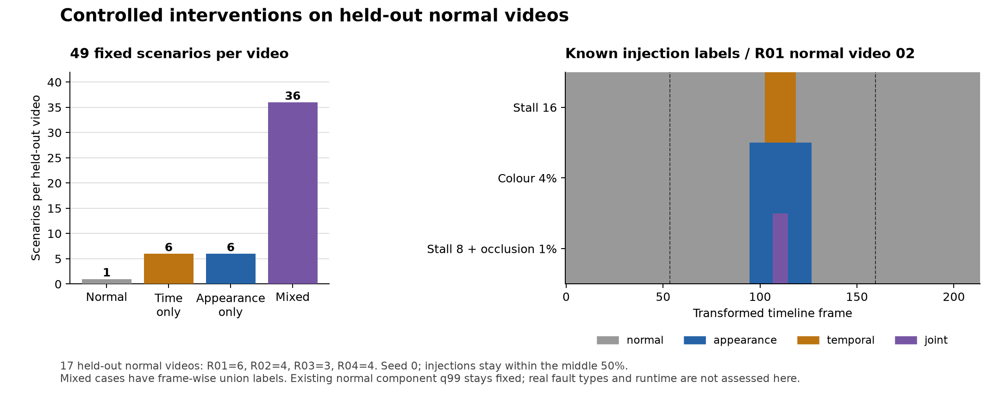

# 정상 진단 영상의 통제 변환

학습·calibration에 사용하지 않은 **정상 진단 영상 17개**에 시간·외관 변환을 적용하고, 고정 P3의 네 증거 유형을 검사한다. 원본 영상은 R01 6개·R02 4개·R03 3개·R04 4개다. 두 L 백본 × 두 모드 × 네 장비 × 세 seeds의 기존 정상 head·PCA/메모리·component q99를 그대로 사용한다. 전체 실제 GPU 평가를 시작했으며 confusion matrix·macro-F1은 독립 검증 후 공개한다.



이 도식은 실제 held-out 영상 목록과 **고정한 변환 규칙**을 보여준다. 모델의 예측·정확도 그래프가 아니다. [출처·예시 위치·PNG/SVG 해시](../results/setup/diagnostic_protocol_figure_sources.json)를 제공한다.

## 고정 시나리오

| 유형 | 변환과 강도 | 영상당 시나리오 |
|---|---|---:|
| 정상 | 원본 내용 유지 | 1 |
| 시간 | stall/reverse × 8/16/32프레임 | 6 |
| 외관 | occlusion/local colour × 면적 1/4/9%, 32프레임 | 6 |
| 혼합 | 시간 6개 × 외관 6개의 모든 조합 | 36 |

원본 영상당 **49개**, 전체 **833개 시나리오 영상**이다. 같은 영상의 변환은 독립적인 원본 표본으로 취급하지 않는다. 두 백본·두 모드의 총 3,332개 영상 인코딩을 세 seeds가 공유하며, 총 **9,996개 seed별 trace**를 만든다. GPU 특징은 메모리에서 사용하고 원본·변환 이미지나 전체 특징 캐시를 저장하지 않는다.

변환 생성 seed는 0이다. `SeedSequence([0, 장비 번호, 영상 번호])`로 영상별 위치를 고정해 모든 모델·모드·학습 seed가 같은 시나리오를 사용한다. 32프레임 외관 구간은 영상 중간 50% 안에 완전히 들어가며, 짧은 시간 구간은 그 중앙에 배치한다. spatial box도 영상별 같은 중심을 사용하고 강도에 따라 크기만 바꾼다. 위치·강도는 결과를 보고 변경하지 않는다.

- **stall**: 지정 구간 동안 바로 이전 프레임을 유지한다. 이후 원래 timeline으로 복귀하고 영상 길이는 유지한다.
- **reverse**: 지정 구간의 원본 프레임 순서만 뒤집는다. 나머지 프레임과 길이를 유지한다.
- **occlusion**: RGB를 384×384로 bilinear resize한 뒤 정사각형 영역을 검정으로 바꾼다.
- **local colour**: 같은 정사각형에서 RGB 단위값에 `(＋0.25, −0.15, ＋0.15)`를 더하고 `[0,1]`로 clip한 뒤 uint8로 반올림한다.

정사각형 변 길이는 `round(384×sqrt(면적 비율))`이다. 1/4/9%의 실제 기하 면적은 약 **0.9793/4.0209/8.9688%**이며, 요청 비율과 실제 면적을 모두 기록한다. 가림과 색 변화는 시간 재배열 후 수신 timeline 위치에 적용한다. 입력을 바꿀 때 원본 RGB 배열을 수정하지 않는다.

## 실제 모델 입력과 평가

시나리오 영상은 사전에 생성한 진단 입력이다. reverse 생성은 원본 내용을 재배열하며, 이후 온라인 모델은 **변환된 스트림에서 이미 수신한 과거 16프레임**만 사용한다. 원본 인덱스와 수신 timeline 인덱스를 구분해 기록한다. 오프라인 모델은 변환 timeline의 `[t−8,…,t+7]`을 사용한다. 두 모드 모두 padding 없는 실제 16프레임을 사용한다.

백본 출력은 기준 실험과 같은 BF16 batch 4이며 local `576×1024`와 문맥 `1024`를 FP16에 반올림한 뒤 FP32 head/search 입력으로 사용한다. 같은 인코딩을 세 seed의 선택 head·메모리에 각각 적용한다. 위상 head는 BF16 batch 256, 검색은 FP32와 저장된 PCA layout을 사용한다. 주기 길이는 원래 정상 fit 영상의 중앙값이며 진단 영상 길이를 위상 네트워크에 제공하지 않는다.

원래 정상 calibration CSV에서 median/MAD·component q99·P3 q99를 재계산해 저장된 값과 일치하는지 확인한 뒤, **저장된 원래 값을 그대로 사용**한다. 진단 특징으로 PCA·은행·head·임계값을 재학습하지 않는다. 위상·특징/시간 점수와 증거 유형을 계산한 뒤에만 알려진 개입 라벨과 비교한다.

| 코드 | 진단 정답: 적용한 개입 | 예측: 기존 정상 component q99 |
|---:|---|---|
| 0 | 개입 없음 | 두 성분 모두 임계값 이하 |
| 1 | 외관 개입만 적용 | 특징 성분만 초과 |
| 2 | 시간 개입만 적용 | 시간 성분만 초과 |
| 3 | 두 개입 동시 적용 | 두 성분 모두 초과 |

혼합 구간의 정답은 frame별 union bit다. 예를 들어 시간 8프레임 + 외관 32프레임은 joint 8프레임, appearance 24프레임이다. 정답을 시나리오 전체의 한 클래스로 덮어쓰지 않는다. 공통 `t=19..N−8`에서 4×4 confusion·class별 F1·macro-F1을 계산한다. 개입 전후의 모델 문맥 영향도 해당 구간에서 평가하며, 유리한 결과를 위해 경계 프레임을 제거하지 않는다.

이 정답은 주입한 개입을 의미하며 실제 IPAD 결함의 원인 라벨이 아니다. real fault type과 pixel GT가 없으므로 실제 원인 분류 성능·pixel AUROC를 주장하지 않는다. GPU 동시 실행은 정확도 진단에 허용하며, 이 실행 시간을 실시간 FPS/지연으로 사용하지 않는다.

## 코드와 검증

[고정 변환·정답·confusion/F1](../src/ipad_jepa/diagnostics.py), [실제 전체 GPU 평가](../src/ipad_jepa/diagnostic_evaluation.py), [프로토콜 도식](../scripts/plot_diagnostic_protocol.py)을 제공한다. 14개 테스트는 49개 시나리오·36개 혼합 조합·중간 50%·길이/순서·정상 held-out 경계·실제 RGB 변환 면적·원본 보존·부분 overlap 정답·네 클래스 F1·실제 온라인/오프라인 tensor 경계·문자열 경로의 소스 해시 검사와 변경 거부를 검사했다.

첫 실행은 시나리오 평가 전에 소스 해시 검사의 문자열/Path 타입 오류로 종료했다. 원래 실패 기록을 유지하고 오류 수정·회귀 테스트·실제 프로세스 종료 확인 후 `artifacts/tmp/diagnostic_pipeline_v2.json`의 새 기록으로 재실행했다. [구현·실행 상태 기록](../results/setup/diagnostic_implementation.json)에 평가 범위와 실패/복구를 명시한다.

[독립 CPU 재검증·집계 코드](../scripts/summarize_diagnostics.py)는 원본 held-out 프레임·recipe·기존 정상 head/은행/보정 해시를 확인하고 CSV의 공통 구간·시간 점수·정규화·증거 bit·부분 overlap 정답·confusion/F1을 재계산한다. 모든 49시나리오를 원본 영상 안에서 묶어 영상 단위 bootstrap 1,000회를 수행하고, 같은 표본을 세 seeds와 백본/모드 비교에 공유한다. 세-seed 지표 평균과 네 장비 동일 비중 Macro4를 계산하며, GPU 특징/거리 연산 자체를 재실행하는 검증은 아니다.

독립 검증의 14개 테스트도 통과했다. 온라인/오프라인 전체 target·혼합 구간 정답, 유효 구간·phase·시간 점수·최종 점수·증거 유형·정답 변조 거부, 원본 영상 단위의 공동 재표본, 빈 클래스 F1 처리, 다른 checkout에서의 소스 경로 정규화와 누락/변조 거부를 검사한다. confusion 시각화는 장비별 정답 행을 먼저 정규화해 같은 비중으로 평균하며, 긴 장비 영상이 그림을 지배하지 않는지 검사했다. 총 28개 CPU 테스트의 통과는 실제 9,996개 진단 trace의 완료를 뜻하지 않는다.

[실제 결과의 그래프 생성 코드](../scripts/plot_diagnostics.py)는 검증된 결과가 있을 때 confusion과 Macro-F1·paired CI를 그린다. Macro-F1은 count에서 장비별로 계산한 세-seed 지표의 평균이며 정규화한 confusion 그림에서 다시 계산하지 않는다. 아직 이 코드로 실제 모델 결과의 그림을 생성하지 않았다.

```bash
python -m ipad_jepa.diagnostic_evaluation --data-root "$IPAD_DATA_ROOT"
python scripts/summarize_diagnostics.py --data-root "$IPAD_DATA_ROOT" --require-full
python scripts/plot_diagnostics.py
PYTHONPATH=src python scripts/plot_diagnostic_protocol.py
```

기본 결과는 `results/stage05/diagnostics/<backbone>/<mode>/<device>/seed*/`에 기록한다. 각 완료 조건에 기존 정상 fit/head/은행 해시, 실제 held-out 프레임 해시, 모든 recipe·frame trace 해시를 저장한다. 전체 49시나리오·모든 해당 장비 영상이 끝난 조건에만 `diagnostic_metrics.json`을 저장한다. 새 결과 경로만 허용하며, completion 파일이 없다는 이유로 살아 있는 작업을 재시작하지 않는다.

아직 전체 GPU 결과에 대한 독립 검증 실행·세-seed 평균·영상 단위 CI·네 장비 Macro4·confusion 그래프는 남아 있다. 입력 변환·CPU 테스트·검증 코드·프로토콜 도식의 통과를 실제 진단 성능의 완료로 표시하지 않는다.
