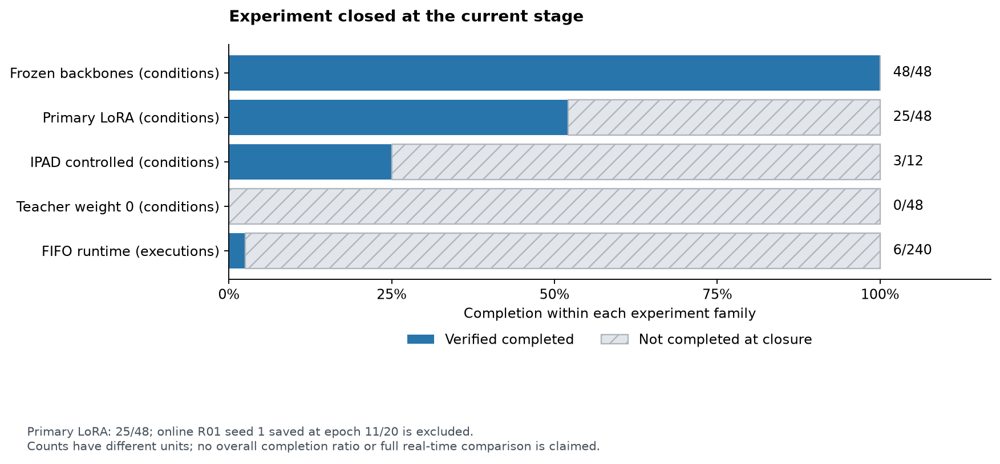

# 현재 단계 종료 보고

사용자 요청에 따라 현재까지 검증된 결과를 게시하고 실험 실행을 종료했다. **고정 백본 48/48조건, 주 LoRA 25/48조건**을 완료했다. 전체 계획의 완료를 의미하지 않는다. 남은 실험은 자동 실행하지 않는다.

## 방법과 비교 범위

IPAD 데이터·원 코드 기준선과 정상 위상별 프로토타입 메모리를 사용했다. 제안 방법은 디코더 없이 백본의 특징 잔차와 시간적 위상 이탈을 합친 P3 점수를 산출한다. DINOv3-L과 V-JEPA 2.1-L을 비교하며 온라인 입력은 `[t−15,…,t]`, 오프라인은 `[t−8,…,t+7]`다. 정상 fit·calibration·진단은 분리했고, 테스트 라벨로 모델이나 임계값을 선택하지 않았다.

## 핵심 결과

아래는 AUROC / AP (%)다. Macro4는 네 장비를 동일 가중치로 평균했으며, LoRA 오프라인은 각 장비의 세 seeds를 모두 포함한다.

| P3 | DINOv3-L | V-JEPA 2.1-L |
|---|---:|---:|
| 고정 백본 · 오프라인 Macro4 | 64.15 / 55.10 | 55.59 / 47.14 |
| 고정 백본 · 온라인 Macro4 | 66.37 / 55.92 | 56.35 / 48.39 |
| LoRA · 오프라인 Macro4 | 75.11 / 68.84 | 53.45 / 46.80 |

고정 백본 온라인−오프라인 AUROC 차이는 DINOv3 **+2.22pp [0.13, 4.33]**, V-JEPA **+0.76pp [−1.64, 3.26]**다. AP 차이의 두 CI는 0을 포함한다. 모드별 정상 head·메모리까지 달라지는 전체 프로토콜 비교다. [고정 백본의 전체 비교와 그래프](STAGE03.md), [모드·Macro4 원 결과](../results/stage02)를 제공한다.

DINOv3 LoRA 오프라인은 고정 대비 AUROC **+10.96pp [9.12, 13.08]**, AP **+13.74pp [9.98, 17.04]**다. V-JEPA LoRA는 AUROC **−2.15pp [−4.06, −0.32]**, AP **−0.34pp [−2.22, 1.28]**다. LoRA P3의 V-JEPA−DINOv3 차이는 AUROC **−21.67pp [−25.08, −18.17]**, AP **−22.04pp [−26.22, −16.25]**다. 장비별 효과와 P0–P3·paired CI는 [Stage 04](STAGE04.md)에 있다.

DINOv3 온라인 R01 seed 0은 20 epoch·3,340 updates 학습과 전체 15개 테스트 평가를 완료했다. P3는 고정 **53.94/36.11% → LoRA 77.40/69.28%**이며 두 개선 CI가 양수다. 정상 q99·3프레임 연속 규칙에서 관측 이상 구간 탐지는 **1/8 → 7/8**, 정상 알람 프레임은 **14/2,068 → 79/2,068**로 함께 늘었다. **정확도 향상이 정상 오탐 감소를 뜻하지 않는다.** 단일 seed 결과이며 온라인 세-seed 평균이나 온라인 LoRA Macro4를 제공하지 않는다. [전체 평가·그래프](STAGE04.md#dinov3-r01-온라인-seed-0의-전체-평가와-완료된-25조건-집계), [알람·점수 분포](STAGE05.md#dinov3-r01-온라인-seed-0을-포함한-전체-73조건의-캐시-알람-재검증)를 제공한다.

IPAD 통제 기준선 R01 세 seeds의 50 epoch 평가에서 B0 픽셀 AUROC/AP는 **81.51/59.79%**, B1 특징 잔차는 **68.72/50.65%**다. 입력·학습 조건도 다르므로 디코더 제거만의 효과로 해석하지 않는다. [동일 프레임 비교](STAGE01.md#ipad와-특징-기반-p3의-동일-프레임-직접-비교)를 제공한다.

실제 FIFO 파일 재생은 **6/240 실행**이다. DINOv3-L 온라인 R01 seed 0의 BF16 full/buffer는 **16.46/17.05 FPS**, target p95 지연은 **7,172/6,314ms**였다. 30 FPS 입력·drop 없음에서 큐가 누적되므로 실시간 30 FPS 처리 성공으로 주장하지 않는다. 별도 FP32 reuse는 세 영상의 점수 gate에 실패했다. [지연·큐 그래프와 실패 근거](STAGE05.md#같은-조건의-버퍼특징-재사용-실측)를 보존한다. 전체 백본·장비의 실시간 비교와 카메라 검증은 미완료다.

## 완료·미완료 목록

완료 수는 전체 평가·독립 검증 기준이다. 일부 학습이 끝났어도 평가가 미완료이면 아래 완료 수에 포함하지 않는다.

| 실험 | 완료 / 계획 | 종료 시 남은 범위 |
|---|---:|---|
| 고정 L 백본 · 두 모드 · 네 장비 · 세 seeds | 48 / 48 | 없음 |
| 주 LoRA · teacher weight 1 · fresh 20 epoch | 25 / 48 | 온라인 23조건; 세-seed 그룹 8/16 완료 |
| IPAD 통제 기준선 · fresh 50 epoch | 3 / 12 | R02–R04 9조건 평가; R02 seed 0의 50 epoch 학습은 보존 |
| IPAD 전체 정상 111영상 reference | 0 / 4 | 네 장비 |
| Teacher weight 0 신규 평가 | 0 / 48 | 전체 신규 비교 |
| 메모리 크기·위상 bins | 192 / 192 | 없음 |
| 시간 이력 5/15/31 | 144 / 144 | 없음 |
| 검색 이웃 k=1/5/10 | 144 / 144 | 없음 |
| 8/16프레임 신규 head·메모리 | 6 / 48 | 42조건 |
| 패치/공간 평균 표현 | 6 / 96 | 90조건 |
| 작은 B 백본 · 온라인 | 3 / 24 | 21조건 |
| 정상 진단 · fresh 재학습 기준 | 0 / 48 | 전체 신규 검증; legacy 결과는 별도 보존 |
| 실제 FIFO precision·구현별 실행 | 6 / 240 | 234실행 |

세 제거 실험의 완료 결과는 고정 백본 특징을 재사용한 비교이며 신규 LoRA 학습의 완료 수와 합산하지 않는다. 원 계획은 [고정 실험 행렬](../configs/experiment_matrix.yaml)에 보존했다. 미완료 주 실험의 정확한 23조건 목록은 [25조건 검증 snapshot](../results/stage04/retained_matrix_audit_R01_R02_R03_R04_partial25/validation.json)에 있다.

## 종료·보존·게시 검증

학습·GPU 실행 큐·CPU 수집기·대기 런타임의 **20개 소유 프로세스와 데이터로더 2개를 종료**하고 재시작하지 않았다. DINOv3 온라인 R01 seed 1은 **11/20 epoch·1,837 updates**의 재개 체크포인트, epoch 11 선택 adapter와 head, 학습 곡선을 보존했다. 이후 epoch의 저장되지 않은 진척은 제외했다. 이 조건은 테스트 평가가 없으며 25조건 완료 수에 포함하지 않는다.

모델·원본·teacher·메모리·기존 결과와 실행한 소스는 로컬에 보존한다. GitHub에는 코드·설정·지표·작은 학습 곡선 CSV·검증 JSON·PNG/SVG만 게시한다. 승인된 과거 86개 특징 배열 정리 외에 이번 종료로 추가 데이터를 삭제하지 않았다.

[종료·체크포인트 해시 근거](../results/setup/experiment_closure.json), [부분 학습 CSV](../results/stage04/partial_training/dinov3-l/online/R01/seed1/lora_training.csv), [25조건 게시 검증](../results/setup/primary25_DINO_R01_online_seed0_matrix_cached73_publication_check.json)을 제공한다. 종료 직전 결과 커밋 `cfb76b433431181caa2abb5859a6d0ac14015c77`은 [CI 422개 테스트와 전체 업로드 검사](https://github.com/PigeonLabs/KNU_Capstone1_VAD_JEPA/actions/runs/37197909258)를 통과했다. 최종 종료 보고의 검증은 동일 저장소의 후속 커밋 CI에서 확인한다.
