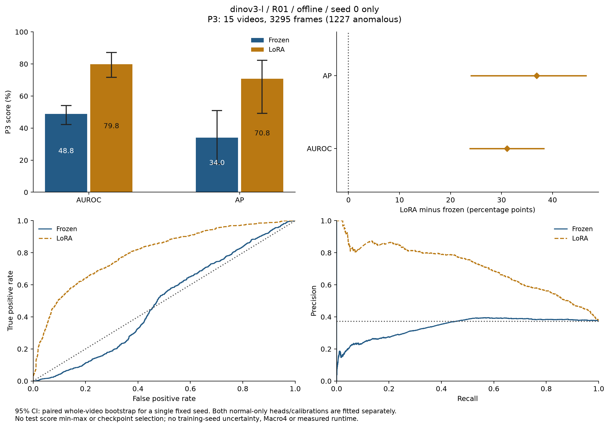
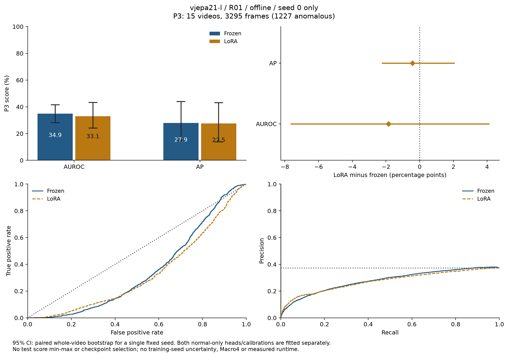
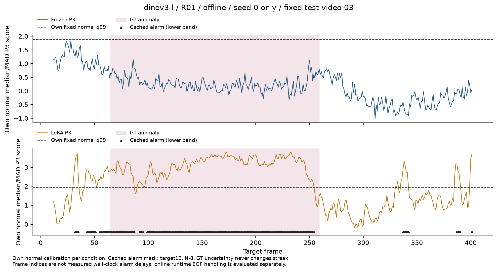
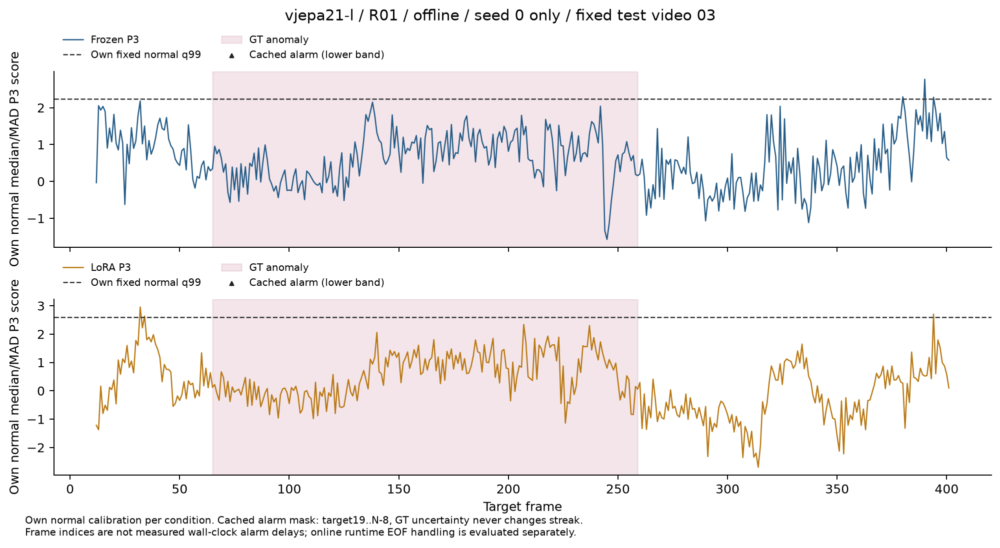

# R01 오프라인 LoRA — seed 0의 실제 이상탐지 평가

두 백본의 정상-only 20 epoch 학습과 선택된 adapter·joint 위상 head의 특징 재추출, PCA·프로토타입·정상 보정 재구성을 완료했다. **R01 오프라인 seed 0만의 결과**이며 3-seed 평균이나 Macro4 결과가 아니다. 학습·선택 조건과 정상 학습 곡선은 [Stage 04](STAGE04.md)에 제공한다.

고정 백본도 같은 장비·모드·seed 0을 사용한다. 15개 테스트 영상의 공통 `t=19..N−8` **3,295프레임(이상 1,227)**을 비교했다. 각 조건은 자신의 정상 fit/calibration에서 PCA·메모리·점수 보정을 구성한다. 고정 백본의 학습된 head와 LoRA의 선택된 joint head를 각각 사용하며, head와 특징을 서로 교환하지 않는다.

## P3 결과와 paired 비교

| 백본 | 조건 | AUROC / 95% CI (%) | AP / 95% CI (%) |
|---|---|---:|---:|
| DINOv3-L | 고정 | 48.76 / 42.22..54.13 | 33.96 / 17.74..50.98 |
| DINOv3-L | LoRA | 79.81 / 71.69..87.14 | 70.83 / 49.19..82.34 |
| V-JEPA 2.1-L | 고정 | 34.91 / 28.19..41.58 | 27.94 / 14.48..43.94 |
| V-JEPA 2.1-L | LoRA | 33.06 / 24.16..43.22 | 27.52 / 13.80..43.02 |

DINOv3 P3의 LoRA−고정 차이는 AUROC **+31.05pp(+23.70..+38.43)**, AP **+36.86pp(+23.89..+46.71)**였다. V-JEPA P3는 **−1.85pp(−7.65..+4.14)**, **−0.43pp(−2.26..+2.07)**이며 두 CI에 0을 포함한다. 이 한 seed에서 DINOv3의 P3 개선을 확인했으나, 모든 장비·모드·학습 seed에서의 LoRA 개선으로 일반화하지 않는다.

각 영상 전체를 1,000회 재표집한 paired bootstrap(seed 2026)의 percentile 95% CI다. 고정/LoRA와 P0–P3에 같은 영상 draw를 사용했으며 기각 draw는 0이다. 한 번 학습된 조건에서의 영상 표본 불확실성이며 학습 seed의 변동은 포함하지 않는다. 여러 구성의 비교에 대한 동시 CI나 다중 비교 보정은 적용하지 않았다.





## 구성별 LoRA−고정 차이

| 백본 | 구성 | AUROC 차이 / 95% CI (pp) | AP 차이 / 95% CI (pp) |
|---|---|---:|---:|
| DINOv3-L | P0 전역 hard | −9.52 (−20.72..−0.79) | −4.35 (−14.02..+3.18) |
| DINOv3-L | P1 위상 hard | +20.44 (+9.25..+29.70) | +20.16 (+7.02..+32.68) |
| DINOv3-L | P2 위상 soft | +25.22 (+13.23..+35.74) | +26.58 (+10.19..+40.30) |
| DINOv3-L | P3 시간 결합 | +31.05 (+23.70..+38.43) | +36.86 (+23.89..+46.71) |
| V-JEPA 2.1-L | P0 전역 hard | −2.07 (−3.60..−0.51) | −0.57 (−1.15..+0.01) |
| V-JEPA 2.1-L | P1 위상 hard | −1.57 (−4.12..+1.47) | −0.40 (−1.24..+0.20) |
| V-JEPA 2.1-L | P2 위상 soft | +0.88 (−4.22..+6.30) | +0.55 (−0.92..+5.16) |
| V-JEPA 2.1-L | P3 시간 결합 | −1.85 (−7.65..+4.14) | −0.43 (−2.26..+2.07) |

두 백본 모두 전역 P0의 AUROC는 낮아졌다. DINOv3 P3의 개선만으로 LoRA가 모든 특징·구성을 개선했다고 판단할 수 없다. joint 위상 head와 표현을 함께 학습했으므로 이 비교만으로 개선의 원인을 하나의 구성요소로 분리할 수도 없다.

V-JEPA는 사전에 정한 최소 정상 CE로 epoch 1을 선택했다. 같은 epoch의 정상 원형 위상 MAE는 23.80%다. 낮은 실제 AUROC를 보고 점수 부호를 바꾸거나, MAE가 낮은 마지막 epoch로 바꾸거나, 테스트 영상으로 threshold를 다시 선택하지 않았다. 약한 정상 위상 예측은 관측된 한계이며 이상탐지 결과의 원인으로 단정하지 않는다.

## 고정 테스트 영상 03의 알람

네 조건 모두 이전 시각화와 같은 영상 03을 사용한다. 공통 유효 383프레임 중 이상은 195프레임이다. DINOv3 LoRA는 이상 프레임 183개와 정상 프레임 34개에서 알람 flag가 켜졌다. 고정 DINOv3와 고정/LoRA V-JEPA는 이 영상의 유효 구간에서 알람이 없었다. 한 영상의 사례이며 전체 테스트의 event recall·false alarm rate로 해석하지 않는다.





각 조건의 정상 보정과 q99를 그대로 사용했다. 저장된 정확도 평가 알람은 target 19..N−8에서 3회 연속 초과로 계산하며 GT는 알람 streak에 관여하지 않는다. 온라인 실제 실행의 EOF 처리와 벽시계 이벤트 지연은 [Stage 05](STAGE05.md)에서 별도로 측정해야 한다. 여기의 frame 위치와 특징 재추출 시간을 실시간 지연/FPS로 사용하지 않는다.

## 출처와 재현 검증

[검증·그래프 코드](../scripts/plot_lora_evaluation.py)는 다음을 실제 완료된 결과에서 확인했다.

- 선택 adapter의 정상 CE 선택과 20 epoch 완료, 선택된 joint head 텐서의 동일성, head·adapter·코드 SHA256.
- 정상 fit 23개·calibration 5개·테스트 15개 영상의 adapted cache fingerprint·분할·target·차원과 선택 adapter/epoch의 일치. teacher가 paired 고정 백본의 정상 cache와 같은지도 확인했다.
- 재구성한 PCA·프로토타입이 고정 백본 텐서와 다르며, 정상 fit 주기 중앙값과 메모리 크기·candidate 영상 inventory가 일치함.
- 두 모델의 고정/LoRA **정상 q99 16개**, P2/P3의 정상 raw 성분 중앙값·MAD·component q99, calibration 전체 target inventory.
- 테스트 전체 target·원본 라벨 해시·공통 GT 마스크, 시간/최종 점수·evidence flag·알람 재계산, 모든 조건의 paired 영상·프레임·GT, 공개 AUROC/AP의 재계산.

cache metadata와 배열 차원·head/메모리 결합을 검증한 것이며, 원본 encoder 특징의 독립 재추출이나 실제 처리량 검증은 아니다. 실제 영상의 evidence flag에는 이상 유형 GT가 없으므로 유형별 정확도를 주장하지 않는다. V-JEPA의 GPU resume 일치 검증 한계도 [Stage 04](STAGE04.md)의 기록을 유지한다.

[DINOv3 원본 CSV·정상 보정·출처 검증·single-seed CI](../results/stage04/dinov3-l/offline/R01/seed0), [V-JEPA 동일 자료](../results/stage04/vjepa21-l/offline/R01/seed0), [8개 LoRA 정상 임계값의 독립 재계산](../results/stage04/calibration_check.json)을 공개한다. 비교 상대의 고정 백본 CSV는 [Stage 02 결과](../results/stage02)에 있다. 모델·adapter·PCA·메모리·특징 텐서는 로컬에만 보관한다.

```bash
# 해당 정상 학습·adapted feature/메모리·실제 평가를 완료한 후 실행
python scripts/plot_lora_evaluation.py \
  --results results/stage04/dinov3-l/offline/R01/seed0 \
  --frozen-results results/stage02/dinov3-l/offline/R01/seed0 \
  --training artifacts/lora/dinov3-l/offline/R01/seed0 \
  --cache artifacts/features_lora/dinov3-l/offline/R01/seed0 \
  --local artifacts/runs_lora/dinov3-l/offline/R01/seed0 \
  --frozen-local artifacts/runs/dinov3-l/offline/R01/seed0 \
  --data-root "$IPAD_DATA_ROOT"
```

V-JEPA는 같은 경로의 모델명을 `vjepa21-l`로 바꿔 재현한다. R01 나머지 seeds와 전체 장비·온라인 LoRA, teacher 제거 실험·실시간 측정은 아직 완료되지 않았다.
