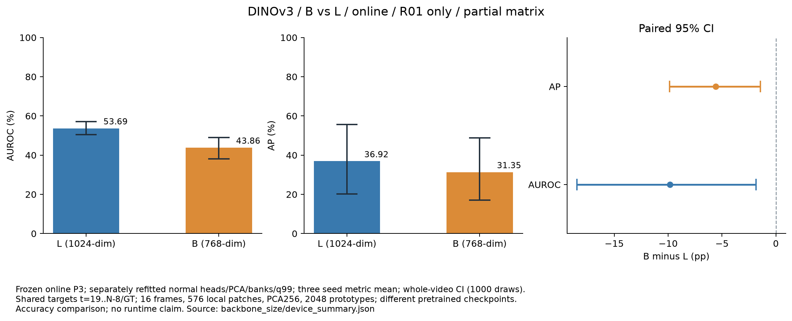
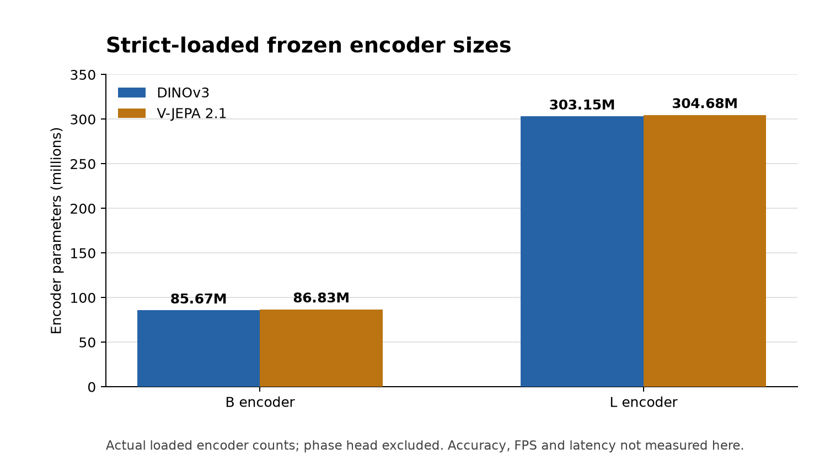

# 작은 B 백본의 온라인 비교

추가 모델 크기 비교는 **DINOv3-B / V-JEPA 2.1-B**, 같은 16프레임 온라인 입력에서 수행한다. 두 모델의 네 장비 × 세 seeds, 총 **24개 고정 B 조건**을 기존 고정 L 온라인 24개 조건과 비교한다. 두 B 모델의 실제 strict GPU 입력 검증을 완료했고 전체 24조건을 실행 중이다. **DINOv3 R01의 세 seeds**는 실제 학습·평가와 B/L 독립 검증을 완료했다. 나머지 21개 B 조건·전체 Macro4·실시간 측정은 아직 완료하지 않았다.

## 첫 장비의 세-seed paired 결과

각 B seed에서 768차원 정상 특징·20-epoch phase head·PCA/메모리·온도·MAD·q99를 새로 학습했다. 기존 L 온라인의 같은 장비·seed와 **15개 테스트 영상, 유효 3,295프레임, 이상 1,227프레임**을 공유한다. 아래 수치는 고정된 세 seed별 P3 지표의 평균이며 CI는 원본 영상 단위 paired bootstrap 1,000회다.

| 조건 | AUROC / 95% CI (%) | AP / 95% CI (%) |
|---|---:|---:|
| DINOv3-L 온라인 R01 | 53.69 (50.53..57.21) | 36.92 (20.20..55.65) |
| DINOv3-B 온라인 R01 | 43.86 (38.15..48.96) | 31.35 (17.02..48.73) |
| B−L 차이 (pp) | −9.84 (−18.46..−1.82) | −5.57 (−9.87..−1.43) |



이 조건에서는 B의 두 지표가 L보다 낮고 paired CI 모두 0을 포함하지 않는다. R01 온라인의 탐색적 부분 비교이므로 다른 장비·V-JEPA·전체 Macro4로 일반화하지 않는다. B와 L은 **별도의 사전학습 체크포인트·특징 너비·정상 학습 head/메모리**를 사용한다. 파라미터 수 하나의 효과만 분리한 실험으로 해석하지 않는다. 속도·VRAM·정확도 대비 비용의 결론도 별도 실제 측정이 필요하다.

[수치·paired CI](../results/stage05/ablations/backbone_size/device_summary.json), [정상 임계값 6개·B 출처 3조건·실제 GT 검증](../results/stage05/ablations/backbone_size/validation.json), [198개 공개 조건 파일의 해시·그래프 검수 근거](../results/stage05/ablations/backbone_size/first_group_publication_check.json), [PNG/SVG 출처와 해시](../results/stage05/ablations/backbone_size/figure_sources.json)를 제공한다.

## 공통 입력·메모리 조건

| 항목 | B 비교 조건 |
|---|---|
| 입력 | RGB 384×384, `[t−15,…,t]`, 16프레임 |
| local 특징 | DINOv3의 마지막 두 프레임 평균; V-JEPA의 마지막 tubelet |
| 공간 query | 576개 패치, 각 768차원 |
| phase 입력 | 전체 입력 문맥의 공간·시간 평균, 768차원 |
| 백본 | 공식 모델 생성자에 실제 가중치를 strict load, 고정 encoder만 사용 |
| 후속 실험 | 기존 L과 같은 정상 분할·fit stride 4·20-epoch head·PCA 256·16 bins/2,048 prototypes·k5·이력5·정상 보정·공통 GT 구간 |

입력 너비와 backbone 크기가 바뀌는 비교다. phase head의 입력 차원도 768에 맞춰야 한다. 기존 1024차원 캐시·head·메모리를 B 입력에 재사용하지 않는다. 새 특징·head·PCA·메모리·정상 calibration을 학습하도록 별도 경로를 구성한다. 전체 실행의 실제 시작·완료 여부는 실행 기록으로 확인한다.

## 가중치 출처

DINOv3-B는 [공개된 파일 배포 경로](https://huggingface.co/jaychempan/dinov3/blob/4412679/dinov3_vitb16_pretrain_lvd1689m-73cec8be.pth)를 명시적으로 선택해 다운로드했다. **Meta 공식 호스팅이 아닌 제삼자 공개 미러**로 기록한다. 로컬 342,860,279 bytes와 SHA-256 `73cec8be7427c8655ceced13ce62f6e20a1fa90d1b4d4a550df17a1144081a7c`가 배포 페이지의 전체 해시와 일치했다. 공식 고정 upstream 생성자의 파일명 해시 접두어 `73cec8be`도 일치한다. Meta의 독립적인 전체 파일 해시와 일치한다고 주장하지 않는다.

V-JEPA 2.1-B는 [공식 배포 checkpoint](https://dl.fbaipublicfiles.com/vjepa2/vjepa2_1_vitb_dist_vitG_384.pt)에서 이미 취득했다. 로컬 SHA-256은 `848a77c33cc9e6649ed2119c9bea1e2c569bcdab9539ff3e7c02ccc2959ddf4d`다. 인코더는 공식 `vit_base`와 EMA 가중치만 사용하며 predictor나 decoder를 사용하지 않는다.

[DINOv3-B 취득 기록](../results/setup/dinov3-b.json), [V-JEPA-B 취득 기록](../results/setup/vjepa21-b.json)을 제공한다. 모델 파일은 로컬 `artifacts/weights`에만 보관한다. 다운로드 스크립트는 기존 파일과 진행 중인 partial 파일을 덮어쓰지 않으며, 미러를 자동 fallback하지 않는다.

## 실제 모델·입력 검증

[작은 백본 어댑터](../src/ipad_jepa/small_backbones.py)는 고정 공식 생성자와 strict state loading을 사용한다. checkpoint를 메모리 매핑해 읽고 필요한 인코더만 구성한다. 기준 L 코드와 실행 중인 실험은 수정하지 않는다.

검증 입력은 실제 R01 정상 fit 영상 01의 프레임 `0..15`, 대상 프레임 15다. 원본 manifest의 이름·내용 해시와 프레임 수를 확인하고, padding 없는 실제 16프레임 GPU 입력에서 local `1×576×768`, 문맥 `1×768`, 유한값과 백본 고정을 확인한다. 두 모델 모두 RTX PRO 6000에서 strict GPU 연산과 실제 입력 검사를 통과했다.

| 실제 로딩한 encoder | 파라미터 수 | local / phase 출력 | 상태 |
|---|---:|---|---|
| DINOv3-B | 85,669,632 | `1×576×768` / `1×768` | 통과 |
| V-JEPA 2.1-B | 86,833,152 | `1×576×768` / `1×768` | 통과 |

[DINOv3-B GPU 결과](../results/setup/dinov3-b_smoke.json)와 [V-JEPA 2.1-B GPU 결과](../results/setup/vjepa21-b_smoke.json)에 실제 정상 입력·가중치/소스 해시·업스트림·GPU·출력·고정 파라미터를 기록했다.



이 그래프는 실제 모델에서 집계한 **encoder 파라미터 수**다. 위상 head를 포함하지 않으며 VRAM·정확도·실시간 성능을 나타내지 않는다. [원자료·출처·PNG/SVG 해시](../results/setup/small_backbone_figure_sources.json)를 제공한다.

CPU 어댑터 테스트는 두 모델의 local 마지막 쌍과 전체 문맥 평균이 구분되는지, 다른 입력 길이를 거부하는지 검사한다. CPU 토큰 fixture는 실제 가중치 검증을 대신하지 않는다. 실제 GPU smoke도 한 정상 클립의 모델/입력 검사이며 AUROC·AP·FPS·지연 측정이 아니다.

```bash
python scripts/download_dinov3_base.py --public-mirror
python scripts/smoke_small_backbone.py --model dinov3-b \
  --data-root "$IPAD_DATA_ROOT" --upstream third_party/dinov3 \
  --weights artifacts/weights/dinov3_vitb16_pretrain_lvd1689m-73cec8be.pth \
  --out results/setup/dinov3-b_smoke.json
python scripts/smoke_small_backbone.py --model vjepa21-b \
  --data-root "$IPAD_DATA_ROOT" --upstream third_party/vjepa2 \
  --weights artifacts/weights/vjepa2_1_vitb_dist_vitG_384.pt \
  --out results/setup/vjepa21-b_smoke.json
```

이미 저장된 다운로드·smoke 결과가 있으면 별도의 새 검증 경로를 지정한다. 단계별 가중치 출처와 실제 모델 검증을 분리해 기록한다. 이후 동일 조건의 B/L 정확도와 독립 GPU 런타임 측정을 별도로 검증한다.

## 전체 B 온라인 경로

[전체 24조건 실행기](../scripts/run_small_matrix.py)는 두 B 모델의 strict GPU 기록을 먼저 검사하고, 새 cache/run/public 경로만 허용한다. 실제 정상·테스트 영상을 16프레임 온라인 입력으로 재인코딩한다. `fit`만 stride 4와 초기 과거 경계 padding을 사용하고, 정상 calibration과 test는 대상 `15..N−1`의 실제 과거 16프레임이다.

[특징 추출](../src/ipad_jepa/small_features.py), [캐시 검사](../src/ipad_jepa/small_data.py), [위상 학습](../src/ipad_jepa/small_train_phase.py), [P0–P3 평가](../src/ipad_jepa/small_experiment.py)를 별도로 제공한다. 입력 768차원 외 위상 head의 은닉 256/출력 200, optimizer·seed·20 epoch·최소 정상 calibration CE 선택과 메모리/점수/공통 평가 구간은 L 기준선과 같다. 실행 중인 L 코드와 공통 알고리즘은 변경하지 않으며 기준 학습/평가 소스 해시를 결과에 기록한다.

캐시 검사는 실제 배열 너비 768·dtype·대상 프레임·입력 해시·소스·모델/모드·정상 분할을 확인한다. 전용 테스트는 실제 L 너비를 가진 잘못된 캐시, 대상 순서 변경, fingerprint를 다시 만든 오래된 reader, 서로 다른 모델의 캐시 혼용, calibration을 fit 후보로 넣는 경우를 거부하고 정상 phase bin/분할을 검증한다. 실제 GPU 검증과 CPU fixture의 범위를 구분한다.

```bash
python scripts/run_small_matrix.py --data-root "$IPAD_DATA_ROOT"
python scripts/plot_small_backbone_setup.py
```

기본 캐시는 `artifacts/features_small`, head/메모리는 `artifacts/runs_small`, 공개 조건 결과는 `results/stage05/ablations/backbone_size/B`다. 기존 L 온라인의 같은 장비·seed·GT 구간과 paired 비교한다. 실행기는 출처를 고정하고 완료된 조건에만 파일 해시 증명을 기록한다. 중단 시 기존 경로를 자동 덮어쓰거나 재시작하지 않는다. R01 DINOv3 세-seed 결과는 검증했고, 나머지 조건·전체 Macro4·독립 GPU 런타임 검증은 진행해야 한다.

[실제 전체 행렬 시작·소스 고정·15개 신규 테스트·그래프 검수 근거](../results/setup/small_backbone_implementation_check.json)를 제공한다. 시작 기록은 전체 학습·평가의 완료 증명이 아니다.

## 독립 검증과 정확도 집계

[summarize_backbone_size.py](../scripts/summarize_backbone_size.py)는 완료된 세-seed B 그룹과 대응하는 세 L 조건만 비교한다. B의 실제 strict GPU 기록·소스 고정·메타데이터와 target 배열·768차원 특징 형상·유한 문맥 입력·20-epoch 정상 CE 선택·실제 head/메모리 해시·PCA 형상·정상 후보의 영상/위상 균형 quota를 검사한다. 그 뒤 B와 L 모두 정상 MAD·component/P3 q99, 시간 점수, 원본 라벨의 해시·공통 GT/추론 구간, P3 점수·알람·AUROC/AP를 독립 재계산한다. 다른 크기의 head나 L 메모리를 B 조건에 대입할 수 없다.

검증용 새 테스트 **12개**는 fingerprint를 다시 계산한 의미 변경, 잘못된 입력 길이/너비, 미래/변경 target, 테스트 데이터가 섞인 정상 fit, 비유한 phase 입력, 잘못 선택하거나 불완전한 head, 메모리 온도 변경, 누락·중복·변조된 소스를 거부했다. 테스트는 CPU fixture이며 실제 R01 감사 결과와 구분한다.

```bash
export PYTHONPATH=src
python scripts/summarize_backbone_size.py
python scripts/plot_backbone_size_accuracy.py
# 전체 B 24조건과 L paired 기준이 완료된 후:
python scripts/summarize_backbone_size.py --require-full
```

부분 집계는 완료된 세-seed 장비만 명시하고 `--require-full`은 8개 그룹이 모두 없으면 거부한다. 네 장비가 모두 검증된 백본에만 동일 가중치 Macro4를 계산한다. 그래프는 현 검증·집계 해시가 일치할 때만 생성한다.

이 감사는 인코더 재실행, 모든 patch 값의 독립 재추출, head/PCA/k-center 재학습, GPU 특징 거리와 온도 표본 계산을 재실행하지 않는다. 공개할 P0–P3 CSV의 출처/해시는 검사하지만 주 정확도 비교의 보정·점수/알람 재계산은 **P3**다. 공통 평가 구간의 batch 알람이며 온라인 EOF 알람·FIFO·처리량을 입증하지 않는다. 큰 특징 배열·head·메모리·모델과 원본 영상은 로컬에만 보관한다.
