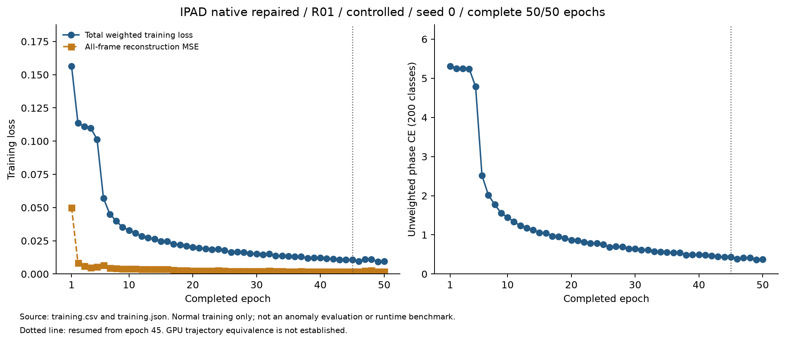
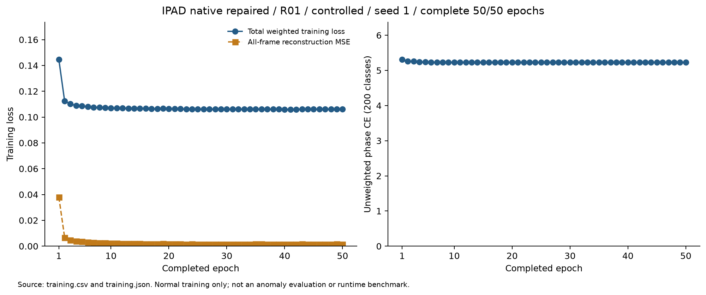
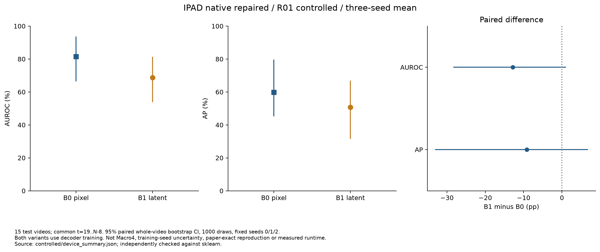
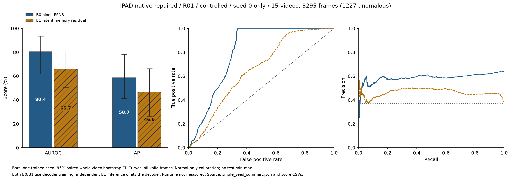
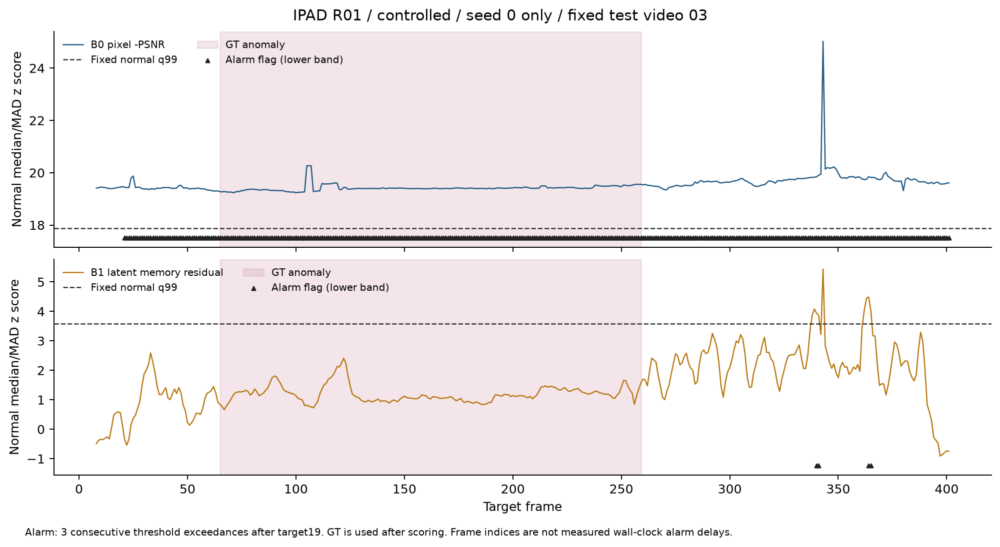
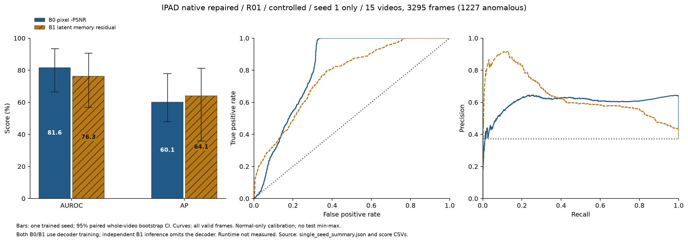
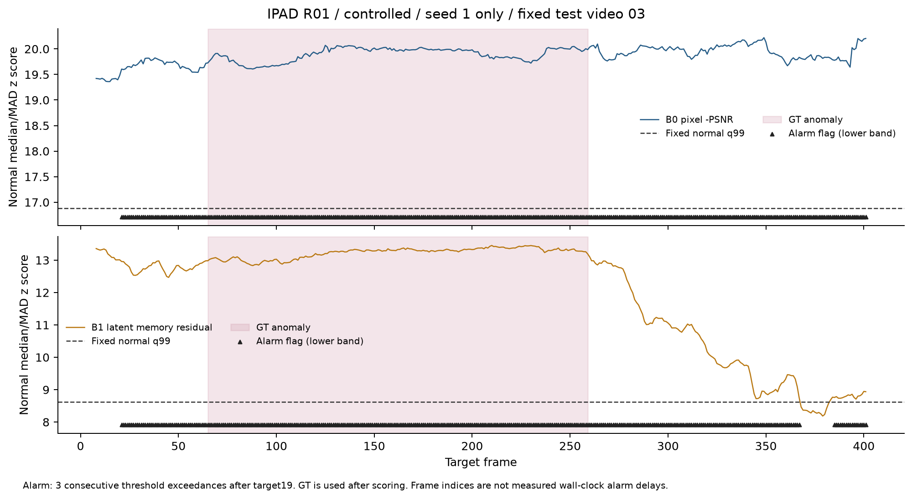
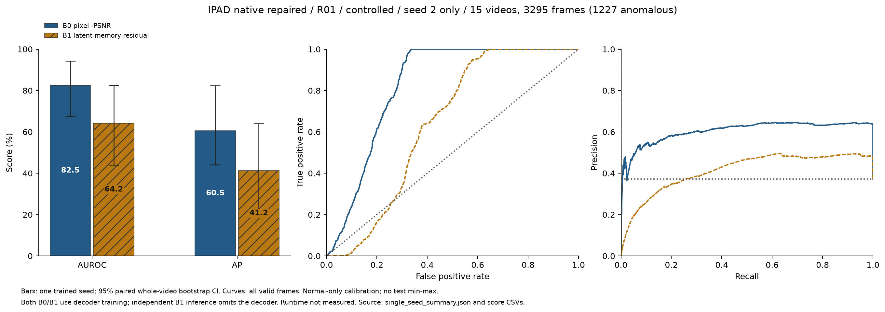
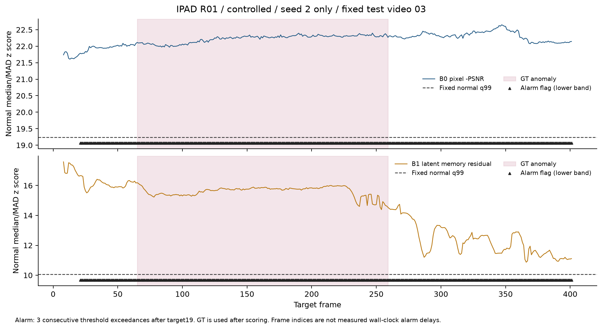

# Stage 01 — IPAD 공개 모델 기반 기준선

## 실행 범위

고정한 IPAD 공개 VST 구조를 장비별로 학습하고, 같은 체크포인트에서 B0 픽셀 재구성 점수와 B1 메모리 전후 특징 잔차를 비교한다.
제안 방법 P0–P3의 학습·추론에는 디코더가 없다. B1은 IPAD 디코더로 학습한 모델의 별도 추론 경로에서 디코더를 제외하므로, 처음부터 디코더를 사용하지 않은 제안 방법과 구분한다.

R01 정상 fit 23개 영상으로 GPU 학습 2 step을 통과했다. [예비 학습 기록](../results/stage01/pilot/R01/seed0/training.json)은 16개 clip에 대한 동작 확인이며, 한 epoch 또는 이상탐지 평가를 완료했다는 의미가 아니다.
R01 controlled seed 0의 **50/50 epoch** 정상 학습과 같은 최종 체크포인트의 B0/B1 이상탐지 평가가 완료됐다. 아래 곡선은 완료된 학습 기록이다.



[학습 CSV/JSON](../results/stage01/controlled/training/R01/seed0)은 30,950개 optimizer step의 완료 기록이며, 정상 학습 loss를 이상탐지 성능으로 해석하지 않는다.
학습 실행은 epoch 49 기록 후 `/tmp` 공간 부족으로 배치 전송에 오류가 발생했다. 실제 checkpoint의 epoch 45를 확인하고 같은 소스·설정에서 `--resume`으로 복구해 epoch 50을 완료했다. 임시 파일은 외장 디스크의 `artifacts/tmp`에 저장한다. [복구 기록](../results/setup/resource_recovery.json)은 최종 학습 완료 또는 GPU resume의 비트 단위 일치를 뜻하지 않는다. 복구 전후 epoch 46/47의 누적 step 수는 같지만 loss는 일치하지 않았다. 원인은 확인되지 않았으며, CPU resume 테스트로 GPU에서의 정확한 궤적 재현을 주장하지 않는다.

R01 controlled seed 1도 정상 fit 23개 영상에서 **50/50 epoch, 30,950 optimizer step** 학습을 완료했다. [완료 학습 CSV/JSON](../results/stage01/controlled/training/R01/seed1)과 곡선을 공개하며, 같은 최종 체크포인트의 B0/B1 테스트 평가도 완료했고 아래에 별도로 기록했다. 최종 학습 loss 0.10618, 재구성 MSE 0.00156, 위상 CE 5.22669는 정상 학습 지표이며 탐지 성능을 나타내지 않는다.



| 실행 | 정상 학습 | seed | epoch | 상태 |
|---|---|---|---|---|
| GPU 예비 검증 R01 | fit 23개 영상에서 2 batch | 0 | 부분 epoch | 통과; 성능 평가에 사용하지 않음 |
| Controlled | 장비별 fit, 합계 76개 영상 | 0/1/2 | 50 | R01 세 seeds의 50 epoch 학습·평가 및 평균·paired CI 완료; 다른 장비 미완료 |
| Reference | 장비별 정상 training, 합계 111개 영상 | 0 | 50 | 미실행 |

Reference는 논문의 전체 정상 training 범위를 비교하려는 조건이다. 정상 calibration 영상이 학습에도 포함되는 점을 별도로 기록하고, 제안 방법과의 주 비교는 calibration을 제외한 controlled 조건으로 수행한다. 장비 간 데이터를 합쳐 학습하지 않는다.

## R01 controlled 세-seed 평가

**seed 0·1·2 모두 50/50 epoch 학습과 최종 체크포인트 평가를 완료했다.** 동일 정상 fit 23개 영상에서 학습하고 별도 정상 calibration 5개 영상으로 median/MAD와 q99를 고정했다. 실제 테스트 15개 영상의 공통 `t=19..N−8` 구간, 3,295프레임(이상 1,227프레임)에서 seed별 지표를 계산한 뒤 평균했다. seed 점수를 합쳐 지표를 만들지 않는다.

| 점수 | AUROC / 95% CI (%) | AP / 95% CI (%) |
|---|---:|---:|
| B0 픽셀 −PSNR | 81.51 (66.44..93.61) | 59.79 (45.17..79.59) |
| B1 메모리 전후 특징 잔차 | 68.72 (53.85..81.42) | 50.65 (31.41..66.89) |



B1−B0 차이는 AUROC **-12.79pp**(95% CI -28.32..+1.04pp), AP **-9.14pp**(-33.12..+6.81pp)다. 평균은 B0가 높았으나 두 paired CI가 0을 포함한다.

CI는 같은 테스트 영상을 paired 재표본한 bootstrap 1,000회(기각 0회)로, 세 개의 고정 학습 seeds에 조건부인 영상 불확실성이다. 학습 seed 모집단의 불확실성이나 다른 장비의 결과까지 나타내지 않는다. R01 한 장비의 결과이며 네 장비 Macro4는 아직 없다. B0/B1 모두 디코더를 사용해 학습하고 B1은 독립 추론에서만 디코더를 제외한다. 제안한 디코더 없는 방법 P0–P3와 구분한다.

15개 실제 annotation·유효 프레임·정상 q99 6개·점수 정규화·3회 연속 초과 알람·50 epoch 학습 출처를 확인했다. 집계 평균·CI·paired 차이 18개 값은 최적화 지표 코드를 거치지 않고 sklearn으로 직접 재계산해 최대 차이 1.12e−16이었다. [세-seed 수치](../results/stage01/controlled/device_summary.json), [검증·소스·그래프 해시](../results/stage01/controlled/R01_three_seed_validation.json)를 제공한다. 이 검사는 CSV와 집계의 재현성이며 독립 모델 재추론이나 실시간 처리량 검증은 아니다.

## R01 controlled seed 0 평가

실제 테스트 15개 영상의 공통 **3,295프레임(이상 1,227프레임)**에서 평가했다. 정상 학습은 fit 23개 영상, 점수 보정과 임계값 설정은 별도 정상 calibration 5개 영상만 사용했다.

| 점수 | AUROC (%) / 95% CI | AP (%) / 95% CI |
|---|---:|---:|
| B0 픽셀 −PSNR | 80.42 / 61.89..93.44 | 58.74 / 41.35..78.27 |
| B1 메모리 전후 특징 잔차 | 65.70 / 50.67..80.24 | 46.65 / 26.45..66.21 |



CI는 동일 테스트 영상의 paired whole-video bootstrap 1,000회로 계산했다(기각 0회). **한 학습 seed를 고정한 CI**이며 학습 seed 간 변동, 3-seed 평균 또는 네 장비 Macro4를 나타내지 않는다. B1−B0 AUROC 차이는 −14.71pp(95% CI −27.13..−2.08pp), AP 차이는 −12.09pp(−31.92..+1.45pp)다. 다른 seed와 장비의 결과 없이 전체 기준선의 우열을 일반화하지 않는다.

[지표·정상 보정·프레임 점수 CSV](../results/stage01/controlled/IPAD-native-repaired/offline/R01/seed0)와 [bootstrap 및 소스 해시 기록](../results/stage01/controlled/IPAD-native-repaired/offline/R01/seed0/single_seed_summary.json)을 제공한다. 그래프 생성 시 공개 CSV에서 AUROC/AP를 다시 계산하고, 정상 median/MAD·q99와 테스트 점수·3회 연속 초과 알람이 저장된 결과와 일치하는지 확인했다.



위 영상 03의 공통 평가 구간은 383프레임이며 GT 이상 구간은 frame 65–259(195프레임)다. 고정 정상 q99 임계값에서 B0는 이상 195프레임과 정상 186프레임에 알람을 냈고, B1은 이상 구간에 알람을 내지 않고 정상 4프레임에서 알람을 냈다. 이 사례는 AUROC/AP와 고정 임계값의 알람 품질을 함께 확인해야 함을 보여 준다. 테스트에 맞춰 임계값을 변경하지 않았다. 가로축은 프레임 번호이며 실제 처리 시간·FPS·벽시계 알람 지연은 아직 측정하지 않았다.

## R01 controlled seed 1 평가

seed 0과 같은 정상 fit 23개·calibration 5개 영상, 최종 epoch 50 선택 정책과 **3,295개 유효 테스트 프레임(이상 1,227)**을 사용했다. 각 seed의 고정 정상 보정과 q99 임계값을 적용했다.

| 점수 | AUROC (%) / 95% CI | AP (%) / 95% CI |
|---|---:|---:|
| B0 픽셀 −PSNR | 81.61 / 66.56..93.49 | 60.11 / 48.04..77.91 |
| B1 메모리 전후 특징 잔차 | 76.30 / 56.90..90.75 | 64.06 / 35.89..81.34 |

CI는 이 한 학습 seed에서 paired whole-video bootstrap 1,000회로 계산했다(기각 0회). B1−B0 차이는 AUROC −5.31pp(95% CI −23.65..+9.04pp), AP +3.96pp(−28.82..+25.14pp)로 두 CI에 모두 0이 포함된다. seed별 B1 수치의 편차가 크며, 세-seed 집계와 그 해석은 위의 별도 절에 제공한다. 전체 장비의 우열로 해석하지 않는다.




고정 영상 03에서 B0는 이상 195프레임과 정상 186프레임, B1은 이상 195프레임과 정상 169프레임에 알람을 냈다. AP 향상과 고정 임계값의 정상 오탐이 함께 존재한다. 테스트에서 임계값을 다시 맞추지 않았다. 이 수는 프레임별 알람이며 실제 이벤트 지연·벽시계 처리량이 아니다. [원본 지표·정상 보정·CSV](../results/stage01/controlled/IPAD-native-repaired/offline/R01/seed1)와 [한 seed의 CI 및 소스 해시 검증](../results/stage01/controlled/IPAD-native-repaired/offline/R01/seed1/single_seed_summary.json)을 제공한다.

## R01 controlled seed 2 평가

정상 fit 23개 영상에서 **50/50 epoch, 30,950 optimizer step**을 완료했다. [학습 CSV/JSON](../results/stage01/controlled/training/R01/seed2)과 완료 곡선을 공개한다. 한 epoch의 후보 clip 4,954개 중 batch 8의 `drop_last`로 4,952개를 사용했다.


같은 최종 epoch 50 체크포인트의 B0 AUROC/AP는 **82.51/60.53%**, B1은 **64.16/41.23%**다. 아래 그래프의 CI는 이 한 학습 seed를 고정한 영상 bootstrap이다. 세-seed 평균은 위의 별도 표를 사용한다.




고정 영상 03에서는 두 점수 모두 정상 q99를 넘는 구간이 넓었다. AUROC/AP와 고정 임계값의 오탐을 함께 읽어야 하며 테스트에서 임계값을 바꾸지 않았다. [실제 지표·정상 보정·CSV](../results/stage01/controlled/IPAD-native-repaired/offline/R01/seed2), [한 seed의 CI·출처](../results/stage01/controlled/IPAD-native-repaired/offline/R01/seed2/single_seed_summary.json)를 제공한다. 프레임별 알람은 벽시계 지연이나 이벤트별 탐지율을 나타내지 않는다.

## 공개 코드의 실행 오류와 명시적인 수정

[고정 upstream](../configs/upstreams.json)의 `model/memory_module.py:MemoryUnit.forward`는 정의되지 않은 `i`를 사용해 `NameError`가 발생했다. [실제 오류 기록](../results/setup/ipad_public_code_issue.json)을 공개하고, upstream 파일은 보존했다.
별도 [래퍼](../src/ipad_jepa/ipad_baseline.py)에서 각 영상의 flatten된 토큰에 해당 영상의 위상 인덱스와 confidence를 적용한다. 구조·손실·메모리 softmax와 shrinkage는 공개 모델에 기반한다.

- `paper200`: 200개 위상 클래스를 메모리 2,000개로 매핑하고, 주소 주변 `[centre−7, centre+8)`을 유효 범위로 제한한다. 전체 비교의 기본 조건이다.
- `public126`: 공개 코드의 상수 `126`과 Python slice의 빈 범위 동작까지 유지하며, 미정의 변수와 배치별 인덱싱만 수정한다. 별도 조건으로 실행할 수 있다.

이 변경은 실행 가능한 논문 기반 비교 모델을 만들기 위한 명시적 수정이다. 논문의 수치와 정확히 일치하는 재현이라고 주장하지 않는다. 공개 VST 구조의 실제 파라미터는 **263,478,713개**로 측정됐으며, 더 작은 구조로 임의 교체하지 않았다.

## 입력·학습·평가

입력은 공개 코드와 동일한 OpenCV BGR 전체 프레임 256×256, `[-1,1]`, 16프레임이다. 실제 R01 정상 clip의 배열을 공개 `np_load_frame` 출력과 **원소 단위로 완전히 일치**함을 확인했다. [검증 근거](../results/setup/ipad_preprocessing.json)는 이 한 clip에 대한 입력 비교다.
정상 상대 위상은 clip 시작 위치의 `floor(200*start/N)`이고, 평가 target은 clip 안의 frame 8이다. 제안 방법의 RGB 384 입력과는 구분한다.

학습은 FP32, batch 8, shuffle/drop_last, Adam lr 1e-4, 50 epoch다. 손실은 전체 16프레임 MSE + 0.0002×메모리 entropy + 0.02×위상 CE다. 합성 S 데이터 사전학습은 사용하지 않는다.
최종 epoch 50 체크포인트를 선택하며, 테스트 결과로 epoch를 고르지 않는다. 5 epoch마다 로컬 체크포인트를 원자적으로 저장하고 optimizer·PyTorch RNG·DataLoader generator를 함께 복구한다. 부분 step 예비 실행은 전체 학습으로 resume하거나 평가할 수 없다.

B0는 중앙 frame의 anomaly-high `−PSNR`이다. B1은 중앙 latent temporal cell 2의 메모리 전후 제곱 잔차를 채널·공간에 대해 평균한다. `latent_score()`가 디코더를 호출하지 않는 경로임을 테스트했다.
두 점수의 median/MAD와 q99 임계값은 정상 calibration만으로 구한다. 제안 방법과 같은 `t=19..N−8` 대상과 라벨 미확정 마스크·오프셋 민감도를 적용한다. 테스트 영상별 min-max 정규화는 사용하지 않는다.

[논문 §5.2](https://arxiv.org/html/2404.15033v1#S5.SS2)의 장비별 학습·16프레임·256 입력·200 위상 클래스·메모리 2,000개·batch 8·Adam lr 1e-4·50 epoch 조건을 참고했다.
원 논문의 Sliding Window Inspection(window 5)은 이 B0/B1 점수에 포함하지 않는다. 논문의 장비 전체 테스트 점수 정규화와 달리, 여기서는 고정 정상 calibration을 사용해 온라인 임계값과 비교할 수 있도록 한다. 따라서 B0/B1은 공개 모델 기반의 점수 비교 조건이며 발표된 전체 IPAD 방법의 동일 수치 재현 조건이 아니다.

## 재현

```bash
python -m ipad_jepa.ipad_baseline --data-root "$IPAD_DATA_ROOT" \
  --device R01 --seed 0 --scope controlled --epochs 50 \
  --out artifacts/ipad/controlled/R01/seed0

# 중단 후 동일 소스·설정의 완전한 epoch 체크포인트에서 재개
python -m ipad_jepa.ipad_baseline --data-root "$IPAD_DATA_ROOT" \
  --device R01 --seed 0 --scope controlled --epochs 50 --resume \
  --out artifacts/ipad/controlled/R01/seed0

# 50 epoch 완료된 경우에만 평가 가능
python -m ipad_jepa.ipad_evaluate --data-root "$IPAD_DATA_ROOT" \
  --device R01 --training artifacts/ipad/controlled/R01/seed0 \
  --out results/stage01/controlled/IPAD-native-repaired/offline/R01/seed0

# 공개 CSV 검증, 한 seed의 paired bootstrap 및 PNG/SVG 생성
python scripts/plot_native_evaluation.py \
  --results results/stage01/controlled/IPAD-native-repaired/offline/R01/seed0
```

세-seed 집계 후 실제 annotation·q99·점수·알람과 sklearn 집계를 검증하려면 `python scripts/plot_native_three_seed.py --device R01`을 실행한다.

학습 완료 시 CSV/JSON과 학습 곡선, 기준선 평가 완료 시 지표·ROC/PR·점수 시계열을 공개한다. 모델·optimizer 체크포인트와 원본 프레임은 로컬에만 보관한다. Stage 01 완료 태그는 전체 요구 조건이 검증된 뒤 생성한다.
