# Stage 02 — 고정 백본 특징 추출과 정상 위상 학습

## 완료 범위

DINOv3-L와 V-JEPA 2.1-L의 R01 오프라인 정상 학습 23개 영상과 정상 검증 5개 영상에서 특징을 추출했다.
학습은 4프레임 간격의 1,248개 clip, 검증은 1프레임 간격의 1,087개 clip이다. 테스트 영상과 진단 영상은 사용하지 않았다.
각 백본의 seed 0/1/2에서 20 epoch 위상 예측기 학습을 완료했다. R01–R04 두 백본의 오프라인 PCA·메모리 구성과 이상탐지 평가를 완료했으며 아래에 기록했다. 전체 온라인·LoRA·추가 실험은 수행 중이며, Stage 02 완료 태그는 전체 단계 검증 후 생성한다.

## 정상 검증 결과와 한계

| 백본 | seed | 선택 epoch | 정상 검증 CE | 선택 모델 원형 MAE (%주기) | 마지막 epoch 원형 MAE (%주기) |
|---|---:|---:|---:|---:|---:|
| DINOv3-L | 0 | 1 | 5.2971 | 24.21 | 12.32 |
| DINOv3-L | 1 | 1 | 5.2968 | 22.34 | 12.83 |
| DINOv3-L | 2 | 1 | 5.2989 | 23.96 | 11.41 |
| V-JEPA 2.1-L | 0 | 1 | 5.3442 | 23.52 | 15.43 |
| V-JEPA 2.1-L | 1 | 1 | 5.3432 | 23.88 | 15.09 |
| V-JEPA 2.1-L | 2 | 1 | 5.3488 | 22.93 | 13.70 |

CE는 200개 상대 위상 클래스에 대한 교차 엔트로피다. 균일 확률의 CE는 `ln(200)=5.2983`이며, 선택된 모델들의 CE가 이 기준과 비슷하거나 더 높다.
원형 MAE는 `mean(abs(wrap(predicted_phase − t/N)))`로 계산하며 %주기는 그 값의 100배다. 이는 공정 단계의 수작업 의미 라벨과 비교한 값이 아니다.

학습 후반에 원형 MAE는 감소하지만 CE 기준에서는 모든 실행의 첫 epoch가 선택됐다. 선택된 모델의 위상 예측은 약하며, 후반 MAE만으로 모델 품질을 평가하면 선택된 모델의 결과를 과대평가하게 된다.
사전 계획대로 정상 검증 CE에 따라 선택했다. 이 결과만으로 두 백본의 이상탐지 정확도 또는 실시간성을 판단할 수 없다. 추가 장비와 정상 위상 학습 진단이 필요하다.

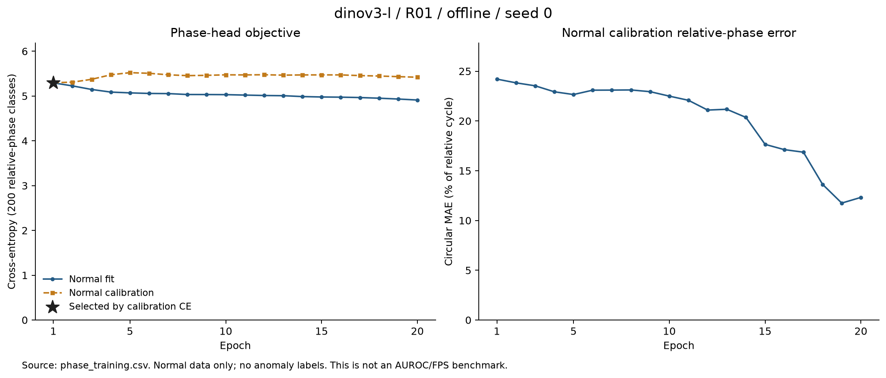
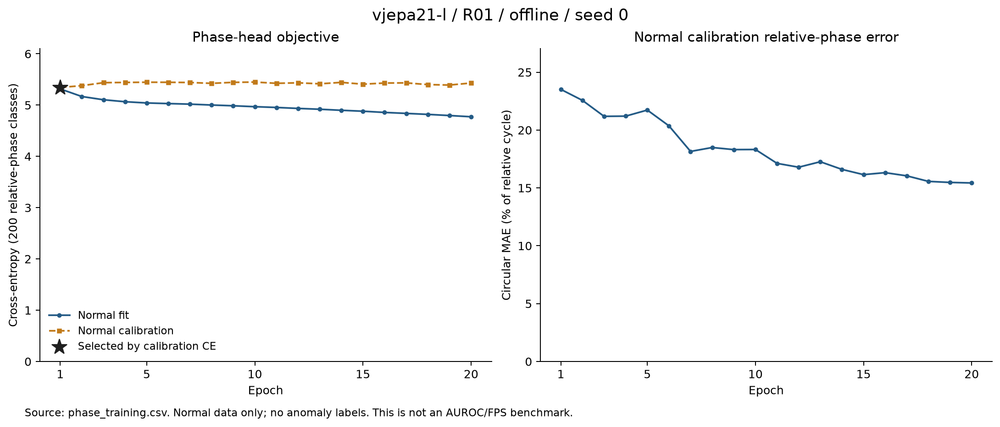

seed 0 곡선은 대표 실행의 전체 epoch를 보여준다. 나머지 seed의 수치도 [phase_summary.csv](../results/stage02/phase_summary.csv)와 실행별 CSV/JSON에 공개한다. 처리량과 실제 알람 지연 결과는 아직 없다. R01 이상탐지 지표는 아래 절에 기록했다.

## 캐시와 입력 검증

- RGB 전체 프레임을 PIL bilinear로 384×384 resize, ImageNet 평균/표준편차 정규화.
- 오프라인 입력은 `[t−8,…,t+7]`, 정상 학습의 위상 감독은 `floor(200*t/N)`.
- 패치 특징은 `576×1024`, 위상 입력은 `1024`. 백본 고정, BF16 추론 후 캐시는 FP16 저장.
- 모델 SHA256, upstream commit, 어댑터/읽기 코드 해시, 전처리, 모드, 원본 JPG 콘텐츠/파일명 해시, 분할과 target 인덱스를 캐시 메타데이터에 기록.
- 학습 로더는 정상 training 영상의 fit/calibration 분할만 허용하며, 변경된 원본·혼합 가중치·분할 불일치를 거부한다.
- 온라인 학습에 한해 첫 프레임 왼쪽 패딩을 허용한다. 온라인 검증/테스트 입력은 16개 실제 과거 프레임이 확보된 후 시작한다.

## 재현

```bash
python -m ipad_jepa.features --model dinov3-l --mode offline \
  --weights artifacts/weights/dinov3_vitl16_pretrain_lvd1689m-8aa4cbdd.pth \
  --upstream third_party/dinov3 --data-root "$IPAD_DATA_ROOT" \
  --devices R01 --splits fit calibration --batch-size 4 --workers 2

python -m ipad_jepa.train_phase --cache artifacts/features/dinov3-l/offline \
  --device R01 --seed 0 --out artifacts/runs/dinov3-l/offline/R01/seed0

python scripts/export_phase_results.py
python scripts/plot_phase_training.py \
  --results results/stage02/dinov3-l/offline/R01/seed0 \
  --out docs/figures/stage02/dinov3-l_R01_offline_seed0_phase
```

V-JEPA는 `--model vjepa21-l`, `--upstream third_party/vjepa2`, `--weights artifacts/weights/vjepa2_1_vitl_dist_vitG_384.pt`를 사용한다. seed 1/2는 별도 출력 경로로 실행한다.
위상 예측기는 1024→256→200, ReLU/dropout 0.1, AdamW 학습률 1e-3/weight decay 1e-4, batch 256, 20 epoch다. 정상 검증 CE 최저 checkpoint만 선택한다.
모델·특징 캐시·학습 checkpoint는 로컬 `artifacts`에 보관한다. 공개 파일은 코드·CSV·JSON·PNG·SVG뿐이다.

## R01 실제 이상탐지 평가: 고정 백본, 오프라인, 3 seeds

R01 테스트 15개 영상의 동일한 3,295프레임(이상 1,227프레임)에서 평가했다. 공통 대상은 `t=19..N−8`이다.
PCA·메모리는 정상 fit 23개 영상, 온도·median/MAD·임계값은 정상 검증 5개 영상으로만 구성했다. 테스트 라벨은 점수 계산이 끝난 후 지표 계산에 사용했다.

| 구성 | DINOv3 AUROC (%) | DINOv3 AP (%) | V-JEPA AUROC (%) | V-JEPA AP (%) |
|---|---:|---:|---:|---:|
| P0 전역 메모리 / hard | 78.51 | 57.30 | 32.90 | 28.38 |
| P1 위상 메모리 / hard | 45.21 | 32.32 | 24.97 | 25.30 |
| P2 위상 메모리 / soft k=5 | 45.47 | 32.18 | 30.43 | 26.86 |
| P3 P2 + 시간 점수 | 47.01 | 33.21 | 37.58 | 28.83 |

표는 seed 0/1/2의 지표 평균이며, 점수를 seed 간 평균해서 계산한 값이 아니다. 아래 오차막대는 동일 영상 단위 1,000회 재표집의 95% percentile 신뢰구간이다.
R01에서는 DINOv3 P0가 가장 높았고, 위상 조건을 추가하면 하락했다. DINOv3 P3−P0 AUROC 차이는 −31.49pp(95% CI −42.90..−19.11pp)다.
V-JEPA P3−P0 차이는 +4.67pp(−1.57..12.00pp)로, 이 장비의 표본에서는 개선을 확정할 수 없다. P3의 V-JEPA−DINOv3 차이는 −9.44pp(−18.21..−0.64pp)다.
한 장비의 결과이므로 일반적인 백본 우열, 온라인 또는 실시간 성능으로 확대 해석하지 않는다. 네 장비 두 백본의 오프라인 Macro4는 별도 절에 기록한다.

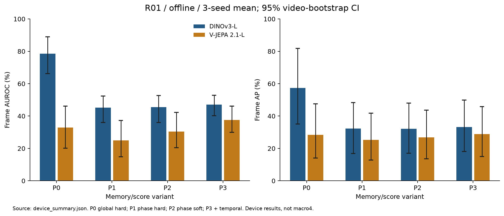
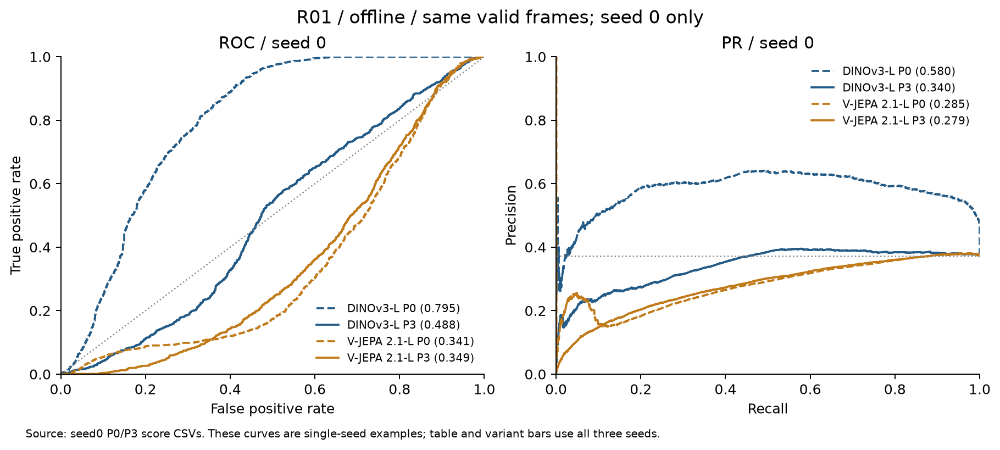

현재 설정에서 선택된 위상 예측기가 약하며, 정상 검증의 상대 위치와 예측 위상이 잘 맞지 않는다. 위상 조건으로 잘못된 정상 메모리 후보를 제한했을 가능성이 있다.
V-JEPA의 P0도 낮으므로 위상 예측만으로 성능 하락 전체를 설명할 수는 없다. 실제 이상 유형별 효과는 후속 진단과 나머지 장비에서 확인해야 한다.
이상 점수는 큰 값이 이상이라는 사전 정의를 유지했으며, 테스트 결과를 보고 점수 부호를 뒤집거나 epoch·온도·임계값을 다시 선택하지 않았다.

<details>
<summary>정상 위상 정렬과 고정 테스트 영상 03의 점수·알람</summary>

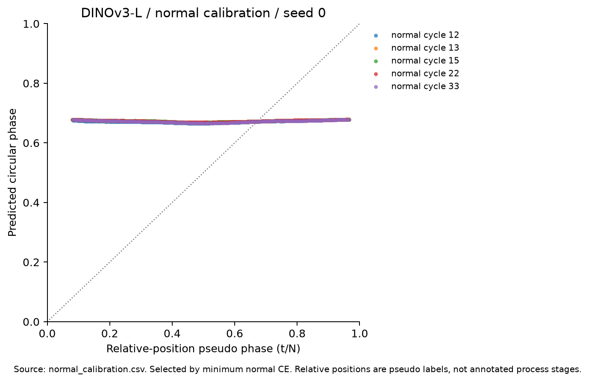
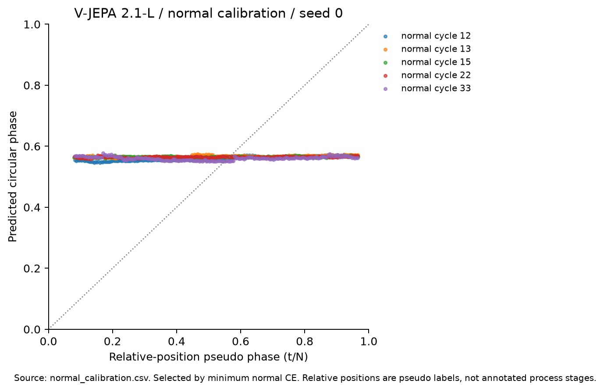
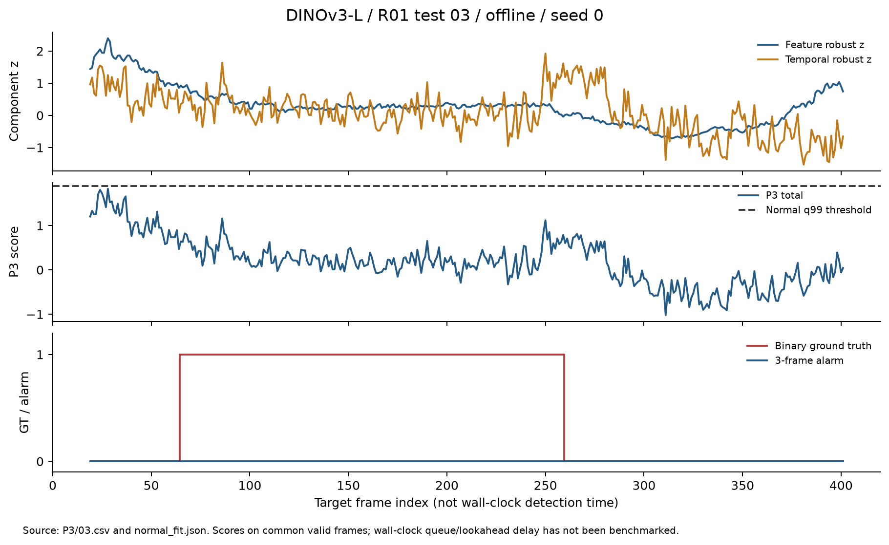
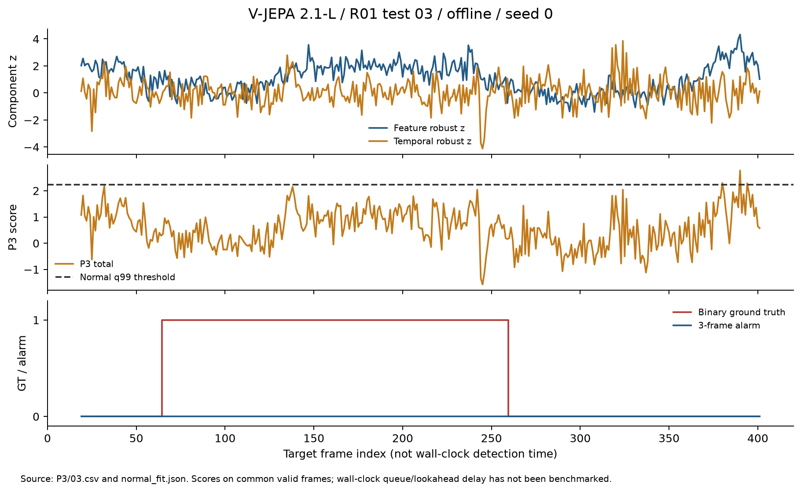

</details>

시계열의 가로축은 target 프레임이며 실제 벽시계 탐지 시간은 아니다. 3프레임 연속 초과 알람을 표시하지만 대기열·전처리·오프라인 lookahead 대기를 측정한 실시간 알람 지연 결과는 아직 없다.

## 메모리·보정·지표 재현

각 위상 bin의 후보는 영상별 같은 수를 목표로 표본 추출하고 부족한 영상의 할당량만 재분배한다. bin당 최대 10,000패치, 총 최대 160,000 후보를 사용하며 PCA 50,000 표본도 영상×위상 strata별로 균등 선택한다.
PCA 256차원/비 whitening/L2 정규화, bin 16개×128 prototype=2,048개, greedy k-center다. P0도 동일한 prototype 2,048개를 사용하고 bin tag만 무시한다.
정상 검증에서 영상별 균등 표본 최대 50,000패치의 5번째 이웃 제곱 거리 중앙값으로 soft 온도를 정한다. 패치 점수 상위 5% 평균이 프레임 특징 점수다.
시간 점수는 최근 5개 예측 위상의 원형 변화량과 정상 fit 주기 길이 중앙값으로 계산한다. P3는 특징·시간 robust z를 0.5/0.5로 결합하고, P0–P2는 특징 z만 사용한다.
각 구성의 정상 검증 점수 99 percentile을 알람 임계값으로 고정한다. 모든 결과에 테스트 영상별 min-max 정규화는 사용하지 않는다.

```bash
python -m ipad_jepa.features --model dinov3-l --mode offline \
  --weights artifacts/weights/dinov3_vitl16_pretrain_lvd1689m-8aa4cbdd.pth \
  --upstream third_party/dinov3 --data-root "$IPAD_DATA_ROOT" \
  --devices R01 --splits test --batch-size 4 --workers 2

OPENBLAS_NUM_THREADS=4 OMP_NUM_THREADS=4 python -m ipad_jepa.experiment \
  --cache artifacts/features/dinov3-l/offline \
  --phase-run artifacts/runs/dinov3-l/offline/R01/seed0 \
  --data-root "$IPAD_DATA_ROOT" --device R01 --seed 0 \
  --out results/stage02/dinov3-l/offline/R01/seed0 \
  --local artifacts/runs/dinov3-l/offline/R01/seed0

python scripts/summarize_experiments.py
python scripts/plot_experiments.py
```

두 백본·세 seed 모두 실행한 뒤 요약/그림을 만든다. 메모리 NPZ는 `artifacts`에만 저장한다.
공개 근거는 실행별 `normal_fit.json`, `normal_calibration.csv`, P0–P3 프레임 점수 CSV, `metrics.json`, [device_summary.json](../results/stage02/device_summary.json)이다.
요약 도구는 공개 CSV에서 AUROC/AP를 다시 계산해 완료 메타데이터와 프레임 수·라벨 수·지표가 맞는지 확인한다. 모델 간 비교는 영상 ID·프레임 ID·라벨 일치를 검증한 뒤 같은 bootstrap 표본을 사용한다.
완료된 3-seed 조건의 정상 q99 임계값을 공개 calibration CSV에서 재계산해 저장값과 일치함을 확인한다. 정상 검증 영상 목록과 공통 대상 마스크도 검증한다. [검증 기록](../results/stage02/calibration_check.json)은 정확한 조건·seed·임계값 수와 summary 파일 해시를 제공하며, 생성 코드는 [verify_calibration.py](../scripts/verify_calibration.py)다. 진행 중인 다음 조건과 공개 스냅샷이 섞이지 않도록 `--from-device-summary`를 사용한다.

Bootstrap은 각 영상의 재표집 횟수를 프레임의 정수 가중치로 적용하고, 점수 정렬을 한 번만 수행하도록 구현했다. 영상 단위 draw·동점 처리·seed 지표 평균·장비별 독립 stream은 유지한다. 기존 sklearn 방식의 저장 결과 **48개 장비·구성, 52개 paired 차이, Macro4 8개 결과와 6개 차이**의 평균·95% CI·표본 수를 대조했고, 684개 실수 값의 최대 차이는 약 2.2×10⁻¹⁶으로 사전 허용 오차 10⁻¹² 이내였다. 새 R03 온라인 결과는 과거 출력과의 대조 범위에 포함되지 않는다.

동점/비동점 합성 표본 각각 1,000개 draw와 실제 DINOv3 R02 온라인 P3의 100개 paired draw도 중복 프레임 방식과 비교했다. IPAD R01 기준선 seed 0의 1,000개 draw 집계 CI도 기존 값과 일치했다. [검증 기록과 원래 출력](../results/stage02/bootstrap_validation), [최적화 계산](../src/ipad_jepa/bootstrap_metrics.py), [집계 대조 코드](../scripts/verify_bootstrap_summary.py)를 제공한다. 집계 검증은 특징 재추출이나 실시간 처리량의 검증이 아니다.

NumPy 기준 검색과 FP32 배치 검색의 hard/soft 및 전역/위상 결과 일치를 테스트했다. 전체 온라인, LoRA, IPAD 기준선, 합성 진단, 실시간 측정과 추가 제거 실험이 완료될 때까지 전체 실험 완료를 선언하지 않는다.

## R02 정상 위상 학습과 실제 이상탐지 평가

R02 정상 fit 21개 영상에서 3,042개 clip, 정상 검증 5개 영상에서 2,864개 clip을 사용했다. 두 백본의 seed 0/1/2 모두 20 epoch가 정상 검증 CE 기준으로 선택됐다.
V-JEPA의 선택 모델 원형 MAE는 2.42/2.34/2.54% 주기, CE는 3.5186/3.5121/3.5383이다. DINOv3는 MAE 2.84/2.78/2.71%, CE 3.5991/3.5785/3.5681이다.
R01과 달리 동일 설정에서 위상 학습이 개선되어, 위상 문제를 모든 장비에 일반화할 수 없다.

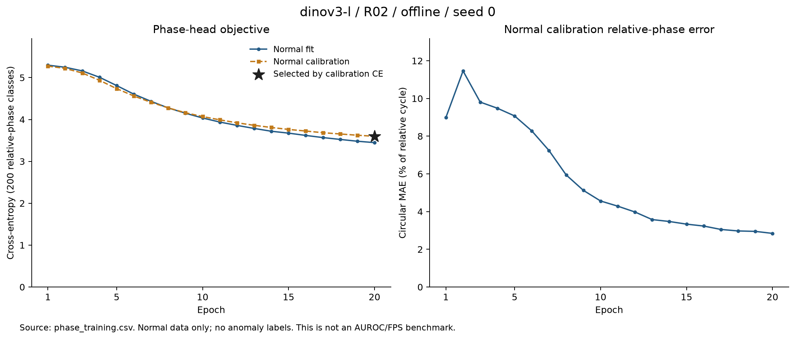
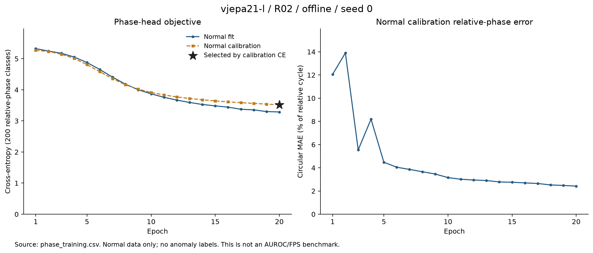

테스트 15개 영상의 공통 대상 9,228프레임 중 라벨 미확정 18프레임을 제외한 **9,210프레임, 이상 2,949프레임**에서 두 백본·3 seeds를 평가했다.
미확정 영상도 유지하며, ±1 인덱스 오차 가정하에 후보 라벨이 모두 일치하는 프레임만 주 지표에 사용했다. 이 정책은 정확한 원본 정렬을 입증하지 않는다. 고정 점수의 −1/0/+1 offset 지표는 각 `metrics.json`에 별도 공개한다.

| 구성 | DINOv3 AUROC (%) | DINOv3 AP (%) | V-JEPA AUROC (%) | V-JEPA AP (%) |
|---|---:|---:|---:|---:|
| P0 전역 메모리 / hard | 73.32 | 62.09 | 58.19 | 36.98 |
| P1 위상 메모리 / hard | 72.20 | 59.04 | 57.18 | 36.65 |
| P2 위상 메모리 / soft k=5 | 71.98 | 60.68 | 59.71 | 38.79 |
| P3 P2 + 시간 점수 | 79.84 | 65.11 | 63.10 | 42.55 |

수치는 3개 seed 지표의 평균이다. P3−P0 AUROC 차이는 DINOv3 +6.51pp(95% 영상 bootstrap CI −3.71..18.77pp), V-JEPA +4.92pp(−5.38..16.30pp)다. 평균은 증가하지만 개선을 확정할 수 없다.
P3의 V-JEPA−DINOv3 차이는 −16.73pp(−28.73..−5.04pp)다. 이 장비 조건에서는 DINOv3가 더 높았으며, 전체 장비·온라인·LoRA 조건의 일반적인 우열은 아직 판단하지 않는다.

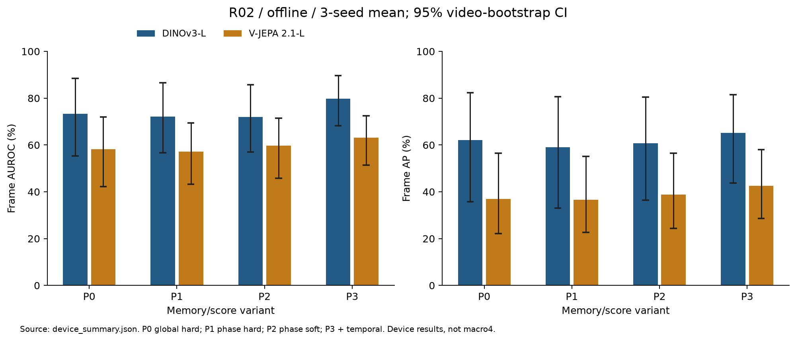
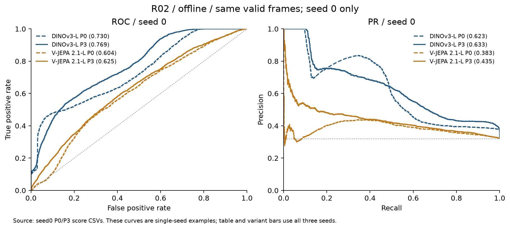

<details>
<summary>R02 정상 위상 정렬과 고정 테스트 영상 03</summary>

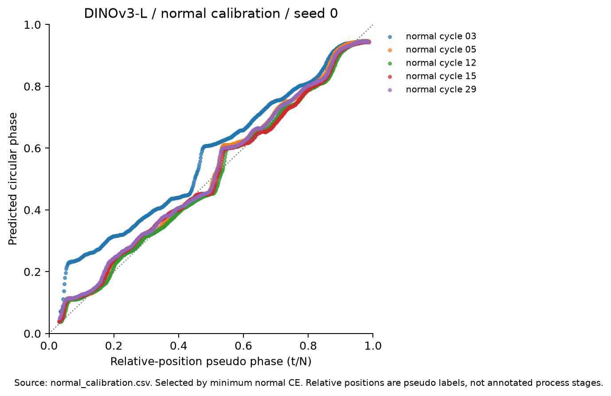
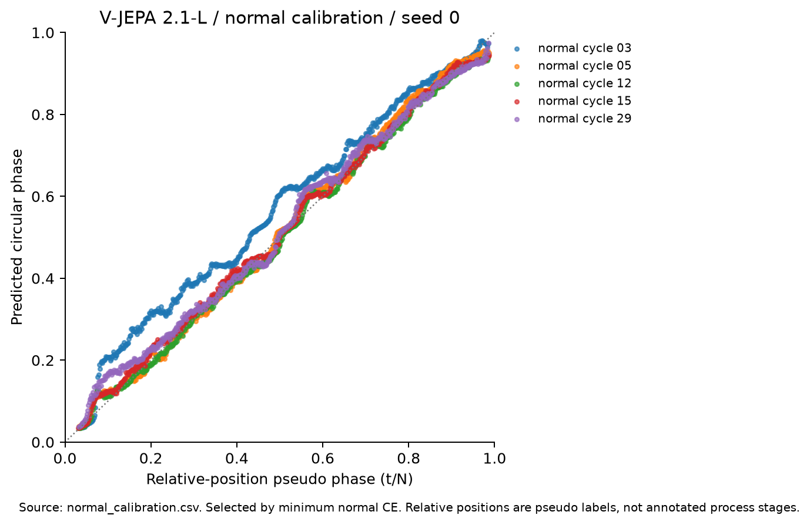
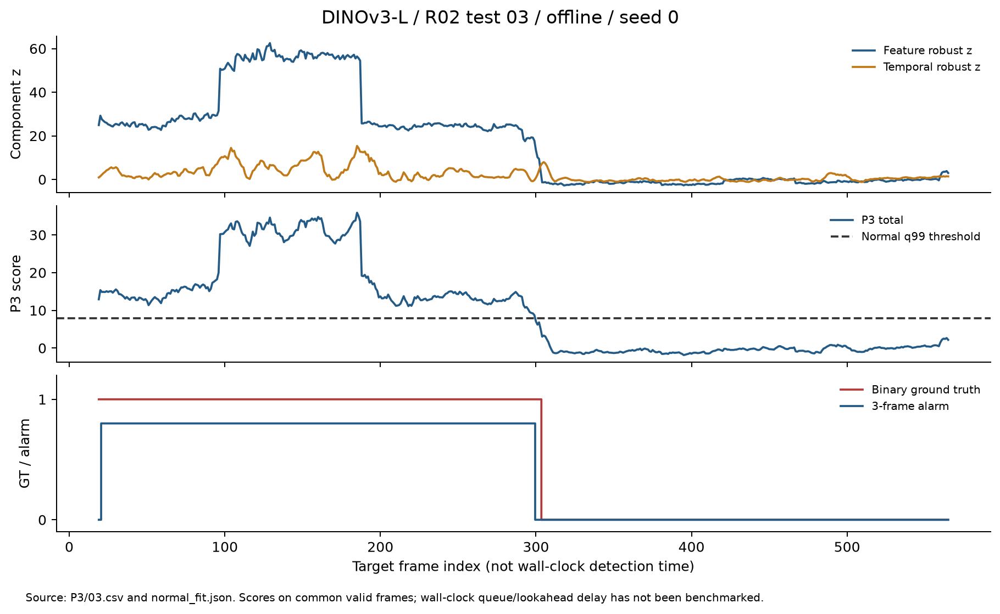
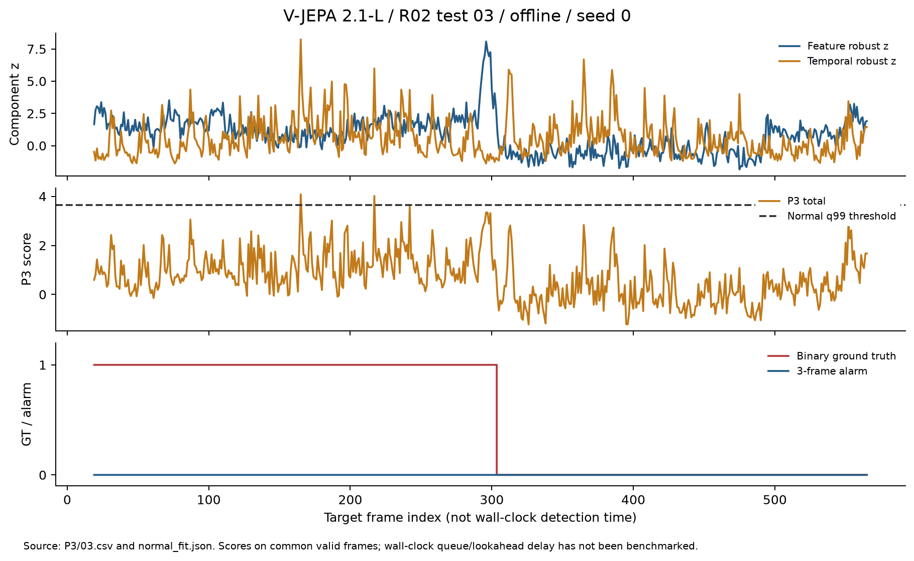

</details>

## 후속 정상 위상 학습: R03

정상 fit 15개 영상의 2,564 clip과 정상 검증 4개 영상의 2,771 clip으로 3 seeds 학습을 완료했다. 정상 검증 CE 기준으로 모두 epoch 20을 선택했다.
두 백본의 실행별 CSV/JSON을 공개한다. 실제 테스트 평가는 아래에 기록한다.

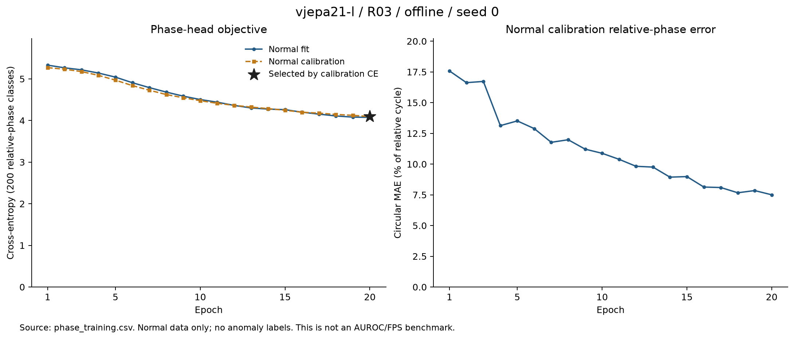
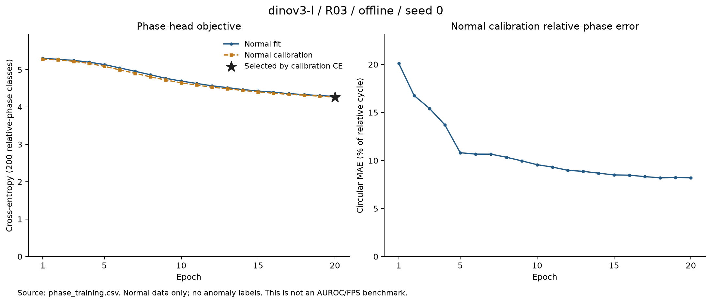

전체 요청 범위는 [experiment_matrix.yaml](../configs/experiment_matrix.yaml)에 선언했다. 행렬에 나열된 실험은 완료 표시가 아니며, 실행별 결과와 실제 프로세스로 진행 상태를 확인한다.

## R03 두 백본 실제 이상탐지 평가

테스트 17개 영상에서 공통 대상 11,563프레임, 이상 4,922프레임을 평가했다. 아래는 각 백본의 3개 seed 지표 평균이다.

| 구성 | DINOv3 AUROC (%) | DINOv3 AP (%) | V-JEPA AUROC (%) | V-JEPA AP (%) |
|---|---:|---:|---:|---:|
| P0 전역 메모리 | 54.54 | 47.32 | 45.67 | 37.98 |
| P1 위상 hard | 60.47 | 52.42 | 50.38 | 41.57 |
| P2 위상 soft | 62.48 | 53.76 | 50.49 | 42.74 |
| P3 위상 soft + 시간 | 60.68 | 51.82 | 50.45 | 43.53 |

V-JEPA의 P3−P0 AUROC 차이는 +4.77pp(95% 영상 bootstrap CI −0.33..10.32pp), AP 차이는 +5.55pp(1.55..10.00pp)다. V-JEPA P3 AUROC는 50% 부근이고, AP는 이상 프레임 비율 42.57%와 비슷해 탐지 성능이 제한적이다. DINOv3 P3는 60.68%이며 P2의 62.48%보다 낮다.
DINOv3 P3−P0 AUROC 차이는 +6.13pp(2.38..11.10pp), AP 차이는 +4.51pp(1.51..8.19pp)다. P3의 V-JEPA−DINOv3 AUROC 차이는 −10.23pp(−17.93..−3.26pp)다. 전체 paired CI는 [device_summary.json](../results/stage02/device_summary.json)에 공개한다.

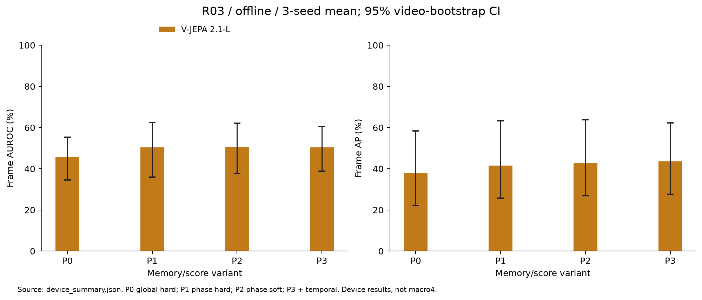
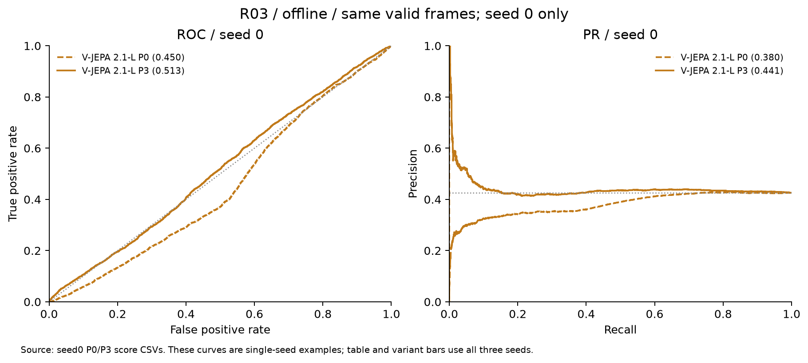

<details>
<summary>R03 정상 위상 정렬과 고정 테스트 영상 03</summary>

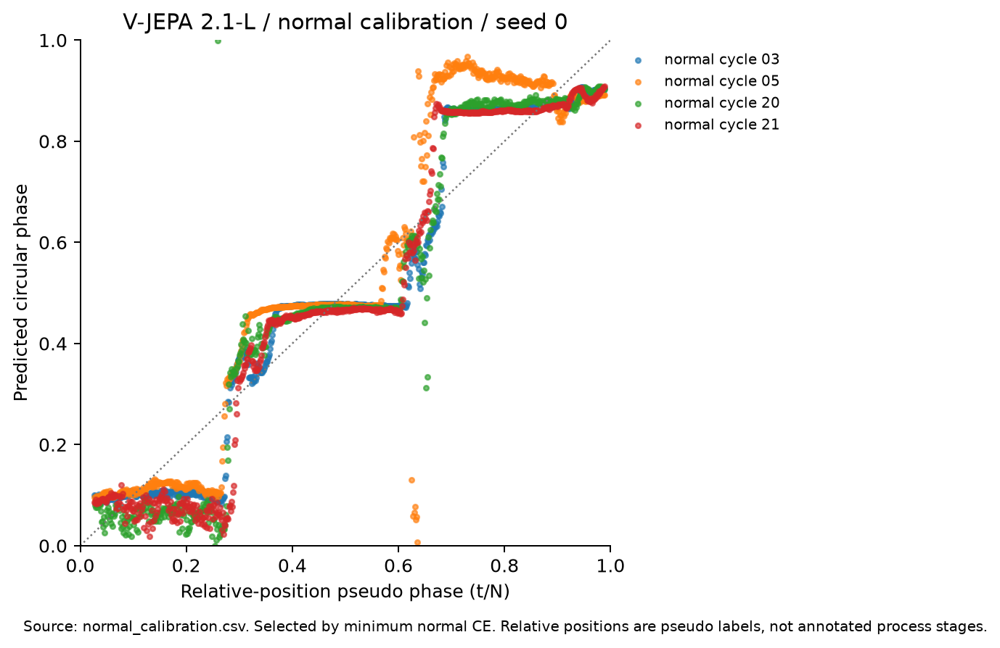
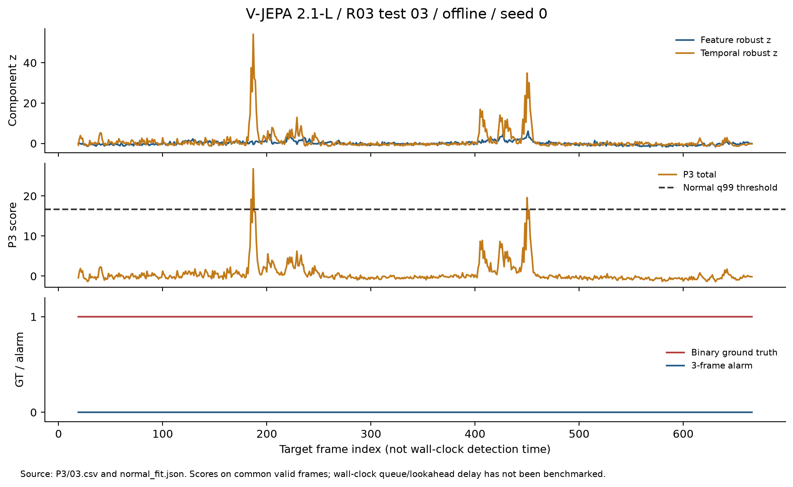
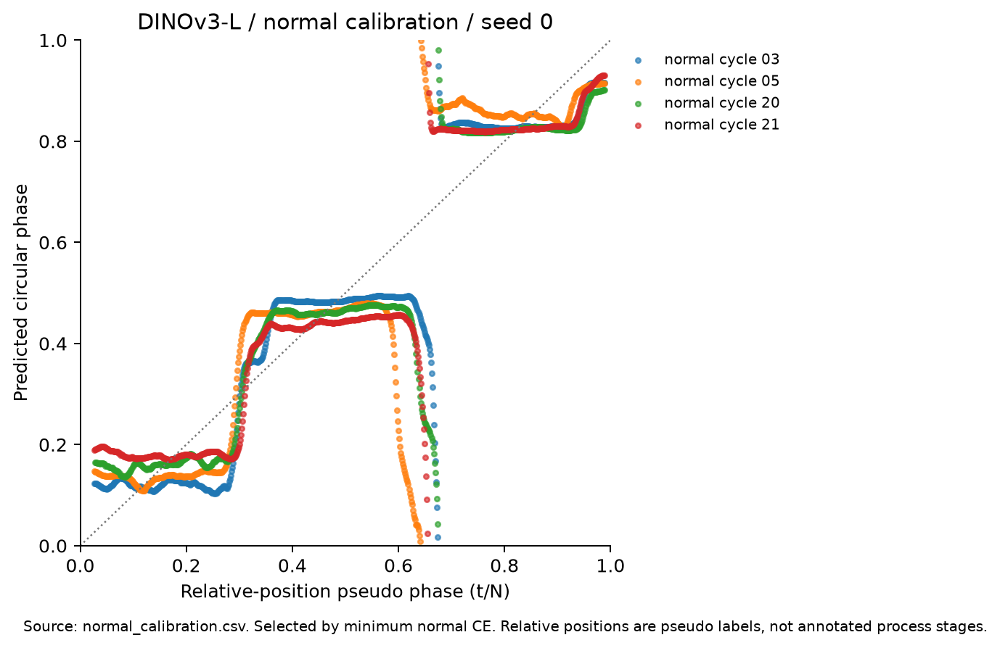
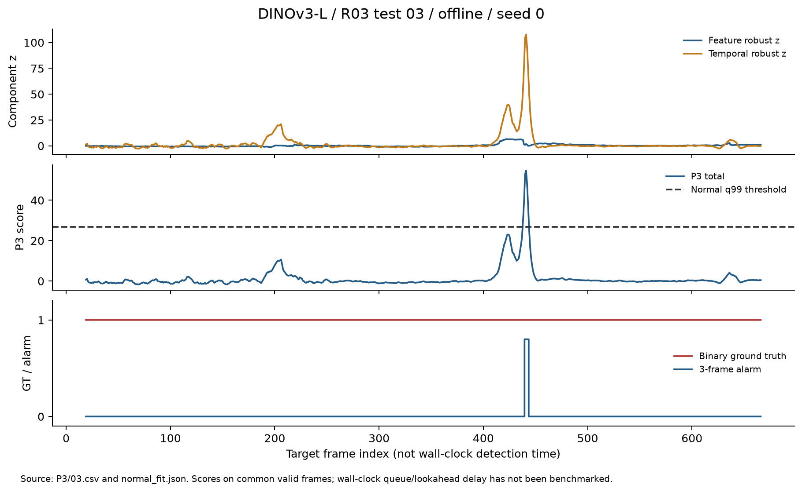

</details>

## R04 두 백본 실제 이상탐지 평가

테스트 19개 영상의 공통 대상 7,660프레임, 이상 4,501프레임에서 두 백본의 3 seeds 평가를 완료했다.

| 구성 | DINOv3 AUROC (%) | DINOv3 AP (%) | V-JEPA AUROC (%) | V-JEPA AP (%) |
|---|---:|---:|---:|---:|
| P0 전역 메모리 | 67.53 | 73.09 | 65.87 | 72.88 |
| P1 위상 hard | 72.72 | 73.02 | 73.47 | 76.71 |
| P2 위상 soft | 73.25 | 73.32 | 72.92 | 76.49 |
| P3 위상 soft + 시간 | 69.08 | 70.26 | 71.24 | 73.66 |

V-JEPA의 P3−P0 AUROC 차이는 +5.37pp(95% 영상 bootstrap CI −0.75..13.80pp), AP 차이는 +0.78pp(−4.62..7.75pp)로 개선을 확정할 수 없다. 두 백본 모두 P3는 P1/P2보다 낮아 시간 점수 추가가 항상 성능 개선으로 이어지지 않았다. 고정 예시 영상 03의 V-JEPA seed 0에서는 정상 q99를 넘는 단발성 점수 구간이 있어도 3프레임 연속 알람은 발생하지 않았다. DINOv3에서는 이상 구간 후반에 짧은 알람이 발생했다. 이 시계열은 프레임 인덱스 기준이며, 실제 처리·대기열을 포함한 알람 지연과 miss/false alarm은 별도 측정해야 한다.

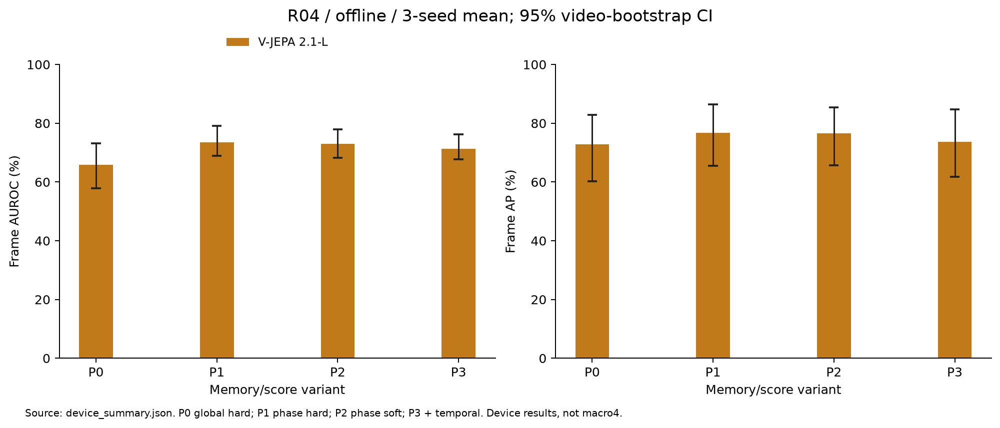
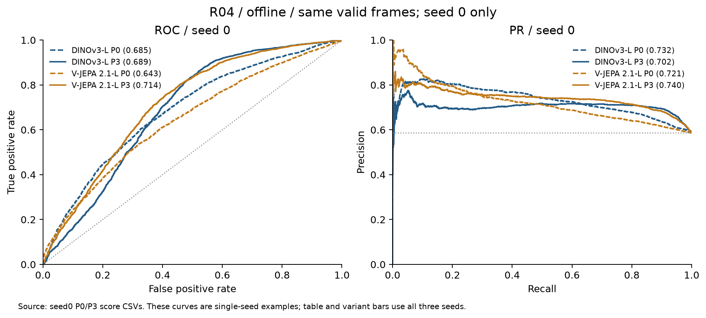

<details>
<summary>R04 정상 위상 정렬과 고정 테스트 영상 03</summary>

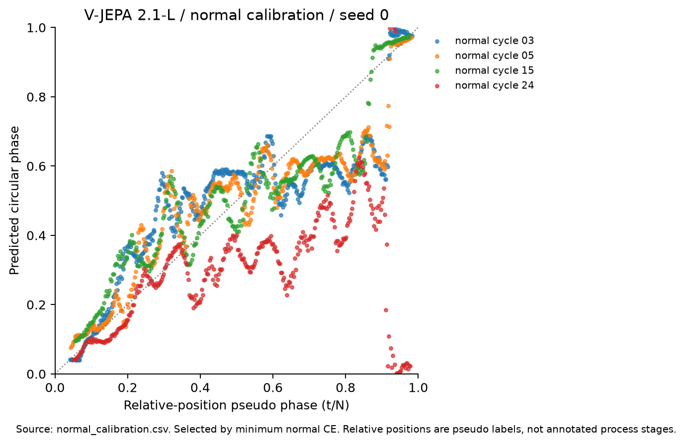
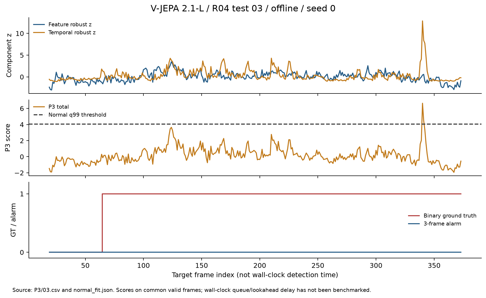
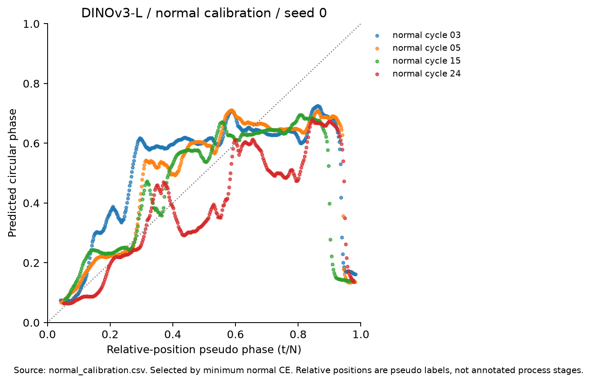
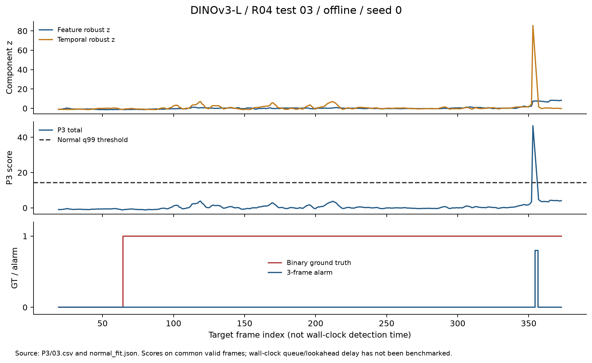

</details>

## 두 백본 오프라인 네 장비 Macro4

R01–R04 테스트 66개 영상의 공통 유효 31,728프레임(이상 13,599)을 두 백본으로 평가했다. 각 장비 안에서 3개 seed의 지표를 평균한 뒤, 장비별 지표를 같은 비중으로 평균한다. 영상·프레임 수로 가중하거나 seed 점수를 합치지 않는다. 네 장비가 모두 완료된 조건에만 Macro4를 계산한다.

| 백본 | 구성 | Macro AUROC (%) / 95% CI | Macro AP (%) / 95% CI |
|---|---|---:|---:|
| DINOv3-L | P0 전역 메모리 | 68.48 / 62.52..73.89 | 59.95 / 48.77..69.80 |
| DINOv3-L | P1 위상 hard | 62.65 / 57.07..67.73 | 54.20 / 44.33..62.94 |
| DINOv3-L | P2 위상 soft | 63.29 / 57.77..68.22 | 54.98 / 45.35..63.37 |
| DINOv3-L | P3 위상 soft + 시간 | 64.15 / 60.32..68.11 | 55.10 / 46.01..63.53 |
| V-JEPA 2.1-L | P0 전역 메모리 | 50.66 / 44.70..56.47 | 44.06 / 36.68..53.22 |
| V-JEPA 2.1-L | P1 위상 hard | 51.50 / 46.23..57.26 | 45.06 / 37.99..53.86 |
| V-JEPA 2.1-L | P2 위상 soft | 53.39 / 47.99..59.01 | 46.22 / 39.05..54.66 |
| V-JEPA 2.1-L | P3 위상 soft + 시간 | 55.59 / 51.25..60.32 | 47.14 / 39.98..55.17 |

V-JEPA의 P3−P0 Macro AUROC 차이는 **+4.93pp(1.41..9.01pp)**, Macro AP 차이는 **+3.09pp(−0.41..5.98pp)**다. DINOv3에서는 AUROC −4.32pp(−8.25..+0.70pp), AP −4.85pp(−9.75..+0.09pp)로 P3 평균이 낮았으며 두 CI에 0이 포함된다.

P3의 V-JEPA−DINOv3 차이는 AUROC **−8.56pp(−12.68..−4.11pp)**, AP **−7.96pp(−12.24..−2.86pp)**다. 이 고정 백본·오프라인 조건에서는 DINOv3의 Macro4가 더 높았다. V-JEPA의 P0 대비 AUROC 개선에도 절대 성능은 55.59%로 제한적이다. 장비별 편차가 크며, 이 결과를 미완료 온라인·LoRA 또는 실시간 알람 성능으로 일반화하지 않는다.

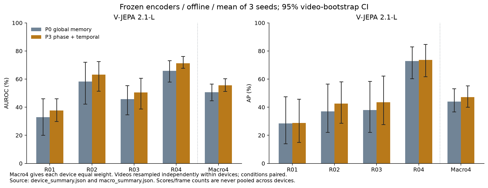

CI는 각 장비 안에서 영상 단위로 독립 재표집한 1,000개 표본의 Macro4 percentile이다. `SeedSequence([2026, 장비번호])`로 장비별 독립 stream을 만들고, 같은 장비의 seed·구성·백본·모드 비교에는 같은 영상 draw를 적용한다. 장비별 CI의 상·하한을 평균하지 않는다. 모든 표본에서 두 라벨이 유지돼 제외된 draw는 0개다.
원본 [macro_summary.json](../results/stage02/macro_summary.json), [CSV](../results/stage02/macro_summary.csv), 생성 코드 [summarize_experiments.py](../scripts/summarize_experiments.py)·[plot_macro.py](../scripts/plot_macro.py)를 제공한다. 장비별 비중, paired draw, 미완료 장비 제외와 마스크 불일치 거부를 테스트했다.
