# Stage 03 — 온라인 탐지와 추론 구현 비교

## 현재 실행 범위

두 백본의 고정 특징 추출을 온라인 `[t−15,…,t]` 창으로 시작했다. R01–R04의 정상 fit/calibration과 테스트를 순서대로 처리한다.
정상 fit 초기 구간만 첫 프레임 왼쪽 패딩을 허용하며, 검증·테스트는 실제 과거 16프레임이 확보된 뒤 시작한다. 정확도 비교의 공통 대상은 오프라인과 같은 `t=19..N−8`이다.

두 백본·두 모드·네 장비의 고정 특징 평가를 각각 3 seeds 모두 완료했다. 실제 FPS·알람 지연과 LoRA 전체 비교는 아직 완료하지 않았다.

모드별로 같은 정상 영상 분할과 fit stride 4를 사용하지만, fit clip의 경계와 정상 위상 CE 검증의 target 위치는 다르다. 오프라인 fit은 `t=8..N−8`, 온라인 fit은 `t=0..N−1`에서 stride 4로 추출한다. 정상 CE 검증은 오프라인 `t=8..N−8`, 온라인 `t=15..N−1`이고, 최종 점수 q99 보정과 테스트는 **같은 `t=19..N−8`** 구간이다. 두 모드는 별도 정상 위상 head·PCA·메모리·점수 보정을 구성하므로, 결과는 전체 모드 프로토콜의 비교이며 미래 프레임 포함 효과만을 분리한 실험은 아니다.

| 장비 | 오프라인 fit clip | 온라인 fit clip | 정상 CE 검증 clip / 각 모드 |
|---|---:|---:|---:|
| R01 | 1,248 | 1,335 | 1,087 |
| R02 | 3,042 | 3,117 | 2,864 |
| R03 | 2,564 | 2,618 | 2,771 |
| R04 | 1,596 | 1,655 | 1,546 |

## R01 오프라인·온라인 정확도

두 모드 모두 테스트 15개 영상의 같은 3,295프레임(이상 1,227프레임)에서 평가했다. 아래는 seed 0/1/2 지표의 평균이다.

| 백본 | 구성 | 오프라인 AUROC / AP (%) | 온라인 AUROC / AP (%) |
|---|---|---:|---:|
| DINOv3-L | P0 전역 메모리 | 78.51 / 57.30 | 79.00 / 58.02 |
| DINOv3-L | P1 위상 hard | 45.21 / 32.32 | 54.79 / 36.94 |
| DINOv3-L | P2 위상 soft | 45.47 / 32.18 | 54.72 / 36.82 |
| DINOv3-L | P3 위상 soft + 시간 | 47.01 / 33.21 | 53.69 / 36.92 |
| V-JEPA 2.1-L | P0 전역 메모리 | 32.90 / 28.38 | 30.37 / 29.53 |
| V-JEPA 2.1-L | P1 위상 hard | 24.97 / 25.30 | 33.83 / 28.42 |
| V-JEPA 2.1-L | P2 위상 soft | 30.43 / 26.86 | 32.44 / 27.84 |
| V-JEPA 2.1-L | P3 위상 soft + 시간 | 37.58 / 28.83 | 34.60 / 29.72 |

V-JEPA P3 온라인−오프라인 차이는 AUROC −2.97pp(95% 영상 bootstrap CI −10.92..5.40pp), AP +0.89pp(−2.19..6.43pp)다. DINOv3는 AUROC +6.68pp(−0.29..14.00pp), AP +3.71pp(−0.57..8.85pp)다. 두 백본의 모드별 P3 차이는 모두 신뢰구간에 0을 포함하며 DINOv3 P3는 P0보다 낮다.

온라인 P3의 V-JEPA−DINOv3 AUROC 차이는 −19.09pp(−32.15..−7.87pp)다. R01에서는 DINOv3가 더 높았으나 이 한 장비 결과로 전체 장비·LoRA·실시간 조건의 우열을 판단하지 않는다. 원본 점수 CSV·정상 보정·실행별 지표는 [DINOv3 온라인](../results/stage02/dinov3-l/online/R01), [V-JEPA 온라인](../results/stage02/vjepa21-l/online/R01)에 공개한다.


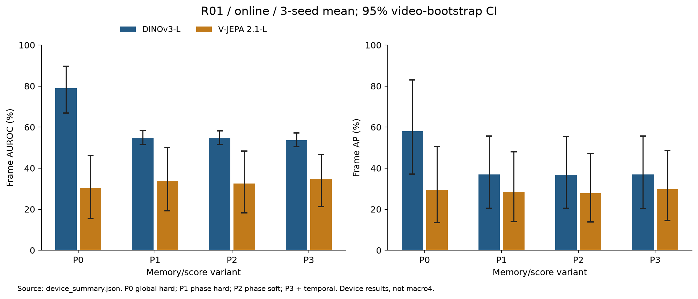
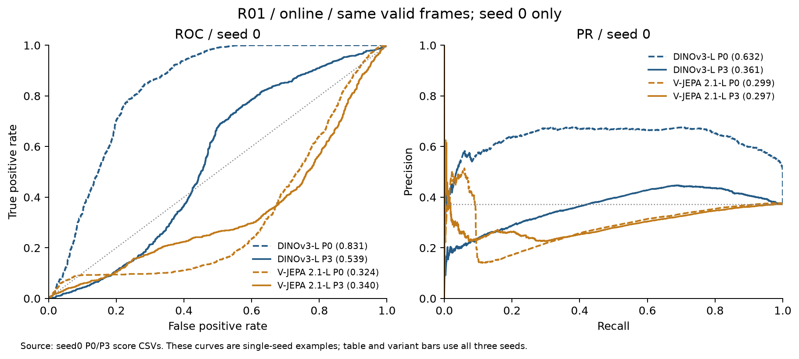

<details>
<summary>R01 온라인 정상 위상 정렬과 고정 테스트 영상 03</summary>

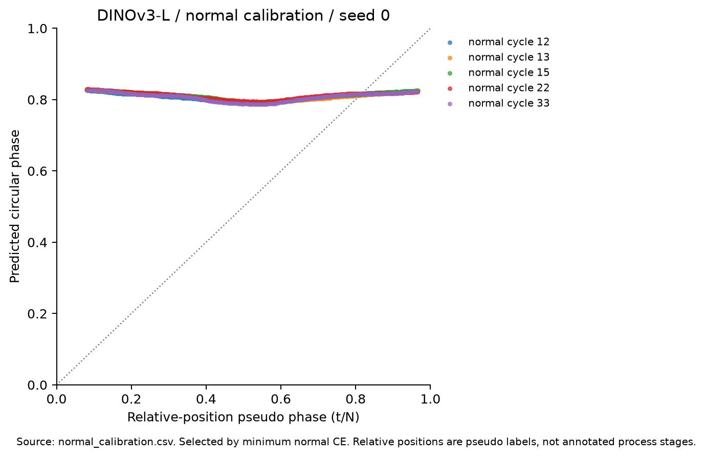
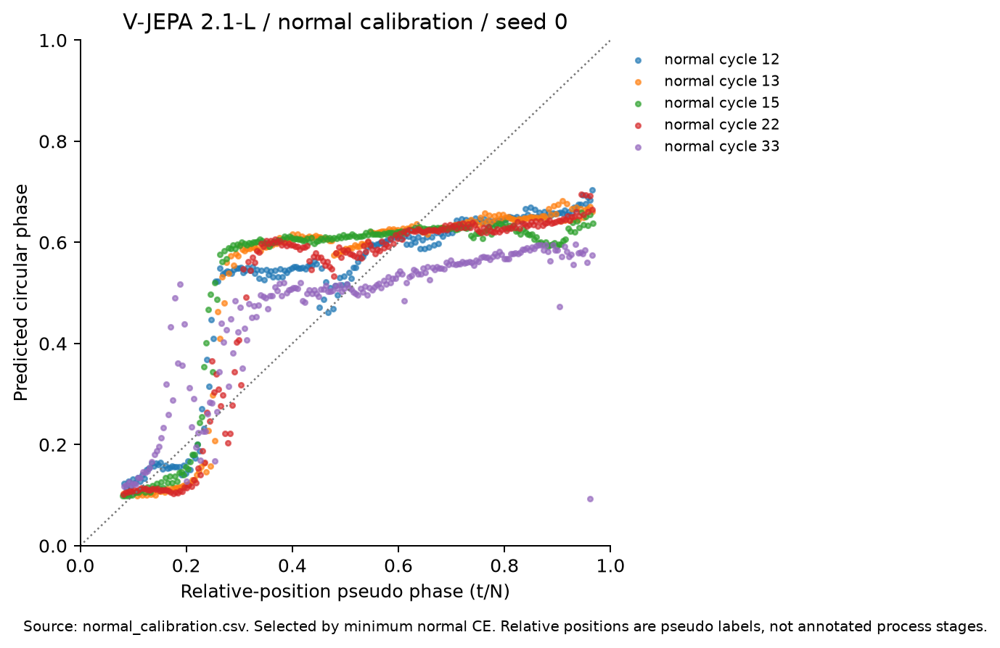
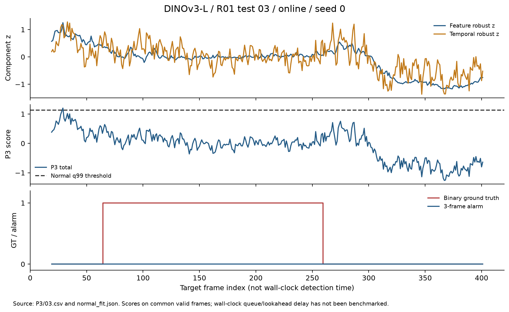
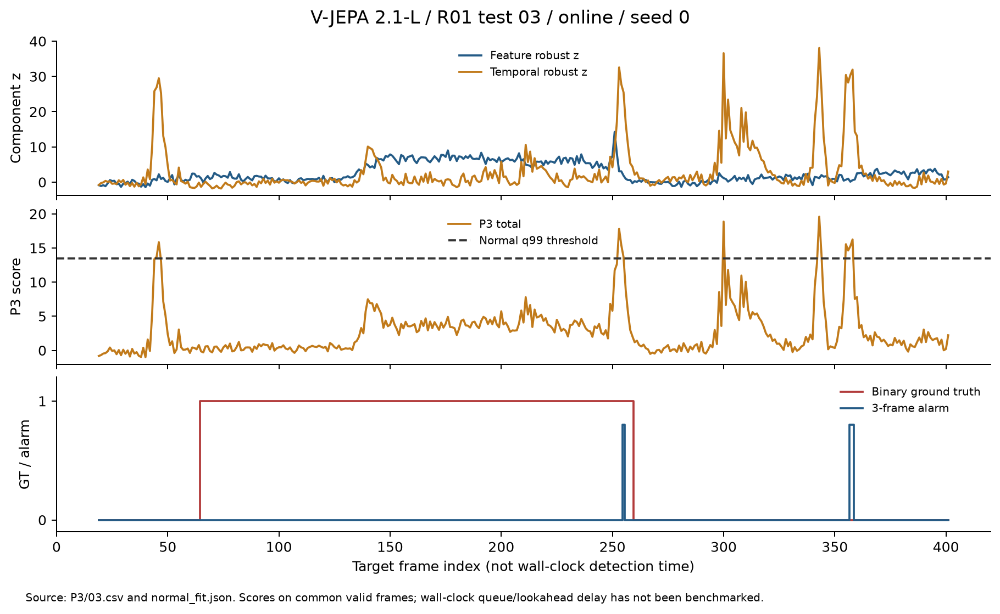

</details>

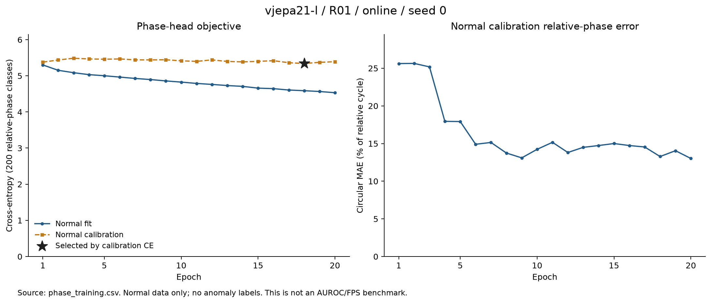

## R02 오프라인·온라인 정확도

테스트 15개 영상에서 동일한 **9,210프레임(이상 2,949)**을 비교했다. R02/12·13·14의 라벨 정렬 미확정 18프레임은 양쪽 모드에서 같은 마스크로 제외했다. 정확한 정렬이 확인됐다는 의미는 아니며, ±1 인덱스 가정과 오프셋별 민감도는 [Stage 00](STAGE00.md)에 기록한다.

| 백본 | 구성 | 오프라인 AUROC / AP (%) | 온라인 AUROC / AP (%) |
|---|---|---:|---:|
| DINOv3-L | P0 전역 메모리 | 73.32 / 62.09 | 71.99 / 60.53 |
| DINOv3-L | P1 위상 hard | 72.20 / 59.04 | 72.44 / 58.70 |
| DINOv3-L | P2 위상 soft | 71.98 / 60.68 | 72.72 / 60.47 |
| DINOv3-L | P3 위상 soft + 시간 | 79.84 / 65.11 | 79.89 / 63.73 |
| V-JEPA 2.1-L | P0 전역 메모리 | 58.19 / 36.98 | 65.17 / 42.82 |
| V-JEPA 2.1-L | P1 위상 hard | 57.18 / 36.65 | 65.62 / 41.90 |
| V-JEPA 2.1-L | P2 위상 soft | 59.71 / 38.79 | 67.05 / 44.91 |
| V-JEPA 2.1-L | P3 위상 soft + 시간 | 63.10 / 42.55 | 67.17 / 45.64 |

V-JEPA P3의 온라인−오프라인 차이는 AUROC **+4.07pp(95% paired 영상 bootstrap CI +0.26..+8.45pp)**, AP **+3.09pp(+0.14..+5.56pp)**다. DINOv3는 AUROC +0.06pp(−3.57..+4.69pp), AP −1.37pp(−5.34..+3.02pp)로 모드 차이의 CI에 0이 포함된다. R02에서의 V-JEPA 모드 차이를 전체 장비의 온라인 우위 또는 실시간 성능 향상으로 해석하지 않는다.

온라인 P3의 V-JEPA−DINOv3 차이는 AUROC −12.72pp(−23.97..−0.58pp), AP −18.09pp(−36.36..+0.13pp)다. 원본 [DINOv3 R02 온라인](../results/stage02/dinov3-l/online/R02), [V-JEPA R02 온라인](../results/stage02/vjepa21-l/online/R02)과 [전체 paired CI](../results/stage02/device_summary.json)를 제공한다.

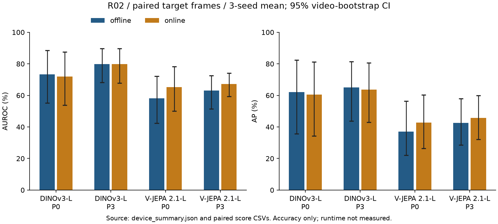
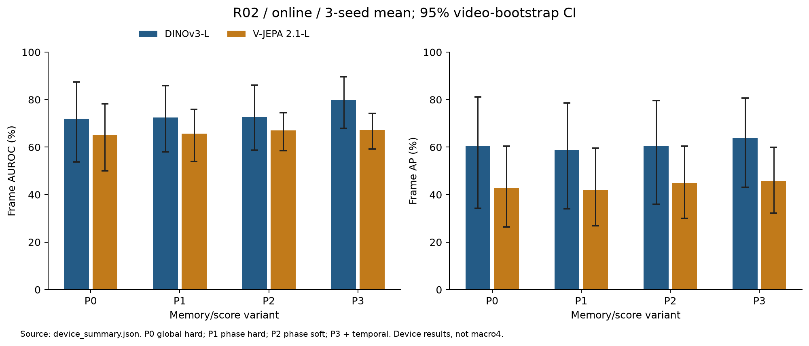
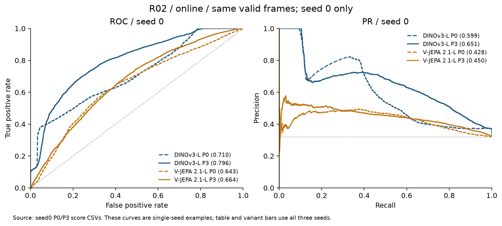

<details>
<summary>R02 온라인 정상 위상 정렬과 고정 테스트 영상 03</summary>

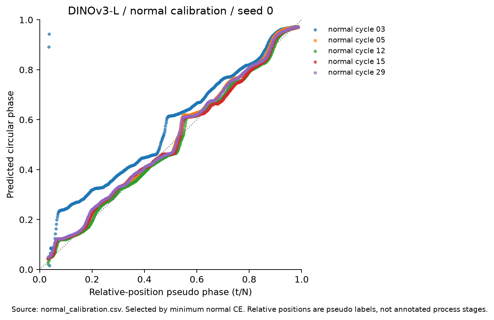
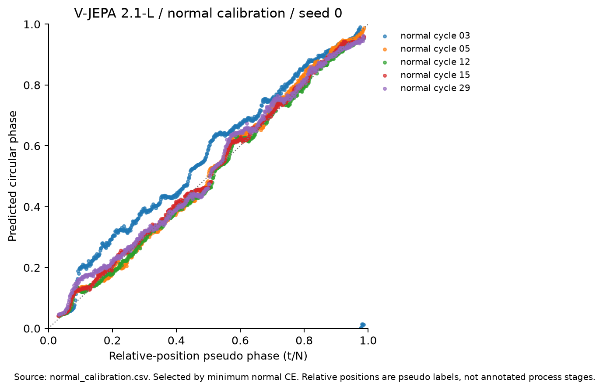
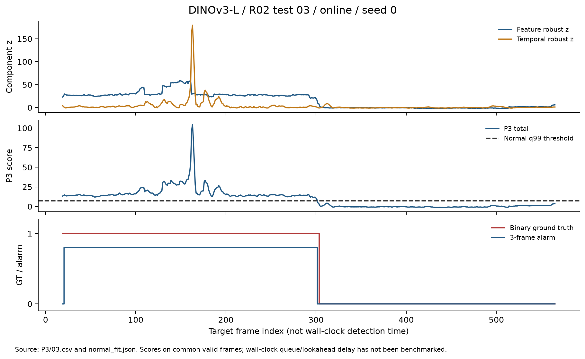
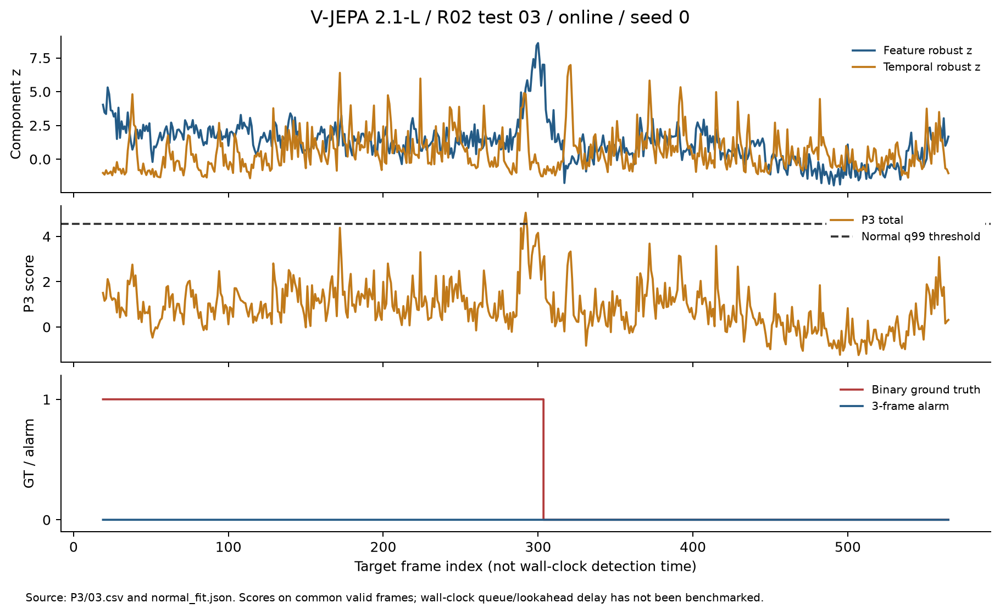

</details>

## R03 오프라인·온라인 정확도

테스트 17개 영상의 동일한 **11,563프레임(이상 4,922)**에서 두 백본의 seed 0/1/2를 비교했다. V-JEPA 온라인 정상 fit은 2,618 clip, 정상 검증은 2,771 clip이며, 세 실행 모두 최소 정상 검증 CE에 따라 epoch 20을 선택했다. 선택 모델의 정상 원형 MAE는 5.35/5.67/6.09% 주기다.

| 백본 | 구성 | 오프라인 AUROC / AP (%) | 온라인 AUROC / AP (%) |
|---|---|---:|---:|
| DINOv3-L | P0 전역 메모리 | 54.54 / 47.32 | 54.47 / 47.15 |
| DINOv3-L | P1 위상 hard | 60.47 / 52.42 | 59.38 / 51.16 |
| DINOv3-L | P2 위상 soft | 62.48 / 53.76 | 62.87 / 52.90 |
| DINOv3-L | P3 위상 soft + 시간 | 60.68 / 51.82 | 61.73 / 52.19 |
| V-JEPA 2.1-L | P0 전역 메모리 | 45.67 / 37.98 | 46.40 / 38.36 |
| V-JEPA 2.1-L | P1 위상 hard | 50.38 / 41.57 | 48.90 / 41.51 |
| V-JEPA 2.1-L | P2 위상 soft | 50.49 / 42.74 | 50.84 / 43.46 |
| V-JEPA 2.1-L | P3 위상 soft + 시간 | 50.45 / 43.53 | 50.80 / 44.29 |

온라인 P3의 DINOv3 AUROC는 **61.73%(95% 영상 bootstrap CI 55.25..68.62)**, AP는 **52.19%(37.28..68.32)**다. P3−P0 차이는 AUROC +7.25pp(+4.09..+11.33pp), AP +5.04pp(+2.47..+8.19pp)다. V-JEPA는 AUROC **50.80%(37.67..62.00)**, AP **44.29%(28.94..63.39)**이며, AP가 이상 프레임 비율 42.57%와 가깝고 AUROC는 50% 부근으로 성능이 제한적이다.

P3의 온라인−오프라인 차이는 DINOv3 AUROC +1.05pp(−0.92..+2.69pp), AP +0.37pp(−0.64..+1.35pp), V-JEPA AUROC +0.35pp(−2.61..+3.87pp), AP +0.75pp(−1.18..+3.80pp)다. 네 CI에 모두 0이 포함된다. 온라인 P3의 V-JEPA−DINOv3 차이는 AUROC −10.93pp(−19.24..−3.83pp), AP −7.90pp(−12.31..−1.07pp)다. 원본 [DINOv3 R03 온라인](../results/stage02/dinov3-l/online/R03), [V-JEPA R03 온라인](../results/stage02/vjepa21-l/online/R03)과 [paired CI](../results/stage02/device_summary.json)를 제공한다.

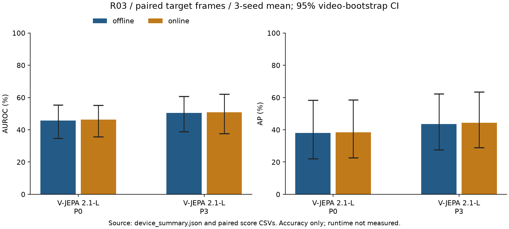
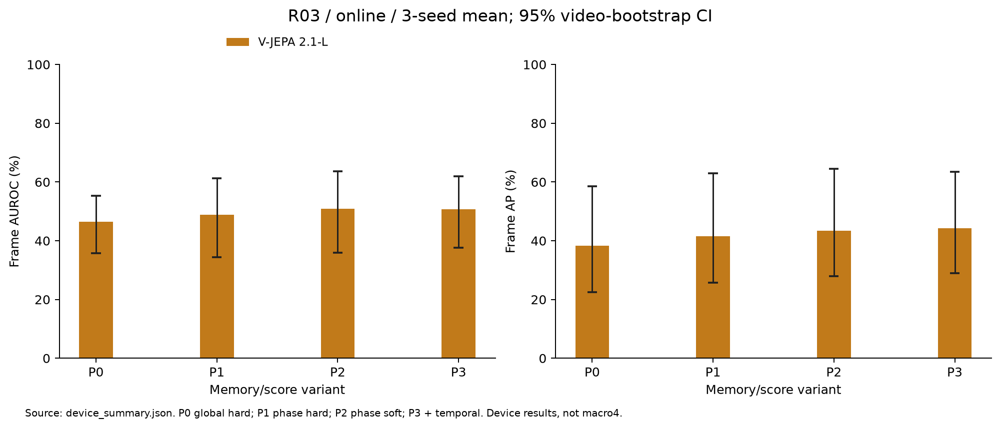
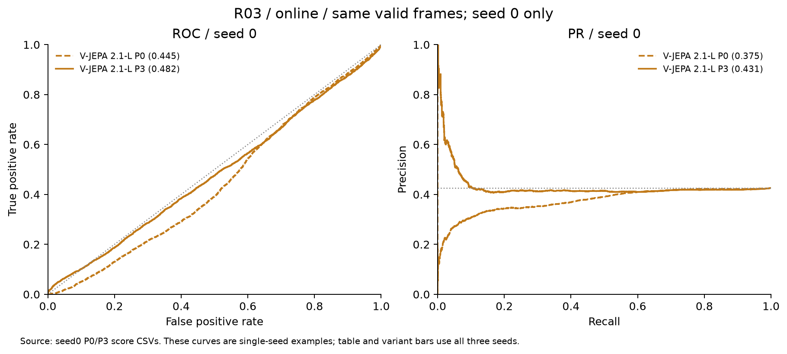

<details>
<summary>R03 정상 위상 학습·정렬과 고정 테스트 영상 03</summary>

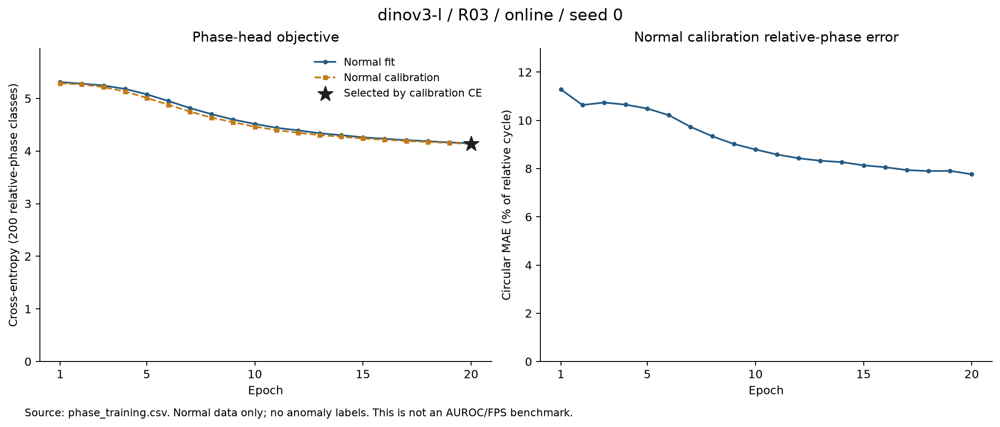
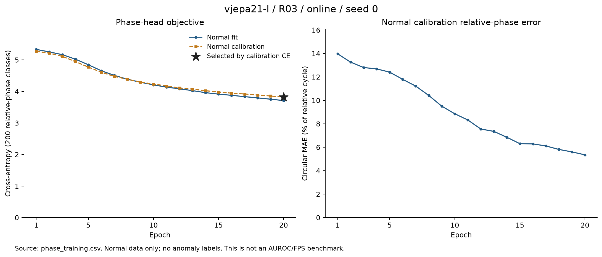
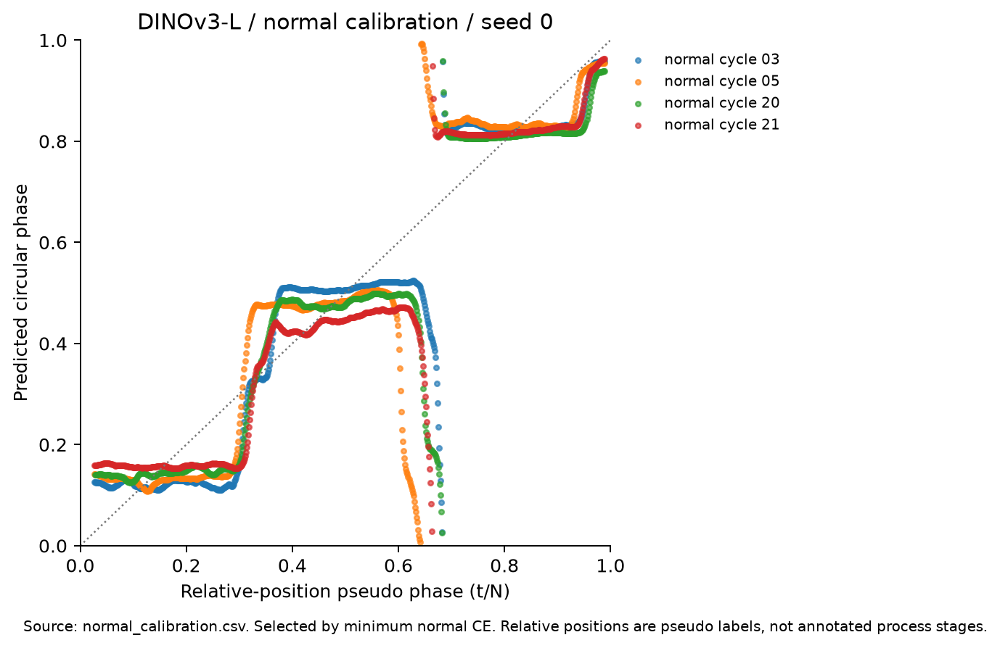
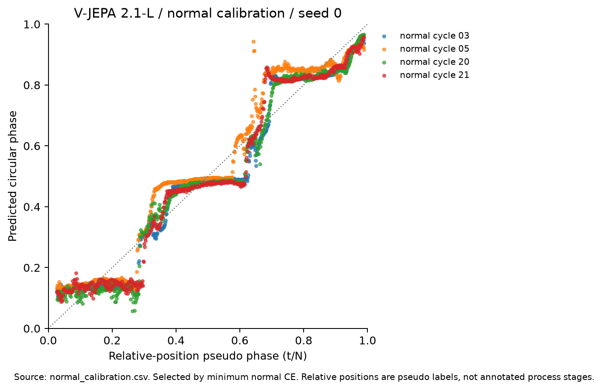
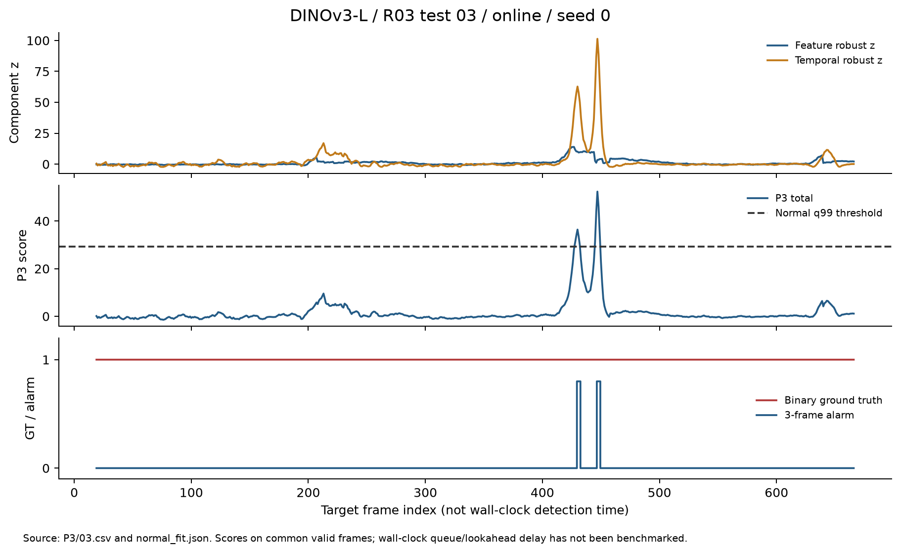
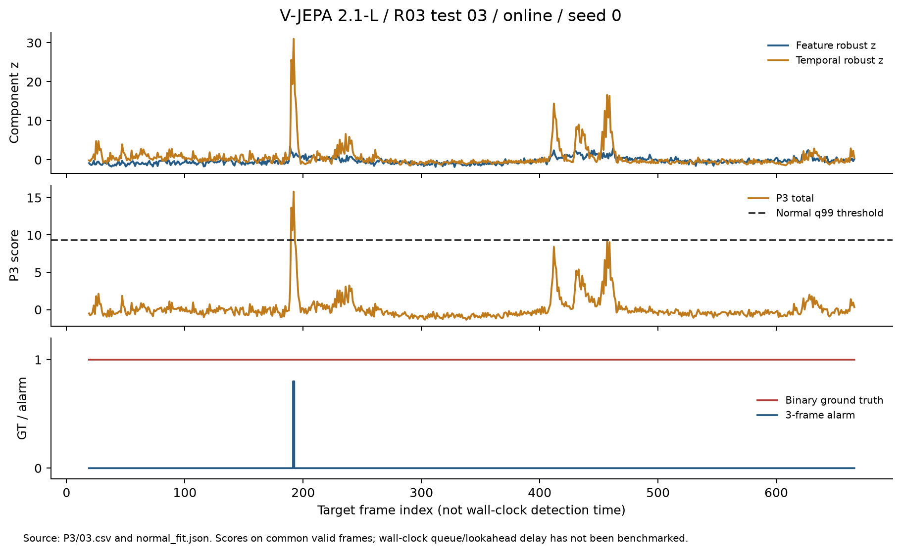

</details>

두 백본·두 모드·네 장비의 위상 head는 각각 3 seeds·20 epoch를 완료했다. [정상 위상 로그](../results/stage02/phase_summary.csv)의 **48개 실행**은 정상 데이터 학습 기록이다. 상대 위치의 pseudo label을 예측한 결과이며, 실제 공정 단계 주석의 정확도 또는 실시간 처리 성능을 뜻하지 않는다.

## R04 오프라인·온라인 정확도

테스트 19개 영상의 동일한 **7,660프레임(이상 4,501)**에서 두 백본의 seed 0/1/2를 비교했다.

| 백본 | 구성 | 오프라인 AUROC / AP (%) | 온라인 AUROC / AP (%) |
|---|---|---:|---:|
| DINOv3-L | P0 전역 메모리 | 67.53 / 73.09 | 69.33 / 74.30 |
| DINOv3-L | P1 위상 hard | 72.72 / 73.02 | 71.31 / 71.55 |
| DINOv3-L | P2 위상 soft | 73.25 / 73.32 | 73.03 / 72.85 |
| DINOv3-L | P3 위상 soft + 시간 | 69.08 / 70.26 | 70.18 / 70.82 |
| V-JEPA 2.1-L | P0 전역 메모리 | 65.87 / 72.88 | 68.38 / 74.80 |
| V-JEPA 2.1-L | P1 위상 hard | 73.47 / 76.71 | 74.02 / 77.01 |
| V-JEPA 2.1-L | P2 위상 soft | 72.92 / 76.49 | 75.33 / 78.60 |
| V-JEPA 2.1-L | P3 위상 soft + 시간 | 71.24 / 73.66 | 72.81 / 73.92 |

P3의 온라인−오프라인 차이는 다음과 같다. CI는 1,000회 paired 영상 bootstrap으로 계산했다.

| 백본 | AUROC 차이 / 95% CI (pp) | AP 차이 / 95% CI (pp) |
|---|---:|---:|
| DINOv3-L | +1.09 (-0.12..+2.46) | +0.56 (-0.38..+1.60) |
| V-JEPA 2.1-L | +1.57 (-0.21..+3.55) | +0.26 (-1.42..+1.92) |

온라인 P3의 V-JEPA−DINOv3 차이는 AUROC +2.63 (-0.98..+7.31)pp, AP +3.10 (-1.21..+8.95)pp다. 정상-only 선택과 q99 임계값을 유지했으며 테스트 결과로 모델·점수 부호·임계값을 변경하지 않았다. [DINOv3 R04 온라인](../results/stage02/dinov3-l/online/R04), [V-JEPA R04 온라인](../results/stage02/vjepa21-l/online/R04)과 원본 점수 CSV를 공개한다.

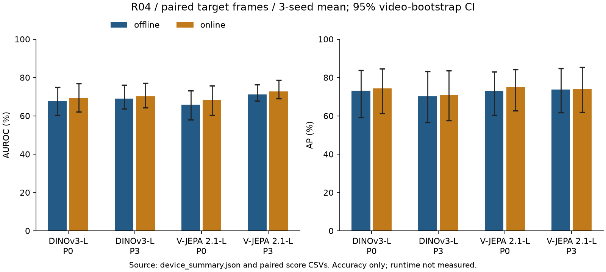
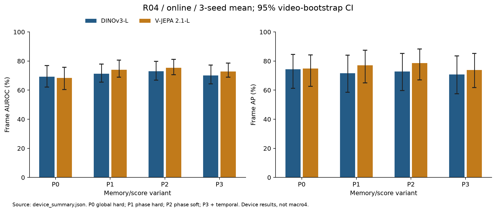
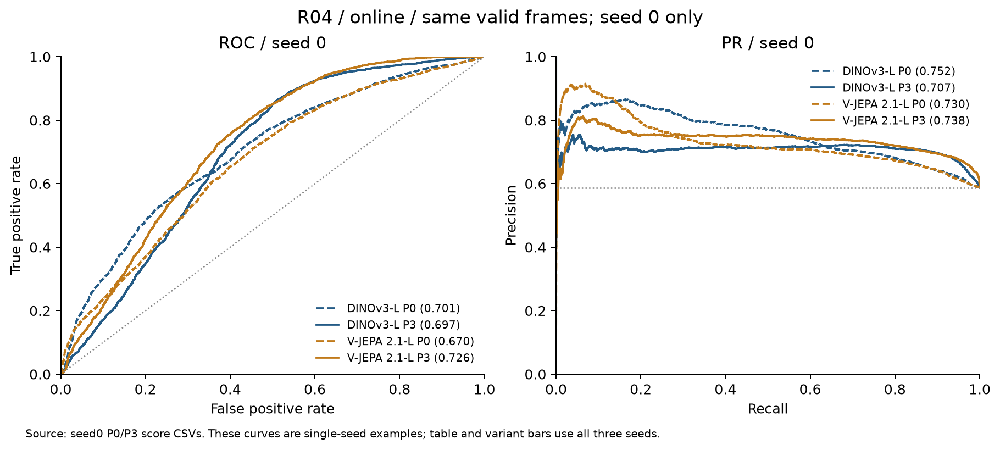

<details>
<summary>R04 정상 위상 학습·정렬과 고정 테스트 영상 03</summary>

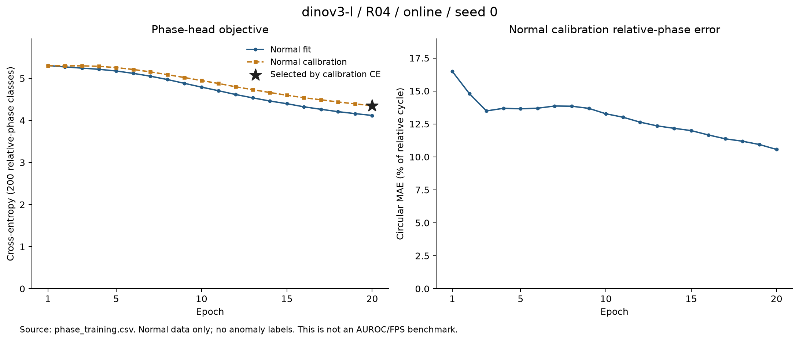
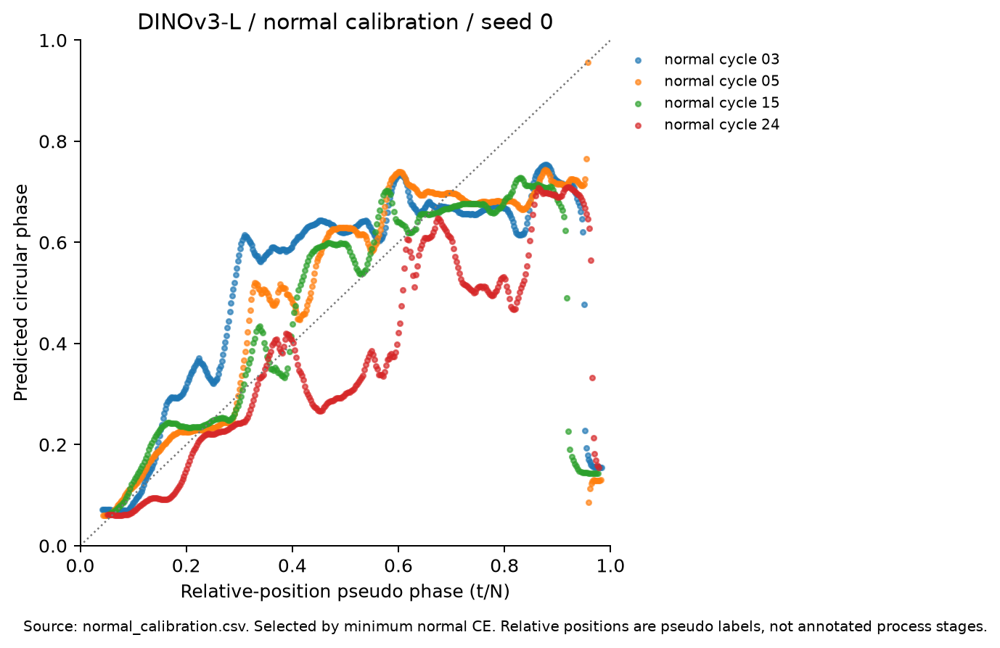
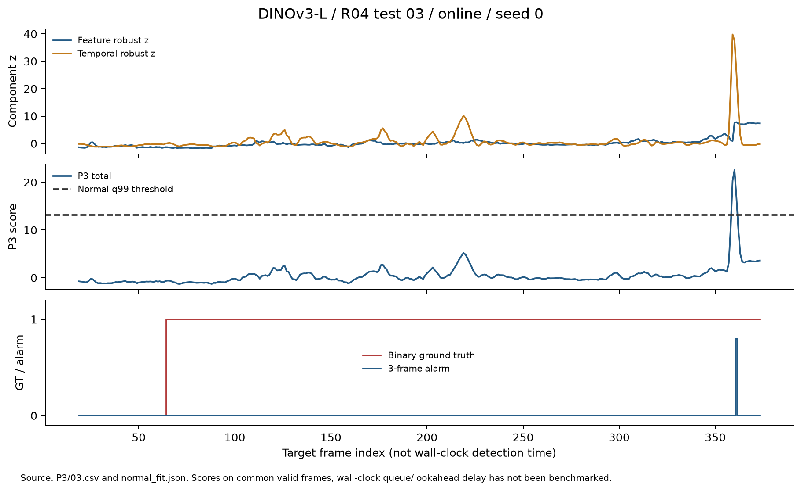
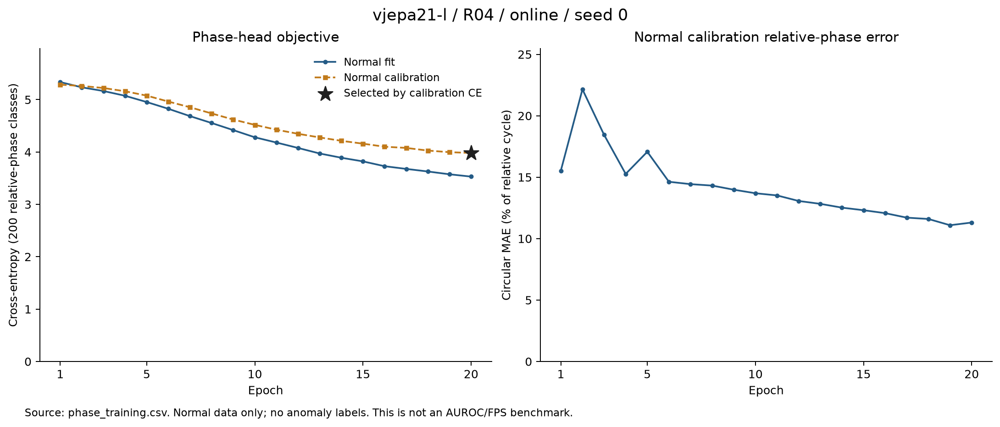
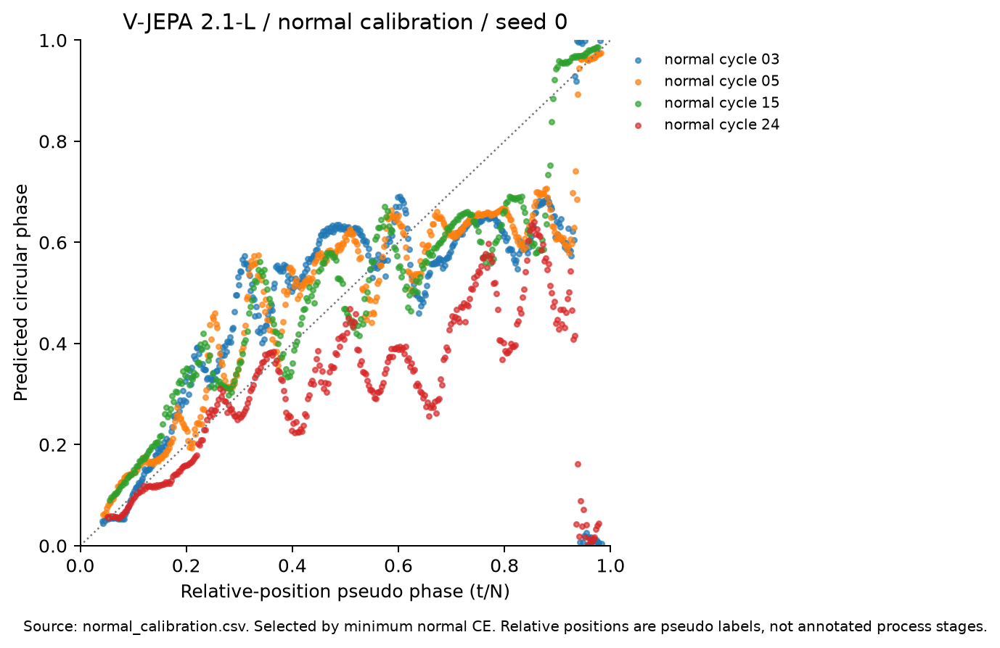
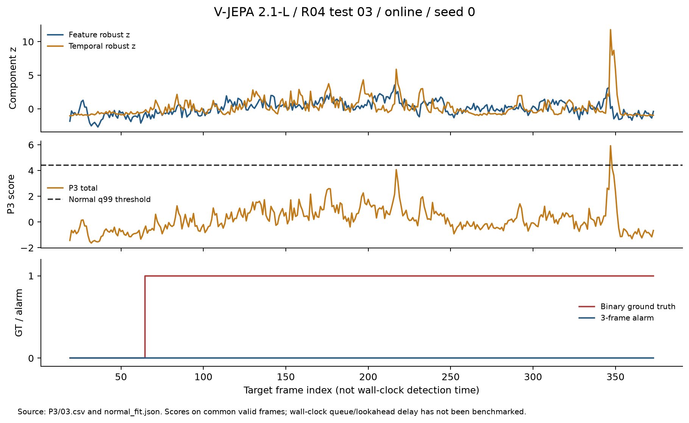

</details>

## 네 장비 온라인 Macro4와 모드 비교

두 백본·두 모드의 66개 테스트 영상을 동일한 **31,728프레임(이상 13,599)**에서 평가했다. 장비별 3-seed 지표 평균을 네 장비에 동일 가중치로 평균한다. 장비 간 점수나 프레임을 합치지 않는다. 각 장비 내 전체 영상을 독립적으로 재표집하며 비교 조건은 같은 draw를 공유한다. 1,000회 bootstrap에서 기각된 draw는 0이다. CI는 이 네 장비와 고정된 세 학습 seed의 영상 표본 불확실성이며, 새 장비나 모든 학습 seed의 변동을 나타내지 않는다.

| 백본 / 온라인 | 구성 | Macro AUROC / 95% CI (%) | Macro AP / 95% CI (%) |
|---|---|---:|---:|
| DINOv3-L | P0 전역 메모리 | 68.70 / 62.53..74.34 | 60.00 / 48.94..69.71 |
| DINOv3-L | P1 위상 hard | 64.48 / 59.69..69.17 | 54.59 / 44.73..63.43 |
| DINOv3-L | P2 위상 soft | 65.83 / 61.07..70.28 | 55.76 / 46.01..64.36 |
| DINOv3-L | P3 위상 soft + 시간 | 66.37 / 62.75..70.13 | 55.92 / 46.79..64.33 |
| V-JEPA 2.1-L | P0 전역 메모리 | 52.58 / 46.42..59.03 | 46.38 / 38.75..55.15 |
| V-JEPA 2.1-L | P1 위상 hard | 55.59 / 50.14..61.78 | 47.21 / 39.68..56.60 |
| V-JEPA 2.1-L | P2 위상 soft | 56.42 / 51.11..62.50 | 48.70 / 41.43..57.48 |
| V-JEPA 2.1-L | P3 위상 soft + 시간 | 56.35 / 51.59..61.37 | 48.39 / 41.01..56.66 |

| 백본 | 구성 | 온라인−오프라인 AUROC / 95% CI (pp) | AP / 95% CI (pp) |
|---|---|---:|---:|
| DINOv3-L | P0 | +0.22 (-0.56..+1.09) | +0.05 (-0.89..+1.28) |
| DINOv3-L | P1 | +1.83 (-0.58..+4.77) | +0.39 (-1.25..+2.45) |
| DINOv3-L | P2 | +2.54 (+0.23..+5.20) | +0.77 (-0.85..+2.48) |
| DINOv3-L | P3 | +2.22 (+0.13..+4.33) | +0.82 (-0.68..+2.43) |
| V-JEPA 2.1-L | P0 | +1.92 (+0.45..+3.62) | +2.32 (+0.86..+3.81) |
| V-JEPA 2.1-L | P1 | +4.09 (+2.19..+6.05) | +2.15 (+0.88..+4.38) |
| V-JEPA 2.1-L | P2 | +3.03 (+0.68..+5.69) | +2.48 (+1.17..+4.64) |
| V-JEPA 2.1-L | P3 | +0.76 (-1.64..+3.26) | +1.25 (-0.08..+2.87) |

| 온라인 비교 | AUROC 차이 / 95% CI (pp) | AP 차이 / 95% CI (pp) |
|---|---:|---:|
| DINOv3-L P3−P0 | -2.33 (-6.70..+2.90) | -4.09 (-10.03..+1.26) |
| V-JEPA 2.1-L P3−P0 | +3.77 (-0.75..+8.95) | +2.02 (-2.96..+6.03) |
| V-JEPA−DINOv3 P3 | -10.02 (-14.49..-5.18) | -7.52 (-12.08..-2.00) |

V-JEPA의 P3 온라인−오프라인 AUROC와 AP 차이는 모두 CI에 0을 포함한다. V-JEPA 온라인 P2 평균이 P3보다 높으며, P3의 전체 구성요소가 모든 장비에서 성능을 높인다고 주장하지 않는다. 이 정확도 결과는 고정 백본 조건이며 LoRA·지속 FPS·벽시계 알람 지연으로 확장하지 않는다. [전체 Macro4 수치 및 paired CI](../results/stage02/macro_summary.json), [64개 장비·구성 집계](../results/stage02/device_summary.json), [192개 정상 q99 검증](../results/stage02/calibration_check.json)을 제공한다.

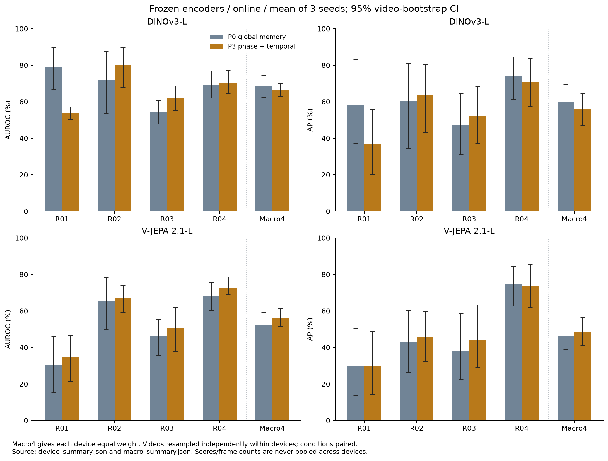


## DINO 과거 프레임 특징 재사용 검증

DINO는 각 프레임을 독립적으로 인코딩하므로, 이전 프레임의 특징을 유지하고 도착한 프레임만 추가하는 구현을 별도로 작성했다. 16개 프레임 특징을 넘겨 보관하지 않고, 위상 입력의 전체 창 평균과 마지막 두 프레임 패치 평균을 유지한다.
CPU 테스트에서 순차 입력·warmup·초기 패딩·창 평균·한 번만 인코딩하는 동작을 검증했다.

실제 R01 정상 영상의 네 온라인 clip에서 전체 클립 추론과 비교했다. [원본 수치](../results/setup/dinov3_streaming.json)는 성공 여부와 오차를 각각 기록한다.

| 정밀도 | 패치 상대 L2 오차 | 전역 상대 L2 오차 | 검증 |
|---|---:|---:|---|
| BF16 | 0.757–0.890% | 0.401–0.490% | 사전 수치 기준 0.1% 초과 |
| FP32 | 약 0.00018% | 약 0.00005–0.00008% | 사전 수치 기준 0.001% 이내 |

FP32에서는 평균 동작이 일치했다. BF16에서 배치 구성에 따른 수치 차이가 있으므로, **주 정확도 실험은 두 모드 모두 기존 전체 클립 BF16 추론을 사용한다**. 재사용 구현으로 생성하는 캐시는 위 수치 검증이 통과되지 않으면 생성 도구가 거부한다.
현재의 특징 비교를 점수·알람의 동등성이나 실시간 속도 검증으로 해석하지 않는다. 최적화 런타임 결과를 공개하려면 실제 점수·알람 차이도 확인하고 사용 정밀도를 명시해야 한다.

## 후속 런타임 측정 범위

30 FPS 입력 도착, FIFO/no drops, warmup 19, 3프레임 연속 초과 알람, 고정 테스트 메모리 조건을 사용한다.
입력 decode/resize, encoder, 위상 head, PCA·메모리 검색, 점수·알람, 대기열, 오프라인 7프레임 lookahead 대기를 분리해 측정한다.
전체 지연 p50/p95, 지속 FPS, peak VRAM, 대기열 증가, 이벤트 탐지 지연·누락·오탐을 그래프로 제공한다. 캐시 생성 시간과 GPU cold forward 시간은 이 측정에 해당하지 않는다.

```bash
python -m ipad_jepa.features --model dinov3-l --mode online \
  --weights artifacts/weights/dinov3_vitl16_pretrain_lvd1689m-8aa4cbdd.pth \
  --upstream third_party/dinov3 --data-root "$IPAD_DATA_ROOT" \
  --devices R01 R02 R03 R04 --splits fit calibration test --batch-size 4 --workers 2

python scripts/verify_dino_streaming.py \
  --sequence "$IPAD_DATA_ROOT/R01/training/frames/01" \
  --weights artifacts/weights/dinov3_vitl16_pretrain_lvd1689m-8aa4cbdd.pth
```

두 번째 명령은 현재 BF16 수치 기준 실패를 JSON에 기록한 뒤 비정상 종료한다. 원인을 숨기거나 성공 기준을 바꿔 통과 처리하지 않는다. 전체 행렬과 완료 조건은 [experiment_matrix.yaml](../configs/experiment_matrix.yaml)에 있다.
