# Stage 04 — 정상 데이터 기반 LoRA와 추가 실험

## 구현과 검증 범위

두 공식 ViT-L 백본의 마지막 4개 attention block에 q/v LoRA를 적용한다. rank 8, alpha 16, dropout 0.05이며, encoder 학습 파라미터는 131,072개다. 313,800개 파라미터의 위상 head를 함께 학습한다. decoder나 V-JEPA predictor를 사용하지 않는다.

DINOv3 attention이 읽는 fused projection의 `in_features` 속성을 유지하는 별도 래퍼를 사용한다. 원본 가중치와 k projection은 고정한다. encoder는 eval 상태를 유지하고 LoRA dropout과 phase head만 train 상태로 전환해 고정 prefix의 drop-path/RoPE 증강이 추가되지 않게 한다.

정상 fit 영상의 raw clip과 검증된 고정 encoder의 dense 특징을 짝지어 학습한다. teacher cache의 영상·프레임·모델·입력 모드·코드 해시와 원본 프레임 내용을 확인한다. 진단 영상과 실제 테스트 영상을 학습·선택에 사용하지 않는다.

손실은 `phase CE + teacher_weight × dense L2`다. dense L2는 각 patch의 1,024차원 특징을 channel 방향으로 단위 정규화한 뒤, 차원별 제곱 오차를 합산하고 patch·batch에 대해 평균한다. teacher는 gradient를 받지 않는다. 차원 수로 추가 나누지 않는다.

AdamW의 encoder LR은 1e-4, head LR은 1e-3, weight decay는 1e-4다. BF16, micro-batch 1, 8회 gradient accumulation, 20 epoch를 사용한다. 마지막 불완전 accumulation window도 실제 clip 수로 나누고 반영한다. 정상 calibration phase CE가 가장 낮은 epoch를 선택하며, 원형 MAE는 함께 보고한다.

## 실행 경로

```bash
python -m ipad_jepa.train_lora --model dinov3-l --mode offline --device R01 \
  --data-root "$IPAD_DATA_ROOT" --teacher-cache artifacts/features/dinov3-l/offline \
  --weights artifacts/weights/dinov3_vitl16_pretrain_lvd1689m-8aa4cbdd.pth \
  --upstream third_party/dinov3 --seed 0 \
  --out artifacts/lora/dinov3-l/offline/R01/seed0

python -m ipad_jepa.adapted_features \
  --run artifacts/lora/dinov3-l/offline/R01/seed0 \
  --weights artifacts/weights/dinov3_vitl16_pretrain_lvd1689m-8aa4cbdd.pth \
  --upstream third_party/dinov3 --data-root "$IPAD_DATA_ROOT" \
  --cache artifacts/features_lora/dinov3-l/offline/R01/seed0 \
  --phase-out artifacts/runs_lora/dinov3-l/offline/R01/seed0

python -m ipad_jepa.experiment --device R01 --seed 0 \
  --cache artifacts/features_lora/dinov3-l/offline/R01/seed0 \
  --phase-run artifacts/runs_lora/dinov3-l/offline/R01/seed0 \
  --data-root "$IPAD_DATA_ROOT" \
  --out results/stage04/dinov3-l/offline/R01/seed0 \
  --local artifacts/runs_lora/dinov3-l/offline/R01/seed0
```

V-JEPA와 온라인에도 같은 조건을 적용한다. 선택된 adapter와 동시에 선택된 head를 사용하며 head를 후속 단계에서 별도 재학습하지 않는다. 특징 추출 후 정상 fit/calibration 경로로 PCA·프로토타입·temperature·score calibration을 모두 다시 구성한다. 대용량 파일은 로컬에만 저장한다.

각 epoch 종료 시 adapter/head, optimizer, Python/NumPy/CPU/CUDA/loader RNG와 곡선을 저장한다. `--resume`은 동일 코드·teacher fingerprint·설정만 허용하고 완료 epoch부터 재개한다. GPU resume의 연속 실행과의 일치는 아직 검증하지 않았다.

`--max-steps`는 실제 optimizer 업데이트를 확인하는 pilot 전용이다. pilot과 전체 학습을 구분하며, 20 epoch가 완료되지 않은 adapter를 특징 재추출·주 평가에 전달하면 거부한다. GPU pilot은 학습 연산의 증거이며 이상탐지 성능이나 실시간 FPS의 증거는 아니다.

## 실제 GPU 예비 학습

R01 정상 fit에서 각 백본의 8개 micro-batch를 누적한 optimizer 업데이트 1회를 실행했다. 두 실행 모두 131,072개 encoder 파라미터와 313,800개 head 파라미터를 학습했다.

| 백본 | 정상 clip | optimizer 업데이트 | 평균 phase CE | 평균 normalized dense L2 |
|---|---:|---:|---:|---:|
| DINOv3-L | 8 | 1 | 5.3008 | 3.3923e-5 |
| V-JEPA 2.1-L | 8 | 1 | 5.1523 | 4.1493e-8 |

이 값은 초기 8개 학습 clip의 손실이며 학습 완료나 모델의 우열을 뜻하지 않는다. [예비 결과 JSON](../results/stage04/pilots)에 source/teacher fingerprint와 학습 후 q/v B 행렬 norm을 공개한다. 백본별 배치 구성과 특징 정밀도 차이를 포함하므로 초기 teacher loss를 이상탐지 성능으로 비교하지 않는다.

## 완료된 정상 학습 — R01 오프라인 seed 0

두 백본 모두 20 epoch와 3,120회 optimizer 업데이트를 완료했다. 각 epoch에서 정상 fit 23개 영상의 1,248개 clip과 정상 calibration 5개 영상의 1,087개 clip을 사용했다. 아래 결과는 사전에 정한 **최소 정상 calibration CE**로 선택한 adapter와 joint head의 결과다. 원형 MAE는 주기 대비 백분율이며 선택 기준이 아니다.

| 백본 | 선택 epoch | 정상 calibration CE | 같은 epoch의 원형 MAE |
|---|---:|---:|---:|
| DINOv3-L | 18 | 4.7632 | 0.66% |
| V-JEPA 2.1-L | 1 | 5.3101 | 23.80% |

V-JEPA의 마지막 epoch 원형 MAE는 3.89%로 낮아졌지만 CE는 6.2001로 선택 epoch보다 높다. CE와 원형 MAE는 다른 지표이므로 선택 규칙을 바꾸지 않았고, 선택된 V-JEPA head의 위상 오차는 여전히 크다. 이 정상 학습 결과만으로 이상탐지 성능의 우열을 판단하지 않는다.

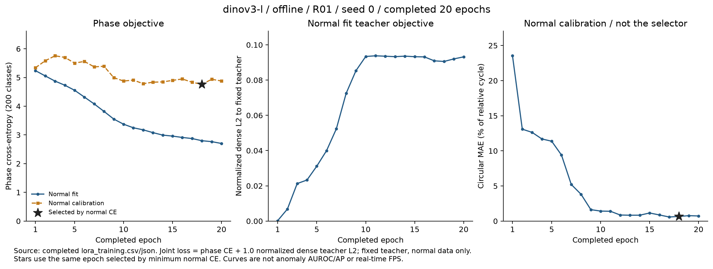

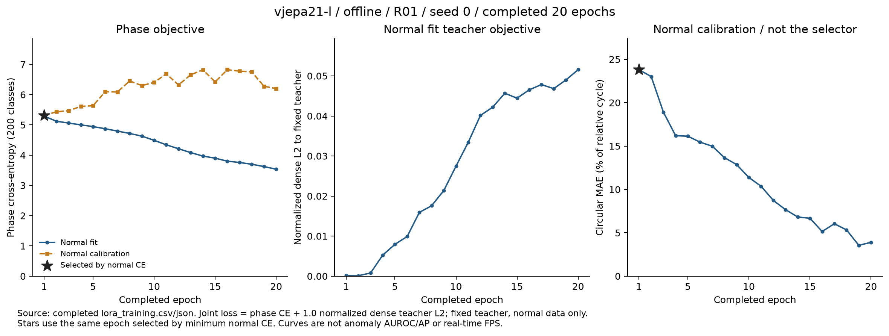

별표는 두 지표에서 동일한 CE 선택 epoch를 표시한다. teacher 곡선은 고정 teacher와의 정상 fit 특징 오차다. 이 그래프는 이상탐지 AUROC/AP나 실시간 FPS 측정 결과가 아니다. V-JEPA 학습은 앞서 기록한 저장공간 장애 이후 resume했으며, GPU 연속 학습과의 수치적 동일성을 입증하지 않는다.

완료된 [DINOv3 학습 CSV·JSON·검증 기록](../results/stage04/training/dinov3-l/offline/R01/seed0)과 [V-JEPA 학습 CSV·JSON·검증 기록](../results/stage04/training/vjepa21-l/offline/R01/seed0)을 공개한다. 기록에는 원본 곡선·metadata 해시와 선택 checkpoint 해시를 포함하며, checkpoint 파일은 업로드하지 않는다. [그래프 생성 코드](../scripts/plot_lora_training.py)는 20 epoch 완료와 최소 CE 선택을 검증한다.

두 백본의 R01 오프라인 seed 0은 선택된 adapter/head의 특징 재추출과 PCA·메모리·정상 보정 재구성, 15개 실제 테스트 영상 평가를 완료했다. P3 AUROC/AP는 DINOv3 **79.81/70.83%**, V-JEPA **33.06/27.52%**다. 같은 seed의 고정 백본 대비 DINOv3 P3의 AUROC/AP paired 차이 CI는 양수였고 V-JEPA는 0을 포함했다. 전역 P0의 AUROC는 두 백본 모두 낮아졌다. [single-seed 상세 결과·CI·그래프·출처 검증](LORA_R01_SEED0.md)을 제공하며, 아직 3-seed 평균이나 전체 장비 결과가 아니다.

R01 seed 1/2와 전체 장비·모드의 후속 학습·평가는 계속 진행 중이다.

## 전체 LoRA 행렬의 독립 검증과 집계

`scripts/summarize_lora_matrix.py`는 두 백본 × 두 모드 × 네 장비 × 세 seeds의 48조건을 검사한다. 실제 평가가 완료된 seed마다 20 epoch 정상 학습·최소 정상 CE 선택, 선택 adapter와 joint head의 tensor 일치, 실제 재추출 캐시의 메타데이터·target·차원, 재구성 PCA/메모리, 정상 보정과 실제 테스트 GT·점수·알람을 검증한다. 공개된 seed 0의 adapter·head·메모리 해시도 기존 검증 기록과 대조한다.

장비별 평균은 **같은 조건의 seeds 0/1/2가 모두 검증된 경우에만** 제공한다. seed별 AUROC/AP를 계산한 뒤 평균하며 seed 점수나 전체 장비 프레임을 합쳐 계산하지 않는다. 1,000회 원본 영상 bootstrap은 같은 장비·seed·영상의 고정 백본/LoRA, P0–P3 및 백본/모드 비교에 같은 추출을 사용한다. Macro4는 R01–R04를 같은 비중으로 평균하며 네 장비가 모두 있어야 생성한다.

```bash
PYTHONPATH=src:scripts python scripts/summarize_lora_matrix.py
# 전체 48조건 완료를 요구할 때만 추가:
PYTHONPATH=src:scripts python scripts/summarize_lora_matrix.py --require-full
# 독립 검증된 3-seed 그룹이 있어야 그래프를 생성한다.
PYTHONPATH=src:scripts python scripts/plot_lora_matrix.py --kind lora
```

검증 결과는 `results/stage04/matrix_audit`에 저장한다. seed 검증 기록과 집계 완료를 구분하며 아직 3-seed 그룹이 없으면 정확도 표·그래프를 만들지 않는다. P2/P3 정상 raw MAD·component q99와 모든 P0–P3의 정상 normalized q99, test GT·점수·연속 초과 알람을 재계산한다. P0/P1 정상 CSV에는 normalized 값만 있으므로 해당 raw median/MAD는 독립 재계산하지 않는다. 원본 영상의 encoder 재실행, PCA/k-center 재학습, GPU 특징 거리·온도 표본의 재계산 및 실시간 성능 측정은 이 CPU 검증의 범위에 포함하지 않는다.

현재 [독립 검증 기록](../results/stage04/matrix_audit/validation.json)은 DINOv3 R01 오프라인 seed 0, V-JEPA R01 오프라인 seeds 0/1의 **세 개 개별 조건**을 통과했다. LoRA와 고정 백본의 정상 임계값 총 24개를 확인했으며, 완성된 3-seed 그룹은 0개다. 신규 [V-JEPA seed 1의 실제 P0–P3 결과·학습 곡선](../results/stage04/vjepa21-l/offline/R01/seed1)은 P3 AUROC/AP **39.74/29.92%**다. 이 값은 단일 seed 결과이며 3-seed 평균·전체 Macro4·백본 우열을 의미하지 않는다. 세 개 seed 검증과 집계기는 구현 테스트를 포함한 전체 211개 테스트를 통과했으며, 실제 전체 행렬 완료와 구분한다.

teacher 가중치 0/1은 [별도 통제 실험](ABLATION_TEACHER_WEIGHT.md)에서 실제 두 joint LoRA 처리를 비교한다. 주 LoRA의 고정 백본 대비 차이를 teacher 0/1 결과로 해석하지 않는다.

전체 장비·3 seeds·2 modes의 LoRA 평가와 teacher weight 0/1을 포함한 추가 실험은 아직 완료되지 않았다. 실험 행렬은 [experiment_matrix.yaml](../configs/experiment_matrix.yaml), 예비 결과는 [results/stage04](../results/stage04)에 공개한다.


## 신규 DINOv3 R01 오프라인 seed 1과 네 조건 재검증

DINOv3 seed 1의 20 epoch·3,120회 업데이트와 선택 epoch **19**를 실제 checkpoint·정상 CE 곡선으로 확인했다. 같은 epoch 정상 위상 MAE는 **0.5977%**다. 실제 adapted 특징으로 PCA·프로토타입·보정을 다시 구성한 P3 AUROC/AP는 **83.55/76.47%**, 같은 seed 고정 백본 대비 **+39.86/+44.91pp**다. 1,000회 paired 영상 bootstrap의 95% CI는 각각 **+33.17..+48.42pp, +33.73..+55.12pp**로 0보다 높았다. 한 장비·한 시드 결과이며 세-seed 평균·전체 LoRA 우열을 뜻하지 않는다.

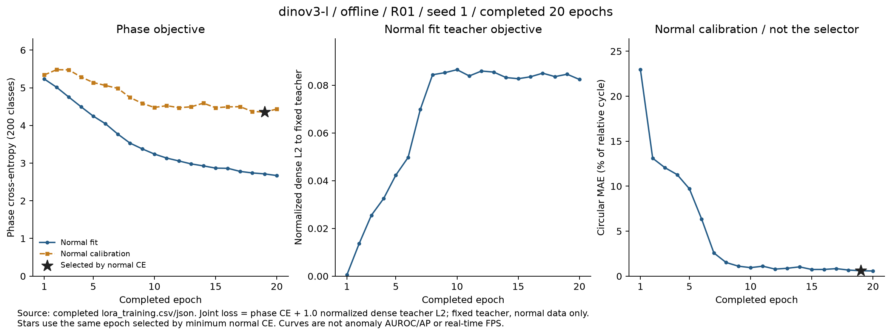

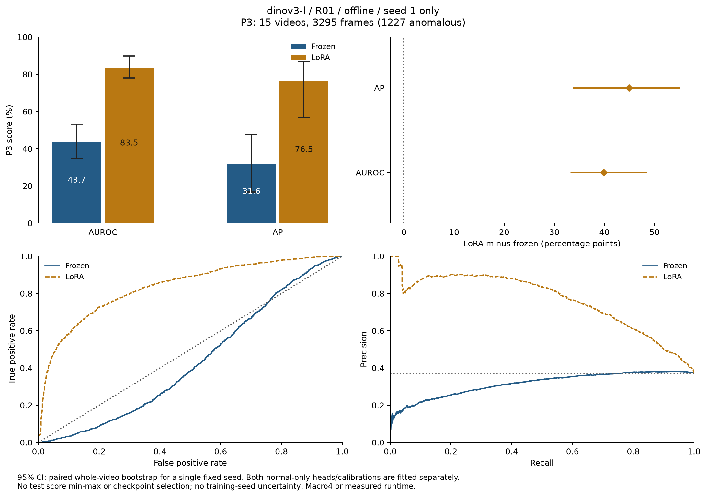

[고정 영상 03의 점수·알람 그래프](figures/stage04/dinov3-l_R01_offline_seed1_lora_sequence03.png), [학습 export와 선택 해시](../results/stage04/training/dinov3-l/offline/R01/seed1), [실제 P0–P3 CSV·보정·single-seed CI·provenance](../results/stage04/dinov3-l/offline/R01/seed1)를 제공한다. 점수 그래프의 x축은 target index이며 실측 알람 지연이 아니다.

[current/retained 집계 검증](../results/stage04/retained_matrix_audit/validation.json)은 최초 두 백본 R01 오프라인 seeds 0/1, 네 조건·정상 임계값 32개를 확인했다. 아래 캐시 정리 후에는 현재 배열 세 조건·보존 증거 한 조건을 사용했다. V-JEPA seed 2 완료 시점에는 **다섯 조건·정상 임계값 40개·현재 배열 네 조건·보존 증거 한 조건**을 검증했다. 이후 DINOv3 seed 2를 반영한 현재 검증은 **여섯 조건·정상 임계값 48개·현재 배열 다섯 조건·보존 증거 한 조건·완결 세-seed 그룹 두 개**이며 아래 두 백본 비교로 이어진다. 기존 세 조건의 `matrix_audit` 증거를 보존하며 아래 새 결과의 범위를 구분한다. 전체 Macro4는 아직 없다.

```bash
PYTHONPATH=src:scripts python scripts/export_lora_training.py \
  --run artifacts/lora/dinov3-l/offline/R01/seed1 \
  --out results/stage04/training/dinov3-l/offline/R01/seed1
PYTHONPATH=src:scripts python scripts/plot_lora_training.py \
  --results results/stage04/training/dinov3-l/offline/R01/seed1 \
  --out docs/figures/stage04/dinov3-l_R01_offline_seed1_joint_training
```

[export_lora_training.py](../scripts/export_lora_training.py)는 실제 선택 checkpoint protocol·20개 epoch·최소 정상 CE와 원본 곡선을 확인하고 CSV/JSON·선택 해시만 export한다. 모델 텐서는 업로드하지 않는다. 이상탐지 비교 그래프는 기존 `plot_lora_evaluation.py`에 실제 training/cache/local/frozen-local 경로를 전달해 생성했다.

## 대형 adapted 특징 캐시의 보존·재검증 준비

전체 기본 LoRA와 teacher=0 비교의 FP16 특징을 계속 보관하면 추정 **약 1.28 TiB**가 필요하므로, 완료 조건의 결과 재검증 증거를 보존하는 경로를 추가했다. 고정 teacher 특징·원본 영상·선택 adapter/head·PCA/메모리·metadata/target·원본 점수 CSV는 보존 대상이다.

DINOv3 R01 오프라인 seed 0의 [실제 배열 inventory·원 감사 기록](../results/cache_retention/T1/dinov3-l/offline/R01/seed0)은 fresh 기존 감사 후 **43개 영상의 86개 NPY, 6,847,939,328 bytes(6.38 GiB)** 전체를 읽어 확인했다. 모든 FP16 값의 유한성, shape/dtype/contiguous layout, 전체 파일 SHA256·NPY header SHA256·파일 identity를 저장했다. **이 준비 명령은 파일을 삭제하지 않았으며, 현재 post-removal 검증 결과는 없다.**

[실제 retained tensor 사전 검증](../results/setup/retained_lora_tensor_preflight.json)은 완료된 네 조건의 현재 선택 adapter·joint head 동등성·선택 epoch·재구성 메모리·고정 teacher 출처를 retained helper로 확인했다. 이 증거는 현재 배열 감사가 존재하는 상태의 사전 검증이다. 전체 encoder 재추출이나 캐시 제거 후 재현을 입증하지 않는다.

```bash
PYTHONPATH=src:scripts python scripts/prepare_lora_cache_retention.py \
  --model dinov3-l --mode offline --device R01 --seed 0 \
  --data-root "$IPAD_DATA_ROOT"
PYTHONPATH=src:scripts python scripts/summarize_retained_lora_matrix.py \
  --kind lora --data-root "$IPAD_DATA_ROOT"
PYTHONPATH=src:scripts python scripts/check_retained_lora_tensors.py
# 모든 장비·세 seeds가 완료된 최종 검증:
PYTHONPATH=src:scripts python scripts/summarize_retained_lora_matrix.py \
  --kind lora --require-full --data-root "$IPAD_DATA_ROOT"
PYTHONPATH=src:scripts python scripts/plot_retained_lora.py \
  --root results/stage04/retained_matrix_audit \
  --data-root "$IPAD_DATA_ROOT" --out docs/figures/stage04/retained
```

새 집계기는 현재 payload가 있으면 기존 실제 배열 감사로 검증한다. payload가 없으면 완결된 의도적 제거 journal과 정확한 성공 CI revision에 archive된 inventory·원 감사가 있어야 retained replay를 허용한다. 제거 journal이 중간 상태이거나 파일이 임의로 없어진 조건은 통과시키지 않는다. retained 경로에서는 원 payload 유한값/해시 검사가 **과거 증거**임을 표시하고 현재 metadata/target·선택 텐서·보정·GT·시간·점수·알람을 다시 검사한다.

같은 seeds 0/1/2가 모두 검증된 그룹만 평균·paired CI·그림을 만들고, 네 장비가 모두 있어야 동일 가중치 Macro4를 제공한다. teacher=0/1 경로는 두 실제 학습 조건과 일치하는 통제를 요구한다. 현 시점 teacher=0/1 완료 쌍이나 캐시 제거 후 검증은 없다. 최종 조건 전체의 GPU 평가, 안전한 실제 제거 실행·제거 후 감사와 최종 집계/그래프는 남아 있다.


## 캐시 정리 실행 코드와 중단 재개 검증

[retire_lora_cache.py](../scripts/retire_lora_cache.py)와 [cache_retirement.py](../src/ipad_jepa/cache_retirement.py)는 archive된 inventory에 열거된 완료 조건의 `patch.npy`·`global.npy`만 처리한다. 원본·teacher 특징·선택 모델·head·PCA/메모리·metadata/target·평가 CSV를 삭제 대상에 넣으면 거부한다. 같은 조건의 kernel lock과 현재 실제 GPU 비사용, live runtime controller의 측정 사이 hold를 확인한다.

준비 모드는 정확한 inventory 공개 revision의 **CPU invariants and upload guard 성공 CI**를 실제 GitHub에서 확인한다. 현재 metadata/target·선택 텐서·정상 보정·GT/P3와 86개 원 파일의 전체 SHA256·NPY header·파일 identity를 재검증하고 [삭제 없는 구체적인 계획](../results/cache_retention/T1/dinov3-l/offline/R01/seed0/retirement_plan.json)을 저장했다. 실제 삭제는 구현 코드와 이 계획이 같은 성공 CI revision에 공개된 후 별도 `--execute`로만 진행한다.

실행은 모든 남은 파일을 먼저 검증한 뒤 각 파일을 삭제 직전에 다시 전체 해시 검증한다. fsync한 journal에 unlink 의도를 먼저 저장하고, 실제 파일 부재를 확인한 뒤 완료 항목을 저장한다. 중단 후 재개는 정확한 같은 조건·source·plan, 이전 owner의 실제 종료, 완료 prefix와 다음 파일의 durable intent를 확인한다. 기록 없는 누락·완료 파일의 재생성·활성 owner·symlink 교체·다른 성공 workflow는 통과시키지 않는다. 완료된 삭제 journal과 이후 retained 과학적 감사는 별도 증거로 저장한다.

27개 신규 파일시스템/CLI 검증을 포함한 전체 **291개 로컬 테스트**를 통과했다. 실제 파일 삭제 전후의 중단 창, size/inode/mtime를 보존한 payload 변조, 누락·재생성·경로 이탈과 잘못된 CI/실시간 동시 작업을 확인했다. 이 테스트는 fixture 기반이며 실제 모델 조건의 post-removal 감사는 아직 없다.

```bash
# 기본은 삭제 없는 prepare:
PYTHONPATH=src:scripts python scripts/retire_lora_cache.py \
  --receipt results/cache_retention/T1/dinov3-l/offline/R01/seed0/payload_inventory.json \
  --publication-revision 8e8abbb323ad5e24eb8fec1ec9c5c71a6533f69a \
  --publication-ci-id 36984566442 --data-root "$IPAD_DATA_ROOT"
# 위 계획/구현을 공개한 정확한 성공 revision과 CI ID를 지정한 뒤 실행:
PYTHONPATH=src:scripts python scripts/retire_lora_cache.py \
  --receipt results/cache_retention/T1/dinov3-l/offline/R01/seed0/payload_inventory.json \
  --publication-revision 8e8abbb323ad5e24eb8fec1ec9c5c71a6533f69a \
  --publication-ci-id 36984566442 \
  --implementation-revision "$RETIRE_IMPLEMENTATION_REV" \
  --implementation-ci-id "$RETIRE_IMPLEMENTATION_CI" \
  --data-root "$IPAD_DATA_ROOT" --execute
# 실제 중단 journal이 있을 때만 같은 인자에 --resume 추가.
```

## 첫 실제 캐시 정리와 사후 재검증

사용자가 승인한 조건은 **후속 실험에서 사용하지 않는 재생성 가능한 특징 배열만 삭제**하는 것이다. [의존성·재생성 입력 검증](../results/cache_retention/T1/dinov3-l/offline/R01/seed0/dependency_regeneration_check.json)은 해당 조건의 원본 43개 영상 전체 해시, 기본 가중치·upstream revision·선택 adapter·고정 소스를 실제 확인하고 CPU 런타임 adapter 바인딩을 통과했다. 실시간 측정은 원본과 선택 모델/head/bank를 읽고, teacher=0 학습은 별도 고정 teacher 캐시를 읽는다. 진단은 고정 백본과 held-out 정상 원본을 사용하며, LoRA·teacher 집계는 current/retained 명령으로 검증한다. GPU로 전체 특징을 재생성하거나 bitwise 일치를 검증한 것은 아니다. 필요하면 같은 원본·선택 모델·고정 소스로 별도의 새 캐시 경로에 재추출할 수 있다.

실행은 inventory revision `8e8abbb323ad5e24eb8fec1ec9c5c71a6533f69a`의 성공 CI와 구현/계획 revision `533a08da7819d75025852d00d0dc0f7296f2a25f`의 [성공 CI](https://github.com/PigeonLabs/KNU_Capstone1_VAD_JEPA/actions/runs/36989545978)를 실제 확인했다. 최신 구현 CI는 외부 `PYTHONPATH` 없이 **291개 테스트와 전체 업로드 검사**를 통과했다.

| DINOv3-L LoRA / offline / R01 / seed 0 | 정리 전 archive | 정리 후 실제 확인 |
|---|---:|---:|
| patch/global 특징 배열 | 86개 / 6,847,939,328 bytes (6.38 GiB) | 0개 / 0 bytes |
| metadata JSON | 43개 | 43개, 원 해시 일치 |
| target NPY | 43개 | 43개, 원 해시 일치 |

[실제 제거 journal](../results/cache_retention/T1/dinov3-l/offline/R01/seed0/retirement.json), [사후 독립 감사](../results/cache_retention/T1/dinov3-l/offline/R01/seed0/post_retirement_audit.json), [실행 결과](../results/cache_retention/T1/dinov3-l/offline/R01/seed0/retirement_execution_check.json)를 제공한다. 원본·teacher·선택 adapter·joint head·PCA/메모리·평가 CSV를 보존했고, 현재 텐서·metadata/target·정상 임계값·GT·위상/시간/점수/알람/지표를 재검증했다. 전체 네 LoRA 조건의 정상 임계값 32개를 다시 검증했으며, 정리한 한 조건은 archived/current replay를 사용했다. 특징 배열의 원 해시·유한값 검사는 정리 전의 **과거 증거**이고 encoder 재추출·PCA 재학습·GPU 검색 재실행은 이 사후 검증 범위에 포함하지 않는다.

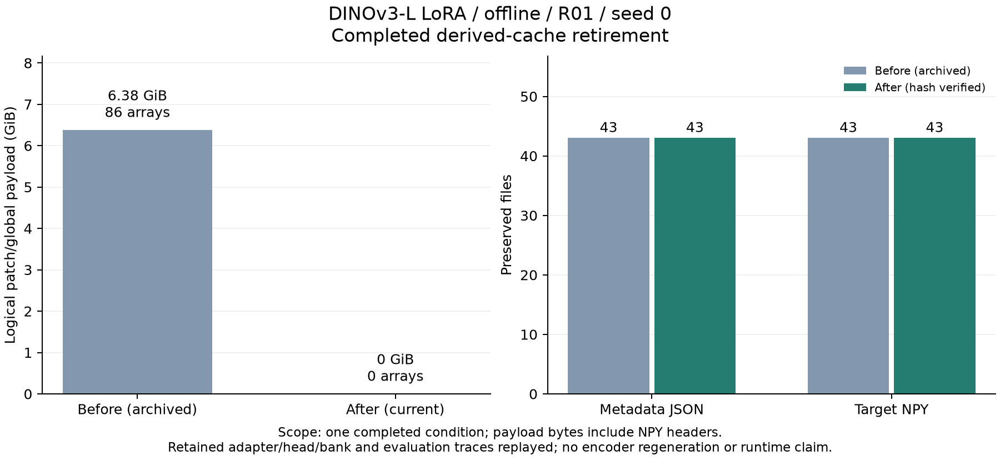

[그래프 코드](../scripts/plot_cache_retirement.py)는 현재 파일 부재·원 metadata/target 해시·완료 journal·사후 감사 일치를 재확인하고 PNG/SVG와 [수치/출처 receipt](figures/stage04/retained/dinov3_l_offline_R01_seed0_cache_retirement.json)를 생성한다. 단일 완료 조건의 논리적 파일 용량이며 전체 디스크 절약량이나 탐지 성능 개선을 뜻하지 않는다.

### 캐시 정리 후 runtime 구성요소의 CPU 검증

실제로 정리된 **DINOv3-L / R01 오프라인 / seed 0**에서 파생 특징 배열 **86개가 없는 상태**로 기존 runtime `readiness`와 `selected_runtime_adapter`를 실행했다. 보존된 **43개 영상 metadata/target**, 정상 CE로 선택된 **epoch 18**의 adapter **16개 CPU 텐서**, joint head **4개 CPU 텐서**를 확인했다. 원 선택 checkpoint와 head가 일치하고 유한하며 PCA 평균 `1024`, 투영 `256×1024`, 프로토타입 `16×128×256`과 온도·주기 값이 보존 보정과 일치했다. 실제 CPU 검사 종료 코드 0을 확인했고 CUDA context는 초기화하지 않았다.

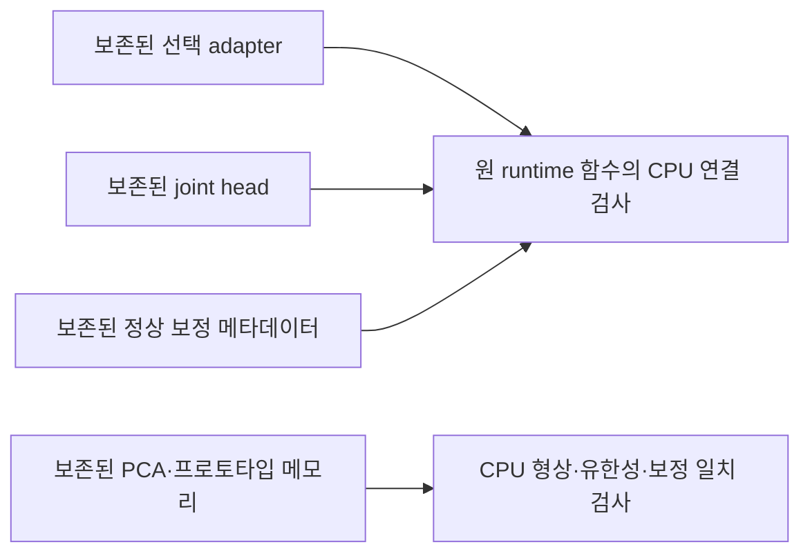
```mermaid
flowchart LR
    A[보존된 선택 adapter] --> V[원 runtime 함수의 CPU 연결 검사]
    H[보존된 joint head] --> V
    N[보존된 정상 보정 메타데이터] --> V
    B[보존된 PCA·프로토타입 메모리] --> C[CPU 형상·유한성·보정 일치 검사]
```

[검사 코드](../scripts/check_retired_runtime_inputs.py), [실제 CPU 결과·입력 hash](../results/setup/retired_R01_runtime_inputs_CPU_check.json), [게시 검증](../results/setup/retired_runtime_CPU_publication_check.json)을 제공한다. 이 결과는 runtime 입력 보존의 확인이다. GPU encoder/search·재생 parity·FPS/지연이나 실시간 성능을 측정한 결과가 아니며, 추가 캐시 정리의 승인이나 삭제 적격성을 입증하지 않는다. 원본 JPEG와 base 가중치의 전체 content hash 또는 특징 재생성을 이 검사에서 다시 수행하지 않았다. 실제 runtime 전체 **6/240 실행**, 주 LoRA **17/48조건**의 완료 수를 유지한다.

```bash
PYTHONPATH=src:scripts python scripts/check_retired_runtime_inputs.py \
  --model dinov3-l --mode offline --device R01 --seed 0 \
  --out results/setup/retired_R01_runtime_inputs_CPU_check_rerun.json
```

## 중단된 주 LoRA 조건 이어가기

[continue_lora_condition.py](../scripts/continue_lora_condition.py)는 기본 teacher=1의 한 조건을 기존 **20 epoch 정상-only 프로토콜**로 이어간다. 기존 원 trainer가 checkpoint의 protocol·source·optimizer/RNG를 확인하고, 전체 학습 완료 후 정상 검증 CE로 선택된 모델의 fit/calibration/test 특징, 새 PCA/메모리·정상 보정, 전체 실제 테스트 평가, 독립 조건 감사를 순차 수행한다. 한 조건의 완료가 전체 48조건의 완료를 뜻하지 않는다.

```bash
PYTHONPATH=src python scripts/continue_lora_condition.py \
  --data-root "$IPAD_DATA_ROOT" --model vjepa21-l \
  --mode offline --device R01 --seed 2 --resume
```

실제 사용 시 CUDA 학습 환경의 Python으로 실행한다. 단일 accuracy lock과 live runtime controller의 측정 사이 hold, GPU 비사용을 확인한 뒤 child를 시작하고 실제 PID/boot/start identity·종료 코드·고정 source 해시를 기록한다. shortened epoch·pilot·다른 teacher/seed·checkpoint 없는 재개·활성 owner의 중복 실행은 거부한다. 8개 신규 continuation 검증을 포함한 전체 **299개 로컬 테스트**를 외부 `PYTHONPATH` 없이 통과했다. 실제 GPU 재개와 최종 정확도는 별도 완료 증거로 구분한다.

V-JEPA 2.1-L R01 오프라인 seed 2는 기존 1 epoch·156 updates의 체크포인트에서 실제 재개했다. [시작 시점의 host owner/child·protocol/source 확인](../results/setup/lora_seed2_continuation_start_check.json)은 GPU 학습 child와 실시간 실행기의 hold를 확인한 snapshot이다. 시작 snapshot과 아래 실제 학습·평가 완료 근거를 구분한다.

## V-JEPA 2.1-L R01 오프라인 seed 2의 완료된 학습

기존 checkpoint에서 재개한 원 trainer가 **20 epoch·3,120 updates**를 완료하고 실제 종료 코드 0을 반환했다. 정상 fit 23개 영상의 1,248 clips, 정상 calibration 5개 영상의 1,087 clips, teacher weight 1·accumulation 8과 원 학습 코드를 유지했다. 실제 선택 checkpoint의 protocol과 아래 20개 epoch 곡선을 검증했으며, 최소 정상 calibration CE로 epoch **18**을 선택했다.

| 선택 epoch | 정상 calibration CE | 같은 epoch의 원형 MAE |
|---:|---:|---:|
| 18 | 5.250174 | 1.5681% |

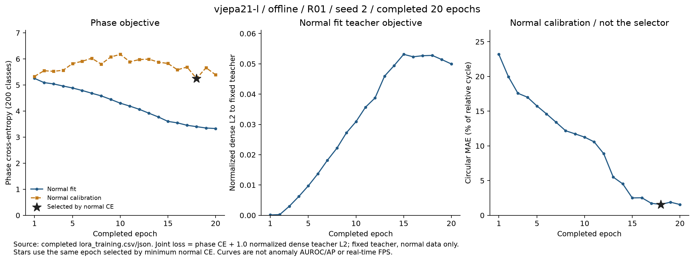

[학습 CSV·JSON·선택 checkpoint 해시·export 검증](../results/stage04/training/vjepa21-l/offline/R01/seed2)을 제공한다. 그래프의 별표는 CE와 MAE 패널에서 같은 선택 epoch를 표시한다. MAE 최솟값으로 모델을 다시 선택하지 않았다. 모델 파일은 업로드하지 않는다.

위 곡선은 **정상 학습**의 결과이며 AUROC/AP나 실시간 FPS를 나타내지 않는다. [특징 재추출 당시의 학습 단계 확인·소스/그래프 해시](../results/setup/lora_vjepa21_seed2_training_publication_check.json)는 학습 완료를 검증한 snapshot이다. 이후 전체 파이프라인도 실제 완료했으며 그 정확도는 아래에서 보고한다. 재개 학습이 중단 없는 GPU 학습과 bitwise 같다는 검증은 아직 없다.

## V-JEPA R01 오프라인 첫 세-seed LoRA 비교

Seed 2는 선택 epoch 18의 실제 fit/calibration/test 특징을 재추출하고, 새 PCA·프로토타입·정상 보정을 구성해 **15개 실제 테스트 영상**을 평가했다. 공통 GT target 3,295개 중 이상 target은 1,227개다. 원 trainer·재추출·전체 평가 child의 종료 코드 0, 선택 adapter/joint head·캐시 출처·메모리·정상 임계값·GT·시간/점수/알람·지표의 독립 검증과 실제 부모 프로세스의 종료를 확인했다.

Seed 2 P3 AUROC/AP는 **41.13/31.85%**, 같은 seed 고정 백본 대비 **+2.21/+2.61pp**다. 1,000회 paired 영상 bootstrap의 95% CI는 각각 **−4.04..+8.51pp, −0.79..+7.51pp**로 0을 포함한다.

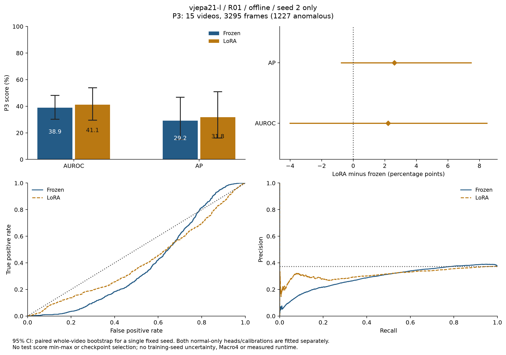

[고정 영상 03의 점수/알람 궤적](figures/stage04/vjepa21-l_R01_offline_seed2_lora_sequence03.png), [P0–P3 전체 CSV·정상 보정·개별 paired CI·provenance](../results/stage04/vjepa21-l/offline/R01/seed2), [원 파이프라인 완료 증거](../results/stage04/condition_pipeline_checks/vjepa21-l/offline/R01/seed2/pipeline_completion.json)를 공개한다. 궤적의 x축은 target index이며 실측 알람 지연이 아니다.

동일 조건의 **seeds 0/1/2를 모두 검증**한 첫 LoRA 그룹은 다음과 같다. 각 seed의 지표를 계산한 뒤 평균하고, 두 처리·세 seeds에 같은 원본 영상 재표집을 적용한 1,000회 paired bootstrap의 percentile 95% CI를 구했다.

| 처리 | AUROC 평균 (%) | AP 평균 (%) |
|---|---:|---:|
| 고정 백본 P3 | 37.58 | 28.83 |
| LoRA P0 | 35.01 | 29.22 |
| LoRA P3 | 37.98 | 29.76 |

LoRA P3−고정 P3의 차이는 **AUROC +0.40pp [−2.11, +2.92], AP +0.93pp [−0.37, +2.79]**다. 두 CI 모두 0을 포함해 이 장비·모드에서 개선이 확인되지 않았다. seed 2의 정상 위상 MAE가 작다는 사실만으로 이상탐지 성능 개선을 주장하지 않는다.

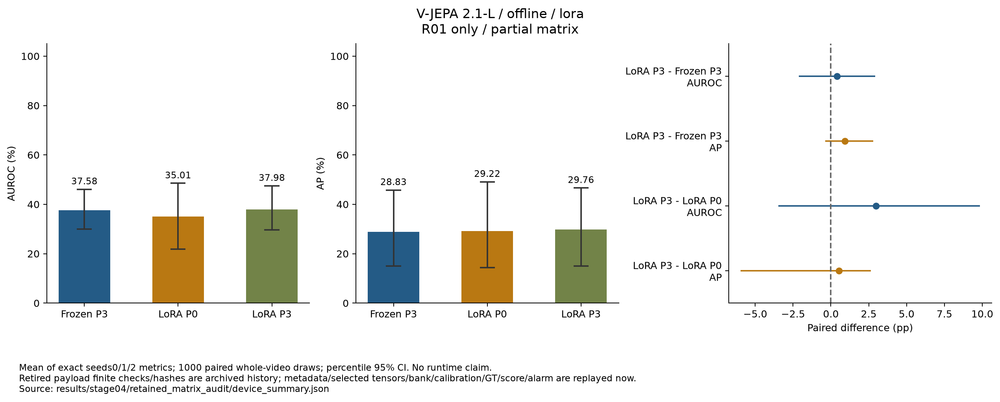

[현재 여섯 조건·48개 정상 임계값 검증](../results/stage04/retained_matrix_audit/validation.json), [모든 P0–P3 평균·CI·paired 차이](../results/stage04/retained_matrix_audit/device_summary.json), [새 조건·그룹의 공개 확인](../results/setup/lora_vjepa21_seed2_evaluation_publication_check.json)을 제공한다. 이 V-JEPA 완료 snapshot에서는 **5/48조건·1/16그룹**이었다. 이후 DINOv3 seed 2를 포함한 현재 상태는 **6/48조건·2/16그룹**이며 아래 두 백본 비교를 추가했다. 이 CI는 고정된 세 seeds의 영상 재표집이며 seed 자체를 재표집하지 않았다. 다른 장비·온라인 LoRA·전체 Macro4·실시간 비교는 남아 있다.


## DINOv3 R01 오프라인 seed 2의 완료된 정상 학습

기본 teacher weight 1·accumulation 8·BF16의 원 정상-only trainer로 **20 epoch·3,120 updates**를 완료했다. 정상 fit 23개 영상의 1,248 clips와 calibration 5개 영상의 1,087 clips를 사용했다. trainer child의 종료 코드 0과 완료 metadata·20개 epoch CSV·선택 checkpoint protocol을 확인했다. 최소 정상 calibration CE로 epoch **11**을 선택했다.

| 선택 epoch | 정상 calibration CE | 같은 epoch의 원형 MAE |
|---:|---:|---:|
| 11 | 4.336612 | 1.0314% |

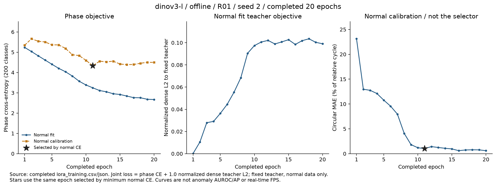

[실제 학습 CSV·JSON·선택 checkpoint 해시·export 검증](../results/stage04/training/dinov3-l/offline/R01/seed2)을 제공한다. 그래프의 두 별표는 같은 선택 epoch를 표시하며 MAE 최솟값으로 재선택하지 않았다. 모델 텐서는 업로드하지 않는다. **정상 학습 곡선은 AUROC/AP나 FPS 결과가 아니다.** [학습 단계의 소스·검증·선택 특징 재추출 시작 snapshot](../results/setup/lora_dinov3_seed2_training_publication_check.json)과 이후 전체 평가 완료 증거를 구분한다. 이 학습 단계 snapshot에서 독립 검증된 정확도는 여전히 5/48조건이며 DINOv3의 세-seed 그룹은 아직 없다.

선택 epoch의 fit/calibration/test 특징 재추출·새 PCA/메모리·정상 보정·전체 실제 테스트 평가·독립 감사를 기존 파이프라인에서 이어간다. epoch·loss·데이터 분할·점수 부호·정상 임계값을 테스트 결과에 맞춰 바꾸지 않는다.

### 완결된 LoRA 백본 쌍의 비교 그래프

[plot_lora_backbone_comparison.py](../scripts/plot_lora_backbone_comparison.py)는 같은 장비·모드에서 **DINOv3와 V-JEPA 각각 seeds 0/1/2가 모두 검증된 그룹**만 사용한다. frozen P3·LoRA P0·LoRA P3의 평균·CI와 V-JEPA−DINOv3 paired 차이를 실제 CSV에서 다시 계산한다. current/retained 조건 감사도 새로 수행하며 정리된 배열의 원 해시·유한성 검사는 과거 증거임을 유지한다.

부분 seed·서로 다른 장비/모드·GT/target 불일치·잘못된 paired 방향·틀린 요약 수치는 거부한다. 네 장비가 모두 있어야 Macro4를 제공하고, seed 지표의 평균과 영상 재표집을 사용한다. seed 자체나 pooled seed 점수는 재표집하지 않는다. 새 9개 비교 검사를 포함한 전체 CPU 테스트 **364개**를 통과했다. 이 CPU 검증 자체는 실제 완결된 백본 쌍의 결과를 뜻하지 않는다. 학습 단계 snapshot의 한 완결 그룹만으로 비교 그림을 만드는 실제 CLI 요청은 거부했다. 이후 실제 DINOv3 전체 평가가 완료돼 아래 완결된 쌍의 그래프를 생성하고 원 수치를 재검산했다.

```bash
# 두 백본의 같은 조건 세 seeds가 모두 실제 평가·검증된 후:
PYTHONPATH=src:scripts python scripts/summarize_retained_lora_matrix.py \
  --kind lora --data-root "$IPAD_DATA_ROOT"
PYTHONPATH=src:scripts python scripts/plot_lora_backbone_comparison.py \
  --root results/stage04/retained_matrix_audit \
  --data-root "$IPAD_DATA_ROOT" --out docs/figures/stage04/retained
```


## DINOv3 R01 오프라인 seed 2의 완료된 전체 평가

선택 epoch 11의 실제 특징을 **43개 fit/calibration/test 영상**에서 재추출했다. 선택 adapter/joint head를 유지하고 PCA·위상별 프로토타입·온도·정상 median/MAD/q99를 새로 구성해 **15개 실제 테스트 영상**을 평가했다. 원 trainer·재추출·메모리/전체 평가 child의 종료 코드 0과 부모 프로세스 종료, 독립 조건 감사 통과를 확인했다. 공통 GT target은 3,295개이며 이상 target은 1,227개다.

| seed 2 처리 | AUROC (%) | AP (%) |
|---|---:|---:|
| LoRA P0 | 66.55 | 48.03 |
| LoRA P1 | 63.03 | 49.38 |
| LoRA P2 | 65.22 | 51.27 |
| LoRA P3 | 77.28 | 67.29 |

같은 seed 고정 P3 대비 차이는 **AUROC +28.70pp [20.75, 35.94], AP +33.18pp [18.26, 43.57]**다. 단일 seed의 1,000회 paired 원본 영상 bootstrap CI이며 학습 seed 불확실성이나 Macro4를 뜻하지 않는다. P0는 같은 seed의 고정 P0 대비 **−13.69/−10.86pp**로 두 CI가 음수였다. 이 정상 학습이 모든 점수 구성에 일관된 개선을 준 결과는 아니다.

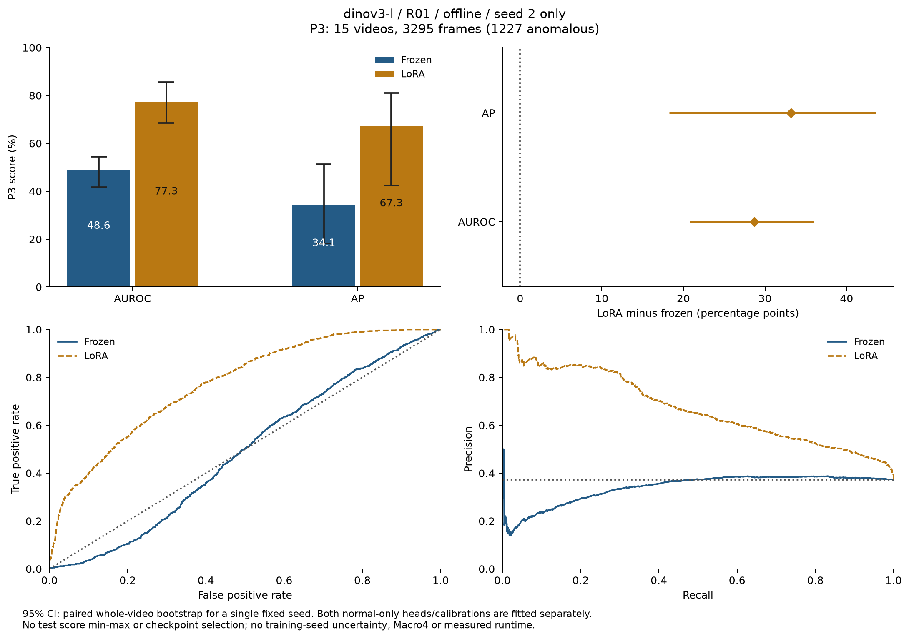

[고정 영상 03의 점수/알람 궤적](figures/stage04/dinov3-l_R01_offline_seed2_lora_sequence03.png), [P0–P3 전체 CSV·보정·single-seed CI·provenance](../results/stage04/dinov3-l/offline/R01/seed2), [원 파이프라인 완료 증거](../results/stage04/condition_pipeline_checks/dinov3-l/offline/R01/seed2/pipeline_completion.json)를 제공한다. 궤적의 target index는 실제 알람 wall-clock 지연이 아니다. 실제 재생 속도와 이벤트 지연은 Stage 05에서 별도로 측정한다.

## R01 오프라인 첫 두 백본 세-seed LoRA 비교

두 백본 각각 **seeds 0/1/2를 모두 검증**했다. 같은 15개 영상·3,295개 GT target에서 각 seed의 지표를 먼저 계산해 평균했다. 세 seeds와 두 백본/처리에 동일한 원본 영상 재표집을 적용한 1,000회 paired bootstrap의 percentile 95% CI이며 seed 자체는 재표집하지 않았다.

| 백본 / 처리 | AUROC 평균 (%) | AP 평균 (%) |
|---|---:|---:|
| DINOv3 고정 P3 | 47.01 | 33.21 |
| DINOv3 LoRA P0 | 71.36 | 54.16 |
| DINOv3 LoRA P3 | 80.21 | 71.53 |
| V-JEPA 고정 P3 | 37.58 | 28.83 |
| V-JEPA LoRA P0 | 35.01 | 29.22 |
| V-JEPA LoRA P3 | 37.98 | 29.76 |

| paired 차이 | AUROC 차이 / 95% CI (pp) | AP 차이 / 95% CI (pp) |
|---|---:|---:|
| DINOv3 LoRA P3−고정 P3 | +33.20 [28.24, 39.72] | +38.32 [26.28, 47.47] |
| V-JEPA LoRA P3−고정 P3 | +0.40 [−2.11, 2.92] | +0.93 [−0.37, 2.79] |
| LoRA P3 V-JEPA−DINOv3 | −42.24 [−51.30, −33.33] | −41.76 [−50.26, −29.44] |

이 장비·모드에서 DINOv3 LoRA P3 개선과 두 LoRA 백본의 차이가 확인됐다. V-JEPA의 고정 P3 대비 개선 CI는 두 지표 모두 0을 포함했다. 별도 정상-only joint head·adapted encoder·재구성 메모리/보정까지 포함한 두 프로토콜의 비교다. 특정 encoder나 teacher 손실 하나의 단독 원인, 다른 장비·온라인의 우열, 전체 LoRA Macro4를 입증하지 않는다. teacher 0/1 통제 결과도 아직 없다.

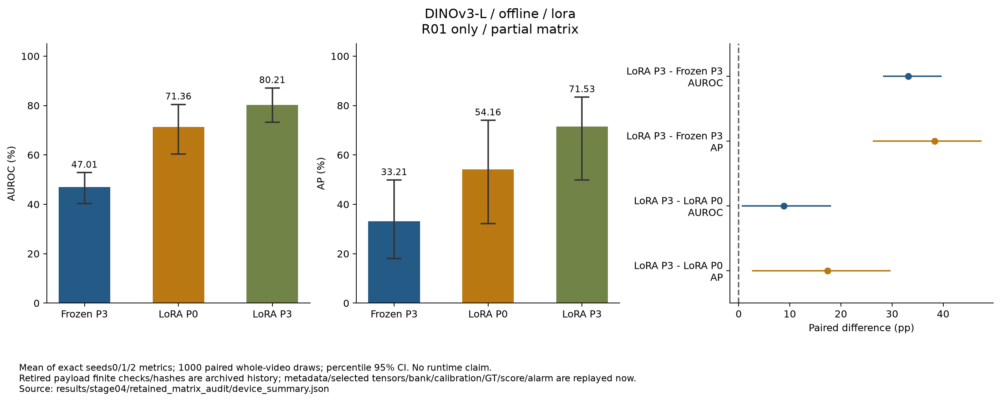

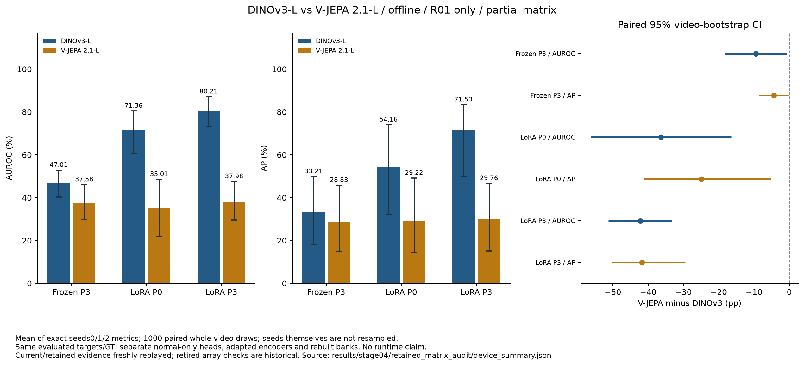

[여섯 조건·48개 정상 임계값·두 세-seed 그룹 감사](../results/stage04/retained_matrix_audit/validation.json), [모든 F/L P0–P3 평균·CI와 18개 paired 비교](../results/stage04/retained_matrix_audit/device_summary.json), [fresh current/retained 그룹 그림 근거](../results/stage04/retained_matrix_audit/figure_sources.json), [실제 CSV에서 재검산한 백본 그림 수치·출처](../results/stage04/retained_matrix_audit/backbone_figure_sources.json)를 제공한다. 원 DINOv3 seed 0 배열은 의도적 정리 전 archive와 현재 보존 자료로 재검증했고 나머지 다섯 조건은 현재 실제 adapted 배열 증거를 사용했다. **전체 6/48조건·2/16그룹**이며 전체 Macro4는 아직 없다.

다음 주 LoRA 조건은 **DINOv3-L 오프라인 R02 seed 0**이다. 기존 canonical 출력이 없는 새 조건과 전체 adapted 캐시+64 GiB 여유 공간을 확인하고 원래 20 epoch·teacher 1 프로토콜로 시작했다. [이번 완료 조건·그룹·그래프와 다음 실제 child 확인](../results/setup/lora_dinov3_seed2_evaluation_publication_check.json)을 제공한다. R02/12·13·14의 라벨 정렬은 계속 미확정이며 기존 공통 제외 mask와 오프셋 민감도 규칙을 유지한다.


## DINOv3 R02 오프라인 seed 0의 완료된 정상 학습

원래 teacher weight 1·accumulation 8·BF16 프로토콜로 **20 epoch·7,620 optimizer updates**를 완료했다. epoch마다 정상 fit **3,042 clips**, 정상 calibration **2,864 clips**를 사용했다. 최소 정상 calibration CE에 따라 epoch **13**을 선택했으며, 이상 라벨은 선택에 사용하지 않았다. 완료 metadata·20개 epoch CSV·선택 checkpoint protocol과 학습 child 종료 코드 0을 확인했다.

| 선택 epoch | 정상 calibration CE | 같은 epoch의 원형 MAE |
|---:|---:|---:|
| 13 | 3.321761 | 1.9929% |

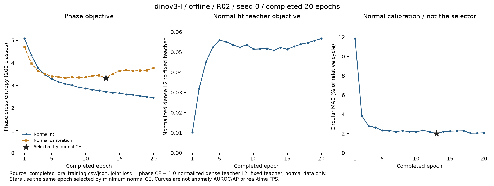

[학습 CSV·JSON·선택 checkpoint 해시·export 검증](../results/stage04/training/dinov3-l/offline/R02/seed0)을 제공한다. 두 별표는 같은 CE 선택 epoch이며 MAE로 재선택하지 않았다. teacher 곡선은 고정 teacher와의 정상 fit 특징 오차다. 이 곡선은 이상탐지 AUROC/AP나 실시간 FPS 결과가 아니다. 모델 텐서는 업로드하지 않는다.

사용자 요청에 따라 20 epoch 이후 작업을 일시정지했고, 명시적인 재개 요청을 받은 뒤 **완료 모델을 유지한 채** 선택 특징 재추출·새 PCA/프로토타입 메모리·정상 보정·모든 실제 테스트 영상 평가를 이어간다. 원 실행 보호 조건을 유지하기 위해 종료된 실시간 제어기도 원래 resume 기능으로 복구해 측정 대기 상태로 두었다. [완료 학습·재개 단계 검증 snapshot](../results/setup/lora_dinov3_R02_seed0_training_publication_check.json)을 제공한다. 이 학습 단계 snapshot에서 독립 검증된 LoRA 정확도는 **6/48조건**이며, R02 정확도·세-seed 평균·Macro4는 아직 없다. R02/12·13·14의 라벨 정렬은 계속 미확정이므로 기존 공통 제외 mask와 오프셋 민감도 규칙을 유지한다.

```bash
PYTHONPATH=src:scripts python scripts/export_lora_training.py \
  --run artifacts/lora/dinov3-l/offline/R02/seed0 \
  --out results/stage04/training/dinov3-l/offline/R02/seed0
PYTHONPATH=src:scripts python scripts/plot_lora_training.py \
  --results results/stage04/training/dinov3-l/offline/R02/seed0 \
  --out docs/figures/stage04/dinov3-l_R02_offline_seed0_joint_training
```


## DINOv3 R02 오프라인 seed 0의 완료된 전체 평가

20 epoch 정상-only 학습에서 선택한 **epoch 13**의 adapter/joint head를 유지하고 **41개 영상(fit 21·calibration 5·test 15)**의 특징을 실제 재추출했다. 별도 진단용 정상 영상 4개는 이번 주 평가 추출 대상에 포함하지 않는다. PCA·16개 위상 bin의 프로토타입 메모리·온도·정상 median/MAD/q99를 새로 구성했다. 재추출·전체 평가 child와 원 파이프라인의 실제 종료 코드 **0**, 선택 tensor와 새 bank/보정/전체 GT·점수·알람의 독립 감사 통과를 확인했다.

같은 seed의 고정 백본과 **15개 테스트 영상·9,210개 유효 GT target(이상 2,949개)**을 비교했다. R02/12·13·14의 정확한 라벨 정렬은 계속 미확정이며 기존 18프레임 제외와 ±1 오프셋 민감도 규칙을 유지했다. 점수 부호·선택 epoch·정상 임계값을 테스트에 맞춰 바꾸지 않았다.

| 처리 | AUROC (%) | AP (%) |
|---|---:|---:|
| 고정 P0 | 73.02 | 62.34 |
| LoRA P0 | 71.44 | 57.91 |
| 고정 P1 | 70.82 | 57.35 |
| LoRA P1 | 72.43 | 57.71 |
| 고정 P2 | 69.21 | 57.44 |
| LoRA P2 | 73.41 | 61.26 |
| 고정 P3 | 76.91 | 63.28 |
| LoRA P3 | **87.06** | **76.85** |

| 같은 seed LoRA−고정 차이 | AUROC / 95% CI (pp) | AP / 95% CI (pp) |
|---|---:|---:|
| P0 | −1.59 [−4.72, 0.82] | −4.43 [−9.35, 0.19] |
| P1 | +1.61 [−0.72, 3.90] | +0.35 [−2.60, 2.94] |
| P2 | +4.20 [−1.02, 10.06] | +3.82 [−2.24, 10.46] |
| P3 | **+10.14 [5.06, 17.28]** | **+13.58 [7.37, 21.22]** |

1,000회 paired 원본 영상 bootstrap의 percentile 95% CI이며 seed는 재표집하지 않았다. 퇴화 resample은 0개다. 주 P3 개선의 두 CI는 양수였고, P0–P2 차이는 모두 0을 포함했다. P0의 점 추정치는 낮아졌으므로 모든 점수 구성의 일관된 개선을 뜻하지 않는다. 이 결과는 단일 장비·단일 seed의 전체 LoRA/head/메모리/보정 프로토콜 비교이며 R02 세-seed 평균·백본 간 LoRA 비교·teacher 손실만의 효과·Macro4·실시간 FPS를 입증하지 않는다.

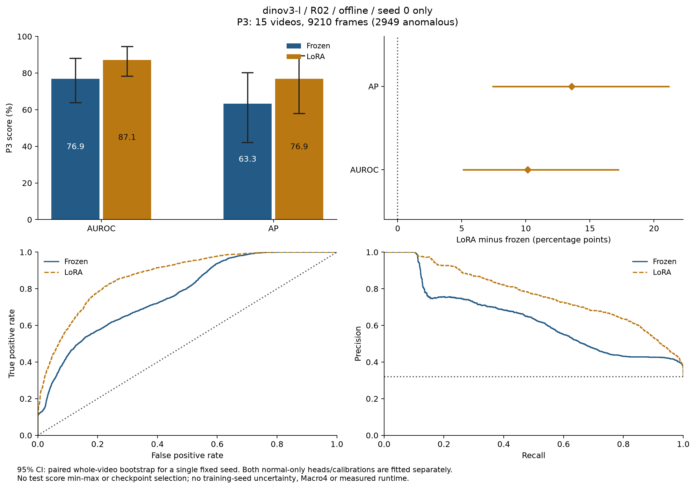

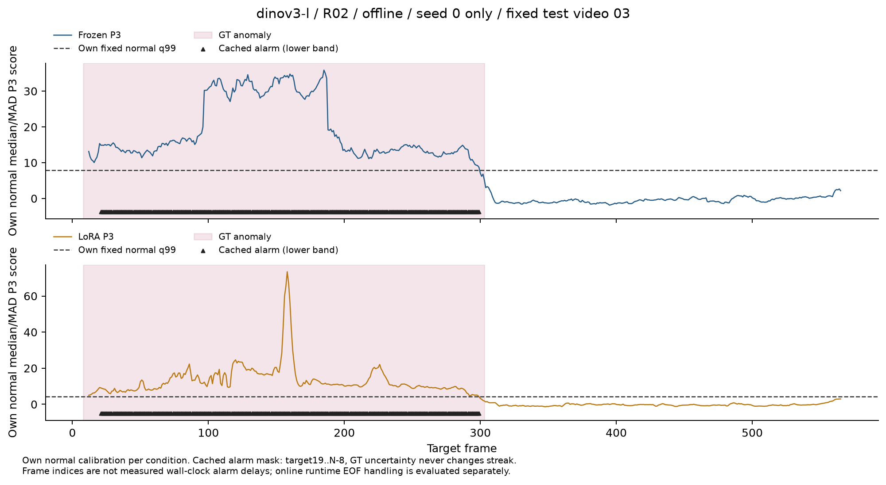

궤적은 조건별 정상 median/MAD 보정과 자체 고정 q99를 사용하며 target index는 wall-clock 탐지 지연이 아니다. 두 그림의 PNG/SVG를 모두 제공한다. [P0–P3 전체 CSV·정상 보정·single-seed CI·provenance](../results/stage04/dinov3-l/offline/R02/seed0), [독립 조건 감사](../results/stage04/condition_pipeline_checks/T1/dinov3-l/offline/R02/seed0/condition_audit.json), [원 파이프라인 완료 증거](../results/stage04/condition_pipeline_checks/dinov3-l/offline/R02/seed0/pipeline_completion.json), [이번 완료·그래프·다음 실행 확인](../results/setup/lora_dinov3_R02_seed0_evaluation_publication_check.json)을 제공한다. 모델·원본 영상·특징 배열은 업로드하지 않는다.

주 LoRA 정확도는 **7/48조건**, 완결된 세-seed 그룹은 여전히 **R01 오프라인 두 백본의 2/16그룹**이다. 위 R01의 기존 혼합 current/retained 그룹 요약은 해당 여섯 조건의 공개 snapshot으로 유지하며, 새 R02 단일 seed를 세-seed 평균에 섞지 않는다. 다음 조건 **DINOv3-L 오프라인 R02 seed 1**을 원래 20 epoch·teacher weight 1·accumulation 8·BF16 설정으로 시작했다. 실시간 측정은 이 GPU 정확도 작업과 겹치지 않도록 대기 상태를 유지한다.

```bash
PYTHONPATH=src:scripts python scripts/plot_lora_evaluation.py \
  --results results/stage04/dinov3-l/offline/R02/seed0 \
  --frozen-results results/stage02/dinov3-l/offline/R02/seed0 \
  --training artifacts/lora/dinov3-l/offline/R02/seed0 \
  --cache artifacts/features_lora/dinov3-l/offline/R02/seed0 \
  --local artifacts/runs_lora/dinov3-l/offline/R02/seed0 \
  --frozen-local artifacts/runs/dinov3-l/offline/R02/seed0 \
  --data-root "$IPAD_DATA_ROOT" --out docs/figures/stage04
```

## DINOv3 R02 오프라인 seed 1의 완료된 정상 학습

원 정상-only trainer가 **20 epoch·7,620 optimizer updates**를 완료하고 종료 코드 **0**을 반환했다. 정상 fit 21개 영상의 3,042 clips와 정상 calibration 5개 영상의 2,864 clips를 사용했다. Teacher weight 1·accumulation 8·BF16과 최소 정상 calibration CE 선택 규칙을 유지했다.

| 선택 epoch | 정상 calibration CE | 같은 epoch의 원형 MAE |
|---:|---:|---:|
| 7 | 3.320097 | 2.2235% |

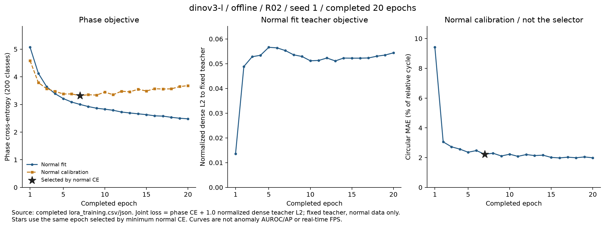

별표는 CE와 MAE 패널에서 같은 CE 선택 epoch를 표시한다. MAE 최솟값으로 모델을 다시 선택하지 않았다. [학습 CSV·JSON·선택 checkpoint 해시·export 검증](../results/stage04/training/dinov3-l/offline/R02/seed1)과 PNG/SVG를 공개한다. [학습 완료·게시 검증 기록](../results/setup/lora_dinov3_R02_seed1_training_publication_check.json)을 함께 제공한다. 모델 파일·원본 영상·특징 배열은 업로드하지 않는다.

학습은 epoch 2·762 updates의 전체 optimizer/RNG checkpoint에서 원 코드의 `--resume` 검증을 거쳐 이어졌다. 기존 프로세스 종료 원인은 확인하지 못했으며, GPU 연속 실행과의 수치적 동일성은 아직 검증하지 않았다. 정상 학습 완료를 이상탐지 정확도 완료로 계산하지 않는다. 이 게시 시점의 공개 주 LoRA 평가는 **7/48조건**, 완결된 세-seed 그룹은 **2/16그룹**이다. 원 파이프라인의 선택 특징 재추출·새 PCA/메모리·정상 보정·15개 전체 테스트·독립 감사를 별도로 검증한다.

```bash
PYTHONPATH=src:scripts python scripts/export_lora_training.py \
  --run artifacts/lora/dinov3-l/offline/R02/seed1 \
  --out results/stage04/training/dinov3-l/offline/R02/seed1
PYTHONPATH=src:scripts python scripts/plot_lora_training.py \
  --results results/stage04/training/dinov3-l/offline/R02/seed1 \
  --out docs/figures/stage04/dinov3-l_R02_offline_seed1_joint_training
```

## DINOv3 R02 오프라인 seed 1의 완료된 전체 평가

정상 calibration CE로 선택한 **epoch 7**의 adapter/joint head를 유지해 **41개 영상(fit 21·calibration 5·test 15)**의 특징을 재추출했다. 별도 진단용 정상 영상 4개는 주 평가 추출 대상에 포함하지 않았다. 새 PCA·16개 위상 bin의 프로토타입 메모리·온도·정상 median/MAD/q99를 구성했다. 원 학습·재추출·전체 평가 child와 원 파이프라인의 실제 종료 코드 **0**, 선택 tensor·새 bank/보정·GT·시간/점수/알람의 독립 감사 통과를 확인했다.

같은 seed의 고정 백본과 **15개 실제 테스트 영상·9,210개 유효 GT target(이상 2,949개)**을 비교했다. R02/12·13·14의 정확한 라벨 정렬은 계속 미확정이며 기존 18프레임 제외와 ±1 오프셋 민감도 규칙을 유지했다. 테스트에 맞춰 점수 부호·선택 epoch·정상 임계값을 바꾸지 않았다.

| 점수 | 고정 백본 AUROC/AP | LoRA AUROC/AP |
|---|---:|---:|
| P0 | 72.05/60.57% | 69.44/56.11% |
| P1 | 70.83/57.80% | 70.77/56.40% |
| P2 | 70.37/60.19% | 69.78/56.86% |
| P3 | 79.79/64.52% | 82.03/68.24% |

| 점수 | AUROC 차이 [95% CI], pp | AP 차이 [95% CI], pp |
|---|---:|---:|
| P0 | -2.61 [-8.70, +3.58] | -4.46 [-9.38, +0.36] |
| P1 | -0.05 [-6.36, +5.35] | -1.40 [-5.26, +2.03] |
| P2 | -0.59 [-9.90, +7.37] | -3.33 [-10.97, +2.01] |
| P3 | +2.24 [-2.02, +7.12] | +3.72 [-2.19, +10.69] |

P3의 차이 점 추정치는 양수였지만 두 95% CI 모두 0을 포함했다. P0–P2의 AUROC/AP 점 추정치는 모두 낮았으며 각 CI도 0을 포함했다.

각 차이는 LoRA−같은 seed 고정 백본이며, 1,000회 paired 원본 영상 bootstrap의 percentile 95% CI다. Seed 자체를 재표집하지 않았고 퇴화 resample은 0개다. 변형별 CI를 함께 제시하며 다중 비교를 보정한 유의성 주장으로 해석하지 않는다. 단일 장비·단일 seed의 전체 LoRA/head/메모리/보정 프로토콜 비교이며 teacher 손실만의 효과·백본 간 LoRA 비교·R02 세-seed 평균·Macro4·실시간 FPS를 입증하지 않는다.

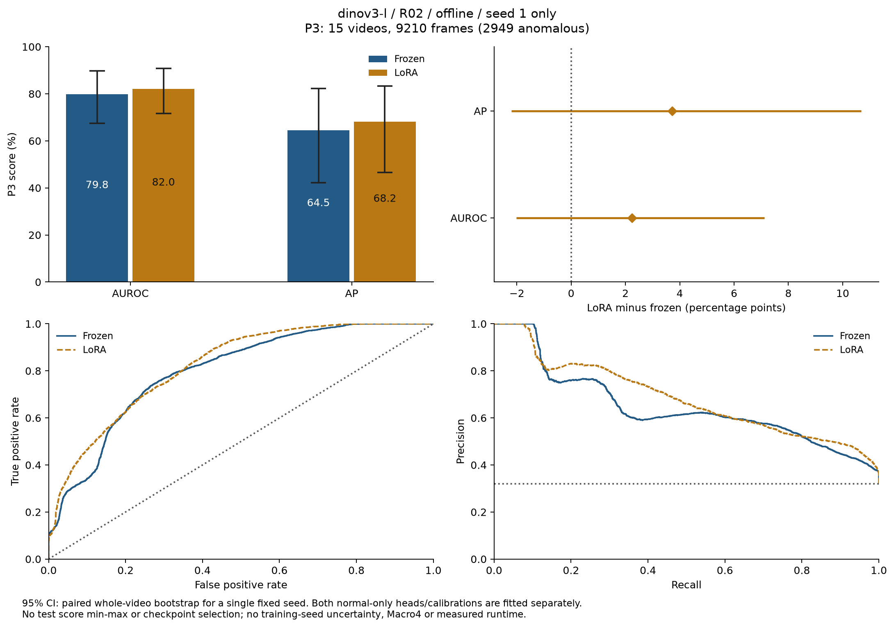

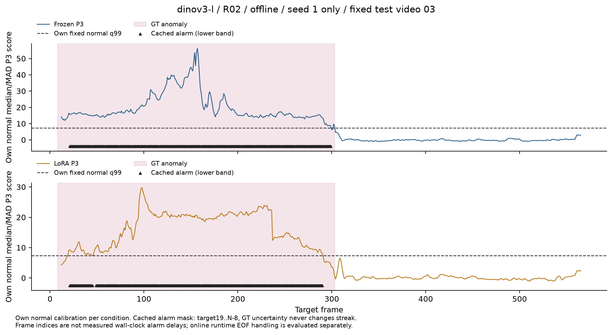

궤적은 조건별 정상 median/MAD 보정과 자체 고정 q99를 사용하며 target index는 wall-clock 탐지 지연이 아니다. PNG/SVG, [P0–P3 전체 CSV·정상 보정·single-seed CI·provenance](../results/stage04/dinov3-l/offline/R02/seed1), [독립 조건 감사](../results/stage04/condition_pipeline_checks/T1/dinov3-l/offline/R02/seed1/condition_audit.json), [원 파이프라인 완료 증거](../results/stage04/condition_pipeline_checks/dinov3-l/offline/R02/seed1/pipeline_completion.json), [게시 검증 기록](../results/setup/lora_dinov3_R02_seed1_evaluation_publication_check.json)을 제공한다. 모델·원본 영상·특징 배열은 업로드하지 않는다.

주 LoRA 정확도는 **8/48조건**, 완결된 세-seed 그룹은 여전히 **R01 오프라인 두 백본의 2/16그룹**이다. 기존 R01 여섯 조건의 current/retained 그룹 snapshot은 유지하며 R02 두 개 seed를 세-seed 평균에 섞지 않는다. 다음 **DINOv3-L 오프라인 R02 seed 2**를 같은 20 epoch·teacher weight 1·accumulation 8·BF16 설정의 원 trainer로 시작했다. 실시간 측정은 대기 상태를 유지한다. 나머지 장비·모드와 전체 실시간 비교는 계속 남아 있다.

```bash
PYTHONPATH=src:scripts python scripts/plot_lora_evaluation.py \
  --results results/stage04/dinov3-l/offline/R02/seed1 \
  --frozen-results results/stage02/dinov3-l/offline/R02/seed1 \
  --training artifacts/lora/dinov3-l/offline/R02/seed1 \
  --cache artifacts/features_lora/dinov3-l/offline/R02/seed1 \
  --local artifacts/runs_lora/dinov3-l/offline/R02/seed1 \
  --frozen-local artifacts/runs/dinov3-l/offline/R02/seed1 \
  --data-root ../IPAD_dataset/IPAD_dataset \
  --out docs/figures/stage04
```

## DINOv3 R02 오프라인 seed 2의 완료된 정상 학습

원 정상-only trainer가 **20 epoch·7,620 optimizer updates**를 완료하고 종료 코드 **0**을 반환했다. 정상 fit 21개 영상의 3,042 clips와 정상 calibration 5개 영상의 2,864 clips를 사용했다. Teacher weight 1·accumulation 8·BF16과 최소 정상 calibration CE 선택 규칙을 유지했다.

| 선택 epoch | 정상 calibration CE | 같은 epoch의 원형 MAE |
|---:|---:|---:|
| 8 | 3.413798 | 2.3410% |

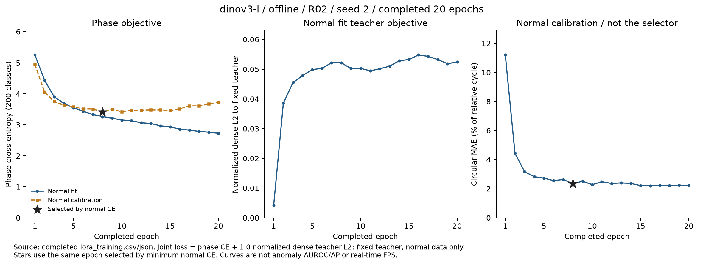

별표는 CE와 MAE 패널에서 같은 CE 선택 epoch를 표시한다. MAE 최솟값으로 모델을 다시 선택하지 않았다. [학습 CSV·JSON·선택 checkpoint 해시·export 검증](../results/stage04/training/dinov3-l/offline/R02/seed2)과 PNG/SVG를 공개한다. [학습 완료·게시 검증 기록](../results/setup/lora_dinov3_R02_seed2_training_publication_check.json)을 함께 제공한다. 모델 파일·원본 영상·특징 배열은 업로드하지 않는다.

Seed 2는 원 trainer의 fresh 조건으로 시작해 같은 20 epoch 설정을 유지했다. 학습 시작의 실제 owner/child와 source 해시를 확인했으며, 다른 seed의 adapter나 optimizer checkpoint를 사용하지 않았다. 정상 학습 완료를 이상탐지 정확도 완료로 계산하지 않는다. 이 게시 시점의 공개 주 LoRA 평가는 **8/48조건**, 완결된 세-seed 그룹은 **2/16그룹**이다. 원 파이프라인의 선택 특징 재추출·새 PCA/메모리·정상 보정·15개 전체 테스트·독립 감사를 별도로 검증한다.

```bash
PYTHONPATH=src:scripts python scripts/export_lora_training.py \
  --run artifacts/lora/dinov3-l/offline/R02/seed2 \
  --out results/stage04/training/dinov3-l/offline/R02/seed2
PYTHONPATH=src:scripts python scripts/plot_lora_training.py \
  --results results/stage04/training/dinov3-l/offline/R02/seed2 \
  --out docs/figures/stage04/dinov3-l_R02_offline_seed2_joint_training
```

## DINOv3 R02 오프라인 seed 2의 완료된 전체 평가

정상 calibration CE로 선택한 **epoch 8**의 adapter/joint head를 유지해 **41개 영상(fit 21·calibration 5·test 15)**의 특징을 재추출했다. 별도 진단용 정상 영상 4개는 주 평가 추출 대상에 포함하지 않았다. 새 PCA·16개 위상 bin의 프로토타입 메모리·온도·정상 median/MAD/q99를 구성했다. 원 학습·재추출·전체 평가 child와 원 파이프라인의 실제 종료 코드 **0**, 선택 tensor·새 bank/보정·GT·시간/점수/알람의 독립 감사 통과를 확인했다.

같은 seed의 고정 백본과 **15개 실제 테스트 영상·9,210개 유효 GT target(이상 2,949개)**을 비교했다. R02/12·13·14의 정확한 라벨 정렬은 계속 미확정이며 기존 18프레임 제외와 ±1 오프셋 민감도 규칙을 유지했다. 테스트에 맞춰 점수 부호·선택 epoch·정상 임계값을 바꾸지 않았다.

| 점수 | 고정 백본 AUROC/AP | LoRA AUROC/AP |
|---|---:|---:|
| P0 | 74.90/63.37% | 68.71/57.62% |
| P1 | 74.95/61.97% | 69.40/55.56% |
| P2 | 76.34/64.40% | 69.04/54.08% |
| P3 | 82.80/67.52% | 80.25/65.60% |

| 점수 | AUROC 차이 [95% CI], pp | AP 차이 [95% CI], pp |
|---|---:|---:|
| P0 | -6.19 [-12.75, -0.99] | -5.75 [-12.39, -0.21] |
| P1 | -5.55 [-12.14, +1.25] | -6.41 [-12.42, -0.88] |
| P2 | -7.31 [-13.69, -1.00] | -10.32 [-19.12, -2.63] |
| P3 | -2.56 [-6.06, +0.42] | -1.92 [-7.81, +4.22] |

P3의 두 점 추정치는 고정 백본보다 낮았지만 두 CI는 0을 포함했다. P0·P2의 AUROC/AP CI는 모두 음수였고, P1의 AP CI는 음수·AUROC CI는 0을 포함했다. 변형별 결과를 함께 보존하며 모든 점수 구성이나 seed에서 일관된 개선을 주장하지 않는다.

각 차이는 LoRA−같은 seed 고정 백본이며, 1,000회 paired 원본 영상 bootstrap의 percentile 95% CI다. Seed 자체를 재표집하지 않았고 퇴화 resample은 0개다. 변형별 CI를 함께 제시하며 다중 비교를 보정한 유의성 주장으로 해석하지 않는다. 단일 장비·단일 seed의 전체 LoRA/head/메모리/보정 프로토콜 비교이며 teacher 손실만의 효과·백본 간 LoRA 비교·R02 세-seed 평균·Macro4·실시간 FPS를 입증하지 않는다.


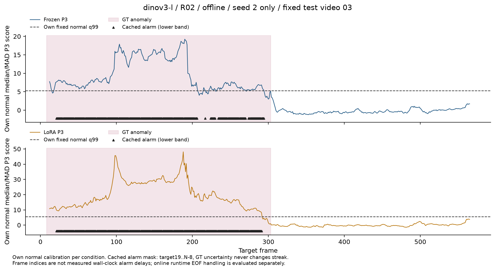

궤적은 조건별 정상 median/MAD 보정과 자체 고정 q99를 사용하며 target index는 wall-clock 탐지 지연이 아니다. PNG/SVG, [P0–P3 전체 CSV·정상 보정·single-seed CI·provenance](../results/stage04/dinov3-l/offline/R02/seed2), [독립 조건 감사](../results/stage04/condition_pipeline_checks/T1/dinov3-l/offline/R02/seed2/condition_audit.json), [원 파이프라인 완료 증거](../results/stage04/condition_pipeline_checks/dinov3-l/offline/R02/seed2/pipeline_completion.json), [게시 검증 기록](../results/setup/lora_dinov3_R02_seed2_evaluation_publication_check.json)을 제공한다. 모델·원본 영상·특징 배열은 업로드하지 않는다.

주 LoRA 정확도는 **9/48조건**이며 R01 두 백본과 DINOv3 R02의 **3/16그룹**에서 각각 세 seed의 전체 평가를 완료했다. 기존 R01 여섯 조건의 current/retained 그룹 snapshot은 유지한다. R02 세-seed 평균·paired CI·비교 그래프는 새 별도 snapshot에서 검산 후 게시한다. 나머지 장비·모드와 전체 실시간 비교는 계속 남아 있다.

```bash
PYTHONPATH=src:scripts python scripts/plot_lora_evaluation.py \
  --results results/stage04/dinov3-l/offline/R02/seed2 \
  --frozen-results results/stage02/dinov3-l/offline/R02/seed2 \
  --training artifacts/lora/dinov3-l/offline/R02/seed2 \
  --cache artifacts/features_lora/dinov3-l/offline/R02/seed2 \
  --local artifacts/runs_lora/dinov3-l/offline/R02/seed2 \
  --frozen-local artifacts/runs/dinov3-l/offline/R02/seed2 \
  --data-root ../IPAD_dataset/IPAD_dataset \
  --out docs/figures/stage04
```

## DINOv3 R02 오프라인 세 seed LoRA 집계

R02 오프라인 DINOv3-L의 **seeds 0/1/2 모두 20 epoch 학습·선택 특징 재추출·새 메모리/정상 보정·전체 테스트·독립 감사를 완료**했다. 같은 15개 영상의 9,210개 유효 GT target(이상 2,949개)에서 각 seed 지표를 계산한 뒤 평균했다. 두 처리와 세 seeds에 같은 원본 영상 재표집을 적용한 **1,000회 paired bootstrap의 percentile 95% CI**이며 seed 자체는 재표집하지 않았다.

| 점수 | 고정 AUROC [95% CI], % | LoRA AUROC [95% CI], % | 고정 AP [95% CI], % | LoRA AP [95% CI], % |
|---|---:|---:|---:|---:|
| P0 | 73.32 [55.27, 88.48] | 69.86 [52.58, 84.94] | 62.09 [35.74, 82.33] | 57.21 [31.63, 78.09] |
| P1 | 72.20 [56.64, 86.67] | 70.87 [55.05, 85.68] | 59.04 [33.11, 80.61] | 56.56 [31.36, 78.94] |
| P2 | 71.98 [57.04, 85.75] | 70.74 [54.72, 85.69] | 60.68 [36.51, 80.41] | 57.40 [31.96, 78.53] |
| P3 | 79.84 [68.19, 89.67] | 83.11 [72.85, 91.94] | 65.11 [43.81, 81.46] | 70.23 [49.08, 84.53] |

| 비교 | AUROC 차이 [95% CI], pp | AP 차이 [95% CI], pp |
|---|---:|---:|
| LoRA−고정 P0 | -3.46 [-7.12, -0.38] | -4.88 [-8.86, -0.87] |
| LoRA−고정 P1 | -1.33 [-4.27, +1.29] | -2.48 [-5.57, -0.03] |
| LoRA−고정 P2 | -1.23 [-5.65, +2.23] | -3.28 [-8.78, +0.20] |
| LoRA−고정 P3 | +3.28 [+1.46, +5.72] | +5.13 [+1.40, +9.98] |
| LoRA P3−LoRA P0 | +13.25 [+3.31, +25.31] | +13.02 [+1.09, +28.44] |

P3의 LoRA−고정 차이는 AUROC/AP의 두 paired 95% CI 모두 0보다 높았다. 변형별 CI를 함께 제공하며 다중 비교를 보정한 유의성 주장으로 해석하지 않는다. 이 결과는 정상 학습 encoder/head와 새 메모리/보정을 함께 적용한 프로토콜 비교다. Teacher 손실만의 효과, V-JEPA R02와의 비교, 온라인 LoRA, 전체 Macro4나 실제 FPS/방출 지연은 아직 검증되지 않았다.

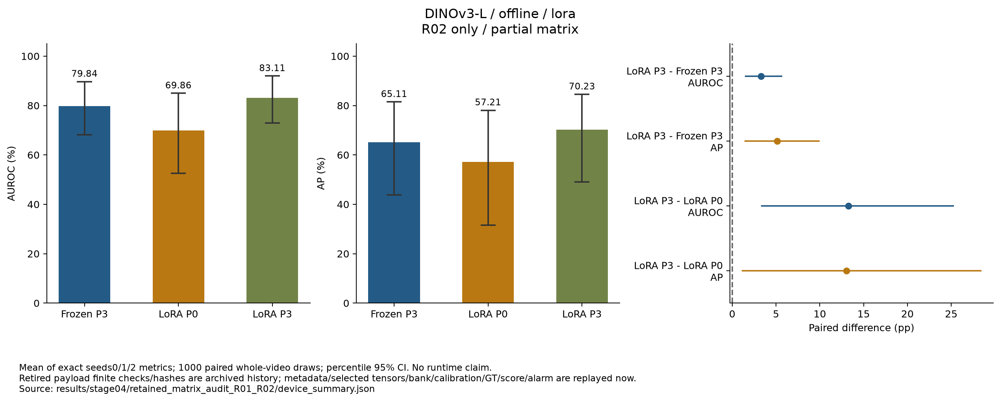

[새 아홉 조건·72개 정상 임계값 검증](../results/stage04/retained_matrix_audit_R01_R02/validation.json), [세 그룹의 전체 평균·CI·paired 차이](../results/stage04/retained_matrix_audit_R01_R02/device_summary.json), [fresh current/retained 그림 근거](../results/stage04/retained_matrix_audit_R01_R02/figure_sources.json), [현재 비교 가능한 R01 두 백본의 재검산 그림 근거](../results/stage04/retained_matrix_audit_R01_R02/backbone_figure_sources.json), [게시 검증 기록](../results/setup/lora_R02_three_seed_publication_check.json)과 PNG/SVG를 제공한다. **9/48조건·3/16그룹** 완료이며 새 snapshot은 기존 R01 여섯 조건의 snapshot을 보존한다. 현재 배열 여덟 조건과 사전 검증·승인된 배열 정리 증거 한 조건을 구분해 재검증했다. 전체 Macro4 파일에는 결과가 없다.

R02/12·13·14의 라벨 정렬은 계속 미확정이다. 기존 공통 18프레임 제외와 ±1 오프셋 민감도 규칙을 유지하며 테스트 점수에 맞춘 모델/seed/임계값 선택을 하지 않았다. 고정 q99의 관측 구간 탐지·정상 오탐은 ranking 지표와 별도이며, seed 0/1의 기존 단일 알람 결과는 보존한다.

```bash
PYTHONPATH=src:scripts python scripts/summarize_retained_lora_matrix.py \
  --kind lora --out results/stage04/retained_matrix_audit_R01_R02
PYTHONPATH=src:scripts python scripts/plot_retained_lora.py \
  --kind lora --root results/stage04/retained_matrix_audit_R01_R02 \
  --out docs/figures/stage04/retained_R01_R02
PYTHONPATH=src:scripts python scripts/plot_lora_backbone_comparison.py \
  --root results/stage04/retained_matrix_audit_R01_R02 \
  --out docs/figures/stage04/retained_R01_R02
```

## V-JEPA 2.1 R02 오프라인 seed 0의 완료된 정상 학습

원 정상-only trainer가 **20 epoch·7,620 optimizer updates**를 완료하고 종료 코드 **0**을 반환했다. 정상 fit 21개 영상의 3,042 clips와 정상 calibration 5개 영상의 2,864 clips를 사용했다. Teacher weight 1·accumulation 8·BF16과 최소 정상 calibration CE 선택 규칙을 유지했다.

| 선택 epoch | 정상 calibration CE | 같은 epoch의 원형 MAE |
|---:|---:|---:|
| 17 | 3.399587 | 2.0083% |

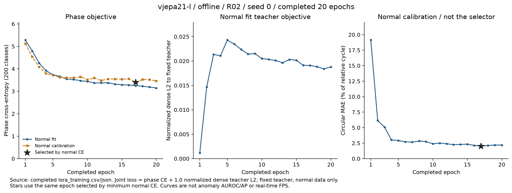

별표는 CE와 MAE 패널에서 같은 CE 선택 epoch를 표시한다. MAE 최솟값으로 모델을 다시 선택하지 않았다. [학습 CSV·JSON·선택 checkpoint 해시·export 검증](../results/stage04/training/vjepa21-l/offline/R02/seed0)과 PNG/SVG를 공개한다. [학습 완료·게시 검증 기록](../results/setup/lora_vjepa_R02_seed0_training_publication_check.json)을 함께 제공한다. 모델 파일·원본 영상·특징 배열은 업로드하지 않는다.

Seed 0는 원 trainer의 fresh 조건으로 시작해 같은 20 epoch 설정을 유지했다. 학습 시작의 실제 owner/child와 source 해시를 확인했으며, 다른 seed의 adapter나 optimizer checkpoint를 사용하지 않았다. 정상 학습 완료를 이상탐지 정확도 완료로 계산하지 않는다. 이 게시 시점의 공개 주 LoRA 평가는 **9/48조건**, 완결된 세-seed 그룹은 **3/16그룹**이다. 원 파이프라인의 선택 특징 재추출·새 PCA/메모리·정상 보정·15개 전체 테스트·독립 감사를 별도로 검증한다.

```bash
PYTHONPATH=src:scripts python scripts/export_lora_training.py \
  --run artifacts/lora/vjepa21-l/offline/R02/seed0 \
  --out results/stage04/training/vjepa21-l/offline/R02/seed0
PYTHONPATH=src:scripts python scripts/plot_lora_training.py \
  --results results/stage04/training/vjepa21-l/offline/R02/seed0 \
  --out docs/figures/stage04/vjepa21-l_R02_offline_seed0_joint_training
```

## V-JEPA 2.1 R02 오프라인 seed 0의 완료된 전체 평가

정상 calibration CE로 선택한 **epoch 17**의 adapter/joint head를 유지해 **41개 영상(fit 21·calibration 5·test 15)**의 특징을 재추출했다. 별도 진단용 정상 영상 4개는 주 평가 추출 대상에 포함하지 않았다. 새 PCA·16개 위상 bin의 프로토타입 메모리·온도·정상 median/MAD/q99를 구성했다. 원 학습·재추출·전체 평가 child와 원 파이프라인의 실제 종료 코드 **0**, 선택 tensor·새 bank/보정·GT·시간/점수/알람의 독립 감사 통과를 확인했다.

같은 seed의 고정 백본과 **15개 실제 테스트 영상·9,210개 유효 GT target(이상 2,949개)**을 비교했다. R02/12·13·14의 정확한 라벨 정렬은 계속 미확정이며 기존 18프레임 제외와 ±1 오프셋 민감도 규칙을 유지했다. 테스트에 맞춰 점수 부호·선택 epoch·정상 임계값을 바꾸지 않았다.

| 점수 | 고정 백본 AUROC/AP | LoRA AUROC/AP |
|---|---:|---:|
| P0 | 60.35/38.28% | 57.34/36.27% |
| P1 | 56.92/36.90% | 61.96/43.59% |
| P2 | 58.48/37.48% | 65.77/50.04% |
| P3 | 62.54/43.48% | 67.82/56.80% |

| 점수 | AUROC 차이 [95% CI], pp | AP 차이 [95% CI], pp |
|---|---:|---:|
| P0 | -3.02 [-6.73, +1.13] | -2.01 [-5.74, +0.78] |
| P1 | +5.04 [-0.42, +10.59] | +6.69 [+1.04, +12.22] |
| P2 | +7.29 [+3.00, +12.82] | +12.55 [+5.50, +19.47] |
| P3 | +5.28 [+1.54, +8.63] | +13.31 [+6.81, +19.83] |

각 차이는 LoRA−같은 seed 고정 백본이며, 1,000회 paired 원본 영상 bootstrap의 percentile 95% CI다. Seed 자체를 재표집하지 않았고 퇴화 resample은 0개다. 변형별 CI를 함께 제시하며 다중 비교를 보정한 유의성 주장으로 해석하지 않는다. 단일 장비·단일 seed의 전체 LoRA/head/메모리/보정 프로토콜 비교이며 teacher 손실만의 효과·백본 간 LoRA 비교·R02 세-seed 평균·Macro4·실시간 FPS를 입증하지 않는다.

P3의 LoRA−고정 백본 차이는 AUROC **+5.28pp [+1.54, +8.63]**, AP **+13.31pp [+6.81, +19.83]**이며 두 CI가 양수였다. P0의 두 점추정 차이는 음수지만 CI는 모두 0을 포함했다. P1은 AUROC CI가 0을 포함하고 AP CI는 양수였으며, P2의 두 CI는 양수였다. 세 seed의 학습 변동성과 백본 간 비교 결론은 남은 seed 1·2를 완료한 후 판단한다.


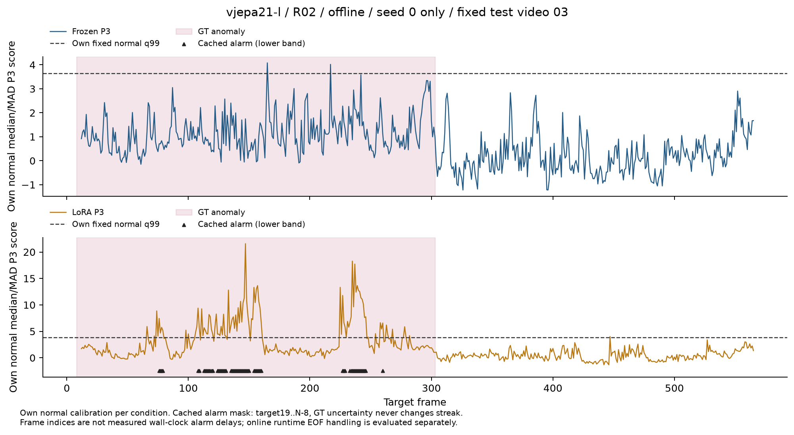

궤적은 조건별 정상 median/MAD 보정과 자체 고정 q99를 사용하며 target index는 wall-clock 탐지 지연이 아니다. PNG/SVG, [P0–P3 전체 CSV·정상 보정·single-seed CI·provenance](../results/stage04/vjepa21-l/offline/R02/seed0), [독립 조건 감사](../results/stage04/condition_pipeline_checks/T1/vjepa21-l/offline/R02/seed0/condition_audit.json), [원 파이프라인 완료 증거](../results/stage04/condition_pipeline_checks/vjepa21-l/offline/R02/seed0/pipeline_completion.json), [게시 검증 기록](../results/setup/lora_vjepa_R02_seed0_evaluation_publication_check.json)을 제공한다. 모델·원본 영상·특징 배열은 업로드하지 않는다.

주 LoRA 정확도는 **10/48조건**이며 R01 두 백본과 DINOv3 R02의 **3/16그룹**에서 각각 세 seed의 전체 평가를 완료했다. 기존 R01 여섯 조건과 DINOv3 R02 세 조건의 집계 snapshot을 유지한다. V-JEPA R02 seed 1·2는 원 seed 0 전체 파이프라인이 실제 종료 코드 0을 반환하고 source·종료 증거가 확인된 뒤 차례로 실행한다. V-JEPA R02의 세-seed 평균·paired CI·백본 간 비교 그래프는 세 seed를 모두 독립 검증한 후 별도 snapshot에서 제공한다. 나머지 장비·모드와 전체 실시간 비교는 계속 남아 있다.

```bash
PYTHONPATH=src:scripts python scripts/plot_lora_evaluation.py \
  --results results/stage04/vjepa21-l/offline/R02/seed0 \
  --frozen-results results/stage02/vjepa21-l/offline/R02/seed0 \
  --training artifacts/lora/vjepa21-l/offline/R02/seed0 \
  --cache artifacts/features_lora/vjepa21-l/offline/R02/seed0 \
  --local artifacts/runs_lora/vjepa21-l/offline/R02/seed0 \
  --frozen-local artifacts/runs/vjepa21-l/offline/R02/seed0 \
  --data-root ../IPAD_dataset/IPAD_dataset \
  --out docs/figures/stage04
```

## V-JEPA 2.1 R02 오프라인 seed 1의 완료된 정상 학습

원 정상-only trainer가 **20 epoch·7,620 optimizer updates**를 완료하고 종료 코드 **0**을 반환했다. 정상 fit 21개 영상의 3,042 clips와 정상 calibration 5개 영상의 2,864 clips를 사용했다. Teacher weight 1·accumulation 8·BF16과 최소 정상 calibration CE 선택 규칙을 유지했다.

| 선택 epoch | 정상 calibration CE | 같은 epoch의 원형 MAE |
|---:|---:|---:|
| 11 | 3.705227 | 3.1309% |

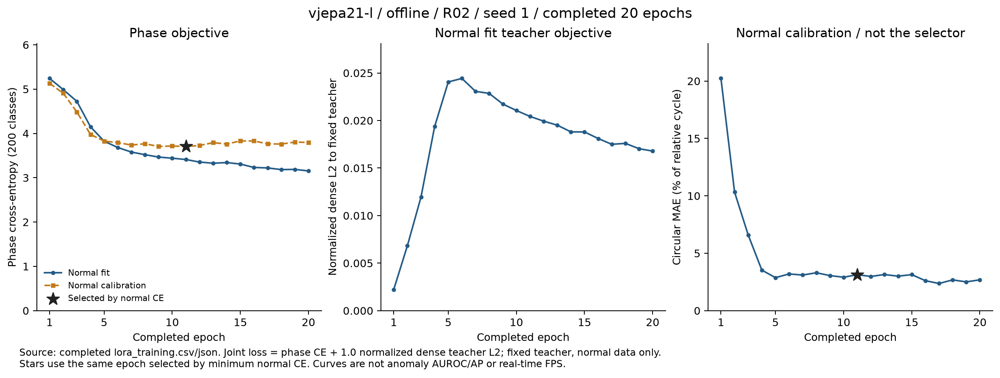

별표는 CE와 MAE 패널에서 같은 CE 선택 epoch를 표시한다. MAE 최솟값으로 모델을 다시 선택하지 않았다. [학습 CSV·JSON·선택 checkpoint 해시·export 검증](../results/stage04/training/vjepa21-l/offline/R02/seed1)과 PNG/SVG를 공개한다. [학습 완료·게시 검증 기록](../results/setup/lora_vjepa_R02_seed1_training_publication_check.json)을 함께 제공한다. 모델 파일·원본 영상·특징 배열은 업로드하지 않는다.

Seed 1은 원 trainer의 fresh 조건으로 시작해 같은 20 epoch 설정을 유지했다. 학습 시작의 실제 owner/child와 source 해시를 확인했으며, 다른 seed의 adapter나 optimizer checkpoint를 사용하지 않았다. 정상 학습 완료를 이상탐지 정확도 완료로 계산하지 않는다. 이 게시 시점의 공개 주 LoRA 평가는 **10/48조건**, 완결된 세-seed 그룹은 **3/16그룹**이다. 원 파이프라인의 선택 특징 재추출·새 PCA/메모리·정상 보정·15개 전체 테스트·독립 감사를 별도로 검증한다.

```bash
PYTHONPATH=src:scripts python scripts/export_lora_training.py \
  --run artifacts/lora/vjepa21-l/offline/R02/seed1 \
  --out results/stage04/training/vjepa21-l/offline/R02/seed1
PYTHONPATH=src:scripts python scripts/plot_lora_training.py \
  --results results/stage04/training/vjepa21-l/offline/R02/seed1 \
  --out docs/figures/stage04/vjepa21-l_R02_offline_seed1_joint_training
```

## V-JEPA 2.1 R02 오프라인 seed 1의 완료된 전체 평가

정상 calibration CE로 선택한 **epoch 11**의 adapter/joint head를 유지해 **41개 영상(fit 21·calibration 5·test 15)**의 특징을 재추출했다. 별도 진단용 정상 영상 4개는 주 평가 추출 대상에 포함하지 않았다. 새 PCA·16개 위상 bin의 프로토타입 메모리·온도·정상 median/MAD/q99를 구성했다. 원 학습·재추출·전체 평가 child와 원 파이프라인의 실제 종료 코드 **0**, 선택 tensor·새 bank/보정·GT·시간/점수/알람의 독립 감사 통과를 확인했다.

같은 seed의 고정 백본과 **15개 실제 테스트 영상·9,210개 유효 GT target(이상 2,949개)**을 비교했다. R02/12·13·14의 정확한 라벨 정렬은 계속 미확정이며 기존 18프레임 제외와 ±1 오프셋 민감도 규칙을 유지했다. 테스트에 맞춰 점수 부호·선택 epoch·정상 임계값을 바꾸지 않았다.

| 점수 | 고정 백본 AUROC/AP | LoRA AUROC/AP |
|---|---:|---:|
| P0 | 58.26/37.50% | 55.17/35.05% |
| P1 | 56.93/36.79% | 60.46/46.50% |
| P2 | 60.42/39.36% | 67.51/51.18% |
| P3 | 62.82/41.80% | 68.59/49.96% |

| 점수 | AUROC 차이 [95% CI], pp | AP 차이 [95% CI], pp |
|---|---:|---:|
| P0 | -3.10 [-7.70, +0.59] | -2.45 [-6.92, +0.33] |
| P1 | +3.53 [-3.30, +11.58] | +9.71 [-2.07, +21.76] |
| P2 | +7.09 [+0.34, +12.97] | +11.82 [+2.13, +21.11] |
| P3 | +5.78 [-0.77, +12.06] | +8.17 [+0.45, +15.30] |

P3는 고정 백본 **62.82/41.80%**에서 LoRA **68.59/49.96%**로 변했다. AUROC 차이 **+5.78pp [-0.77, +12.06]**의 CI는 0을 포함하고, AP 차이 **+8.17pp [+0.45, +15.30]**의 CI는 양수다. P0는 두 점추정 차이가 음수지만 CI는 모두 0을 포함했다. P1의 두 CI도 0을 포함했고, P2의 두 CI는 양수였다. 이 단일 seed로 R02 세-seed 평균이나 학습 seed 변동성을 결론내리지 않는다.

각 차이는 LoRA−같은 seed 고정 백본이며, 1,000회 paired 원본 영상 bootstrap의 percentile 95% CI다. Seed 자체를 재표집하지 않았고 퇴화 resample은 0개다. 변형별 CI를 함께 제시하며 다중 비교를 보정한 유의성 주장으로 해석하지 않는다. 단일 장비·단일 seed의 전체 LoRA/head/메모리/보정 프로토콜 비교이며 teacher 손실만의 효과·백본 간 LoRA 비교·R02 세-seed 평균·Macro4·실시간 FPS를 입증하지 않는다.

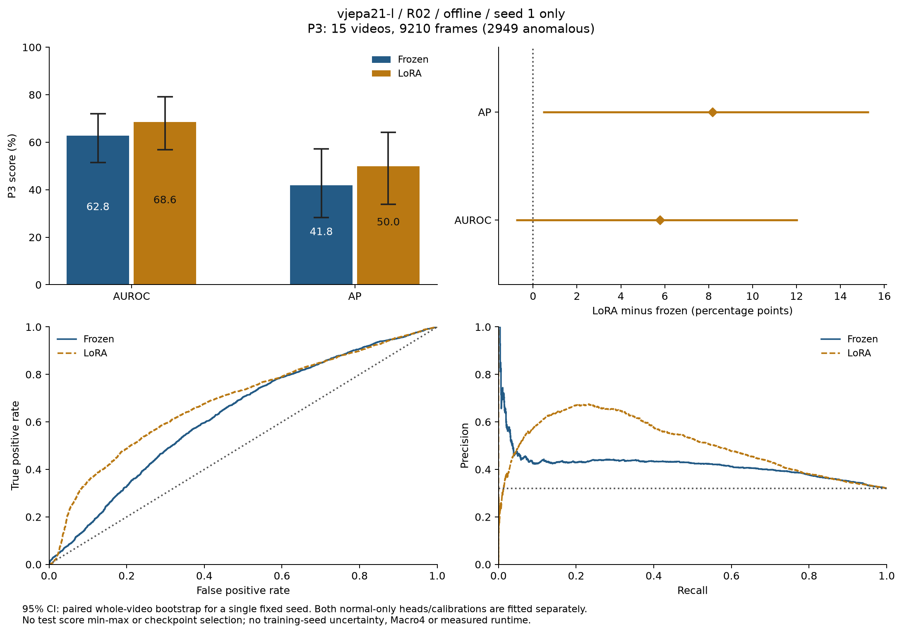

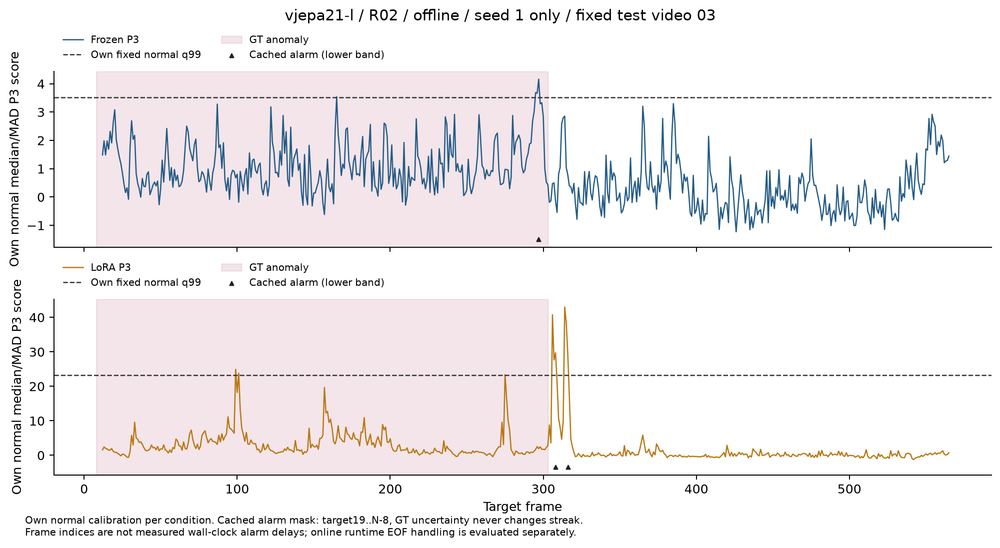

궤적은 조건별 정상 median/MAD 보정과 자체 고정 q99를 사용하며 target index는 wall-clock 탐지 지연이 아니다. PNG/SVG, [P0–P3 전체 CSV·정상 보정·single-seed CI·provenance](../results/stage04/vjepa21-l/offline/R02/seed1), [독립 조건 감사](../results/stage04/condition_pipeline_checks/T1/vjepa21-l/offline/R02/seed1/condition_audit.json), [원 파이프라인 완료 증거](../results/stage04/condition_pipeline_checks/vjepa21-l/offline/R02/seed1/pipeline_completion.json), [게시 검증 기록](../results/setup/lora_vjepa_R02_seed1_evaluation_publication_check.json)을 제공한다. 모델·원본 영상·특징 배열은 업로드하지 않는다.

주 LoRA 정확도는 **11/48조건**이며 R01 두 백본과 DINOv3 R02의 **3/16그룹**에서 각각 세 seed의 전체 평가를 완료했다. 기존 R01 여섯 조건과 DINOv3 R02 세 조건의 집계 snapshot을 유지한다. V-JEPA R02 seed 2는 원 seed 1 전체 파이프라인의 실제 종료 코드 0과 source·종료 증거를 확인한 뒤 실행한다. V-JEPA R02의 세-seed 평균·paired CI·백본 간 비교 그래프는 세 seed를 모두 독립 검증한 후 별도 snapshot에서 제공한다. 나머지 장비·모드와 전체 실시간 비교는 계속 남아 있다.

```bash
PYTHONPATH=src:scripts python scripts/plot_lora_evaluation.py \
  --results results/stage04/vjepa21-l/offline/R02/seed1 \
  --frozen-results results/stage02/vjepa21-l/offline/R02/seed1 \
  --training artifacts/lora/vjepa21-l/offline/R02/seed1 \
  --cache artifacts/features_lora/vjepa21-l/offline/R02/seed1 \
  --local artifacts/runs_lora/vjepa21-l/offline/R02/seed1 \
  --frozen-local artifacts/runs/vjepa21-l/offline/R02/seed1 \
  --data-root ../IPAD_dataset/IPAD_dataset \
  --out docs/figures/stage04
```

## V-JEPA 2.1 R02 오프라인 seed 2의 완료된 정상 학습

원 정상-only trainer가 **20 epoch·7,620 optimizer updates**를 완료하고 종료 코드 **0**을 반환했다. 정상 fit 21개 영상의 3,042 clips와 정상 calibration 5개 영상의 2,864 clips를 사용했다. Teacher weight 1·accumulation 8·BF16과 최소 정상 calibration CE 선택 규칙을 유지했다.

| 선택 epoch | 정상 calibration CE | 같은 epoch의 원형 MAE |
|---:|---:|---:|
| 20 | 4.087316 | 7.4958% |

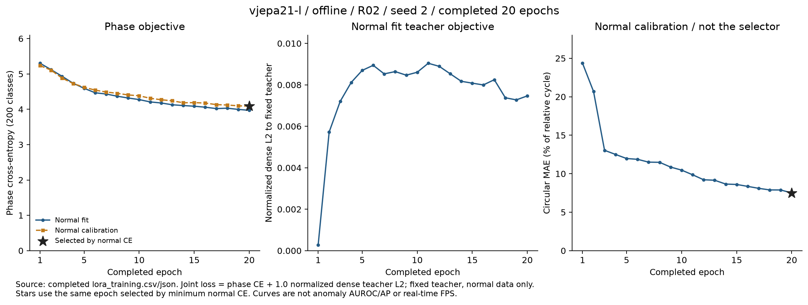

별표는 CE와 MAE 패널에서 같은 CE 선택 epoch를 표시한다. MAE 최솟값으로 모델을 다시 선택하지 않았다. [학습 CSV·JSON·선택 checkpoint 해시·export 검증](../results/stage04/training/vjepa21-l/offline/R02/seed2)과 PNG/SVG를 공개한다. [학습 완료·게시 검증 기록](../results/setup/lora_vjepa_R02_seed2_training_publication_check.json)을 함께 제공한다. 모델 파일·원본 영상·특징 배열은 업로드하지 않는다.

Seed 2는 원 trainer의 fresh 조건으로 시작해 같은 20 epoch 설정을 유지했다. 학습 시작의 실제 owner/child와 source 해시를 확인했으며, 다른 seed의 adapter나 optimizer checkpoint를 사용하지 않았다. 정상 학습 완료를 이상탐지 정확도 완료로 계산하지 않는다. 이 게시 시점의 공개 주 LoRA 평가는 **11/48조건**, 완결된 세-seed 그룹은 **3/16그룹**이다. 원 파이프라인의 선택 특징 재추출·새 PCA/메모리·정상 보정·15개 전체 테스트·독립 감사를 별도로 검증한다.

```bash
PYTHONPATH=src:scripts python scripts/export_lora_training.py \
  --run artifacts/lora/vjepa21-l/offline/R02/seed2 \
  --out results/stage04/training/vjepa21-l/offline/R02/seed2
PYTHONPATH=src:scripts python scripts/plot_lora_training.py \
  --results results/stage04/training/vjepa21-l/offline/R02/seed2 \
  --out docs/figures/stage04/vjepa21-l_R02_offline_seed2_joint_training
```

## V-JEPA 2.1 R02 오프라인 seed 2의 완료된 전체 평가

정상 calibration CE로 선택한 **epoch 20**의 adapter/joint head를 유지해 **41개 영상(fit 21·calibration 5·test 15)**의 특징을 재추출했다. 별도 진단용 정상 영상 4개는 주 평가 추출 대상에 포함하지 않았다. 새 PCA·16개 위상 bin의 프로토타입 메모리·온도·정상 median/MAD/q99를 구성했다. 원 학습·재추출·전체 평가 child와 원 파이프라인의 실제 종료 코드 **0**, 선택 tensor·새 bank/보정·GT·시간/점수/알람의 독립 감사 통과를 확인했다.

같은 seed의 고정 백본과 **15개 실제 테스트 영상·9,210개 유효 GT target(이상 2,949개)**을 비교했다. R02/12·13·14의 정확한 라벨 정렬은 계속 미확정이며 기존 18프레임 제외와 ±1 오프셋 민감도 규칙을 유지했다. 테스트에 맞춰 점수 부호·선택 epoch·정상 임계값을 바꾸지 않았다.

| 점수 | 고정 백본 AUROC/AP | LoRA AUROC/AP |
|---|---:|---:|
| P0 | 55.94/35.17% | 59.01/36.84% |
| P1 | 57.70/36.27% | 63.04/43.49% |
| P2 | 60.21/39.54% | 62.90/43.74% |
| P3 | 63.95/42.37% | 61.86/40.69% |

| 점수 | AUROC 차이 [95% CI], pp | AP 차이 [95% CI], pp |
|---|---:|---:|
| P0 | +3.07 [+0.42, +5.96] | +1.68 [-0.63, +3.61] |
| P1 | +5.34 [-1.17, +10.73] | +7.22 [+0.99, +11.82] |
| P2 | +2.68 [-6.71, +10.51] | +4.20 [-4.38, +10.56] |
| P3 | -2.09 [-9.41, +6.69] | -1.68 [-10.75, +6.86] |

P3는 고정 백본 **63.95/42.37%**에서 LoRA **61.86/40.69%**로 변했다. AUROC 차이는 **-2.09pp [-9.41, +6.69]**, AP 차이는 **-1.68pp [-10.75, +6.86]**다. P3의 두 점추정은 감소했지만 두 CI는 모두 0을 포함하므로 유의한 감소나 개선을 결론내리지 않는다. P0는 AUROC CI가 양수이고 AP CI는 0을 포함했다. P1은 AUROC CI가 0을 포함하고 AP CI는 양수였다. P2의 두 CI는 0을 포함했다. 사전에 정한 주 점수 P3와 전체 P0–P3를 그대로 보고하며 테스트를 보고 유리한 점수로 주 결과를 바꾸지 않는다. 이 단일 seed로 R02 세-seed 평균이나 학습 seed 변동성을 결론내리지 않는다.

각 차이는 LoRA−같은 seed 고정 백본이며, 1,000회 paired 원본 영상 bootstrap의 percentile 95% CI다. Seed 자체를 재표집하지 않았고 퇴화 resample은 0개다. 변형별 CI를 함께 제시하며 다중 비교를 보정한 유의성 주장으로 해석하지 않는다. 단일 장비·단일 seed의 전체 LoRA/head/메모리/보정 프로토콜 비교이며 teacher 손실만의 효과·백본 간 LoRA 비교·R02 세-seed 평균·Macro4·실시간 FPS를 입증하지 않는다.

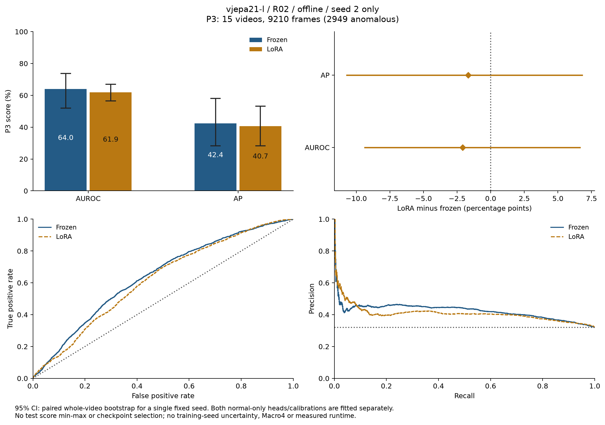

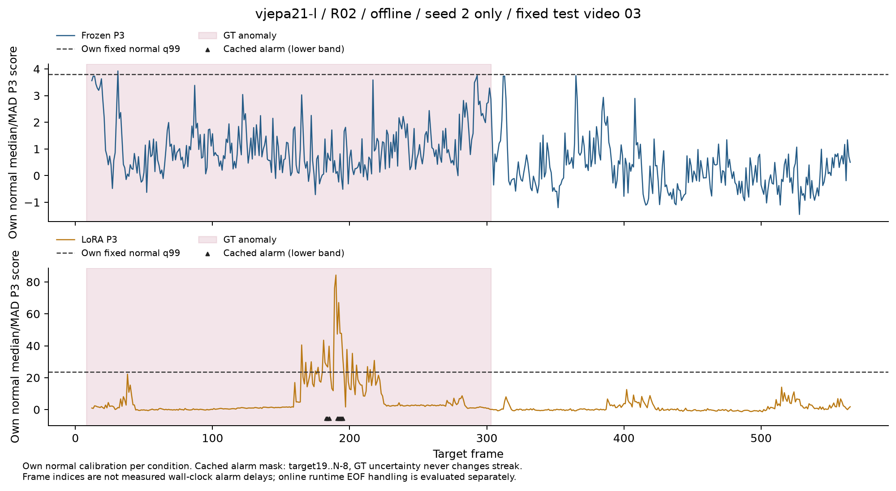

궤적은 조건별 정상 median/MAD 보정과 자체 고정 q99를 사용하며 target index는 wall-clock 탐지 지연이 아니다. PNG/SVG, [P0–P3 전체 CSV·정상 보정·single-seed CI·provenance](../results/stage04/vjepa21-l/offline/R02/seed2), [독립 조건 감사](../results/stage04/condition_pipeline_checks/T1/vjepa21-l/offline/R02/seed2/condition_audit.json), [원 파이프라인 완료 증거](../results/stage04/condition_pipeline_checks/vjepa21-l/offline/R02/seed2/pipeline_completion.json), [게시 검증 기록](../results/setup/lora_vjepa_R02_seed2_evaluation_publication_check.json)을 제공한다. 모델·원본 영상·특징 배열은 업로드하지 않는다.

주 LoRA 정확도는 **12/48조건**이며 R01·R02 두 백본의 오프라인 **4/16그룹**에서 각각 세 seed의 전체 평가를 완료했다. 기존 R01 여섯 조건과 DINOv3 R02 세 조건의 집계 snapshot을 유지한다. 원 seed 2 전체 파이프라인의 실제 종료 코드 0과 source·종료 증거를 확인한 뒤 대기 큐의 DINOv3-L 오프라인 R03 seed 0→1→2를 순차 실행한다. V-JEPA R02 세 seed의 전체 평가·독립 감사를 모두 완료했으며, 세-seed 평균·paired CI·백본 간 비교 그래프는 이 단일 조건 게시와 구분한 별도 검증 snapshot에서 제공한다. 나머지 장비·모드와 전체 실시간 비교는 계속 남아 있다.

```bash
PYTHONPATH=src:scripts python scripts/plot_lora_evaluation.py \
  --results results/stage04/vjepa21-l/offline/R02/seed2 \
  --frozen-results results/stage02/vjepa21-l/offline/R02/seed2 \
  --training artifacts/lora/vjepa21-l/offline/R02/seed2 \
  --cache artifacts/features_lora/vjepa21-l/offline/R02/seed2 \
  --local artifacts/runs_lora/vjepa21-l/offline/R02/seed2 \
  --frozen-local artifacts/runs/vjepa21-l/offline/R02/seed2 \
  --data-root ../IPAD_dataset/IPAD_dataset \
  --out docs/figures/stage04
```

## R02 오프라인 두 백본의 세 seed LoRA 비교

R02 오프라인 두 백본의 seeds 0/1/2 모두 원래 20-epoch 정상 학습·선택 특징 재추출·새 메모리/정상 보정·전체 테스트·독립 감사를 완료했다. 같은 15개 테스트 영상의 유효 GT target **9,210개(이상 2,949개·정상 6,261개)**에서 각 seed 지표를 계산한 뒤 세 값을 평균했다. 두 백본·고정/LoRA·세 seeds에 같은 원본 영상 재표집을 적용한 **1,000회 paired bootstrap percentile 95% CI**다. Seed 자체를 재표집하거나 프레임·seed 점수를 하나로 합치지 않았다.

**DINOv3-L: 세 seed 평균과 영상 bootstrap 95% CI**

| 점수 | 고정 AUROC [CI], % | LoRA AUROC [CI], % | 고정 AP [CI], % | LoRA AP [CI], % |
|---|---:|---:|---:|---:|
| P0 | 73.32 [55.27, 88.48] | 69.86 [52.58, 84.94] | 62.09 [35.74, 82.33] | 57.21 [31.63, 78.09] |
| P1 | 72.20 [56.64, 86.67] | 70.87 [55.05, 85.68] | 59.04 [33.11, 80.61] | 56.56 [31.36, 78.94] |
| P2 | 71.98 [57.04, 85.75] | 70.74 [54.72, 85.69] | 60.68 [36.51, 80.41] | 57.40 [31.96, 78.53] |
| P3 | 79.84 [68.19, 89.67] | 83.11 [72.85, 91.94] | 65.11 [43.81, 81.46] | 70.23 [49.08, 84.53] |

**V-JEPA 2.1-L: 세 seed 평균과 영상 bootstrap 95% CI**

| 점수 | 고정 AUROC [CI], % | LoRA AUROC [CI], % | 고정 AP [CI], % | LoRA AP [CI], % |
|---|---:|---:|---:|---:|
| P0 | 58.19 [42.29, 72.05] | 57.17 [41.16, 70.91] | 36.98 [22.10, 56.43] | 36.06 [22.37, 53.57] |
| P1 | 57.18 [43.26, 69.48] | 61.82 [47.04, 73.64] | 36.65 [22.70, 55.06] | 44.53 [29.04, 60.62] |
| P2 | 59.71 [45.84, 71.39] | 65.39 [52.07, 76.03] | 38.79 [24.32, 56.43] | 48.32 [32.59, 63.99] |
| P3 | 63.10 [51.47, 72.56] | 66.09 [57.21, 73.09] | 42.55 [28.56, 58.03] | 49.15 [35.58, 61.20] |

**DINOv3-L: paired 차이**

| 비교 | AUROC 차이 [CI], pp | AP 차이 [CI], pp |
|---|---:|---:|
| LoRA−고정 P0 | -3.46 [-7.12, -0.38] | -4.88 [-8.86, -0.87] |
| LoRA−고정 P1 | -1.33 [-4.27, +1.29] | -2.48 [-5.57, -0.03] |
| LoRA−고정 P2 | -1.23 [-5.65, +2.23] | -3.28 [-8.78, +0.20] |
| LoRA−고정 P3 | +3.28 [+1.46, +5.72] | +5.13 [+1.40, +9.98] |
| LoRA P3−LoRA P0 | +13.25 [+3.31, +25.31] | +13.02 [+1.09, +28.44] |

**V-JEPA 2.1-L: paired 차이**

| 비교 | AUROC 차이 [CI], pp | AP 차이 [CI], pp |
|---|---:|---:|
| LoRA−고정 P0 | -1.01 [-3.58, +1.77] | -0.93 [-3.88, +0.93] |
| LoRA−고정 P1 | +4.63 [+0.25, +8.84] | +7.87 [+2.68, +11.95] |
| LoRA−고정 P2 | +5.69 [+1.02, +9.55] | +9.52 [+5.19, +12.57] |
| LoRA−고정 P3 | +2.99 [-0.53, +6.83] | +6.60 [+1.46, +10.15] |
| LoRA P3−LoRA P0 | +8.92 [-2.01, +19.20] | +13.09 [+3.83, +19.07] |

**같은 R02의 백본 비교**

| V-JEPA−DINOv3 비교 | AUROC 차이 [CI], pp | AP 차이 [CI], pp |
|---|---:|---:|
| 고정 P3 | -16.73 [-28.73, -5.04] | -22.55 [-39.11, -5.11] |
| LoRA P0 | -12.69 [-29.58, +3.62] | -21.16 [-38.12, -1.41] |
| LoRA P3 | -17.02 [-26.15, -8.17] | -21.08 [-35.63, -4.68] |

DINOv3-L P3의 LoRA−고정 paired CI 판정은 AUROC **양수**, AP **양수**다. V-JEPA 2.1-L P3의 LoRA−고정 paired CI 판정은 AUROC **0 포함**, AP **양수**다. LoRA P3의 V-JEPA−DINOv3 paired CI 판정은 AUROC **음수**, AP **음수**다. 다중 비교를 보정한 유의성 주장으로 해석하지 않는다.

V-JEPA seed 2의 P3 단일 결과 **61.86/40.69%**, 고정 대비 **−2.09/−1.68pp**와 두 CI의 0 포함을 보존한다. 세-seed 평균 개선을 모든 seed의 개선으로 확대하지 않는다. 주 점수 P3를 결과에 따라 바꾸지 않았으며 정상 검증 CE 선택 epoch는 seeds 0/1/2 각각 **17/11/20**다. Encoder/head와 새 메모리/보정을 함께 바꾸는 전체 프로토콜 비교다. Teacher 손실만의 효과, 사전학습 방법만의 인과 효과, 디코더 제거만의 효과나 동등성을 주장하지 않는다.

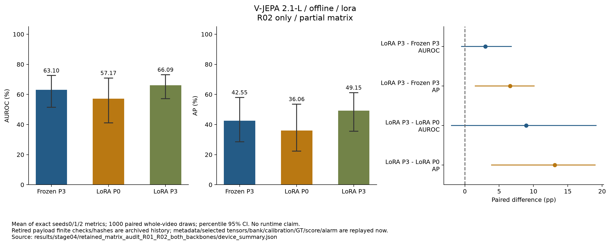

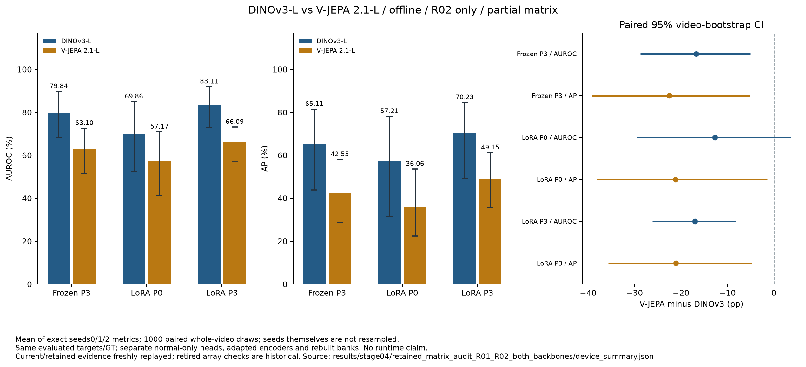

[12조건·96개 정상 임계값 감사](../results/stage04/retained_matrix_audit_R01_R02_both_backbones/validation.json), [전체 평균·CI·paired 차이](../results/stage04/retained_matrix_audit_R01_R02_both_backbones/device_summary.json), [current/retained 그래프 근거](../results/stage04/retained_matrix_audit_R01_R02_both_backbones/figure_sources.json), [백본 paired 재검산](../results/stage04/retained_matrix_audit_R01_R02_both_backbones/backbone_figure_sources.json), [게시 검증 기록](../results/setup/lora_R02_both_backbones_three_seed_publication_check.json)과 여섯 PNG/SVG를 제공한다. **12/48조건·4/16그룹** 완료 상태다. 현재 배열 11조건과 사전 검증·승인된 배열 정리 증거 1조건을 구분해 재검증했다. 새 snapshot은 기존 R01 여섯 조건과 R01/R02 아홉 조건의 모든 데이터·그래프를 보존한다. Macro4 결과는 아직 없다.

R02/12·13·14의 라벨 정렬은 미확정이며 기존 ±1 규칙에 따른 공통 18프레임 제외를 유지했다. 총 9,228 inference target 중 미확정 18개를 GT 지표에서 제외한다. 고정 q99의 구간 탐지·정상 경보는 ranking 지표와 별도다. 기존 seed 0의 구간 탐지 3→13개와 seed 1의 7→3개·정상 경보 3→20프레임을 함께 보존하며, seed 2의 구간 집계와 세-seed 경보 집계는 별도 검산 후 제공한다. 이 캐시 정확도 결과에서 실제 FPS·방출 지연·온라인 EOF 탐지를 추론하지 않는다.

```bash
PYTHONPATH=src:scripts python scripts/summarize_retained_lora_matrix.py \
  --kind lora --out results/stage04/retained_matrix_audit_R01_R02_both_backbones
PYTHONPATH=src:scripts python scripts/plot_retained_lora.py \
  --kind lora --root results/stage04/retained_matrix_audit_R01_R02_both_backbones \
  --out docs/figures/stage04/retained_R01_R02_both_backbones
PYTHONPATH=src:scripts python scripts/plot_lora_backbone_comparison.py \
  --root results/stage04/retained_matrix_audit_R01_R02_both_backbones --out docs/figures/stage04/retained_R01_R02_both_backbones
```

## DINOv3 R03 오프라인 seed 0의 완료된 정상 학습

원 fresh 정상-only trainer가 **20 epoch·6,420 optimizer updates**를 완료하고 실제 종료 코드 **0**을 반환했다. 정상 fit **15개 영상·2,564 clips**, 정상 calibration **4개 영상·2,771 clips**를 사용했다. Teacher weight 1·accumulation 8·BF16·최소 정상 calibration CE 선택 규칙과 원래 학습 코드를 유지했다. 진단용 정상 영상은 학습·임계값 선택에 넣지 않았다.

| 선택 epoch | 정상 calibration CE | 같은 epoch의 원형 MAE |
|---:|---:|---:|
| 19 | 3.121916 | 1.8808% |

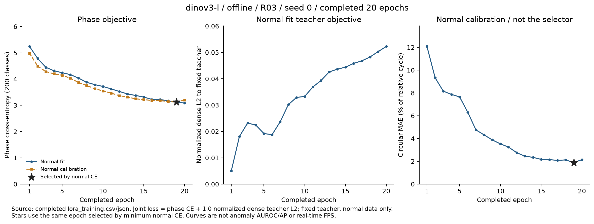

두 별표는 같은 CE 선택 epoch이며 MAE 최솟값으로 재선택하지 않았다. 기존 CPU 수집자가 실제 export·plot 종료 코드 0 이후 생성한 CSV/JSON과 PNG/SVG를 사용했고 직접 PNG를 확인했다. [학습 CSV·JSON·선택 checkpoint hash·export 검증](../results/stage04/training/dinov3-l/offline/R03/seed0), [학습 완료·그래프 검토·게시 검증](../results/setup/lora_dinov3_R03_seed0_training_publication_check.json)을 제공한다. 모델·원본 영상·특징 배열은 업로드하지 않는다.

원 pipeline owner/trainer의 boot ID·PID·start ticks와 소스 28개를 확인했다. 기존 pipeline은 실제 child.wait()가 0일 때만 full20 완료 단계를 기록한다. 이 증거와 독립 읽기 전용 관찰의 실제 종료 코드 0을 함께 확인했다. 학습·선택 checkpoint·optimizer 상태를 변경하거나 다른 seed의 checkpoint로 대체하지 않았다.

정상 학습 완료를 이상탐지 정확도 완료로 세지 않는다. 기존 공개 주 평가는 **12/48조건·4/16 세-seed 그룹**이다. 원 pipeline의 선택 특징 재추출·새 PCA/프로토타입 메모리·정상 보정·R03의 실제 17개 테스트와 독립 감사를 별도로 검증한다. Online·Macro4·teacher 0/1·전체 IPAD 기준선·추가 실험·실시간 측정의 전체 계획을 유지한다.

```bash
PYTHONPATH=src:scripts python scripts/export_lora_training.py \
  --run artifacts/lora/dinov3-l/offline/R03/seed0 --out results/stage04/training/dinov3-l/offline/R03/seed0
PYTHONPATH=src:scripts python scripts/plot_lora_training.py \
  --results results/stage04/training/dinov3-l/offline/R03/seed0 --out docs/figures/stage04/dinov3-l_R03_offline_seed0_joint_training
```

## DINOv3 R03 오프라인 seed 0의 완료된 전체 평가

원 fresh 정상-only 학습 **20 epoch·6,420 updates**의 calibration CE 선택 **epoch 19** adapter/joint head로 **36개 영상(fit 15·calibration 4·test 17)**의 특징을 재추출했다. 별도 진단용 정상 영상 3개는 포함하지 않았다. 새 PCA·16 bins·2,048개 프로토타입 메모리·온도·정상 median/MAD/q99를 구성했다. 원 학습·재추출·전체 평가와 원 파이프라인의 실제 종료 코드 **0**, 선택 tensor·새 메모리·보정·GT·시간/점수/알람 독립 감사 통과를 확인했다.

같은 seed 고정 백본과 **17개 실제 테스트·11,563개 유효 GT target(이상 4,922개)**을 비교했다. 테스트를 보고 점수 부호·선택 epoch·정상 임계값·주 점수 P3를 바꾸지 않았다.

| 점수 | 고정 백본 AUROC / AP (%) | LoRA AUROC / AP (%) |
|---|---:|---:|
| P0 | 52.73 / 46.02 | 56.58 / 48.26 |
| P1 | 62.01 / 53.08 | 57.89 / 53.33 |
| P2 | 62.23 / 54.18 | 59.73 / 54.35 |
| P3 | 61.09 / 52.43 | 62.66 / 56.68 |

| 점수 | AUROC 차이 [95% CI], pp | AP 차이 [95% CI], pp |
|---|---:|---:|
| P0 | +3.85 [+1.22, +7.39] | +2.23 [-0.40, +5.88] |
| P1 | -4.12 [-8.91, +0.23] | +0.25 [-2.49, +3.65] |
| P2 | -2.50 [-8.75, +2.70] | +0.17 [-4.70, +5.66] |
| P3 | +1.58 [-3.60, +5.92] | +4.25 [-1.98, +10.73] |

차이는 LoRA−같은 seed 고정 백본이다. **1,000회 paired 원본 영상 bootstrap·percentile 95% CI**를 사용했으며 퇴화 resample은 0개다. Seed 자체를 재표집하지 않았다. P3의 AUROC/AP CI는 각각 **0 포함/0 포함**다. 0 포함은 개선·감소의 확정이나 동등성을 뜻하지 않는다. 모든 P0–P3를 보고하며 다중 비교를 보정한 유의성 주장으로 해석하지 않는다.


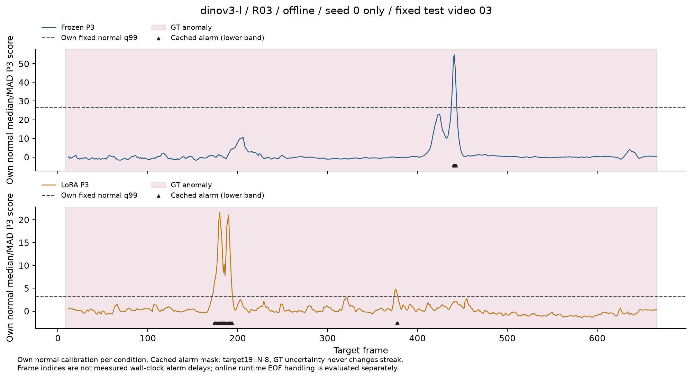

궤적은 각 조건의 정상 median/MAD와 자체 고정 q99를 사용한다. Target index는 wall-clock 탐지 지연이 아니다. 기존 CPU 수집자가 실제 종료 코드 0으로 재검증·paired 비교·plot을 완료한 산출물을 사용했고 두 PNG를 직접 확인했다. [전체 CSV·보정·single-seed CI·provenance](../results/stage04/dinov3-l/offline/R03/seed0), [독립 조건 감사](../results/stage04/condition_pipeline_checks/T1/dinov3-l/offline/R03/seed0/condition_audit.json), [원 파이프라인 완료](../results/stage04/condition_pipeline_checks/dinov3-l/offline/R03/seed0/pipeline_completion.json), [게시 검증](../results/setup/lora_dinov3_R03_seed0_evaluation_publication_check.json)을 제공한다. 모델·원본 영상·특징 배열은 업로드하지 않는다.

주 LoRA 전체 평가는 **13/48조건·4/16 세-seed 그룹**이다. 기존 R01·R02의 12조건·4그룹 집계 snapshot은 유지하며, R03의 이 단일 seed를 세-seed 평균·학습 seed 불확실성·백본 간 LoRA 우위·teacher 손실만의 효과·Macro4·실시간 성능으로 해석하지 않는다. 후속 seed·두 백본·온라인·전체 기준선·추가 실험·실시간 측정 계획을 유지한다.

재현은 기존 `scripts/plot_lora_evaluation.py`에 이 조건의 `--results`, `--frozen-results`, `--training`, `--cache`, `--local`, `--frozen-local`, `--data-root`를 전달하고 `--sequence 03 --out docs/figures/stage04`를 사용한다. 실행한 정확한 인자·종료 코드·log hash는 게시 검증의 CPU 수집 증거에 포함한다.

## DINOv3 R03 오프라인 seed 1의 완료된 정상 학습

원 fresh 정상-only trainer가 **20 epoch·6,420 optimizer updates**를 완료하고 실제 종료 코드 **0**을 반환했다. 정상 fit **15개 영상·2,564 clips**, 정상 calibration **4개 영상·2,771 clips**를 사용했다. Teacher weight 1·accumulation 8·BF16·최소 정상 calibration CE 선택 규칙과 원래 학습 코드를 유지했다. 진단용 정상 영상은 학습·임계값 선택에 넣지 않았다.

| 선택 epoch | 정상 calibration CE | 같은 epoch의 원형 MAE |
|---:|---:|---:|
| 20 | 3.188403 | 2.6442% |

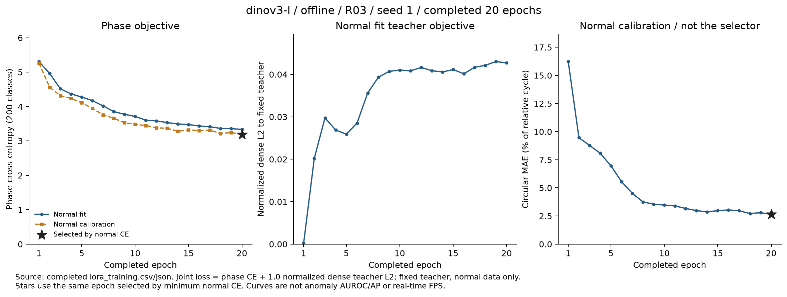

두 별표는 같은 CE 선택 epoch이며 MAE 최솟값으로 재선택하지 않았다. 기존 CPU 수집자가 실제 export·plot 종료 코드 0 이후 생성한 CSV/JSON과 PNG/SVG를 사용했고 직접 PNG를 확인했다. [학습 CSV·JSON·선택 checkpoint hash·export 검증](../results/stage04/training/dinov3-l/offline/R03/seed1), [학습 완료·그래프 검토·게시 검증](../results/setup/lora_dinov3_R03_seed1_training_publication_check.json)을 제공한다. 모델·원본 영상·특징 배열은 업로드하지 않는다.

원 pipeline owner/trainer의 boot ID·PID·start ticks와 소스 28개를 확인했다. 기존 pipeline은 실제 child.wait()가 0일 때만 full20 완료 단계를 기록한다. 이 증거와 독립 읽기 전용 관찰의 실제 종료 코드 0을 함께 확인했다. 학습·선택 checkpoint·optimizer 상태를 변경하거나 다른 seed의 checkpoint로 대체하지 않았다.

정상 학습 완료를 이상탐지 정확도 완료로 세지 않는다. 기존 공개 주 평가는 **13/48조건·4/16 세-seed 그룹**이다. 원 pipeline의 선택 특징 재추출·새 PCA/프로토타입 메모리·정상 보정·R03의 실제 17개 테스트와 독립 감사를 별도로 검증한다. Online·Macro4·teacher 0/1·전체 IPAD 기준선·추가 실험·실시간 측정의 전체 계획을 유지한다.

```bash
PYTHONPATH=src:scripts python scripts/export_lora_training.py \
  --run artifacts/lora/dinov3-l/offline/R03/seed1 --out results/stage04/training/dinov3-l/offline/R03/seed1
PYTHONPATH=src:scripts python scripts/plot_lora_training.py \
  --results results/stage04/training/dinov3-l/offline/R03/seed1 --out docs/figures/stage04/dinov3-l_R03_offline_seed1_joint_training
```

## DINOv3 R03 오프라인 seed 1의 완료된 전체 평가

원 fresh 정상-only 학습 **20 epoch·6,420 updates**의 calibration CE 선택 **epoch 20** adapter/joint head로 **36개 영상(fit 15·calibration 4·test 17)**의 특징을 재추출했다. 별도 진단용 정상 영상 3개는 포함하지 않았다. 새 PCA·16 bins·2,048개 프로토타입 메모리·온도·정상 median/MAD/q99를 구성했다. 원 학습·재추출·전체 평가와 원 파이프라인의 실제 종료 코드 **0**, 선택 tensor·새 메모리·보정·GT·시간/점수/알람 독립 감사 통과를 확인했다.

같은 seed 고정 백본과 **17개 실제 테스트·11,563개 유효 GT target(이상 4,922개)**을 비교했다. 테스트를 보고 점수 부호·선택 epoch·정상 임계값·주 점수 P3를 바꾸지 않았다.

| 점수 | 고정 백본 AUROC / AP (%) | LoRA AUROC / AP (%) |
|---|---:|---:|
| P0 | 54.50 / 47.85 | 57.18 / 48.95 |
| P1 | 60.67 / 52.59 | 57.18 / 51.82 |
| P2 | 61.25 / 53.38 | 60.23 / 53.58 |
| P3 | 60.12 / 51.63 | 61.22 / 54.29 |

| 점수 | AUROC 차이 [95% CI], pp | AP 차이 [95% CI], pp |
|---|---:|---:|
| P0 | +2.67 [-0.70, +7.55] | +1.10 [-1.99, +7.05] |
| P1 | -3.49 [-6.75, -0.48] | -0.77 [-3.76, +3.74] |
| P2 | -1.02 [-5.04, +2.78] | +0.20 [-4.02, +4.63] |
| P3 | +1.10 [-4.96, +5.93] | +2.66 [-3.25, +8.89] |

차이는 LoRA−같은 seed 고정 백본이다. **1,000회 paired 원본 영상 bootstrap·percentile 95% CI**를 사용했으며 퇴화 resample은 0개다. Seed 자체를 재표집하지 않았다. P3의 AUROC/AP CI는 각각 **0 포함/0 포함**다. P1 AUROC CI는 **음수**다. P0/P2 AUROC와 모든 AP CI는 0을 포함했다. 0 포함은 개선·감소의 확정이나 동등성을 뜻하지 않는다. 모든 P0–P3를 보고하며 다중 비교를 보정한 유의성 주장으로 해석하지 않는다.

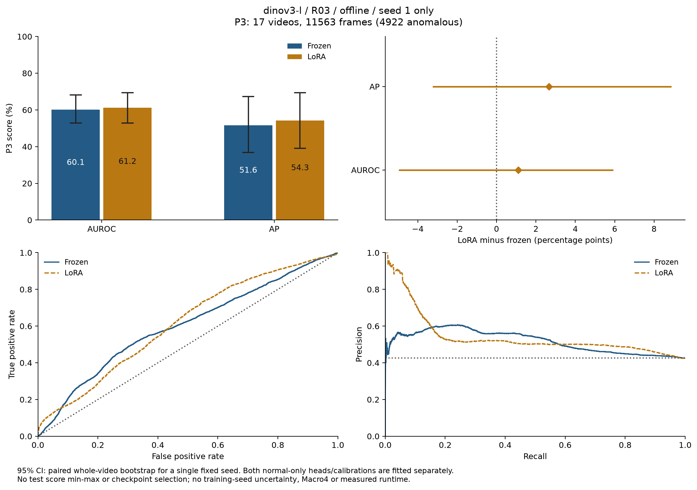

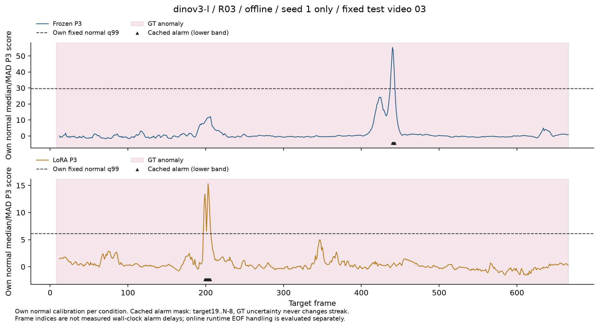

궤적은 각 조건의 정상 median/MAD와 자체 고정 q99를 사용한다. Target index는 wall-clock 탐지 지연이 아니다. 기존 CPU 수집자가 실제 종료 코드 0으로 재검증·paired 비교·plot을 완료한 산출물을 사용했고 두 PNG를 직접 확인했다. [전체 CSV·보정·single-seed CI·provenance](../results/stage04/dinov3-l/offline/R03/seed1), [독립 조건 감사](../results/stage04/condition_pipeline_checks/T1/dinov3-l/offline/R03/seed1/condition_audit.json), [원 파이프라인 완료](../results/stage04/condition_pipeline_checks/dinov3-l/offline/R03/seed1/pipeline_completion.json), [게시 검증](../results/setup/lora_dinov3_R03_seed1_evaluation_publication_check.json)을 제공한다. 모델·원본 영상·특징 배열은 업로드하지 않는다.

주 LoRA 전체 평가는 **14/48조건·4/16 세-seed 그룹**이다. 기존 R01·R02의 12조건·4그룹 집계 snapshot은 유지하며, R03의 두 개별 seed를 세-seed 평균·학습 seed 불확실성·백본 간 LoRA 우위·teacher 손실만의 효과·Macro4·실시간 성능으로 해석하지 않는다. 후속 seed·두 백본·온라인·전체 기준선·추가 실험·실시간 측정 계획을 유지한다.

재현은 기존 `scripts/plot_lora_evaluation.py`에 이 조건의 `--results`, `--frozen-results`, `--training`, `--cache`, `--local`, `--frozen-local`, `--data-root`를 전달하고 `--sequence 03 --out docs/figures/stage04`를 사용한다. 실행한 정확한 인자·종료 코드·log hash는 게시 검증의 CPU 수집 증거에 포함한다.

## 완료된 주 LoRA 14조건의 전체 재검증

기존 독립 검증 코드로 **완료된 14/48조건·4/16 세-seed 그룹**을 새 namespace에서 재검증했다. 정상 fit/calibration·선택 adapter/head·새 메모리·GT·P0–P3 점수·알람과 고정/LoRA의 **정상 임계값 112개**가 통과했다. 현재 특징 배열 **13조건**과 사전 검증·승인된 배열 정리 증거 **1조건**을 구분했다. 정리된 배열의 finite/hash 검사는 과거 검증 기록이며, metadata·선택 모델·메모리·보정·GT·점수·알람은 현재 보존 상태로 다시 검산했다.

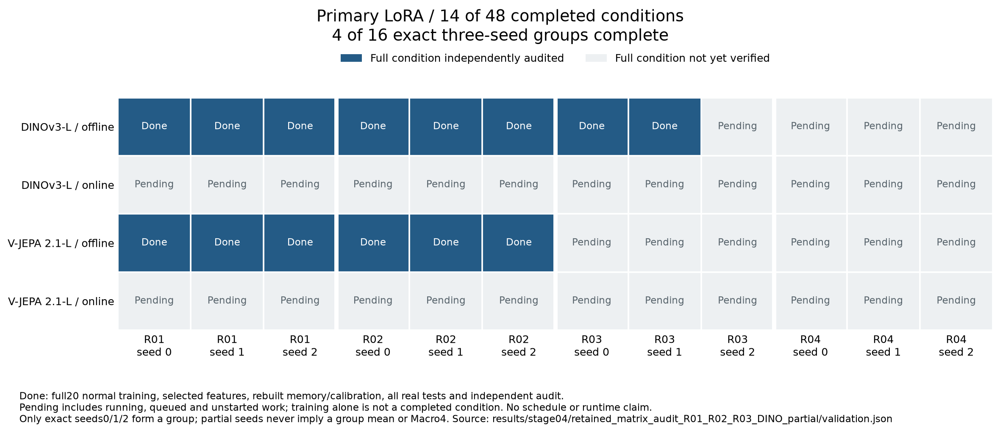

파란 칸은 원래 20 epoch 정상 학습뿐 아니라 선택 특징 재추출·메모리/보정 재구성·전체 테스트·독립 감사까지 완료한 조건이다. 회색은 전체 조건의 완료가 아직 검증되지 않았으며 진행 중·대기·미시작을 포함한다. 학습 완료만으로 파란 칸을 늘리지 않는다. DINOv3 R03 seeds 0·1은 각각 완료됐지만 seed 2가 남아 있어 R03 세-seed 평균에 넣지 않았다. 현재 LoRA의 온라인·R04 결과와 Macro4는 아직 없다.

기존 R01·R02의 **32개 treatment/점수별 평균·36개 paired 비교**와 모든 CI를 포함한 `device_summary.json`이 이전 12조건 snapshot과 **byte 단위로 동일**함을 확인했다. 세-seed 미완결 조건은 평균·CI를 추가하지 않으며 `macro_summary.json`의 결과/paired 비교는 모두 비어 있다. 기존 snapshot·개별 결과·그래프를 보존했다.

[14조건·34개 미완료 조건·보정 감사](../results/stage04/retained_matrix_audit_R01_R02_R03_DINO_partial/validation.json), [기존과 동일한 세-seed 요약·CI](../results/stage04/retained_matrix_audit_R01_R02_R03_DINO_partial/device_summary.json), [그림의 출처](figures/stage04/primary_lora_completed14_sources.json), [게시 검증](../results/setup/primary14_matrix_cached62_publication_check.json)을 제공한다. [그림 코드](../scripts/plot_lora_completion.py)는 독립 감사 및 source hash를 재확인한다. 실제 전체 CPU 테스트 **422개**가 통과했으며 부분 seed의 그룹 완료 주장·중복 seed·누락된 pending 조건·teacher 0 대체를 거부하는 검증을 포함한다. 전체 수락된 비교·추가 실험·실시간 측정 범위를 유지한다.

```bash
PYTHONPATH=src:scripts python scripts/summarize_retained_lora_matrix.py --kind lora \
  --data-root ../IPAD_dataset/IPAD_dataset --out results/stage04/retained_matrix_audit_R01_R02_R03_DINO_partial
PYTHONPATH=src:scripts python scripts/plot_lora_completion.py \
  --root results/stage04/retained_matrix_audit_R01_R02_R03_DINO_partial --data-root ../IPAD_dataset/IPAD_dataset \
  --out docs/figures/stage04/primary_lora_completed14
```

## DINOv3 R03 오프라인 seed 2의 완료된 정상 학습

원 fresh 정상-only trainer가 **20 epoch·6,420 optimizer updates**를 완료하고 실제 종료 코드 **0**을 반환했다. 정상 fit **15개 영상·2,564 clips**, 정상 calibration **4개 영상·2,771 clips**를 사용했다. Teacher weight 1·accumulation 8·BF16·최소 정상 calibration CE 선택 규칙과 원래 학습 코드를 유지했다. 진단용 정상 영상은 학습·임계값 선택에 넣지 않았다.

| 선택 epoch | 정상 calibration CE | 같은 epoch의 원형 MAE |
|---:|---:|---:|
| 20 | 3.120366 | 2.1798% |

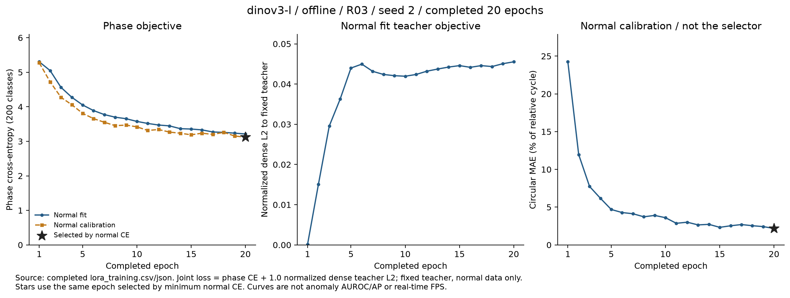

두 별표는 같은 CE 선택 epoch이며 MAE 최솟값으로 재선택하지 않았다. 기존 CPU 수집자가 실제 export·plot 종료 코드 0 이후 생성한 CSV/JSON과 PNG/SVG를 사용했고 직접 PNG를 확인했다. [학습 CSV·JSON·선택 checkpoint hash·export 검증](../results/stage04/training/dinov3-l/offline/R03/seed2), [학습 완료·그래프 검토·게시 검증](../results/setup/lora_dinov3_R03_seed2_training_publication_check.json)을 제공한다. 모델·원본 영상·특징 배열은 업로드하지 않는다.

원 pipeline owner/trainer의 boot ID·PID·start ticks와 소스 28개를 확인했다. 기존 pipeline은 실제 child.wait()가 0일 때만 full20 완료 단계를 기록한다. 이 증거와 독립 읽기 전용 관찰의 실제 종료 코드 0을 함께 확인했다. 학습·선택 checkpoint·optimizer 상태를 변경하거나 다른 seed의 checkpoint로 대체하지 않았다.

정상 학습 완료를 이상탐지 정확도 완료로 세지 않는다. 기존 공개 주 평가는 **14/48조건·4/16 세-seed 그룹**이다. 원 pipeline의 선택 특징 재추출·새 PCA/프로토타입 메모리·정상 보정·R03의 실제 17개 테스트와 독립 감사를 별도로 검증한다. Online·Macro4·teacher 0/1·전체 IPAD 기준선·추가 실험·실시간 측정의 전체 계획을 유지한다.

```bash
PYTHONPATH=src:scripts python scripts/export_lora_training.py \
  --run artifacts/lora/dinov3-l/offline/R03/seed2 --out results/stage04/training/dinov3-l/offline/R03/seed2
PYTHONPATH=src:scripts python scripts/plot_lora_training.py \
  --results results/stage04/training/dinov3-l/offline/R03/seed2 --out docs/figures/stage04/dinov3-l_R03_offline_seed2_joint_training
```

## DINOv3 R03 오프라인 seed 2의 완료된 전체 평가

원 fresh 정상-only 학습 **20 epoch·6,420 updates**의 calibration CE 선택 **epoch 20** adapter/joint head로 **36개 영상(fit 15·calibration 4·test 17)**의 특징을 재추출했다. 별도 진단용 정상 영상 3개는 포함하지 않았다. 새 PCA·16 bins·2,048개 프로토타입 메모리·온도·정상 median/MAD/q99를 구성했다. 원 학습·재추출·전체 평가와 원 파이프라인의 실제 종료 코드 **0**, 선택 tensor·새 메모리·보정·GT·시간/점수/알람 독립 감사 통과를 확인했다.

같은 seed 고정 백본과 **17개 실제 테스트·11,563개 유효 GT target(이상 4,922개)**을 비교했다. 테스트를 보고 점수 부호·선택 epoch·정상 임계값·주 점수 P3를 바꾸지 않았다.

| 점수 | 고정 백본 AUROC / AP (%) | LoRA AUROC / AP (%) |
|---|---:|---:|
| P0 | 56.38 / 48.07 | 55.57 / 50.70 |
| P1 | 58.75 / 51.58 | 58.42 / 54.86 |
| P2 | 63.97 / 53.72 | 60.33 / 55.10 |
| P3 | 60.82 / 51.40 | 63.43 / 57.70 |

| 점수 | AUROC 차이 [95% CI], pp | AP 차이 [95% CI], pp |
|---|---:|---:|
| P0 | -0.81 [-4.60, +4.58] | +2.63 [-1.51, +8.74] |
| P1 | -0.32 [-5.67, +3.83] | +3.28 [-1.57, +8.52] |
| P2 | -3.65 [-6.79, -0.48] | +1.38 [-1.76, +5.56] |
| P3 | +2.61 [-0.86, +6.67] | +6.30 [+0.24, +13.72] |

차이는 LoRA−같은 seed 고정 백본이다. **1,000회 paired 원본 영상 bootstrap·percentile 95% CI**를 사용했으며 퇴화 resample은 0개다. Seed 자체를 재표집하지 않았다. P3의 AUROC/AP CI는 각각 **0 포함/양수**다. P2 AUROC CI는 **음수**다. P0/P1의 AUROC/AP와 P2 AP CI는 0을 포함했다. 0 포함은 개선·감소의 확정이나 동등성을 뜻하지 않는다. 모든 P0–P3를 보고하며 다중 비교를 보정한 유의성 주장으로 해석하지 않는다.

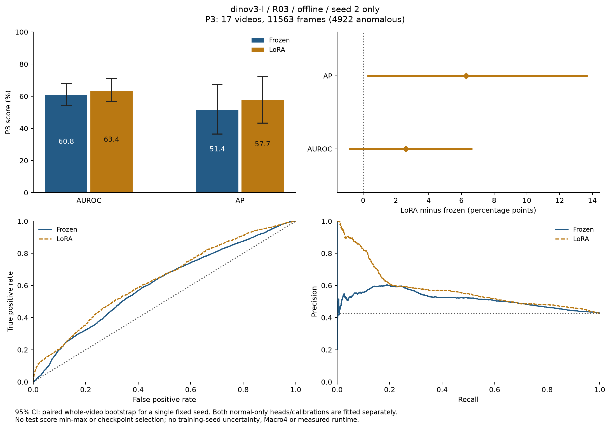

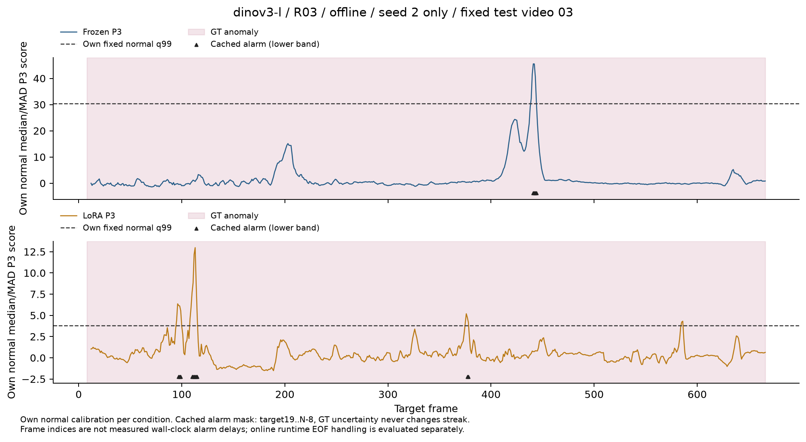

궤적은 각 조건의 정상 median/MAD와 자체 고정 q99를 사용한다. Target index는 wall-clock 탐지 지연이 아니다. 기존 CPU 수집자가 실제 종료 코드 0으로 재검증·paired 비교·plot을 완료한 산출물을 사용했고 두 PNG를 직접 확인했다. [전체 CSV·보정·single-seed CI·provenance](../results/stage04/dinov3-l/offline/R03/seed2), [독립 조건 감사](../results/stage04/condition_pipeline_checks/T1/dinov3-l/offline/R03/seed2/condition_audit.json), [원 파이프라인 완료](../results/stage04/condition_pipeline_checks/dinov3-l/offline/R03/seed2/pipeline_completion.json), [게시 검증](../results/setup/lora_dinov3_R03_seed2_evaluation_publication_check.json)을 제공한다. 모델·원본 영상·특징 배열은 업로드하지 않는다.

주 LoRA 전체 평가는 **15/48조건·5/16 세-seed 그룹**이다. R03 세-seed 집계는 아래 새 snapshot으로 별도 검증했다. 개별 seed의 CI를 세-seed CI·학습 seed 불확실성·백본 간 LoRA 우위·teacher 손실만의 효과·Macro4·실시간 성능으로 해석하지 않는다. 후속 seed·두 백본·온라인·전체 기준선·추가 실험·실시간 측정 계획을 유지한다.

재현은 기존 `scripts/plot_lora_evaluation.py`에 이 조건의 `--results`, `--frozen-results`, `--training`, `--cache`, `--local`, `--frozen-local`, `--data-root`를 전달하고 `--sequence 03 --out docs/figures/stage04`를 사용한다. 실행한 정확한 인자·종료 코드·log hash는 게시 검증의 CPU 수집 증거에 포함한다.


## 완료된 주 LoRA 15조건과 R03 DINOv3 세-seed 집계

완료된 **15/48 주 조건·5/16 exact 세-seed 그룹**을 기존 CPU 코드로 새 namespace에서 재검증했다. 정상 fit/calibration·선택 adapter/head·새 PCA/메모리·GT·P0–P3 점수·알람과 **정상 임계값 120개**를 검산했다. 현재 특징 배열 14조건과 승인된 DINOv3 R01 seed 0 배열 정리 증거 1조건을 구분했다. 정리된 배열 finite/hash 검사는 과거 기록이고, metadata·선택 모델·메모리·보정·GT·점수·알람은 현재 보존 상태로 다시 검산했다. GPU 실행과 CPU 집계·그림 검증의 실제 종료 코드 0을 확인했다.

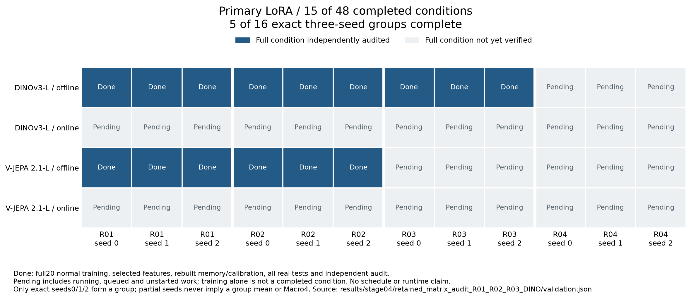

DINOv3 R03 오프라인 exact seeds 0/1/2가 모두 완료돼 새 그룹 평균을 추가했다. 각 seed의 원본 17개 영상·11,563개 유효 GT target(이상 4,922)을 동일하게 대응시키고 **seed별 전체 프레임 metric의 산술평균**을 계산했다. 세 seed 점수를 pooling하지 않았다. **1,000회 paired 원본 영상 bootstrap·percentile 95% CI**는 같은 영상 resample을 두 방법·세 seed에 공유한다. Seed 자체를 재표집하지 않으므로 CI는 학습 seed 변동의 추정이 아니다.

| 점수 | 고정 AUROC / AP 평균 (%) | LoRA AUROC / AP 평균 (%) | AUROC 차이 [95% CI], pp | AP 차이 [95% CI], pp |
|---|---:|---:|---:|---:|
| P0 | 54.54 / 47.32 | 56.44 / 49.30 | +1.90 [-1.16, +6.38] | +1.99 [-0.94, +6.59] |
| P1 | 60.47 / 52.42 | 57.83 / 53.34 | -2.64 [-6.17, +0.24] | +0.92 [-1.93, +4.97] |
| P2 | 62.48 / 53.76 | 60.09 / 54.34 | -2.39 [-5.73, +0.61] | +0.58 [-2.36, +4.32] |
| P3 | 60.68 / 51.82 | 62.44 / 56.23 | +1.76 [-2.56, +5.47] | +4.40 [-0.73, +10.66] |

P0–P3의 LoRA−고정 AUROC/AP 차이 CI는 모두 0을 포함했다. P3 평균 차이 **+1.76/+4.40pp**만으로 개선이나 동등성을 확정하지 않는다. 같은 LoRA 안에서 P3−P0 차이는 **AUROC +5.99pp [1.52, 11.33], AP +6.92pp [1.78, 12.29]**였다. 테스트 기반 점수 선택·부호 반전·epoch/임계값 변경 없이 기본 P3와 모든 P0–P3를 보고한다. 다중 비교를 보정한 유의성 또는 teacher 손실만의 효과로 해석하지 않는다.

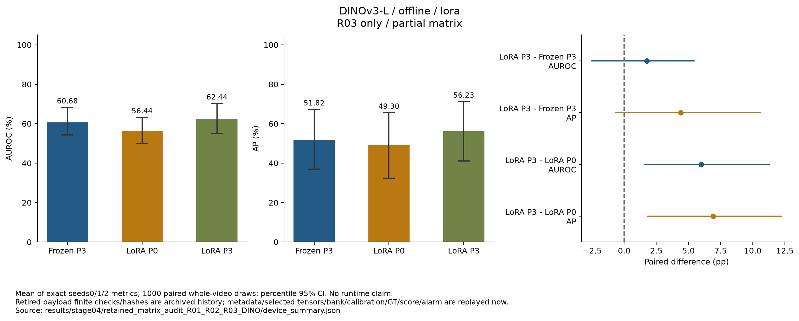

기존 R01·R02 **32개 평균과 36개 paired 비교 및 모든 CI**는 새 요약에서 숫자와 필드가 정확히 동일하다. R03의 8개 평균·5개 paired 비교를 추가해 40개 평균·41개 비교를 제공한다. 이전 12·14조건 snapshot, 개별 결과와 그림은 보존했다. 현재 온라인 LoRA·R04·LoRA Macro4는 아직 없으며 V-JEPA R03 세-seed 결과가 없어 R03 LoRA 백본 우위를 주장하지 않는다. 전체 수락된 실험 범위를 유지한다.

[15조건·33개 pending·source와 보정 감사](../results/stage04/retained_matrix_audit_R01_R02_R03_DINO/validation.json), [새 5그룹 모든 평균·CI·paired 비교](../results/stage04/retained_matrix_audit_R01_R02_R03_DINO/device_summary.json), [원본 집계/그림 증거](../results/stage04/retained_matrix_audit_R01_R02_R03_DINO/figure_sources.json), [게시 검증](../results/setup/lora_dinov3_R03_seed2_evaluation_publication_check.json)을 제공한다. `plot_retained_lora.py`는 선택 tensor·보존 evidence·점수와 그림의 평균/CI를 새로 검산하며 5개 그룹 전체 PNG/SVG를 제공한다. 완료 그림의 회색은 실행 중·대기·미시작을 포함하며 학습 완료만으로 조건 완료를 표시하지 않는다. 원본 영상·특징 배열·큰 모델은 업로드하지 않았다. 전체 CPU invariant 테스트 422개를 재사용한 검증 증거 및 별도 exact commit CI를 확인한다.

```bash
PYTHONPATH=src:scripts python scripts/summarize_retained_lora_matrix.py --kind lora --data-root ../IPAD_dataset/IPAD_dataset --out results/stage04/retained_matrix_audit_R01_R02_R03_DINO
PYTHONPATH=src:scripts python scripts/plot_retained_lora.py --kind lora --root results/stage04/retained_matrix_audit_R01_R02_R03_DINO --data-root ../IPAD_dataset/IPAD_dataset --out docs/figures/stage04/retained_R01_R02_R03_DINO
PYTHONPATH=src:scripts python scripts/plot_lora_completion.py --root results/stage04/retained_matrix_audit_R01_R02_R03_DINO --data-root ../IPAD_dataset/IPAD_dataset --out docs/figures/stage04/primary_lora_completed15
```


## V-JEPA R03 오프라인 seed 0의 완료된 정상 학습

원 fresh 정상-only 학습 **20 epoch·6,420 updates**를 완료했다. Fit 15개 영상·2,564 clips와 별도 calibration 4개 영상·2,771 clips를 사용하고 teacher weight 1·accumulation 8·BF16을 유지했다. 정상 calibration CE 최솟값의 **epoch 17**을 선택했다. 선택 CE는 **5.281197**, 같은 epoch 원형 MAE는 **24.4747%**다. MAE로 재선택하지 않았다.

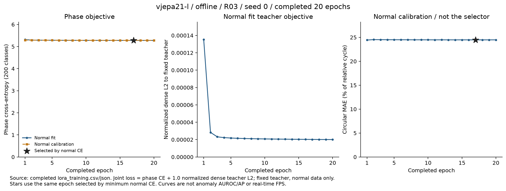

CE와 MAE 곡선은 대부분 평평하며, 이 정상 학습 지표만으로 이상탐지 정확도나 백본 우위를 판단하지 않는다. 기존 source-bound 원 pipeline은 child.wait()가 0일 때만 full20 완료 단계를 기록한다. 이 단계와 기존 CPU exporter·plot의 실제 종료 코드 0, 5개 로컬 학습 파일 hash 보존 및 실제 PNG 검토를 확인했다. 선택 특징·새 메모리·보정·전체 17개 테스트 평가는 별도 조건 감사가 필요하다. 이 학습 단계는 위 15개 완료 정확도 조건·5개 세-seed 그룹에 추가하지 않았다. 모델·optimizer·원본 영상·특징 배열은 업로드하지 않는다.

[20 epoch CSV·JSON·선택 checkpoint hash·export 검증](../results/stage04/training/vjepa21-l/offline/R03/seed0), [동시 게시된 학습/그래프 검증](../results/setup/lora_dinov3_R03_seed2_evaluation_publication_check.json)을 제공한다. 전체 비교·온라인·Macro4·제거 실험·실시간 계획을 유지한다.

```bash
PYTHONPATH=src:scripts python scripts/export_lora_training.py --run artifacts/lora/vjepa21-l/offline/R03/seed0 --out results/stage04/training/vjepa21-l/offline/R03/seed0
PYTHONPATH=src:scripts python scripts/plot_lora_training.py --results results/stage04/training/vjepa21-l/offline/R03/seed0 --out docs/figures/stage04/vjepa21-l_R03_offline_seed0_joint_training
```

## V-JEPA R03 오프라인 seed 0의 완료된 전체 평가

원 fresh 정상-only 학습 **20 epoch·6,420 updates**의 calibration CE 선택 **epoch 17** adapter/joint head로 **36개 영상(fit 15·calibration 4·test 17)**의 특징을 재추출했다. 별도 진단용 정상 영상 3개는 포함하지 않았다. 새 PCA·16 bins·2,048개 프로토타입 메모리·온도·정상 median/MAD/q99를 구성했다. 원 학습·재추출·전체 평가와 원 파이프라인의 실제 종료 코드 **0**, 선택 tensor·새 메모리·보정·GT·시간/점수/알람 독립 감사 통과를 확인했다.

같은 seed 고정 백본과 **17개 실제 테스트·11,563개 유효 GT target(이상 4,922개)**을 비교했다. 테스트를 보고 점수 부호·선택 epoch·정상 임계값·주 점수 P3를 바꾸지 않았다.

| 점수 | 고정 백본 AUROC / AP (%) | LoRA AUROC / AP (%) |
|---|---:|---:|
| P0 | 44.96 / 37.96 | 45.52 / 37.99 |
| P1 | 52.80 / 42.87 | 45.96 / 38.23 |
| P2 | 51.33 / 43.18 | 44.90 / 38.50 |
| P3 | 51.33 / 44.08 | 44.42 / 37.82 |

| 점수 | AUROC 차이 [95% CI], pp | AP 차이 [95% CI], pp |
|---|---:|---:|
| P0 | +0.56 [-1.37, +2.07] | +0.03 [-0.96, +0.98] |
| P1 | -6.85 [-17.44, +3.27] | -4.65 [-13.80, +1.23] |
| P2 | -6.43 [-19.65, +4.61] | -4.67 [-15.59, +2.22] |
| P3 | -6.92 [-17.60, +2.24] | -6.26 [-13.99, -0.33] |

차이는 LoRA−같은 seed 고정 백본이다. **1,000회 paired 원본 영상 bootstrap·percentile 95% CI**를 사용했으며 퇴화 resample은 0개다. Seed 자체를 재표집하지 않았다. P3의 AUROC/AP CI는 각각 **0 포함/음수**다. P0–P2의 모든 AUROC/AP CI는 0을 포함했다. P3 AP CI는 음수였다. 0 포함은 개선·감소의 확정이나 동등성을 뜻하지 않는다. 모든 P0–P3를 보고하며 다중 비교를 보정한 유의성 주장으로 해석하지 않는다.

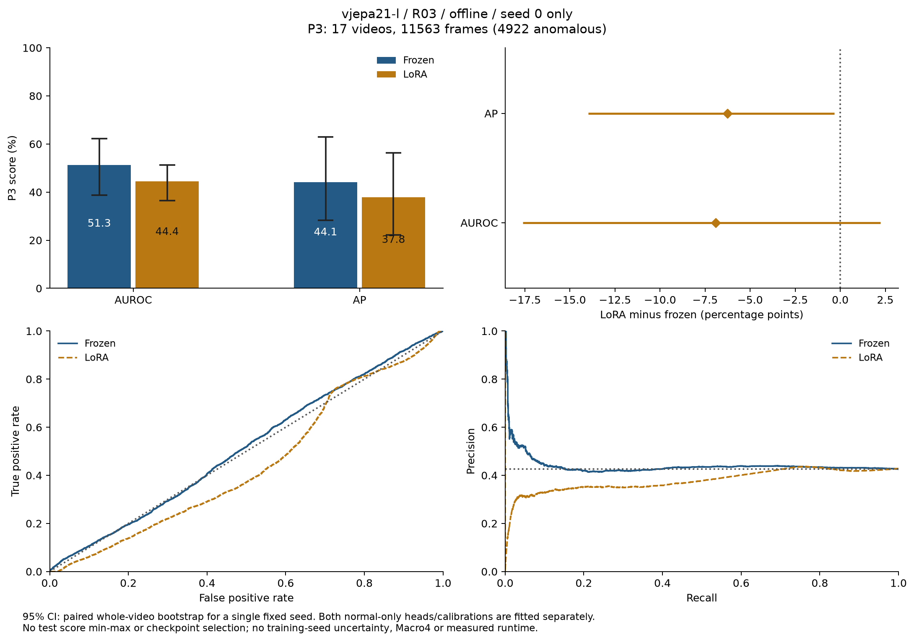

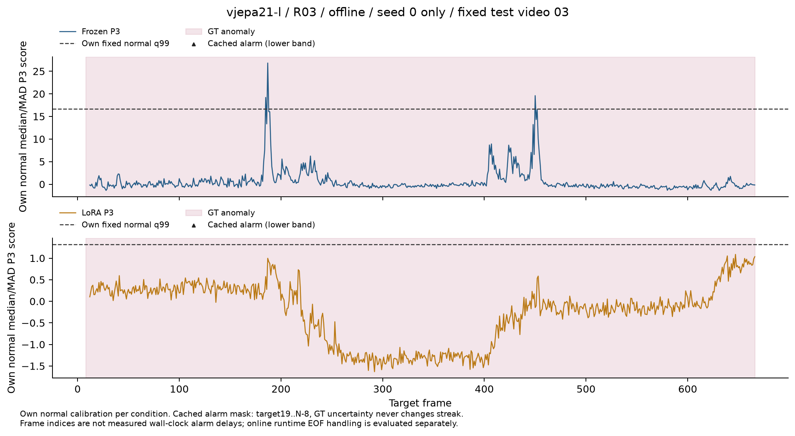

궤적은 각 조건의 정상 median/MAD와 자체 고정 q99를 사용한다. Target index는 wall-clock 탐지 지연이 아니다. 기존 CPU 수집자가 실제 종료 코드 0으로 재검증·paired 비교·plot을 완료한 산출물을 사용했고 두 PNG를 직접 확인했다. [전체 CSV·보정·single-seed CI·provenance](../results/stage04/vjepa21-l/offline/R03/seed0), [독립 조건 감사](../results/stage04/condition_pipeline_checks/T1/vjepa21-l/offline/R03/seed0/condition_audit.json), [원 파이프라인 완료](../results/stage04/condition_pipeline_checks/vjepa21-l/offline/R03/seed0/pipeline_completion.json), [게시 검증](../results/setup/lora_vjepa_R03_seed0_evaluation_publication_check.json)을 제공한다. 모델·원본 영상·특징 배열은 업로드하지 않는다.

주 LoRA 전체 평가는 **16/48조건·5/16 세-seed 그룹**이다. 기존 15조건·5그룹 집계 snapshot을 보존하고 V-JEPA seed 0의 원 전체 평가만 추가했다. 이 개별 seed를 V-JEPA R03 세-seed 평균·학습 seed 불확실성·백본 간 LoRA 우위·teacher 손실만의 효과·Macro4·실시간 성능으로 해석하지 않는다. 후속 seed·두 백본·온라인·전체 기준선·추가 실험·실시간 측정 계획을 유지한다.

재현은 기존 `scripts/plot_lora_evaluation.py`에 이 조건의 `--results`, `--frozen-results`, `--training`, `--cache`, `--local`, `--frozen-local`, `--data-root`를 전달하고 `--sequence 03 --out docs/figures/stage04`를 사용한다. 실행한 정확한 인자·종료 코드·log hash는 게시 검증의 CPU 수집 증거에 포함한다.

## 완료된 주 LoRA 16조건의 전체 재검증

완료된 **16/48조건·5/16 exact 세-seed 그룹**을 새 namespace에서 기존 독립 CPU 코드로 재검증했다. DINOv3 R01–R03 세 seeds와 V-JEPA R01·R02 세 seeds 및 R03 seed 0의 정상 fit/calibration·선택 adapter/head·메모리·GT·P0–P3 점수/알람 및 **정상 임계값 128개**를 검산했다. 현재 특징 배열 15조건과 승인된 R01 DINOv3 seed 0 배열 정리 증거 1조건을 구분했다. 과거 payload finite/hash 증거와 현재 보존 metadata/tensor/bank/보정/trace 재검산의 범위를 구분한다.

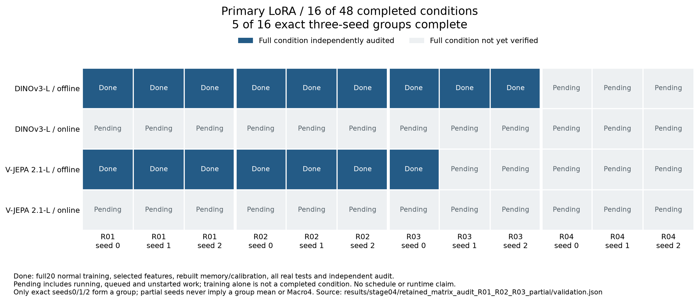

기존 15조건 snapshot의 **평균 40개·paired 비교 41개와 모든 CI**를 담은 device summary 및 빈 Macro4 summary가 새 snapshot에서 **byte 단위로 동일**하다. V-JEPA R03은 seed 0만 완료됐으므로 새 그룹 평균/CI에 넣지 않았다. 32개 pending 조건에는 실행 중·대기·미시작이 포함되며 정상 학습만으로 완료를 선언하지 않는다. 이전 12·14·15조건 집계와 그림을 보존했다.

[16조건·32 pending·정상 임계값 감사](../results/stage04/retained_matrix_audit_R01_R02_R03_partial/validation.json), [변하지 않은 5그룹 평균·CI](../results/stage04/retained_matrix_audit_R01_R02_R03_partial/device_summary.json), [그림의 source](figures/stage04/primary_lora_completed16_sources.json), [게시 검증](../results/setup/primary16_matrix_cached64_publication_check.json)을 제공한다. Original CPU 집계/그림 검증의 실제 종료 코드 0과 직접 PNG 검토를 확인했다. 전체 invariant 테스트 422개 및 exact 새 commit CI를 확인하며 원 GPU 후속 학습·전체 온라인/Macro4·기준선·추가/실시간 계획을 유지한다. 모델·원본 영상·특징 배열을 업로드하지 않았다.

```bash
PYTHONPATH=src:scripts python scripts/summarize_retained_lora_matrix.py --kind lora --data-root ../IPAD_dataset/IPAD_dataset --out results/stage04/retained_matrix_audit_R01_R02_R03_partial
PYTHONPATH=src:scripts python scripts/plot_lora_completion.py --root results/stage04/retained_matrix_audit_R01_R02_R03_partial --data-root ../IPAD_dataset/IPAD_dataset --out docs/figures/stage04/primary_lora_completed16
```

## V-JEPA R03 오프라인 seed 1의 완료된 정상 학습

원 fresh 정상-only 학습이 **20 epoch·6,420 optimizer updates**를 완료했다. Fit **15개 영상·2,564 clips**, 별도 calibration **4개 영상·2,771 clips**를 사용하고 teacher weight 1·accumulation 8·BF16과 원래 학습 코드를 유지했다. 최소 정상 calibration CE의 epoch **19**을 선택했다.

| 선택 epoch | 정상 calibration CE | 같은 epoch의 원형 MAE |
|---:|---:|---:|
| 19 | 4.675610 | 13.1437% |

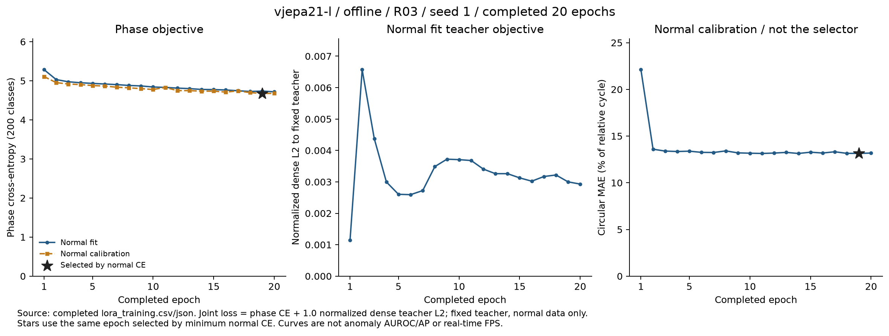

MAE 최솟값으로 재선택하지 않았다. 원 source-bound pipeline은 실제 trainer의 `child.wait()`가 0일 때만 full20 완료 단계를 기록한다. 이 단계와 원 CPU 수집기의 export·plot 실제 종료 코드 0, 보존된 로컬 학습 파일 다섯 개의 해시 및 직접 PNG 검토를 확인했다.

[전체 학습 CSV·JSON·선택 checkpoint 해시·export 검증](../results/stage04/training/vjepa21-l/offline/R03/seed1), [학습 완료·시각화 검토·게시 검증](../results/setup/lora_vjepa_R03_seed1_training_publication_check.json)을 제공한다. 공개된 정확도 행렬은 **16/48조건·5/16 세-seed 그룹**이며 이 정상 학습 단계를 추가 조건으로 세지 않는다. 선택 특징 재추출·새 PCA/메모리·정상 보정·전체 **17개 실제 테스트**의 독립 평가는 별도로 완료해야 한다. 전체 온라인·teacher 0/1·IPAD 기준선·추가 실험·실시간 비교를 유지한다. 원본 영상·특징·모델·optimizer 파일은 업로드하지 않는다.

```bash
PYTHONPATH=src:scripts python scripts/export_lora_training.py --run artifacts/lora/vjepa21-l/offline/R03/seed1 --out results/stage04/training/vjepa21-l/offline/R03/seed1
PYTHONPATH=src:scripts python scripts/plot_lora_training.py --results results/stage04/training/vjepa21-l/offline/R03/seed1 --out docs/figures/stage04/vjepa21-l_R03_offline_seed1_joint_training
```

## V-JEPA R03 오프라인 seed 1의 완료된 전체 평가

원 fresh 정상-only 학습 **20 epoch·6,420 updates**의 calibration CE 선택 **epoch 19** adapter/joint head로 **36개 영상(fit 15·calibration 4·test 17)**의 특징을 재추출했다. 별도 진단용 정상 영상 3개는 포함하지 않았다. 새 PCA·16 bins·2,048개 프로토타입 메모리·온도·정상 median/MAD/q99를 구성했다. 원 학습·재추출·전체 평가와 원 파이프라인의 실제 종료 코드 **0**, 선택 tensor·새 메모리·보정·GT·시간/점수/알람 독립 감사 통과를 확인했다.

같은 seed 고정 백본과 **17개 실제 테스트·11,563개 유효 GT target(이상 4,922개)**을 비교했다. 테스트를 보고 점수 부호·선택 epoch·정상 임계값·주 점수 P3를 바꾸지 않았다.

| 점수 | 고정 백본 AUROC / AP (%) | LoRA AUROC / AP (%) |
|---|---:|---:|
| P0 | 45.15 / 37.66 | 44.85 / 37.34 |
| P1 | 47.49 / 40.25 | 48.16 / 42.03 |
| P2 | 48.45 / 41.65 | 49.21 / 42.91 |
| P3 | 49.31 / 43.16 | 48.64 / 42.68 |

| 점수 | AUROC 차이 [95% CI], pp | AP 차이 [95% CI], pp |
|---|---:|---:|
| P0 | -0.30 [-2.73, +1.96] | -0.32 [-1.63, +0.61] |
| P1 | +0.66 [-5.56, +6.93] | +1.79 [-3.89, +5.23] |
| P2 | +0.76 [-5.54, +6.90] | +1.26 [-4.98, +5.37] |
| P3 | -0.67 [-8.85, +7.55] | -0.48 [-8.00, +5.23] |

차이는 LoRA−같은 seed 고정 백본이다. **1,000회 paired 원본 영상 bootstrap·percentile 95% CI**를 사용했으며 퇴화 resample은 0개다. Seed 자체를 재표집하지 않았다. P3의 AUROC/AP CI는 각각 **0 포함/0 포함**다. P0–P2의 AUROC/AP CI 분류는 P0 0 포함/0 포함, P1 0 포함/0 포함, P2 0 포함/0 포함다. 0 포함은 개선·감소의 확정이나 동등성을 뜻하지 않는다. 모든 P0–P3를 보고하며 다중 비교를 보정한 유의성 주장으로 해석하지 않는다.


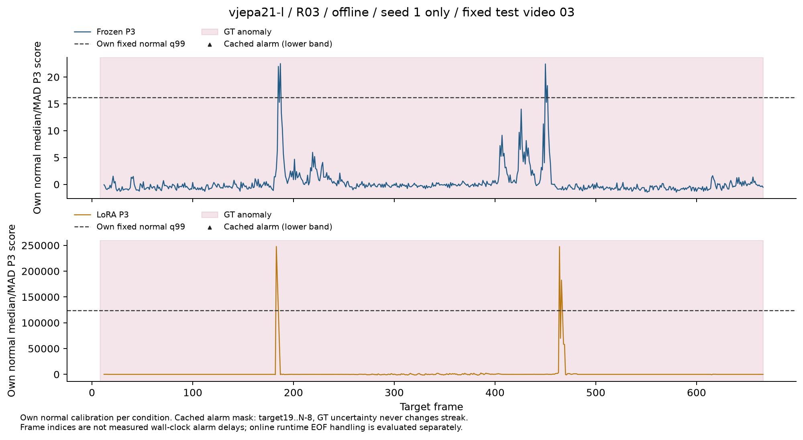

궤적은 각 조건의 정상 median/MAD와 자체 고정 q99를 사용한다. Target index는 wall-clock 탐지 지연이 아니다. 기존 CPU 수집자가 실제 종료 코드 0으로 재검증·paired 비교·plot을 완료한 산출물을 사용했고 두 PNG를 직접 확인했다. [전체 CSV·보정·single-seed CI·provenance](../results/stage04/vjepa21-l/offline/R03/seed1), [독립 조건 감사](../results/stage04/condition_pipeline_checks/T1/vjepa21-l/offline/R03/seed1/condition_audit.json), [원 파이프라인 완료](../results/stage04/condition_pipeline_checks/vjepa21-l/offline/R03/seed1/pipeline_completion.json), [게시 검증](../results/setup/lora_vjepa_R03_seed1_evaluation_publication_check.json)을 제공한다. 모델·원본 영상·특징 배열은 업로드하지 않는다.

주 LoRA 전체 평가는 **17/48조건·5/16 세-seed 그룹**이다. 기존 16조건·5그룹 집계 snapshot을 보존하고 V-JEPA seed 1의 원 전체 평가만 추가했다. 이 개별 seed를 V-JEPA R03 세-seed 평균·학습 seed 불확실성·백본 간 LoRA 우위·teacher 손실만의 효과·Macro4·실시간 성능으로 해석하지 않는다. 후속 seed·두 백본·온라인·전체 기준선·추가 실험·실시간 측정 계획을 유지한다.

재현은 기존 `scripts/plot_lora_evaluation.py`에 이 조건의 `--results`, `--frozen-results`, `--training`, `--cache`, `--local`, `--frozen-local`, `--data-root`를 전달하고 `--sequence 03 --out docs/figures/stage04`를 사용한다. 실행한 정확한 인자·종료 코드·log hash는 게시 검증의 CPU 수집 증거에 포함한다.

## 완료된 주 LoRA 17조건의 전체 재검증

완료된 **17/48조건·5/16 exact 세-seed 그룹**을 새 namespace에서 기존 독립 CPU 코드로 재검증했다. DINOv3 R01–R03 세 seeds와 V-JEPA R01·R02 세 seeds 및 R03 seeds 0/1의 정상 fit/calibration·선택 adapter/head·메모리·GT·P0–P3 점수/알람 및 **정상 임계값 136개**를 검산했다. 현재 특징 배열 16조건과 승인된 R01 DINOv3 seed 0 배열 정리 증거 1조건을 구분했다. 과거 payload finite/hash 증거와 현재 보존 metadata/tensor/bank/보정/trace 재검산의 범위를 구분한다.

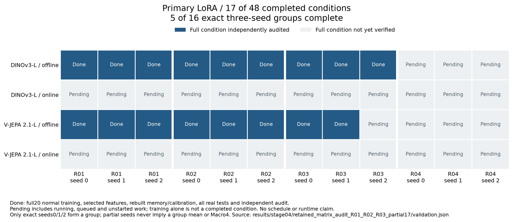

기존 16조건 snapshot의 **평균 40개·paired 비교 41개와 모든 CI**를 담은 device summary 및 빈 Macro4 summary가 새 snapshot에서 **byte 단위로 동일**하다. V-JEPA R03은 seeds 0/1만 완료됐으므로 새 그룹 평균/CI에 넣지 않았다. 31개 pending 조건에는 실행 중·대기·미시작이 포함되며 정상 학습만으로 완료를 선언하지 않는다. 이전 12·14·15·16조건 집계와 그림을 보존했다.

[17조건·31 pending·정상 임계값 감사](../results/stage04/retained_matrix_audit_R01_R02_R03_partial17/validation.json), [변하지 않은 5그룹 평균·CI](../results/stage04/retained_matrix_audit_R01_R02_R03_partial17/device_summary.json), [그림의 source](figures/stage04/primary_lora_completed17_sources.json), [게시 검증](../results/setup/primary17_matrix_cached65_publication_check.json)을 제공한다. Original CPU 집계/그림 검증의 실제 종료 코드 0과 직접 PNG 검토를 확인했다. 전체 invariant 테스트 422개 및 exact 새 commit CI를 확인하며 원 GPU 후속 학습·전체 온라인/Macro4·기준선·추가/실시간 계획을 유지한다. 모델·원본 영상·특징 배열을 업로드하지 않았다.

```bash
PYTHONPATH=src:scripts python scripts/summarize_retained_lora_matrix.py --kind lora --data-root ../IPAD_dataset/IPAD_dataset --out results/stage04/retained_matrix_audit_R01_R02_R03_partial17
PYTHONPATH=src:scripts python scripts/plot_lora_completion.py --root results/stage04/retained_matrix_audit_R01_R02_R03_partial17 --data-root ../IPAD_dataset/IPAD_dataset --out docs/figures/stage04/primary_lora_completed17
```

## V-JEPA R03 오프라인 seed 2의 완료된 정상 학습

원 fresh 정상-only 학습이 **20 epoch·6,420 optimizer updates**를 완료했다. Fit **15개 영상·2,564 clips**, 별도 calibration **4개 영상·2,771 clips**를 사용하고 teacher weight 1·accumulation 8·BF16과 원래 학습 코드를 유지했다. 최소 정상 calibration CE의 epoch **19**을 선택했다.

| 선택 epoch | 정상 calibration CE | 같은 epoch의 원형 MAE |
|---:|---:|---:|
| 19 | 3.072021 | 1.9989% |

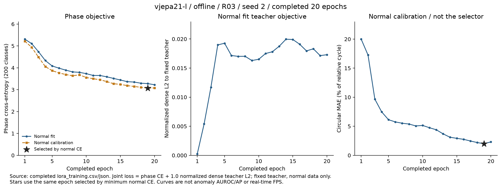

MAE 최솟값으로 재선택하지 않았다. 원 source-bound pipeline은 실제 trainer의 `child.wait()`가 0일 때만 full20 완료 단계를 기록한다. 이 단계와 원 CPU 수집기의 export·plot 실제 종료 코드 0, 보존된 로컬 학습 파일 다섯 개의 해시 및 직접 PNG 검토를 확인했다.

[전체 학습 CSV·JSON·선택 checkpoint 해시·export 검증](../results/stage04/training/vjepa21-l/offline/R03/seed2), [학습 완료·시각화 검토·게시 검증](../results/setup/lora_vjepa_R03_seed2_training_publication_check.json)을 제공한다. 공개된 정확도 행렬은 **17/48조건·5/16 세-seed 그룹**이며 이 정상 학습 단계를 추가 조건으로 세지 않는다. 선택 특징 재추출·새 PCA/메모리·정상 보정·전체 **17개 실제 테스트**의 독립 평가는 별도로 완료해야 한다. 전체 온라인·teacher 0/1·IPAD 기준선·추가 실험·실시간 비교를 유지한다. 원본 영상·특징·모델·optimizer 파일은 업로드하지 않는다.

```bash
PYTHONPATH=src:scripts python scripts/export_lora_training.py --run artifacts/lora/vjepa21-l/offline/R03/seed2 --out results/stage04/training/vjepa21-l/offline/R03/seed2
PYTHONPATH=src:scripts python scripts/plot_lora_training.py --results results/stage04/training/vjepa21-l/offline/R03/seed2 --out docs/figures/stage04/vjepa21-l_R03_offline_seed2_joint_training
```

## V-JEPA R03 seed 2와 세 seed 백본 비교의 완료된 평가

Seed 2의 fresh **20 epoch·6,420 updates**, 정상 calibration CE 선택 epoch **19**로 fit 15·calibration 4·test 17의 **36개 영상**을 재추출하고 PCA·프로토타입 메모리·정상 보정을 새로 구성했다. 진단용 정상 3개는 제외했다. 원 파이프라인 세 단계의 실제 종료 코드 0과 선택 tensor·메모리·정상 임계값·GT·시간·P0–P3 점수·알람의 독립 감사를 확인했다. 모든 **17개 테스트·11,563개 유효 GT(이상 4,922개)**를 같은 seed 고정 백본과 비교했다.

| 점수 | 고정 AUROC / AP (%) | LoRA AUROC / AP (%) | AUROC 차이 [95% CI], pp | AP 차이 [95% CI], pp |
|---|---:|---:|---:|---:|
| P0 | 46.91 / 38.32 | 45.11 / 37.74 | -1.80 [-5.17, +1.25] | -0.58 [-2.87, +0.64] |
| P1 | 50.85 / 41.58 | 49.75 / 42.04 | -1.10 [-6.01, +5.15] | +0.46 [-2.20, +4.42] |
| P2 | 51.67 / 43.39 | 50.39 / 43.83 | -1.28 [-5.26, +4.58] | +0.43 [-2.63, +6.53] |
| P3 | 50.70 / 43.36 | 51.01 / 46.85 | +0.31 [-3.67, +5.07] | +3.49 [-1.44, +10.21] |

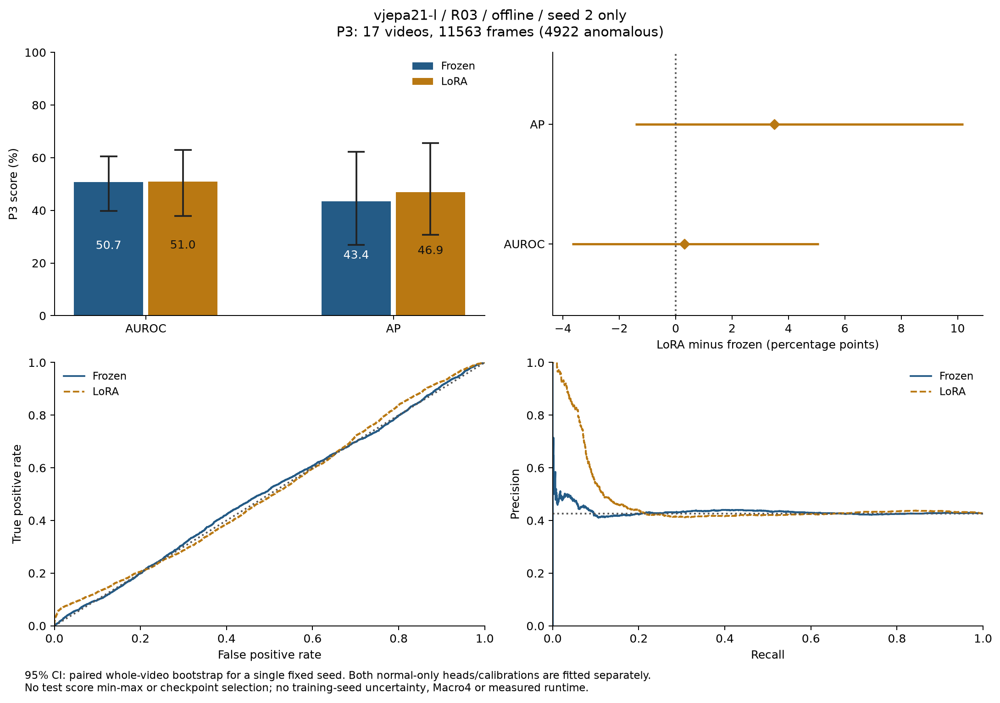

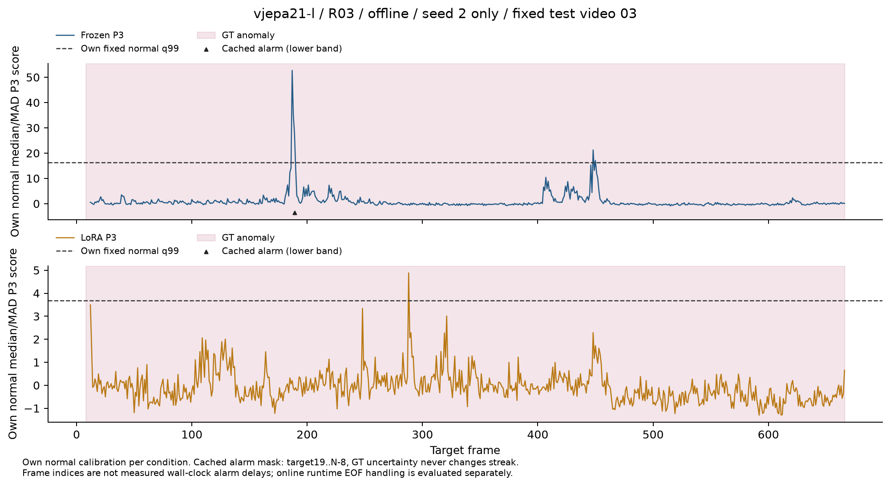

[전체 개별 seed CSV·P0–P3·보정·paired CI](../results/stage04/vjepa21-l/offline/R03/seed2), [독립 조건 감사](../results/stage04/condition_pipeline_checks/T1/vjepa21-l/offline/R03/seed2/condition_audit.json), [원 완료 증거](../results/stage04/condition_pipeline_checks/vjepa21-l/offline/R03/seed2/pipeline_completion.json)를 제공한다. Seed 2의 P3 AUROC/AP 차이 CI는 각각 **0 포함/0 포함**이다.

이제 **18/48조건·6/16 세-seed 그룹**을 새 namespace에서 재검산했고, 정상 임계값 **144개**를 확인했다. 현재 배열 17조건과 승인된 배열 정리 증거 1조건을 구분했다. 기존 평균 40행·paired 비교 41행과 모든 CI는 그대로 유지되며, 새 집계에는 평균 **48행·paired 비교 54행**이 있다. V-JEPA R03과 R03 백본 비교는 exact seeds 0/1/2만 사용했다.

| R03 세 seed 비교 | AUROC / AP 또는 차이 (%) / (pp) | AUROC 차이 95% CI, pp | AP 차이 95% CI, pp |
|---|---:|---:|---:|
| V-JEPA 고정 P3 평균 | 50.45 / 43.53 | — | — |
| V-JEPA LoRA P3 평균 | 48.02 / 42.45 | — | — |
| V-JEPA LoRA−고정 P3 | -2.43 / -1.08 | -2.43 [-7.66, +2.75] | -1.08 [-4.98, +2.38] |
| LoRA P3 V-JEPA−DINOv3 | -14.42 / -13.78 | -14.42 [-19.64, -9.60] | -13.78 [-19.68, -8.28] |

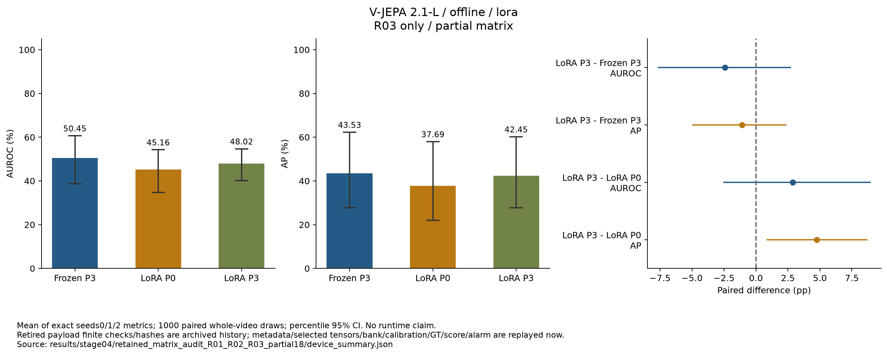

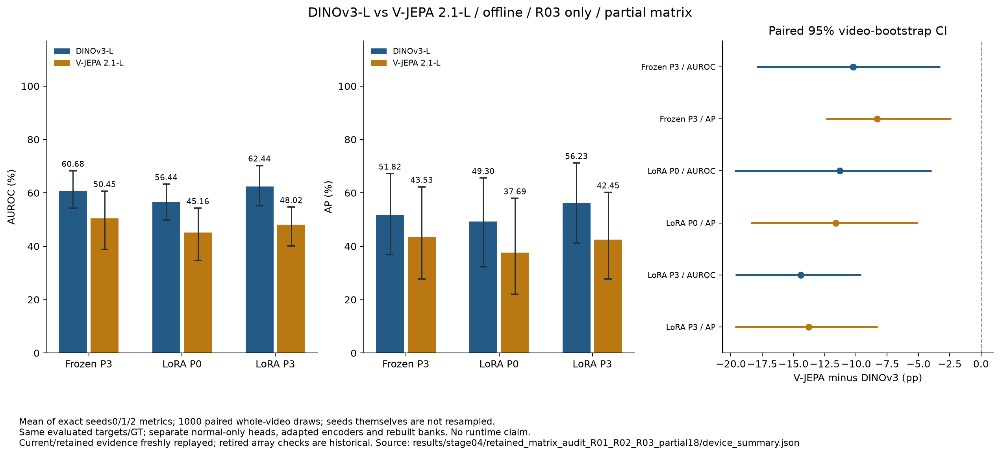

V-JEPA LoRA−고정 P3의 AUROC/AP CI는 **0 포함/0 포함**, LoRA P3 V-JEPA−DINOv3의 CI는 **음수/음수**다. 표의 차이 값과 CI는 동일 차이를 함께 표시한다. 평균은 세 seed별 metric의 산술평균이며 **1,000회 paired 원본 영상 bootstrap·percentile 95% CI**를 사용했다. Seed 자체를 재표집하지 않았고, 테스트로 epoch·부호·임계값·P3를 바꾸지 않았다. 0 포함은 동등성을 증명하지 않으며 다중 비교를 보정한 유의성 주장으로 해석하지 않는다.

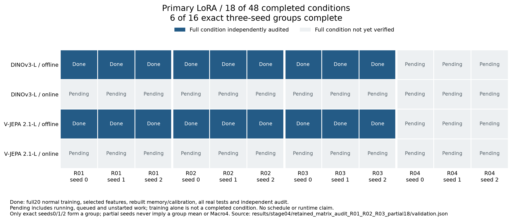

[전체 6그룹 P0–P3·paired CI](../results/stage04/retained_matrix_audit_R01_R02_R03_partial18/device_summary.json), [18조건 감사·30 pending](../results/stage04/retained_matrix_audit_R01_R02_R03_partial18/validation.json), [모든 집계 그림의 source](../results/stage04/retained_matrix_audit_R01_R02_R03_partial18/figure_sources.json), [3개 백본 쌍의 통계 재검산](../results/stage04/retained_matrix_audit_R01_R02_R03_partial18/backbone_figure_sources.json), [게시 검증](../results/setup/primary18_VJ_R03_seed2_matrix_cached66_publication_check.json)을 제공한다. 기존 17조건 snapshot을 보존했다. R04·온라인 LoRA·teacher 0/1·원 IPAD 기준선·OFAT·진단·실시간 비교는 계속 필요하며 **LoRA Macro4는 아직 없다**. 정상 학습·calibration MAE를 이상탐지 정확도나 실시간 FPS로 해석하지 않는다. 원본 영상·모델·특징·optimizer 파일은 업로드하지 않는다.

## DINOv3 R04 오프라인 seed 0의 완료된 정상 학습

원 fresh 정상-only 학습이 **20 epoch·4,000 optimizer updates**를 완료했다. Fit **17개 영상·1,596 clips**, 별도 calibration **4개 영상·1,546 clips**를 사용하고 teacher weight 1·accumulation 8·BF16과 원래 학습 코드를 유지했다. 최소 정상 calibration CE의 epoch **18**을 선택했다.

| 선택 epoch | 정상 calibration CE | 같은 epoch의 원형 MAE |
|---:|---:|---:|
| 18 | 3.565851 | 3.4863% |

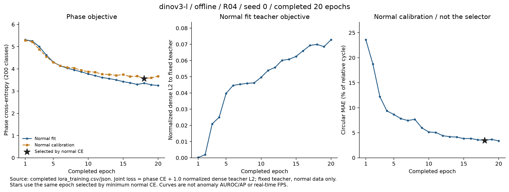

MAE 최솟값으로 재선택하지 않았다. 원 source-bound pipeline은 실제 trainer의 `child.wait()`가 0일 때만 full20 완료 단계를 기록한다. 이 단계와 원 CPU 수집기의 export·plot 실제 종료 코드 0, 보존된 로컬 학습 파일 다섯 개의 해시 및 직접 PNG 검토를 확인했다.

[전체 학습 CSV·JSON·선택 checkpoint 해시·export 검증](../results/stage04/training/dinov3-l/offline/R04/seed0), [학습 완료·시각화 검토·게시 검증](../results/setup/lora_dinov3_R04_seed0_training_publication_check.json)을 제공한다. 공개된 정확도 행렬은 **18/48조건·6/16 세-seed 그룹**이며 이 정상 학습 단계를 추가 조건으로 세지 않는다. 선택 특징 재추출·새 PCA/메모리·정상 보정·전체 **19개 실제 테스트**의 독립 평가는 별도로 완료해야 한다. 전체 온라인·teacher 0/1·IPAD 기준선·추가 실험·실시간 비교를 유지한다. 원본 영상·특징·모델·optimizer 파일은 업로드하지 않는다.

```bash
PYTHONPATH=src:scripts python scripts/export_lora_training.py --run artifacts/lora/dinov3-l/offline/R04/seed0 --out results/stage04/training/dinov3-l/offline/R04/seed0
PYTHONPATH=src:scripts python scripts/plot_lora_training.py --results results/stage04/training/dinov3-l/offline/R04/seed0 --out docs/figures/stage04/dinov3-l_R04_offline_seed0_joint_training
```

## DINOv3 R04 seed 0의 완료된 전체 평가와 19조건 집계

원 fresh 정상-only **20 epoch·4,000 updates**, 정상 calibration CE 최소 epoch **18**으로 선택한 encoder/head를 사용했다. Fit **17**·calibration **4**·실제 test **19**의 **40개 영상**을 재추출하고 PCA·프로토타입 메모리·정상 보정을 새로 구성했다. 진단용 정상 **4개**를 제외했으며 모든 **19개 테스트·7,660개 유효 GT(이상 4,501개)**를 같은 seed 고정 백본과 비교했다. 원 세 단계 및 wrapper의 실제 종료 코드 0과 tensor·메모리·정상 임계값·GT·시간·점수·알람의 독립 감사를 확인했다.

| 점수 | 고정 AUROC / AP (%) | LoRA AUROC / AP (%) | AUROC 차이 [95% CI], pp | AP 차이 [95% CI], pp |
|---|---:|---:|---:|---:|
| P0 | 68.50 / 73.24 | 72.35 / 75.22 | +3.85 [-0.55, +9.37] | +1.98 [-1.84, +5.82] |
| P1 | 73.21 / 73.56 | 74.45 / 77.81 | +1.25 [-2.18, +5.08] | +4.25 [-0.36, +8.75] |
| P2 | 72.63 / 73.15 | 75.04 / 78.28 | +2.41 [-1.09, +6.63] | +5.13 [+0.33, +9.85] |
| P3 | 68.95 / 70.24 | 73.77 / 76.86 | +4.82 [+2.01, +8.03] | +6.62 [+2.72, +10.51] |

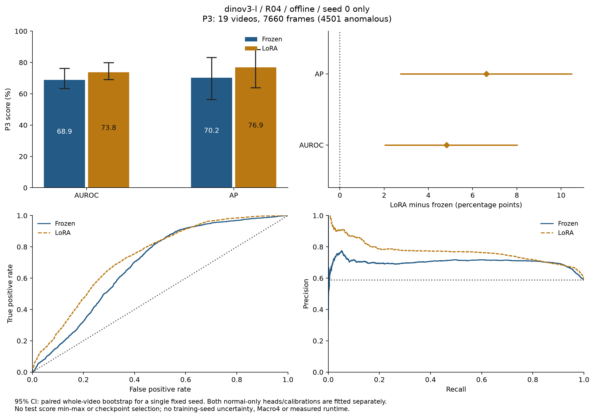

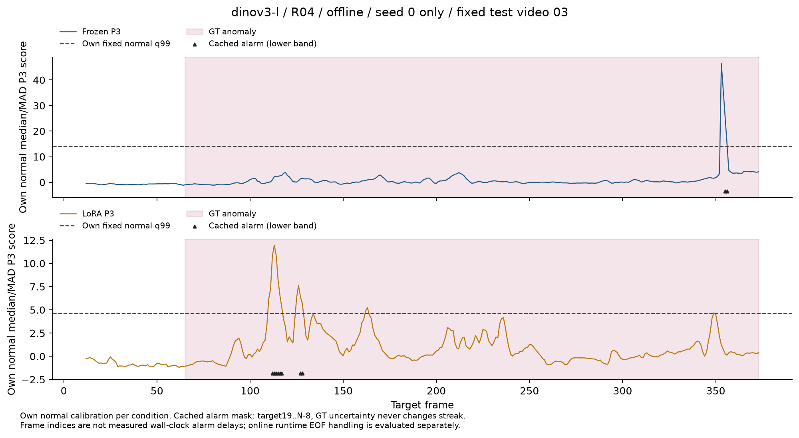

P3 AUROC/AP 차이 CI는 **양수/양수**다. [개별 CSV·P0–P3·paired CI](../results/stage04/dinov3-l/offline/R04/seed0), [조건 감사](../results/stage04/condition_pipeline_checks/T1/dinov3-l/offline/R04/seed0/condition_audit.json), [원 완료 증거](../results/stage04/condition_pipeline_checks/dinov3-l/offline/R04/seed0/pipeline_completion.json)를 제공한다.

전체 **19/48조건·6/16 세-seed 그룹**을 독립 재검산하고 정상 임계값 **152개**를 확인했다. 현재 배열 **18조건**과 승인된 배열 정리 증거 **1조건**을 구분했다. 기존 **48개 평균 행·54개 paired 비교·6그룹·3백본 쌍**은 그대로 유지한다. **R04는 seed 0 하나**이므로 R04 평균·백본 비교·Macro4를 추가하지 않는다. 1,000회 paired 원본 영상 bootstrap·percentile 95% CI를 사용하며 seed 자체를 재표집하거나 테스트로 선택 규칙을 바꾸지 않았다.

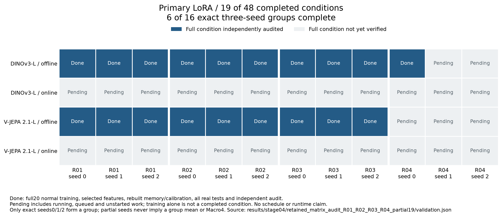

[19조건 감사와 29 pending](../results/stage04/retained_matrix_audit_R01_R02_R03_R04_partial19/validation.json), [유지된 세-seed 평균·paired CI](../results/stage04/retained_matrix_audit_R01_R02_R03_R04_partial19/device_summary.json), [빈 Macro4와 미완료 장비](../results/stage04/retained_matrix_audit_R01_R02_R03_R04_partial19/macro_summary.json), [그림 source](../results/stage04/retained_matrix_audit_R01_R02_R03_R04_partial19/figure_sources.json), [게시 검증](../results/setup/primary19_DINO_R04_seed0_matrix_cached67_publication_check.json)을 제공한다. 이전 snapshot을 보존한다. 원본·모델·특징·optimizer 파일을 업로드하지 않으며 나머지 온라인/오프라인·teacher 0/1·IPAD 기준선·OFAT·진단·실시간 비교를 유지한다.

## DINOv3 R04 오프라인 seed 1의 완료된 정상 학습

원 fresh 정상-only 학습이 **20 epoch·4,000 optimizer updates**를 완료했다. Fit **17개 영상·1,596 clips**, 별도 calibration **4개 영상·1,546 clips**를 사용하고 teacher weight 1·accumulation 8·BF16과 원래 학습 코드를 유지했다. 최소 정상 calibration CE의 epoch **19**을 선택했다.

| 선택 epoch | 정상 calibration CE | 같은 epoch의 원형 MAE |
|---:|---:|---:|
| 19 | 3.574549 | 3.6194% |

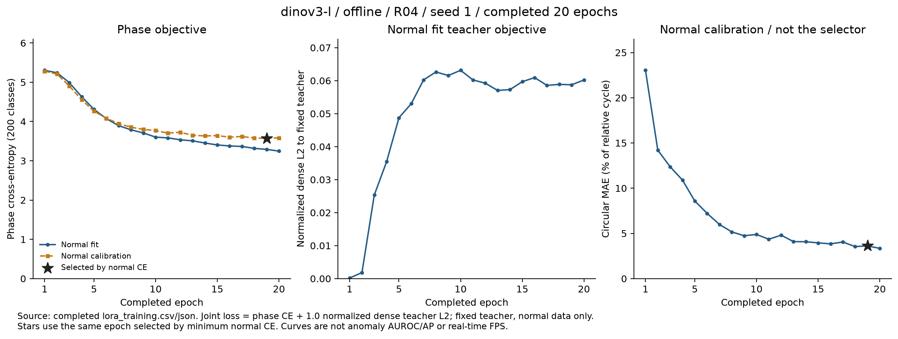

MAE 최솟값으로 재선택하지 않았다. 원 source-bound pipeline은 실제 trainer의 `child.wait()`가 0일 때만 full20 완료 단계를 기록한다. 이 단계와 원 CPU 수집기의 export·plot 실제 종료 코드 0, 보존된 로컬 학습 파일 다섯 개의 해시 및 직접 PNG 검토를 확인했다.

[전체 학습 CSV·JSON·선택 checkpoint 해시·export 검증](../results/stage04/training/dinov3-l/offline/R04/seed1), [학습 완료·시각화 검토·게시 검증](../results/setup/lora_dinov3_R04_seed1_training_publication_check.json)을 제공한다. 공개된 정확도 행렬은 **19/48조건·6/16 세-seed 그룹**이며 이 정상 학습 단계를 추가 조건으로 세지 않는다. 선택 특징 재추출·새 PCA/메모리·정상 보정·전체 **19개 실제 테스트**의 독립 평가는 별도로 완료해야 한다. 전체 온라인·teacher 0/1·IPAD 기준선·추가 실험·실시간 비교를 유지한다. 원본 영상·특징·모델·optimizer 파일은 업로드하지 않는다.

```bash
PYTHONPATH=src:scripts python scripts/export_lora_training.py --run artifacts/lora/dinov3-l/offline/R04/seed1 --out results/stage04/training/dinov3-l/offline/R04/seed1
PYTHONPATH=src:scripts python scripts/plot_lora_training.py --results results/stage04/training/dinov3-l/offline/R04/seed1 --out docs/figures/stage04/dinov3-l_R04_offline_seed1_joint_training
```

## DINOv3 R04 seed 1의 완료된 전체 평가와 20조건 집계

원 fresh 정상-only **20 epoch·4,000 updates**, 정상 calibration CE 최소 epoch **19**으로 선택한 encoder/head를 사용했다. Fit **17**·calibration **4**·실제 test **19**의 **40개 영상**을 재추출하고 PCA·프로토타입 메모리·정상 보정을 새로 구성했다. 진단용 정상 **4개**를 제외했으며 모든 **19개 테스트·7,660개 유효 GT(이상 4,501개)**를 같은 seed 고정 백본과 비교했다. 원 세 단계 및 wrapper의 실제 종료 코드 0과 tensor·메모리·정상 임계값·GT·시간·점수·알람의 독립 감사를 확인했다.

| 점수 | 고정 AUROC / AP (%) | LoRA AUROC / AP (%) | AUROC 차이 [95% CI], pp | AP 차이 [95% CI], pp |
|---|---:|---:|---:|---:|
| P0 | 64.72 / 72.02 | 73.49 / 76.12 | +8.77 [+3.55, +15.15] | +4.09 [-0.85, +7.88] |
| P1 | 73.30 / 73.47 | 74.58 / 76.61 | +1.28 [-1.85, +5.48] | +3.14 [-1.21, +7.83] |
| P2 | 74.25 / 73.82 | 77.24 / 79.14 | +2.99 [-0.34, +7.37] | +5.33 [+0.26, +10.71] |
| P3 | 68.94 / 70.24 | 75.59 / 77.94 | +6.65 [+3.57, +10.10] | +7.70 [+3.34, +12.23] |

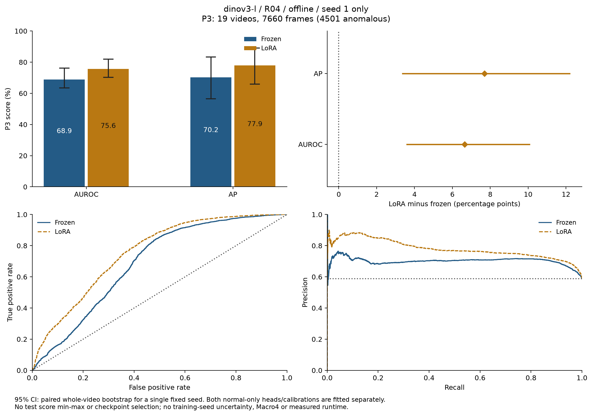

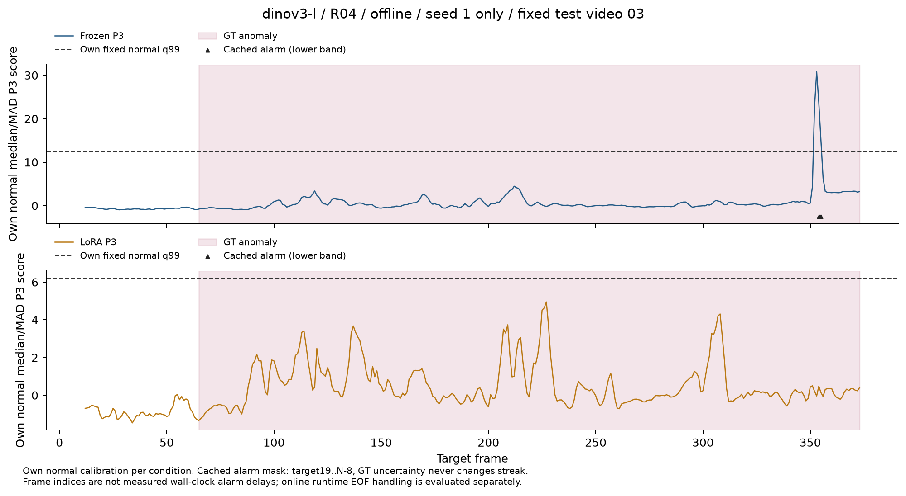

P3 AUROC/AP 차이 CI는 **양수/양수**다. [개별 CSV·P0–P3·paired CI](../results/stage04/dinov3-l/offline/R04/seed1), [조건 감사](../results/stage04/condition_pipeline_checks/T1/dinov3-l/offline/R04/seed1/condition_audit.json), [원 완료 증거](../results/stage04/condition_pipeline_checks/dinov3-l/offline/R04/seed1/pipeline_completion.json)를 제공한다.

전체 **20/48조건·6/16 세-seed 그룹**을 독립 재검산하고 정상 임계값 **160개**를 확인했다. 현재 배열 **19조건**과 승인된 배열 정리 증거 **1조건**을 구분했다. 기존 **48개 평균 행·54개 paired 비교·6그룹·3백본 쌍**은 그대로 유지한다. **R04는 seeds 0·1 두 개**이므로 R04 평균·백본 비교·Macro4를 추가하지 않는다. 1,000회 paired 원본 영상 bootstrap·percentile 95% CI를 사용하며 seed 자체를 재표집하거나 테스트로 선택 규칙을 바꾸지 않았다.

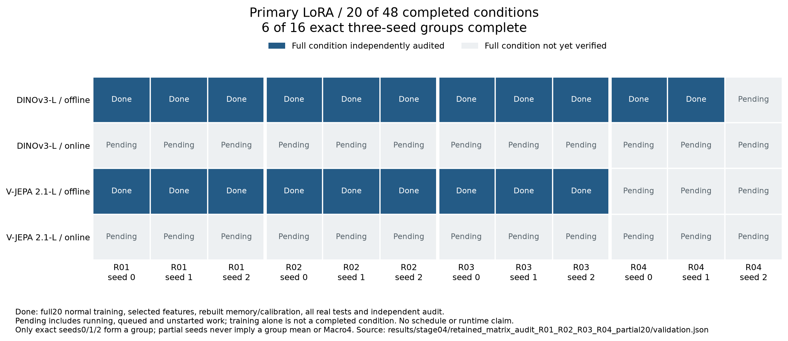

[20조건 감사와 28 pending](../results/stage04/retained_matrix_audit_R01_R02_R03_R04_partial20/validation.json), [유지된 세-seed 평균·paired CI](../results/stage04/retained_matrix_audit_R01_R02_R03_R04_partial20/device_summary.json), [빈 Macro4와 미완료 장비](../results/stage04/retained_matrix_audit_R01_R02_R03_R04_partial20/macro_summary.json), [그림 source](../results/stage04/retained_matrix_audit_R01_R02_R03_R04_partial20/figure_sources.json), [게시 검증](../results/setup/primary20_DINO_R04_seed1_matrix_cached68_publication_check.json)을 제공한다. 이전 snapshot을 보존한다. 원본·모델·특징·optimizer 파일을 업로드하지 않으며 나머지 온라인/오프라인·teacher 0/1·IPAD 기준선·OFAT·진단·실시간 비교를 유지한다.

## DINOv3 R04 오프라인 seed 2의 완료된 정상 학습

원 fresh 정상-only 학습이 **20 epoch·4,000 optimizer updates**를 완료했다. Fit **17개 영상·1,596 clips**, 별도 calibration **4개 영상·1,546 clips**를 사용하고 teacher weight 1·accumulation 8·BF16과 원래 학습 코드를 유지했다. 최소 정상 calibration CE의 epoch **17**을 선택했다.

| 선택 epoch | 정상 calibration CE | 같은 epoch의 원형 MAE |
|---:|---:|---:|
| 17 | 3.661910 | 3.7789% |

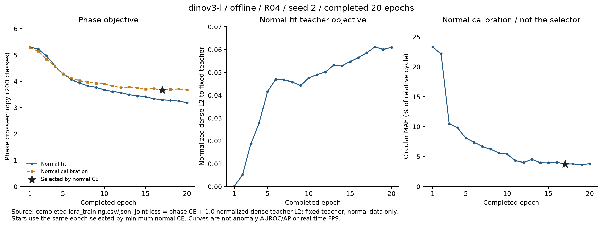

MAE 최솟값으로 재선택하지 않았다. 원 source-bound pipeline은 실제 trainer의 `child.wait()`가 0일 때만 full20 완료 단계를 기록한다. 이 단계와 원 CPU 수집기의 export·plot 실제 종료 코드 0, 보존된 로컬 학습 파일 다섯 개의 해시 및 직접 PNG 검토를 확인했다.

[전체 학습 CSV·JSON·선택 checkpoint 해시·export 검증](../results/stage04/training/dinov3-l/offline/R04/seed2), [학습 완료·시각화 검토·게시 검증](../results/setup/lora_dinov3_R04_seed2_training_publication_check.json)을 제공한다. 공개된 정확도 행렬은 **20/48조건·6/16 세-seed 그룹**이며 이 정상 학습 단계를 추가 조건으로 세지 않는다. 선택 특징 재추출·새 PCA/메모리·정상 보정·전체 **19개 실제 테스트**의 독립 평가는 별도로 완료해야 한다. 전체 온라인·teacher 0/1·IPAD 기준선·추가 실험·실시간 비교를 유지한다. 원본 영상·특징·모델·optimizer 파일은 업로드하지 않는다.

```bash
PYTHONPATH=src:scripts python scripts/export_lora_training.py --run artifacts/lora/dinov3-l/offline/R04/seed2 --out results/stage04/training/dinov3-l/offline/R04/seed2
PYTHONPATH=src:scripts python scripts/plot_lora_training.py --results results/stage04/training/dinov3-l/offline/R04/seed2 --out docs/figures/stage04/dinov3-l_R04_offline_seed2_joint_training
```

## DINOv3 R04 세-seed와 오프라인 Macro4의 완료된 21조건 집계

원 fresh 정상-only **20 epoch·4,000 updates**, 정상 calibration CE 최소 epoch **17**으로 선택한 encoder/head를 사용했다. Fit **17**·calibration **4**·실제 test **19**의 **40개 영상**을 재추출하고 PCA·프로토타입 메모리·정상 보정을 새로 구성했다. 진단용 정상 **4개**를 제외했으며 모든 **19개 테스트·7,660개 유효 GT(이상 4,501개)**를 같은 seed 고정 백본과 비교했다. 원 세 단계 및 wrapper의 실제 종료 코드 0과 tensor·메모리·정상 임계값·GT·시간·점수·알람의 독립 감사를 확인했다.

| 점수 | 고정 AUROC / AP (%) | LoRA AUROC / AP (%) | AUROC 차이 [95% CI], pp | AP 차이 [95% CI], pp |
|---|---:|---:|---:|---:|
| P0 | 69.38 / 74.01 | 77.60 / 79.18 | +8.22 [+4.93, +12.41] | +5.17 [+2.08, +7.74] |
| P1 | 71.65 / 72.04 | 75.23 / 79.00 | +3.58 [-1.41, +9.42] | +6.96 [+0.94, +12.47] |
| P2 | 72.87 / 73.00 | 76.82 / 80.21 | +3.95 [-1.23, +9.74] | +7.20 [+1.32, +12.83] |
| P3 | 69.36 / 70.29 | 74.70 / 77.36 | +5.34 [+1.23, +9.75] | +7.07 [+2.41, +11.54] |

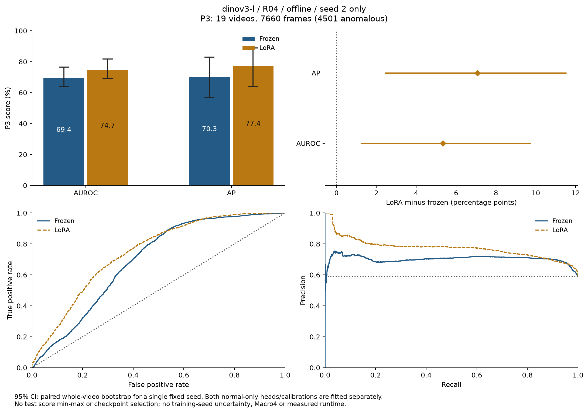

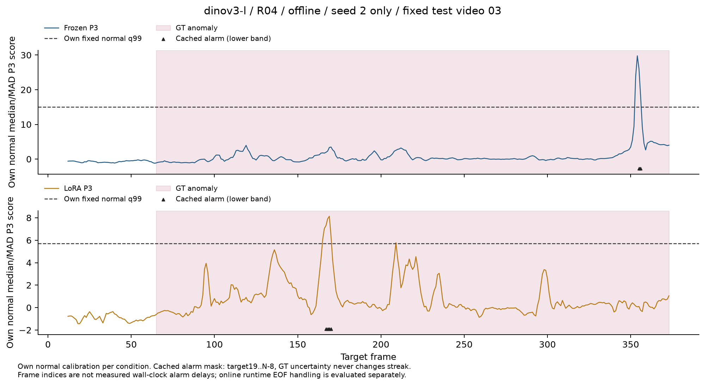

P3 AUROC/AP 차이 CI는 **양수/양수**다. [개별 CSV·P0–P3·paired CI](../results/stage04/dinov3-l/offline/R04/seed2), [조건 감사](../results/stage04/condition_pipeline_checks/T1/dinov3-l/offline/R04/seed2/condition_audit.json), [원 완료 증거](../results/stage04/condition_pipeline_checks/dinov3-l/offline/R04/seed2/pipeline_completion.json)를 제공한다.

전체 **21/48조건·7/16 세-seed 그룹**을 독립 재검산하고 정상 임계값 **168개**를 확인했다. 현재 배열 **20조건**과 승인된 배열 정리 증거 **1조건**을 구분했다. 기존 **48개 평균 행·54개 paired 비교**를 보존하고 R04의 **8개 평균 행·5개 paired 비교**를 추가해 **56/59행**이 됐다. 백본 쌍은 기존 **3개**를 유지한다.

| 범위 · 세-seed 평균 | 고정 P3 AUROC / AP (%) | LoRA P3 AUROC / AP (%) | AUROC 차이 [95% CI], pp | AP 차이 [95% CI], pp |
|---|---:|---:|---:|---:|
| R04 | 69.08 / 70.26 | 74.69 / 77.38 | +5.60 [+2.84, +8.89] | +7.13 [+3.65, +10.82] |
| 동일 가중치 Macro4 | 64.15 / 55.10 | 75.11 / 68.84 | +10.96 [+9.12, +13.08] | +13.74 [+9.98, +17.04] |

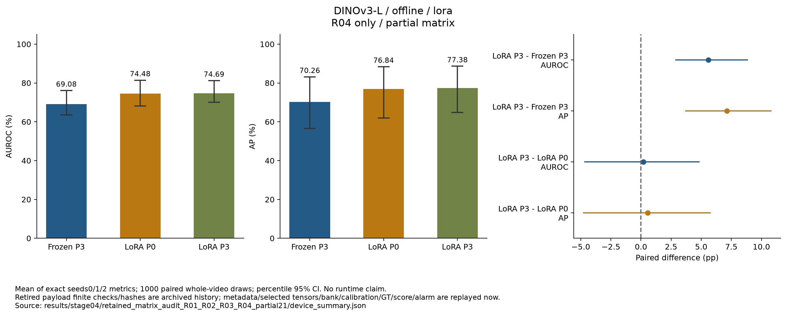

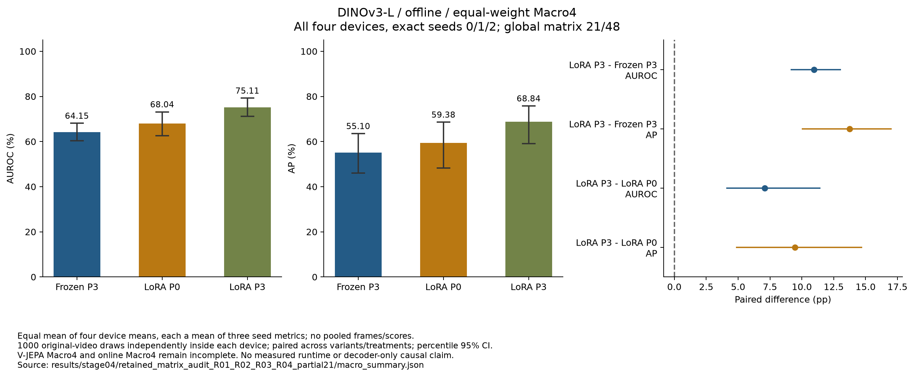

Macro4는 네 장비별 세-seed 평균의 동일 가중치 평균이다. 프레임이나 점수를 합치지 않았으며 장비 안에서 영상 단위로 독립 재표집하고 비교 조건에는 같은 영상 draw를 사용했다. 1,000회 percentile 95% CI이고 seed 자체는 재표집하지 않았다. **DINOv3 오프라인에만** 네 장비·세 seeds가 완결됐다. V-JEPA R04와 온라인 LoRA는 남아 있으며 전체 행렬의 완료 flag는 false다.

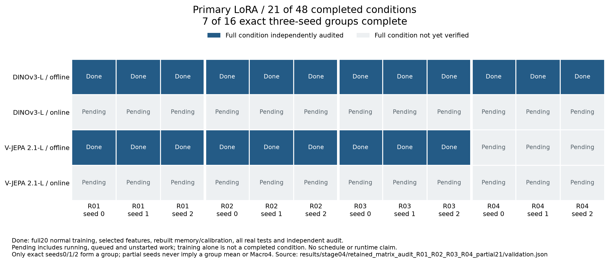

[21조건 감사와 27 pending](../results/stage04/retained_matrix_audit_R01_R02_R03_R04_partial21/validation.json), [세-seed 평균·paired CI](../results/stage04/retained_matrix_audit_R01_R02_R03_R04_partial21/device_summary.json), [DINOv3 Macro4·V-JEPA 미완료 장비](../results/stage04/retained_matrix_audit_R01_R02_R03_R04_partial21/macro_summary.json), [Macro4 그림 source](../docs/figures/stage04/retained_R01_R02_R03_R04_partial21/dinov3-l_offline_Macro4_sources.json), [게시 검증](../results/setup/primary21_DINO_R04_seed2_matrix_cached69_publication_check.json)을 제공한다. 실제 그림 생성에 사용한 [코드](../scripts/plot_partial_lora_macro4.py)와 [입력 조건](../results/setup/DINO_offline_Macro4_partial21_semantic_requirements.json)을 공개하며 별도 출력 stem으로 재현할 수 있다.

```bash
mkdir -p artifacts/tmp
cp results/setup/DINO_offline_Macro4_partial21_semantic_requirements.json artifacts/tmp/R04_completed21_reporting_semantic_read_only_preparation.json
PYTHONPATH=src:scripts python scripts/plot_partial_lora_macro4.py --root results/stage04/retained_matrix_audit_R01_R02_R03_R04_partial21 --out docs/figures/stage04/dinov3_offline_Macro4_rerun
```

이전 snapshot을 보존한다. 원본·모델·특징·optimizer 파일을 업로드하지 않으며 나머지 온라인/오프라인·teacher 0/1·IPAD 기준선·OFAT·진단·실시간 비교를 유지한다.

## V-JEPA R04 오프라인 seed 0의 완료된 정상 학습

원 fresh 정상-only 학습이 **20 epoch·4,000 optimizer updates**를 완료했다. Fit **17개 영상·1,596 clips**, 별도 calibration **4개 영상·1,546 clips**를 사용하고 teacher weight 1·accumulation 8·BF16과 원래 학습 코드를 유지했다. 최소 정상 calibration CE의 epoch **19**을 선택했다.

| 선택 epoch | 정상 calibration CE | 같은 epoch의 원형 MAE |
|---:|---:|---:|
| 19 | 4.868966 | 17.7944% |

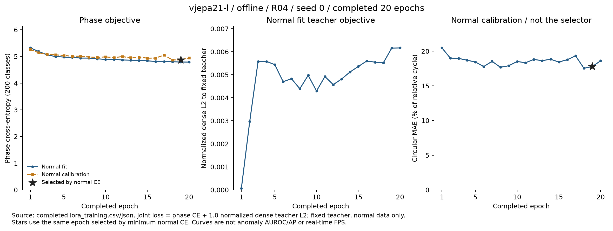

MAE 최솟값으로 재선택하지 않았다. 원 source-bound pipeline은 실제 trainer의 `child.wait()`가 0일 때만 full20 완료 단계를 기록한다. 이 단계와 원 CPU 수집기의 export·plot 실제 종료 코드 0, 보존된 로컬 학습 파일 다섯 개의 해시 및 직접 PNG 검토를 확인했다.

[전체 학습 CSV·JSON·선택 checkpoint 해시·export 검증](../results/stage04/training/vjepa21-l/offline/R04/seed0), [학습 완료·시각화 검토·게시 검증](../results/setup/lora_vjepa_R04_seed0_training_publication_check.json)을 제공한다. 공개된 정확도 행렬은 **21/48조건·7/16 세-seed 그룹**이며 이 정상 학습 단계를 추가 조건으로 세지 않는다. 선택 특징 재추출·새 PCA/메모리·정상 보정·전체 **19개 실제 테스트**의 독립 평가는 별도로 완료해야 한다. 전체 온라인·teacher 0/1·IPAD 기준선·추가 실험·실시간 비교를 유지한다. 원본 영상·특징·모델·optimizer 파일은 업로드하지 않는다.

```bash
PYTHONPATH=src:scripts python scripts/export_lora_training.py --run artifacts/lora/vjepa21-l/offline/R04/seed0 --out results/stage04/training/vjepa21-l/offline/R04/seed0
PYTHONPATH=src:scripts python scripts/plot_lora_training.py --results results/stage04/training/vjepa21-l/offline/R04/seed0 --out docs/figures/stage04/vjepa21-l_R04_offline_seed0_joint_training
```

## V-JEPA R04 오프라인 seed 0의 전체 평가와 완료된 22조건 집계

원 fresh 정상-only **20 epoch·4,000 updates**, 정상 calibration CE 최소 epoch **19**으로 선택한 encoder/head를 사용했다. Fit **17**·calibration **4**·실제 test **19**의 **40개 영상**을 재추출하고 PCA·프로토타입 메모리·정상 보정을 새로 구성했다. 진단용 정상 **4개**를 제외했으며 모든 **19개 테스트·7,660개 유효 GT(이상 4,501개)**를 같은 seed의 고정 백본과 비교했다. 원 세 단계 및 wrapper 실제 종료 코드 0, tensor·메모리·정상 임계값·GT·시간·점수·알람의 독립 감사를 확인했다.

| 점수 · R04 seed 0 | 고정 AUROC / AP (%) | LoRA AUROC / AP (%) | AUROC 차이 [95% CI], pp | AP 차이 [95% CI], pp |
|---|---:|---:|---:|---:|
| P0 | 64.33 / 72.10 | 61.17 / 67.37 | -3.15 [-5.28, -1.25] | -4.72 [-6.29, -3.01] |
| P1 | 73.40 / 77.25 | 65.28 / 68.43 | -8.11 [-12.78, -3.84] | -8.83 [-15.09, -3.10] |
| P2 | 73.57 / 77.93 | 62.28 / 67.33 | -11.29 [-16.69, -6.60] | -10.60 [-17.20, -4.47] |
| P3 | 71.36 / 74.01 | 59.93 / 64.20 | -11.43 [-16.02, -7.66] | -9.80 [-14.48, -5.32] |

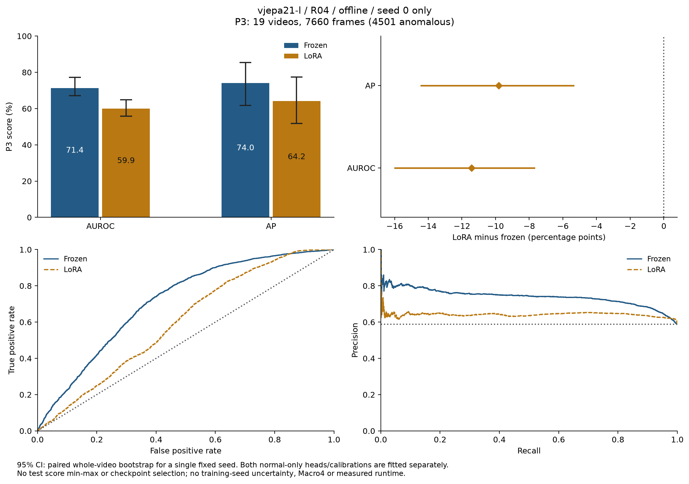

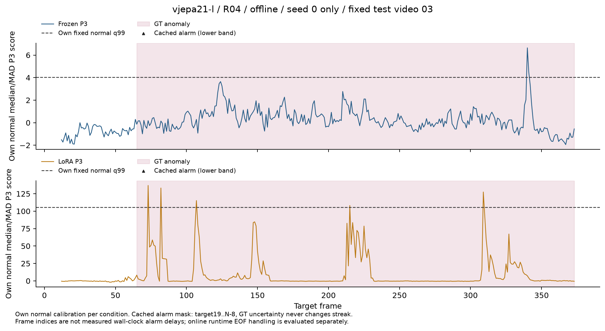

P3 AUROC/AP 차이 CI는 **음수/음수**다. 단일 고정 seed의 1,000회 영상 단위 paired percentile 95% CI이며 seed를 재표집하지 않았다. [개별 CSV·P0–P3·paired CI](../results/stage04/vjepa21-l/offline/R04/seed0), [조건 감사](../results/stage04/condition_pipeline_checks/T1/vjepa21-l/offline/R04/seed0/condition_audit.json), [원 완료 증거](../results/stage04/condition_pipeline_checks/vjepa21-l/offline/R04/seed0/pipeline_completion.json)를 제공한다.

전체 **22/48조건·7/16 세-seed 그룹**을 독립 재검산하고 정상 임계값 **176개**를 확인했다. 현재 배열 **21조건**과 승인된 배열 정리 증거 **1조건**을 구분했다. 기존 **56개 장비 평균·59개 paired 비교**, **8개 DINOv3 오프라인 Macro4 평균·5개 paired 비교**를 값까지 그대로 보존했다. DINOv3–V-JEPA의 완결 장비 쌍도 기존 **3개**를 유지한다. V-JEPA R04 seed 0 하나만으로 R04 세-seed 평균이나 새 백본 비교를 만들지 않았다.

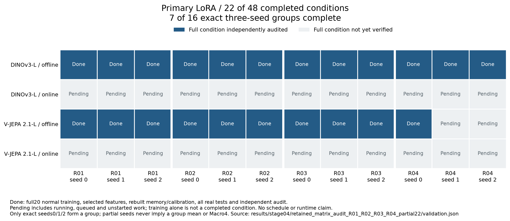


DINOv3 오프라인에만 네 장비·세 seeds가 완결됐다. Macro4는 네 장비별 세-seed 평균의 동일 가중치 평균이며 프레임이나 점수를 합치지 않았다. 장비 안에서 영상 단위로 독립 재표집하고 비교 조건에는 같은 영상 draw를 사용한 1,000회 percentile 95% CI다. V-JEPA R04 세-seed·V-JEPA Macro4·온라인 LoRA·실시간 비교는 남아 있으며 전체 행렬 완료 flag는 false다.

[22조건 감사와 26 pending](../results/stage04/retained_matrix_audit_R01_R02_R03_R04_partial22/validation.json), [보존된 세-seed 평균·paired CI](../results/stage04/retained_matrix_audit_R01_R02_R03_R04_partial22/device_summary.json), [Macro4·미완료 장비](../results/stage04/retained_matrix_audit_R01_R02_R03_R04_partial22/macro_summary.json), [Macro4 그림 source](../docs/figures/stage04/retained_R01_R02_R03_R04_partial22/dinov3-l_offline_Macro4_sources.json), [게시 검증](../results/setup/primary22_VJ_R04_seed0_matrix_cached70_publication_check.json)을 제공한다. 새 snapshot의 [그림 코드](../scripts/plot_partial_lora_macro4_partial22.py)와 [입력 조건](../results/setup/DINO_offline_Macro4_partial22_semantic_requirements.json)은 별도 출력 stem으로 재현할 수 있다.

```bash
mkdir -p artifacts/tmp
cp results/setup/DINO_offline_Macro4_partial22_semantic_requirements.json artifacts/tmp/R04_completed22_reporting_semantic_read_only_preparation.json
PYTHONPATH=src:scripts python scripts/plot_partial_lora_macro4_partial22.py --root results/stage04/retained_matrix_audit_R01_R02_R03_R04_partial22 --out docs/figures/stage04/dinov3_offline_Macro4_partial22_rerun
```

이전 snapshot과 실제 통계를 보존한다. 원본·모델·특징·optimizer 파일을 업로드하지 않으며 나머지 온라인/오프라인·teacher 0/1·IPAD 기준선·OFAT·진단·실시간 비교를 유지한다.
