# Stage 05 — 실시간 탐지와 진단

고정 백본의 이력 5·15·31 OFAT 144개 seed 조건을 완료했다. [공통 구간의 수치·paired CI·그래프와 재현 근거](ABLATION_HISTORY.md)를 제공한다. DINOv3 온라인 R01 seed 0의 첫 실제 FIFO 측정은 아래에 별도 기록하며 전체 모델·모드·장비·seed의 실시간 비교는 아직 완료되지 않았다. 특징 캐시 생성 시간, 모델 smoke 시간, LoRA 예비 학습 시간은 처리량 결과로 사용하지 않는다.

이웃 수 k=1·5·10의 두 백본 × 두 모드 × 네 장비 × 세 seeds, **144개 조건**도 완료했다. 기존 k=5의 48개 원본 조건을 점수·알람 차이 0으로 재현하고 정상 임계값 144개를 재계산했다. [Macro4·장비별 수치·paired CI·그래프·검색 출처](ABLATION_NEIGHBOURS.md)를 제공한다. 백본·모드 전체에 일관된 우위는 없어 기본 k=5를 유지한다.

메모리 크기와 bin 수의 **192개 GPU 조건·독립 검증을 완료**했다. 기본 48조건의 실제 배열·정상 temperature·점수·알람을 정확히 재현하고 정상 q99 192개를 재계산했다. V-JEPA의 4,096개 조건은 오프라인 AUROC/AP +4.79/+3.49pp, 온라인 +3.26/+2.94pp였고 두 모드의 두 paired CI 모두 0을 포함하지 않았다. [전체 Macro4·장비별 수치·paired CI·6개 그래프·검증 근거](ABLATION_MEMORY.md)를 제공하며 사전 기본 16 bins·2,048개를 유지한다.

8·16프레임 비교의 신규 48조건 중 DINOv3 오프라인 R01 세 seeds의 실제 평가·독립 검증을 완료했다. 8프레임 P3 AUROC/AP는 44.71/32.20%로, 16프레임 대비 −2.31/−1.01pp이며 두 paired CI는 0을 포함한다. [부분 결과·CI·그래프·입력 구간·재현 명령](ABLATION_CLIP_FRAMES.md)을 제공한다. 전체 Macro4와 실제 FPS/지연은 아직 없다.

## 준비된 스트리밍 점수와 평가

[runtime_state.py](../src/ipad_jepa/runtime_state.py)는 고정 정상 calibration과 주기 길이로 P3 점수와 3프레임 연속 초과 알람을 순차 계산한다. 최근 5개 위상만 유지하며 영상의 최종 길이·테스트 라벨을 받지 않는다. 온라인은 target 15부터 위상을 쌓고, target 19부터 알람이 유효하다. 오프라인은 target 8부터 위상을 쌓되 같은 target 19부터 알람이 유효하다.

온라인은 실제 마지막 7프레임도 계속 탐지한다. 정확도 비교의 `t=19..N−8` 마스크는 실행 후 보고에만 적용한다. 미래 EOF나 미확정 GT가 알람을 중단시키지 않도록 했다.

실행 후 GT를 읽어 이벤트별 최초 알람과 도착 시점 대비 지연을 계산한다. 지연에는 전처리·모델·검색·점수 처리, 입력 대기열, 오프라인의 7프레임 lookahead 대기가 포함돼야 한다. 평가 대상 프레임이 전혀 없는 GT 이벤트는 coverage 밖으로 기록한다. GT 경계가 미확정인 이벤트에는 이를 표시하고, 불확실한 onset의 지연은 제외한다. 정상으로 확인된 target에서 시작한 알람 구간 수와 정상 프레임의 알람 수를 함께 보고한다.

GT 이상 구간 안의 target에서 발생했더라도 실제 알람 출력은 이상 구간이 끝난 뒤 도착할 수 있다. 종료 경계가 확인된 이벤트에서는 첫 정상 프레임의 도착 이전에 출력된 알람, 그 이후의 늦은 알람, 종료 전 알람이 없는 이벤트를 별도로 집계한다. 종료 경계가 미확정인 이벤트는 이 집계에서 제외한다. 이는 관측된 이벤트 종료 시점을 기준으로 한 통계이며, 별도의 실시간 서비스 SLA를 가정하지 않는다.

테스트는 순차 시간 점수와 배치 계산의 일치, prefix 유지, 마지막 7프레임의 온라인 알람, 3프레임 warmup, 누락·중복 target 거부, 처리와 lookahead를 포함한 이벤트 지연, GT 미확정과 coverage 제외를 확인한다. 이는 실제 GPU 처리량 또는 알람 성능 측정이 아니다.

## 남은 실제 실행

30 FPS 도착, FIFO, 프레임 drop 없음, 메모리 갱신 없음으로 두 백본·두 모드를 비교한다. GPU에서 다른 학습·추론이 겹치지 않는 측정 조건을 기록한다. decode/resize, encoder, phase head, PCA/메모리 검색, score/alarm, queue/lookahead 대기를 분리하고 지속 FPS·p50/p95 지연·VRAM·queue 증가·miss·false alarm을 공개한다.

[benchmark_runtime.py](../scripts/benchmark_runtime.py)는 이 측정을 위한 실행 코드를 제공한다. 첫 완료 조건의 전체 영상 trace를 검증했으며 전체 측정과 최적화 동등성 검증은 남아 있다. 기본은 장비의 모든 실제 테스트 영상을 30 FPS 도착 시점에 맞춰 파일로 재생한다. `full`은 매 clip을 CPU 프레임 버퍼에서 조합·GPU로 전송하고 인코더를 재계산하며, `buffer`는 과거 픽셀 프레임을 GPU에 보관해 전송을 줄이고 같은 clip의 인코더를 재계산한다. DINO 온라인 FP32의 `reuse`는 과거 인코더 특징을 재사용하는 별도 조건이다. 정상 데이터로 20회 warmup 후 영상별 점수 상태를 초기화한다.

메모리 복원 시 저장된 PCA의 Fortran layout을 유지한다. 이웃 수 재현에서 기본 C layout 복사로 FP32 검색 점수가 달라졌음을 확인했으며, layout 보존 후 k=5가 기존 점수와 정확히 일치했다. 런타임의 실제 로더도 동일하게 수정하고 CPU stride 회귀 테스트를 추가했다. 실제 GPU 런타임의 점수·알람 동등성 게이트는 여전히 별도로 수행해야 한다.

입력 도착부터 실제 점수 계산 종료까지 벽시계 시간을 기록하고, GPU에 다른 compute PID가 있으면 측정을 거부한다. 검사 사이의 순간적인 외부 작업까지 감시하지는 않으므로 다른 실험 실행이 모두 끝난 상태에서 측정해야 한다. 원본 해시 검증은 측정 전 수행하므로 파일 캐시는 warm 조건이다. BF16 batch 1 점수와 기존 batch 4 캐시 점수의 차이, full/buffer 및 FP32 full/reuse의 점수·알람 일치도도 결과와 함께 검증해야 한다.

```bash
python scripts/benchmark_runtime.py --model dinov3-l --mode online \
  --device R01 --seed 0 --implementation full --precision bf16 \
  --data-root "$IPAD_DATA_ROOT" --upstream third_party/dinov3 \
  --weights artifacts/weights/dinov3_vitl16_pretrain_lvd1689m-8aa4cbdd.pth \
  --run artifacts/runs/dinov3-l/online/R01/seed0 \
  --results results/stage02/dinov3-l/online/R01/seed0 \
  --out results/stage05/runtime/dinov3-l/online/R01/seed0/full_bf16
```

GPU 측정이 완료된 경우에만 `runtime.json`을 완료 마커로 저장한다. 일부 영상을 지정한 실행은 전체 장비 평가로 표시하지 않는다. 기본 `--adaptation frozen`은 고정 백본과 해당 정상 메모리를 사용한다.

`--adaptation lora --lora-run <완료된 joint 학습 경로>`는 같은 seed의 정상 검증 CE로 선택된 adapter와 joint 위상 head를 사용한다. 20 epoch 전체 곡선·선택 epoch·학습/adapter 소스·기본 가중치를 검증하고, 실제 head 텐서가 선택 체크포인트와 같은지 확인한다. adapter 해시가 해당 seed에서 재구성한 정상 특징·PCA/메모리와 일치해야 하므로 고정 백본의 메모리를 대신 사용할 수 없다. 완료 전 학습, 다른 seed·teacher·head 또는 선택 epoch를 거부한다. 가중치와 adapter는 로컬에서만 읽는다.

```bash
# 해당 LoRA 학습·특징 재구성·정상 메모리 평가가 완료된 후 실행
python scripts/benchmark_runtime.py --model dinov3-l --mode online \
  --device R01 --seed 0 --adaptation lora \
  --lora-run artifacts/lora/dinov3-l/online/R01/seed0 \
  --implementation full --precision bf16 \
  --data-root "$IPAD_DATA_ROOT" --upstream third_party/dinov3 \
  --weights artifacts/weights/dinov3_vitl16_pretrain_lvd1689m-8aa4cbdd.pth \
  --run artifacts/runs_lora/dinov3-l/online/R01/seed0 \
  --results results/stage04/dinov3-l/online/R01/seed0 \
  --out results/stage05/runtime_lora/dinov3-l/online/R01/seed0/full_bf16
```

LoRA의 `full`/`buffer`, DINO 온라인 FP32 `full`/`reuse`도 각각 같은 선택 adapter·head·재구성 메모리로 비교해야 한다. 고정 백본의 특징 재사용 검증을 LoRA에 적용하지 않으며, 실제 LoRA 점수·알람 일치 게이트는 아직 실행하지 않았다. 체크포인트 선택과 혼합 조건 거부는 CPU 테스트 대상이며 실제 GPU 처리량을 뜻하지 않는다.

[verify_runtime_parity.py](../scripts/verify_runtime_parity.py)는 완료된 `full` 실행과 같은 precision의 `buffer` 또는 허용된 FP32 `reuse` 실행을 비교한다. 모델·위상 head·메모리·선택 adapter·teacher 손실 비중·입력 manifest·영상/라벨 해시가 같은지 확인하고, 알람이 유효한 모든 target의 위상·특징/시간 점수·최종 점수·알람을 비교한다. 온라인 마지막 7프레임과 미확정 GT도 제외하지 않는다. 사전에 고정한 게이트는 위상 circular 최대 차이 1e−5, raw 점수 `rtol=1e−5/atol=1e−7`, 최종 점수 `rtol=1e−5/atol=1e−4`, 알람 불일치 0개다. 게이트 통과는 해당 실제 측정 쌍에만 적용하며, 기존 batch 4 정확도 캐시와의 일치까지 의미하지 않는다. R01 고정 DINOv3 온라인 seed 0의 실제 BF16 full/buffer 게이트는 통과했고, FP32 full/reuse는 일부 점수 게이트에 실패했다. 아래 실제 비교 결과에 전체 영상의 근거를 기록한다.

```bash
python scripts/verify_runtime_parity.py \
  --reference results/stage05/runtime/dinov3-l/online/R01/seed0/full_bf16 \
  --candidate results/stage05/runtime/dinov3-l/online/R01/seed0/buffer_bf16 \
  --out results/stage05/runtime/dinov3-l/online/R01/seed0/full_buffer_parity.json
```

DINO full-clip BF16과 과거 특징 재사용 BF16의 수치 일치 게이트는 실패했다. FP32 특징 비교는 통과했지만, 실제 점수·알람과 실행 시간을 확인해야 한다. 재사용 구현의 숫자를 주 BF16 조건의 성능으로 대체하지 않으며, precision과 대응하는 full 계산 조건을 명시한다. 세부 근거는 [Stage 03](STAGE03.md)에 있다.

정상 진단 **17개 영상 × 49시나리오**의 stall/reverse·가림/국소 색 변화·36개 혼합 조합에 대해 전체 GPU 평가를 시작했다. [고정 위치/강도·네 증거 유형 정답·입력 문맥 도식·코드·검증 범위](DIAGNOSTICS.md)를 제공한다. 실제 confusion/Macro-F1은 전체 trace의 독립 검증 후 공개한다. 나머지 OFAT·LoRA·실시간 측정도 남아 있어 Stage 05 완료 태그는 생성하지 않는다.

## 작은 온라인 백본

DINOv3-B와 V-JEPA 2.1-B의 별도 768차원 정상 학습·평가 **24개 조건을 실행 중**이다. DINOv3 R01 온라인의 세 seeds는 L paired 기준과 독립 검증했다. P3 AUROC/AP는 B **43.86/31.35%**, L **53.69/36.92%**이며 B−L 두 CI 모두 0보다 낮다. [부분 정확도·CI·그래프·검증 한계·모델 출처·재현 경로](SMALL_BACKBONES.md)를 제공한다. 이 결론은 R01 온라인에 한정하며 전체 Macro4와 독립 실시간 성능은 아직 없다.

## 전체 실시간 측정 행렬과 재개

### 첫 실제 FIFO 측정

DINOv3-L 온라인 R01 seed 0, 고정 백본·P3·BF16·full 재계산의 **15개 전체 실제 테스트 영상**을 RTX PRO 6000에서 재생했다. 실제 자식 프로세스 종료 코드 0, 입력 3,685프레임·알람 유효 target 3,400개·공통 GT 지표 target 3,295개를 확인했다. 영상마다 정상 warmup 후 점수/큐 상태를 초기화하고, 30 FPS 도착·FIFO·drop 없음·고정 정상 메모리를 적용했다.

| 지표 | 실제 측정 |
|---|---:|
| 지속 입력 처리 FPS | 16.4630 |
| target 전체 지연 p50 / p95 | 3,471.09 / 7,172.03 ms |
| queue wait p95 | 6,895.15 ms |
| 영상별 최종 queue 증가 최대 | 10,948.55 ms |
| GPU peak allocated / reserved | 1,577.67 / 1,804.00 MiB |
| 평균 decode / encoder 포함 전송 | 2.36 / 58.17 ms |
| 평균 phase head / PCA·검색 / score·alarm | 0.50 / 0.99 / 0.06 ms |
| 평균 전체 service / feature cast | 62.28 / 0.18 ms |
| 공통 target AUROC / AP | 53.87 / 36.03% |
| operational GT 이벤트 탐지 / 미탐 | 1 / 7 (총 8개) |
| 이벤트 종료 전 알람 / 늦은 최초 알람 | 1 / 0 |
| 정상 알람 episode 시작 / 정상 알람 프레임 | 4 / 13 (평가 정상 2,169프레임) |

30 FPS 입력에 처리 속도가 미달해 대기열이 증가했다. p95는 전체 알람 유효 target의 벽시계 지연이며 영상별 p95의 평균이 아니다. 지속 FPS는 완료된 입력 간격 수를 첫 도착부터 마지막 처리 종료까지의 시간으로 나눈 값으로, 30 FPS 제한이 없는 최대 처리량 측정이 아니다. 관측된 단일 탐지 이벤트의 onset 지연은 1.3992초이며 한 이벤트로 지연 분포를 일반화하지 않는다.

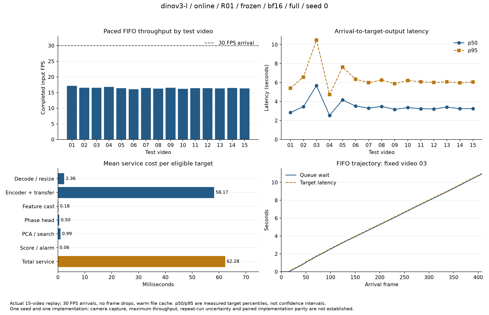

[원본 15개 CSV·runtime JSON·trace 검증](../results/stage05/runtime/frozen/dinov3-l/online/R01/seed0/bf16/full), [PNG/SVG와 그림 소스 해시](figures/stage05/runtime/dinov3-l_online_R01_seed0_frozen_bf16_full.json)를 제공한다. 실제 CSV의 도착 순서·GT·정상 보정·위상 이력·점수·알람·지표·이벤트와 전체 FPS/p50/p95/queue/cost를 재계산했고 PNG를 열어 범례·축·단위·출력 범위를 확인했다.

기존 batch 4 encoder 특징 캐시의 같은 seed P3 AUROC/AP는 53.94/36.11%로, runtime batch 1의 53.87/36.03%와 다르다. head는 기존 캐시 평가에서 여러 target을 batch로 처리한다. 동일 정상 보정과 공통 GT를 사용했지만 수치·알람 동등성을 선언하지 않는다. 첫 결과와 같은 조건의 full/buffer·FP32 full/reuse 비교를 아래에 추가했다. 여전히 한 seed·한 장비의 실제 파일 재생이며 반복 측정 CI, 전체 장비·LoRA 실시간 비교, 실제 카메라 입력은 아직 완료되지 않았다. GPU 격리는 setup과 각 영상 전후 다른 compute PID가 없는지 확인한 범위이며 검사 사이의 순간적인 외부 작업은 독립 감시하지 않았다.

```bash
PYTHONPATH=src:scripts python scripts/audit_runtime.py \
  --runtime results/stage05/runtime/frozen/dinov3-l/online/R01/seed0/bf16/full \
  --out results/stage05/runtime/frozen/dinov3-l/online/R01/seed0/bf16/full/trace_audit.json
PYTHONPATH=src:scripts python scripts/plot_runtime.py \
  --runtime results/stage05/runtime/frozen/dinov3-l/online/R01/seed0/bf16/full \
  --audit results/stage05/runtime/frozen/dinov3-l/online/R01/seed0/bf16/full/trace_audit.json \
  --out docs/figures/stage05/runtime/dinov3-l_online_R01_seed0_frozen_bf16_full
```

[run_runtime_matrix.py](../scripts/run_runtime_matrix.py)는 고정 백본·teacher=1 LoRA 각각의 두 모델 × 두 모드 × 네 장비 × 세 seeds, **96개 주 조건**을 유지한다. 각 조건의 BF16 full/buffer 192회와 DINOv3 온라인의 별도 FP32 full/reuse 48회, 합계 **240회**를 계획한다. 모든 실행은 해당 장비의 전체 실제 테스트 영상을 사용한다. 이 횟수는 완료 수가 아니다.

완료된 정확도·선택 head·정상 메모리가 있는 조건만 실행한다. 최초 준비 상태는 고정 백본 48조건과 R01 오프라인 LoRA 4조건, **52조건·128회**이며 나머지 LoRA 44조건은 대기로 남긴다. 각 실행 전후 소스·선택 head·메모리·정상 보정 해시를 확인하고, 자식 프로세스의 실제 종료 코드 0과 전체 영상 결과를 확인한 뒤 완료로 기록한다. 같은 조건의 full/buffer와 FP32 full/reuse 점수·알람 게이트가 수치적으로 실패하면 그 실패를 그대로 기록한다.

```bash
PYTHONPATH=src:scripts python scripts/run_runtime_matrix.py \
  --data-root "$IPAD_DATA_ROOT"
# 이전 controller와 측정 프로세스가 실제 종료된 후, 같은 소스로 재개:
PYTHONPATH=src:scripts python scripts/run_runtime_matrix.py \
  --data-root "$IPAD_DATA_ROOT" --resume
```

대형 GPU 런타임은 `.venv/bin/python`, 점수·알람 게이트는 별도 CPU 런타임을 사용한다. ledger는 `artifacts/tmp/runtime_matrix.json`에 저장한다. 커널 파일 잠금으로 controller 중복을 막고, 재개 시 boot ID·PID 시작 시점으로 이전 작업이 실제 종료됐는지 확인한다. 완료 기록의 CSV/JSON 해시를 확인하며 중단된 출력은 로컬 `artifacts/runtime_interrupted`에 보존한 뒤 해당 측정만 다시 실행한다. `artifacts/tmp/runtime_matrix.hold`가 있으면 현재 측정을 마친 뒤 다음 측정 시작 전에 대기하므로 독립 검증·업로드 작업을 GPU 측정과 겹치지 않게 수행할 수 있다.

추론용 선택 LoRA를 로딩한 뒤 전체 encoder 파라미터를 고정한다. eval만으로는 새 LoRA 파라미터의 gradient 플래그가 해제되지 않아 과거 특징 재사용 검사가 거부되는 문제를 수정했다. 선택된 nonzero adapter 텐서와 출력 보존·dropout 비활성화·인과적 ring 진입을 CPU 회귀 테스트로 확인한다. 실제 이벤트의 NumPy 불리언도 값과 null 경계를 유지하며 JSON으로 저장한다. 전체 영상 CSV를 저장하고 JSON 직렬화에서 실패한 최초 실행은 로컬에 보존하며 완료된 실시간 성능으로 집계하지 않는다.

[audit_runtime.py](../scripts/audit_runtime.py)는 완료된 측정 CSV에서 입력 순서·전체 프레임 수·도착/서비스/출력 시점·queue/lookahead/target latency를 재계산한다. 고정 정상 P3 median/MAD·q99, 실제 annotation·공통 mask, 위상 이력·최종 점수·3프레임 연속 알람, AUROC/AP와 이벤트 집계를 검증한다. 온라인 EOF와 미확정 GT도 실제 알람 검증에서 제외하지 않는다. 이벤트 정의는 기존 공용 함수를 재생하며, encoder/PCA/search 재실행·독립 VRAM 측정·반복 측정 CI를 주장하지 않는다.

[plot_runtime.py](../scripts/plot_runtime.py)는 이 검증을 다시 실행하고 같은 실제 CSV에서 영상별 FPS·latency p50/p95·처리 비용·사전 고정 영상 03의 FIFO 궤적을 PNG/SVG로 생성한다. p50/p95는 측정 target의 백분위이며 신뢰구간이 아니다. 한 seed의 파일 재생 수치를 최대 처리량·실제 카메라 결과·세-seed 평균으로 해석하지 않는다.


### 같은 조건의 버퍼·특징 재사용 실측

위와 같은 고정 DINOv3-L 온라인 R01 seed 0의 선택 head·정상 메모리·보정과 실제 테스트 15개 영상을 유지했다. 네 실행 모두 실제 종료 코드 0과 입력 3,685개·알람 유효 target 3,400개·공통 GT target 3,295개를 확인했다. 각 저장 trace를 독립 재생해 점수·알람·queue·시간·지표를 검증했다. BF16/FP32는 별도 수치 조건이며 구현 비교는 같은 precision의 full을 기준으로 한다.

| precision / 구현 | 지속 입력 FPS | target 지연 p95 (ms) | peak allocated (MiB) | 공통 AUROC / AP (%) |
|---|---:|---:|---:|---:|
| BF16 / full | 16.4630 | 7,172.03 | 1,577.67 | 53.8665 / 36.0274 |
| BF16 / buffer | 17.0509 | 6,313.83 | 1,605.99 | 53.8665 / 36.0274 |
| FP32 / full | 5.0911 | 44,064.40 | 1,634.58 | 53.6205 / 35.7571 |
| FP32 / reuse | 29.9135 | 37.64 | 1,317.05 | 53.6201 / 35.7569 |

BF16 full/buffer는 15개 영상의 위상·특징/시간 점수·최종 점수·알람 차이가 모두 0이었다. GPU 픽셀 버퍼는 전송/clip 조합을 줄이지만 encoder를 매번 재계산하므로 이 조건에서 30 FPS 입력의 queue 증가를 해소하지 못했다.

**FP32 full/reuse의 사전 점수 게이트는 실패했다.** 위상과 시간 점수 게이트는 통과했고 실제 알람 불일치는 0개였으나, 영상 03·11·13에서 특징 잔차와 최종 점수가 허용 오차를 초과했다. 아래 수치는 영상의 모든 알람 유효 target 중 최대 절대 차이이며, 고정 게이트는 위 절의 `allclose(rtol, atol)` 그대로 유지한다.

| 영상 | 특징 잔차 최대 절대 차이 | 최종 점수 최대 절대 차이 | 알람 불일치 |
|---|---:|---:|---:|
| 03 | 0.0002212226 | 0.0010887255 | 0 |
| 11 | 0.0004786253 | 0.0023368037 | 0 |
| 13 | 0.0004116595 | 0.0020055073 | 0 |

초기 네 clip의 FP32 특징 오차 통과는 전체 영상의 downstream 점수 동등성을 입증하지 못했다. 처리 속도와 알람 일치만으로 점수 동등성을 선언하거나 허용 오차를 늘리지 않는다. 수치 차이의 원인과 다른 조건의 재현 여부는 추가 확인 대상이다. BF16 주 조건에 FP32 reuse 속도를 대입하지 않으며, 29.91 FPS는 30 FPS 도착으로 제한한 파일 재생 결과여서 최대 처리량을 뜻하지 않는다.

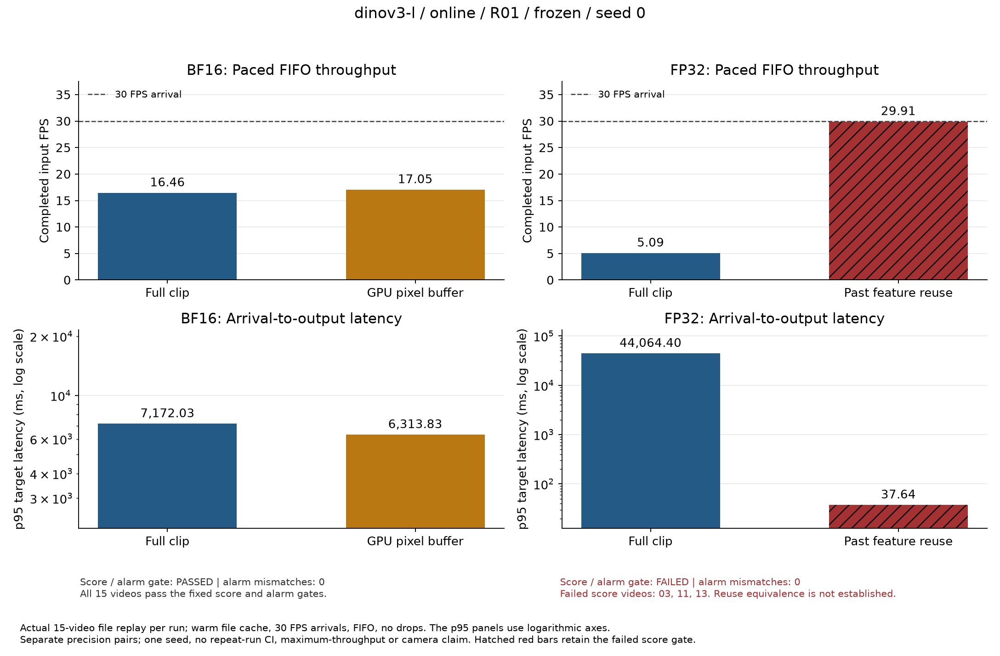

지연 패널은 로그 축이며 숫자를 ms로 함께 표시했다. p95는 실제 target 분포의 백분위이고 CI가 아니다. [그림 PNG/SVG·수치·소스 해시](figures/stage05/runtime/dinov3-l_online_R01_seed0_frozen_pairs.json), [BF16 원본·게이트](../results/stage05/runtime/frozen/dinov3-l/online/R01/seed0/bf16), [FP32 원본·게이트](../results/stage05/runtime/frozen/dinov3-l/online/R01/seed0/fp32)를 제공한다. trace 재생 통과와 full/candidate 점수 동등성 게이트를 구분한다. 전체 240회 중 이 한 주 조건의 네 실행이 완료됐으며 세-seed 실시간 평균·LoRA/V-JEPA의 실시간 우열·반복 측정 불확실성은 아직 없다.

```bash
PYTHONPATH=src:scripts python scripts/plot_runtime_pairs.py \
  --root results/stage05/runtime/frozen/dinov3-l/online/R01/seed0 \
  --data-root "$IPAD_DATA_ROOT" \
  --out docs/figures/stage05/runtime/dinov3-l_online_R01_seed0_frozen_pairs
```

[plot_runtime_pairs.py](../scripts/plot_runtime_pairs.py)는 네 trace 감사와 두 저장 gate를 실제 소스로 다시 계산한다. 실패 기록을 통과로 바꾼 파일이나 precision 간 선택 head/메모리/데이터가 다른 조건을 거부한다. 비교 그림은 실제 측정치와 실패 상태를 함께 보존하며 세-seed 평균·CI를 만들지 않는다.


### R01 온라인 seed 1의 BF16 쌍 추가

고정 DINOv3-L 온라인 R01 seed 1도 같은 15개 실제 테스트 영상·30 FPS 도착·FIFO/no drops로 BF16 full/buffer를 측정했다. 두 실행의 실제 종료 코드 0과 전체 3,685 input·3,400 eligible·3,295 shared GT target을 확인하고 저장 trace를 독립 재생했다.

| 구현 | 지속 입력 FPS | target p50 / p95 (ms) | peak allocated (MiB) | 공통 AUROC / AP (%) |
|---|---:|---:|---:|---:|
| BF16 full | 17.2397 | 3,084.87 / 6,424.45 | 1,577.67 | 58.0966 / 40.5557 |
| BF16 buffer | 18.2508 | 2,661.86 / 5,613.61 | 1,605.99 | 58.0966 / 40.5557 |

15개 영상의 위상·특징/시간 점수·최종 점수·알람은 모두 정확히 같았고 사전 gate를 통과했다. 두 구현 모두 30 FPS 도착을 따라가지 못해 queue가 증가했다. 고정 정상 q99에서는 두 구현 모두 operational GT 이벤트 **0/8개 탐지·8개 미탐**, 정상 알람 episode **3개·7프레임**이었다. 탐지된 이벤트가 없으므로 onset 지연 백분위는 null이다. 위 target p95를 성공적인 이상 알람 지연으로 해석하지 않는다.

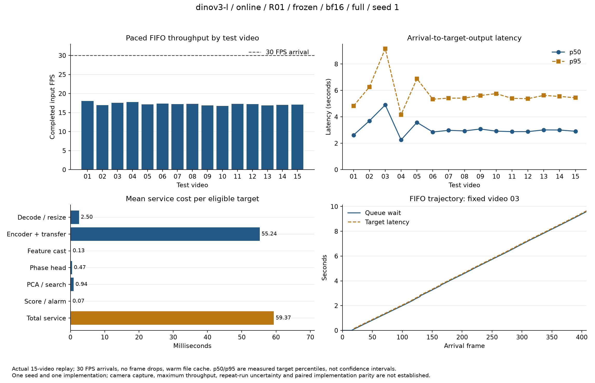

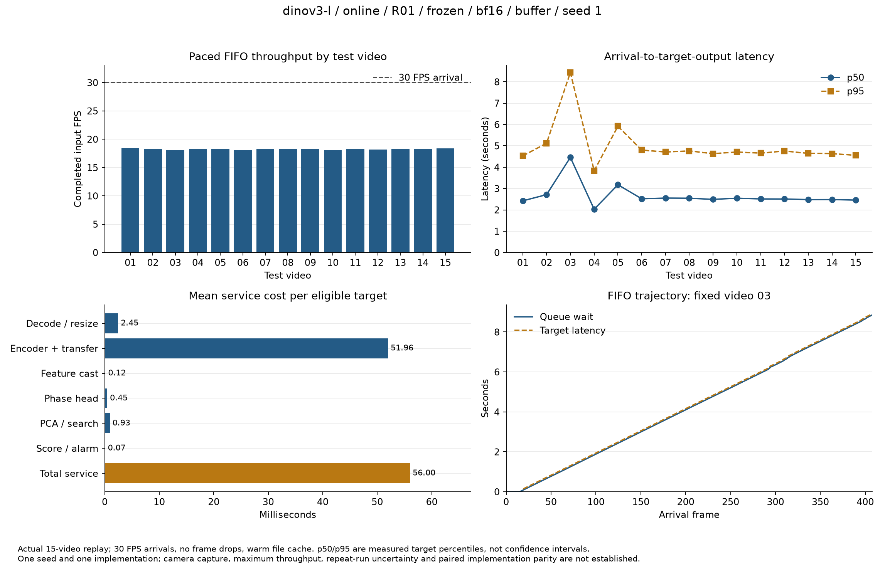

[전체 두 실행 CSV·JSON·trace 감사·일치 gate](../results/stage05/runtime/frozen/dinov3-l/online/R01/seed1/bf16), [full 그림 소스](figures/stage05/runtime/dinov3-l_online_R01_seed1_frozen_bf16_full.json), [buffer 그림 소스](figures/stage05/runtime/dinov3-l_online_R01_seed1_frozen_bf16_buffer.json)를 제공한다. 전체 240회 중 6회가 완료됐지만 이 seed의 FP32 쌍과 seed 2, 다른 장비·백본·LoRA 실시간 비교는 남아 있다. 서로 다른 seed의 이 측정치를 반복 실행 CI나 완결된 세-seed 실시간 평균으로 사용하지 않는다.

## FP32 재사용 점수 불일치의 trace 진단

[diagnose_runtime_pair.py](../scripts/diagnose_runtime_pair.py)는 공개된 R01 온라인 seed 0의 FP32 full/reuse pair를 **동일한 사전 gate**로 다시 비교했다. 실제 측정 실행기의 [소스/완료 출력 snapshot](../results/setup/runtime_controller_source_check.json), 고정 정상 보정과 은행 해시, 기존 두 실제 trace 감사의 입력 해시를 확인하고 15개 영상·유효 target 3,400개를 모두 분석했다. 입력·GT·알람을 제외해 통과시키거나 허용 오차를 바꾸지 않았다.

| 영상 / target | raw 특징 점수 차이 (reuse−full) | raw gate 허용량 대비 배수 | 최종 P3 점수 차이 | full/reuse 위상 bin |
|---|---:|---:|---:|---:|
| 03 / 269 | +0.000221223 | 48.3× | +0.001088725 | 12 / 12 |
| 11 / 19 | +0.000478625 | 89.5× | +0.002336804 | 13 / 13 |
| 13 / 104 | +0.000411659 | 82.3× | +0.002005507 | 12 / 12 |

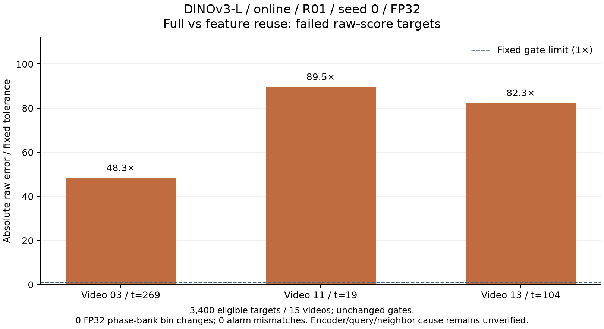

이 세 target에서 raw 특징 점수가 gate를 넘었다. **전체 3,400 target의 실제 FP32 위상 bin 전환은 0개, 알람 불일치도 0개**였다. 현재 `TorchMemory`는 위상의 FP32 bin으로 인접 세 bin을 선택하므로, 이 pair에서 raw 차이를 위상 bin 경계 이동으로 설명할 수 없다. 진단은 로그의 double 값을 그대로 floor하지 않고 런타임과 같은 FP32 cast 후 bin을 계산했다.

고정 P3 MAD scale은 특징 `0.1016114271`, 시간 `0.0012385573`이다. 같은 정상 보정에서 `ΔP3 = 0.5 × Δfeature / feature_scale + 0.5 × Δtime / time_scale`를 전체 target에 적용한 최대 재계산 오차는 **3.20×10⁻¹⁶**이었다. 세 실패 지점의 최종 차이는 대부분 raw 특징 차이에서 이어졌고, 시간 기여는 각각 `+1.54×10⁻⁷`, `−1.84×10⁻⁵`, `−2.01×10⁻⁵`였다.

[모든 영상/target 검사·수치·출처·PNG/SVG 해시](../results/stage05/runtime/frozen/dinov3-l/online/R01/seed0/fp32/failure_diagnostics.json)를 제공한다. 이 결과는 **trace 진단**이며 encoder 특징·PCA 변환 query·선택 이웃/거리·tie를 캡처하지 않았다. 당시 남았던 GPU 비교는 아래 절에서 별도 수행했다. 현재 parity 상태는 계속 **실패**이고 FP32 reuse를 동등한 최적화로 채택하지 않는다. FPS·지연을 새로 측정하거나 정확도를 개선한 결과도 아니다.

```bash
PYTHONPATH=src python scripts/diagnose_runtime_pair.py \
  --root results/stage05/runtime/frozen/dinov3-l/online/R01/seed0/fp32 \
  --normal-fit results/stage02/dinov3-l/online/R01/seed0/normal_fit.json \
  --bank artifacts/runs/dinov3-l/online/R01/seed0/memory.npz \
  --measurement-sources results/setup/runtime_controller_source_check.json \
  --figure docs/figures/stage05/runtime/dinov3_l_online_R01_seed0_fp32_raw_failures
```

### GPU 검색 중간값 캡처와 독립 비교

[probe_runtime_search.py](../scripts/probe_runtime_search.py)는 위 세 실패 target을 입력으로 사용한다. full/reuse를 **별도 프로세스**로 실행하며, 원래 정상 clip의 20회 warmup과 영상 시작부터 실패 target까지의 프레임 순서·FP32 encoder/head/search를 유지한다. 모델·선택 head·PCA/메모리·보정·원본·실측 소스 해시를 확인한다. 실행 중인 정확도 파이프라인과 같은 잠금을 사용하고 runtime controller가 hold 상태이며 GPU가 비어 있어야 시작한다.

캡처한 PCA query·이웃 ID/거리·상위 5% patch 잔차는 기존 `TorchMemory`의 실제 API와 **정확히 같은 값**인지 확인한다. 보조 FP64 검색은 원래 **FP32 query/프로토타입을 승격한 뒤 명시적 차의 제곱합**으로 거리를 재계산한다. encoder/PCA를 FP64로 실행하는 실험이 아니다. k=5/6 경계 거리, full/reuse의 특징·query 및 원래 실측 점수 재현 여부를 후속 비교에 사용한다. 대형 배열은 ignored `artifacts/`에 저장한다.

full/reuse를 각각 실제 GPU에서 실행해 **3개 context × 2개 구현의 캡처를 완료**했다. 원래 측정과 같은 RTX PRO 6000·Torch 2.8.0+cu128을 사용했고 TF32를 비활성화했다. 각 캡처의 raw 점수는 원래 측정값과 정확히 같았다. 학습·시간 측정과 겹치지 않는 별도 실행이며 새로운 처리량을 측정하지 않았다. 아래 캡처 명령을 재실행할 때는 새로운 ignored 경로를 사용하고 GPU 작업이 끝나야 한다. 준비 당시의 [CPU 검증 기록](../results/setup/runtime_search_probe_preparation_check.json)은 역사적 snapshot으로 보존한다.

```bash
PYTHONPATH=src:scripts .venv/bin/python scripts/probe_runtime_search.py \
  --implementation full --data-root ../IPAD_dataset/IPAD_dataset \
  --capture-root artifacts/probes/dinov3_R01_seed0_fp32_full
PYTHONPATH=src:scripts .venv/bin/python scripts/probe_runtime_search.py \
  --implementation reuse --data-root ../IPAD_dataset/IPAD_dataset \
  --capture-root artifacts/probes/dinov3_R01_seed0_fp32_reuse
```


[summarize_runtime_search_probe.py](../scripts/summarize_runtime_search_probe.py)는 원래 실패 pair와 실제 측정 소스·모델·메모리·capture JSON/배열 해시를 다시 확인한다. 캡처된 FP32 query와 프로토타입을 FP64로 승격하고, NumPy 명시적 거리로 **모든 384 후보의 k=5 선택·거리·가중 투영·patch 잔차·상위 29개 평균·k=5/6 margin**을 독립 재계산했다. GPU 보조 FP64 캡처와의 최대 오차는 **4.44×10⁻¹⁶**이었다. 주 FP32 CUDA 거리 커널이나 encoder/PCA를 CPU로 독립 재현한 검사는 아니다.

| 영상 / target | query 최대 절대 차이 | 실제 FP32 raw 차이 | 보조 FP64 raw 차이 | FP32 / FP64 이웃 집합 변경 patch 수 |
|---|---:|---:|---:|---:|
| 03 / 269 | 2.1681×10⁻⁶ | +0.000221223 | +0.0000000776 | 1 / 0 |
| 11 / 19 | 1.7285×10⁻⁶ | +0.000478625 | +0.000478653 | 1 / 1 |
| 13 / 104 | 1.4752×10⁻⁶ | +0.000411659 | +0.000411653 | 1 / 1 |

각 context는 576개 patch를 사용한다. FP32 이웃 집합이 달라진 patch의 **0-based 인덱스는 각각 212·291·205**이며 변경 개수는 각각 **1개**다. 이웃의 순서와 집합을 별도로 검사했다. 같은 phase bins를 검색했고, local encoder 특징의 최대 절대 차이는 각각 8.5235×10⁻⁶·5.8413×10⁻⁶·4.6492×10⁻⁶이었다.

영상 03에서는 보조 FP64 거리의 이웃 집합이 일치하고 raw 차이가 원래 허용량 안으로 줄었다. 그러나 영상 11·13에서는 FP64에서도 k=5 경계 이웃이 달라져 raw 차이가 원래 허용량을 넘었다. **거리 정밀도만 높여 세 지점을 모두 해결한 결과가 아니다.** 세 context의 FP64 k=5/6 최소 margin은 모두 양수였으므로 모든 차이를 정확한 tie 하나로 설명하지 않는다.

방향을 고정한 보조 계산으로 reuse query에 **full의 FP64 이웃 ID**를 적용했다. 거리·softmax·투영·patch 잔차·상위 29개 평균을 매번 다시 계산한다. 이 고정 ID 계산에서 full 대비 query 효과는 각각 +7.759×10⁻⁸·−1.347×10⁻⁷·−1.143×10⁻⁷이고, reuse의 이웃 선택을 허용하면서 추가된 차이는 0·+0.000478788·+0.000411768이었다. 두 항의 합이 보조 FP64 raw 차이다. 전체 encoder의 단독 원인 입증이나 모든 영상에 대한 인과적 결론을 뜻하지 않는다. 상위 29개 patch 집합도 같다고 가정하지 않았다.

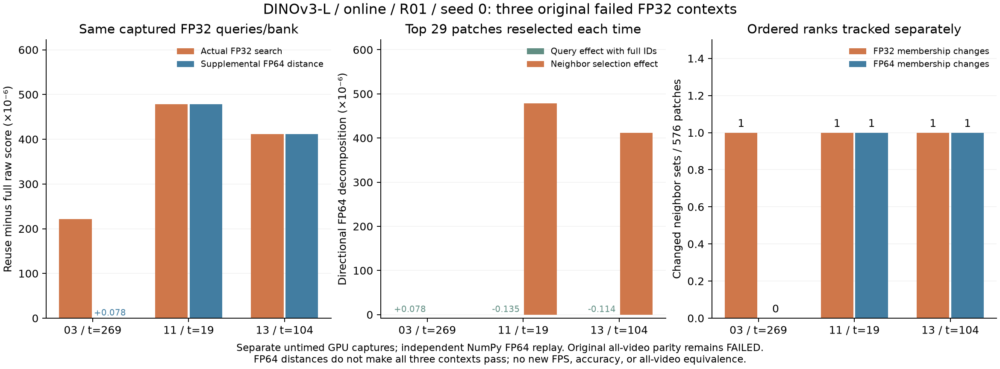

[모든 수치·출처 해시·독립 재계산 오차·PNG/SVG 해시](../results/stage05/runtime/frozen/dinov3-l/online/R01/seed0/fp32/search_probe_comparison.json)를 제공한다. 큰 특징 배열·모델·메모리는 업로드하지 않는다. **원래 15개 영상 parity는 계속 실패**이며 점수 게이트·보정·주 scorer를 바꾸지 않았다. 세 실패 context 진단은 전체 FP64 영상 평가·새로운 정확도/FPS·동등한 스트리밍 최적화 채택을 의미하지 않는다.

```bash
PYTHONPATH=src:scripts python scripts/summarize_runtime_search_probe.py \
  --full artifacts/probes/dinov3_R01_seed0_fp32_full \
  --reuse artifacts/probes/dinov3_R01_seed0_fp32_reuse \
  --figure docs/figures/stage05/runtime/dinov3_l_online_R01_seed0_fp32_search_capture
```

## 캐시의 고정 임계값 알람 coverage

고정 백본 **48조건**과 완료된 LoRA **6조건**의 기존 P3 점수·알람을 실제 annotation으로 검증했다. 모든 조건의 정상 보정과 P0–P3 q99·시간 점수·정규화 점수·3프레임 연속 알람을 기존 검증기로 다시 계산했고, P3 지표도 실제 CSV에서 재확인했다. 정상 q99와 연속 조건을 바꾸지 않았다. 검증된 54조건은 고정 백본 16개·LoRA 2개의 완성된 세-seed 그룹이다. 전체 LoRA는 여전히 6/48조건이다.

아래 탐지율은 **각 GT의 연속 이상 구간 안에서 캐시 알람이 한 번 이상 있는 비율**이다. 실제 탐지 출력 시점을 측정한 값이 아니다. 같은 구간에서 지속 중인 알람도 탐지로 계산한다. 정상 알람 비율은 정상으로 확인된 평가 프레임 중 알람 프레임의 비율이다. 정상 episode 시작은 처음 알람이 켜진 target이 정상인 경우만 센다. 이상/미확정 구간에서 켜져 정상 구간까지 이어진 알람의 정상 프레임은 오탐 프레임에 포함하지만 새 정상 episode로 중복 계산하지 않는다. 미확정 GT를 제거하기 전에 episode 시작을 결정한다.

캐시 알람의 공통 target는 **19..N−8**이다. 온라인 캐시의 마지막 7프레임은 이 집계에 포함되지 않으며 실제 스트리밍 EOF 알람은 별도 런타임으로 평가한다. GT 이벤트에 공통 target가 전혀 없으면 coverage 밖으로 기록하고 미탐 분모에서 제외한다. 영상 시작/끝 또는 미확정 라벨에 닿는 GT 구간의 경계를 표시했다. R02 라벨의 정확한 정렬은 여전히 미확정이며 기존 ±1 consensus 정책을 사용한다. R03/R04에도 영상 경계에 닿는 구간이 있으므로 경계 불확실성이 R02에만 존재하는 것은 아니다.

표의 값은 seeds 0/1/2의 지표/횟수 평균이다. seed마다 같은 실제 GT 구간을 평가하므로 세 번의 독립 GT 표본으로 합치지 않았다. 그림의 원은 평균, ×는 개별 seed이며 CI가 아니다. FPS·초 단위 지연·분당 오탐을 캐시 프레임에서 추정하지 않았다.

| 고정 P3 | 모드 | 장비 | 관측 GT 구간 탐지율 (%) | 정상 알람 프레임 비율 (%) | 정상 episode 시작 평균 |
|---|---|---|---:|---:|---:|
| DINOv3-L | offline | R01 | 0.00 | 0.13 | 1.33 |
| DINOv3-L | offline | R02 | 36.67 | 0.74 | 9.00 |
| DINOv3-L | offline | R03 | 35.29 | 0.68 | 7.00 |
| DINOv3-L | offline | R04 | 30.77 | 0.26 | 5.00 |
| DINOv3-L | online | R01 | 4.17 | 0.37 | 3.33 |
| DINOv3-L | online | R02 | 28.33 | 0.50 | 13.00 |
| DINOv3-L | online | R03 | 41.18 | 0.60 | 7.33 |
| DINOv3-L | online | R04 | 41.03 | 0.26 | 5.00 |
| V-JEPA 2.1-L | offline | R01 | 8.33 | 2.58 | 20.67 |
| V-JEPA 2.1-L | offline | R02 | 25.00 | 0.13 | 4.00 |
| V-JEPA 2.1-L | offline | R03 | 39.22 | 0.22 | 7.33 |
| V-JEPA 2.1-L | offline | R04 | 48.72 | 0.41 | 3.67 |
| V-JEPA 2.1-L | online | R01 | 41.67 | 1.14 | 11.67 |
| V-JEPA 2.1-L | online | R02 | 31.67 | 0.32 | 11.33 |
| V-JEPA 2.1-L | online | R03 | 50.98 | 0.24 | 9.00 |
| V-JEPA 2.1-L | online | R04 | 48.72 | 0.81 | 8.33 |


R01 오프라인의 GT 이상 구간은 8개, 공통 target는 3,295개이며 그중 정상은 2,068개다. DINOv3 LoRA의 탐지 평균은 95.83%지만 정상 알람 프레임 비율도 5.79%다. 고정 DINOv3 오프라인 P3는 같은 구간에서 세 seeds 모두 8개를 미탐하고 정상 알람 비율은 0.13%였다. AUROC/AP 개선만으로 고정 임계값의 운영 적합성을 판단하지 않는다. 이 결과를 보고 테스트에 맞춰 임계값을 재선택하지 않았다.

| R01 오프라인 LoRA P3 | seed | 탐지 / 미탐 (8구간) | 정상 episode 시작 | 정상 알람 프레임 / 2,068 |
|---|---:|---:|---:|---:|
| DINOv3-L | 0 | 8 / 0 | 31 | 95 |
| DINOv3-L | 1 | 8 / 0 | 44 | 130 |
| DINOv3-L | 2 | 7 / 1 | 36 | 134 |
| V-JEPA 2.1-L | 0 | 0 / 8 | 2 | 2 |
| V-JEPA 2.1-L | 1 | 1 / 7 | 12 | 26 |
| V-JEPA 2.1-L | 2 | 2 / 6 | 16 | 37 |

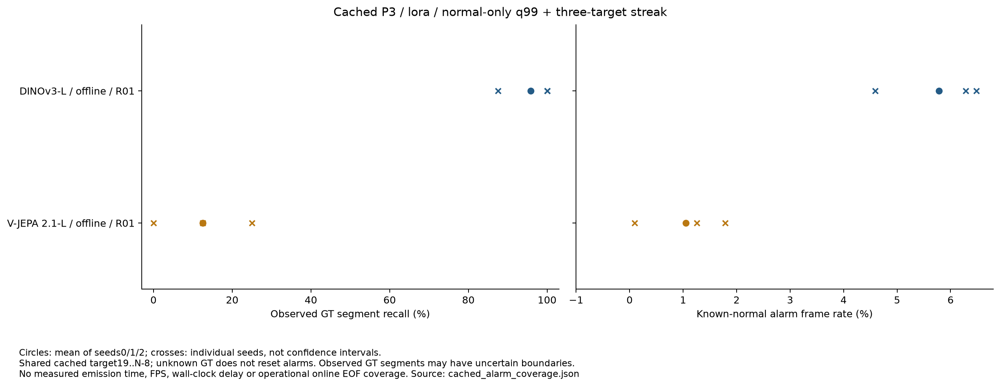

V-JEPA LoRA의 관측 구간 탐지 평균은 12.50%, 정상 알람 프레임 비율은 1.05%다. 고정/LoRA의 별도 정상 학습·보정·메모리 때문에 이는 전체 프로토콜의 동작 비교다. 같은 장비의 온라인 고정 V-JEPA는 관측 구간 탐지율 41.67%였지만 실제 출력이 이벤트 종료 전에 도착했는지는 이 캐시 결과로 알 수 없다.

[조건별·영상별 이벤트/coverage/미탐/오탐·출처 해시](../results/stage05/cached_alarm_coverage/cached_alarm_coverage.json)와 [재현 코드](../scripts/report_cached_alarm_coverage.py)를 제공한다. 실제 annotation 66개와 현재 CSV의 출처를 고정했고, LoRA 5조건의 현재 배열·1조건의 보존 산출물도 다시 확인했다. 삭제된 DINOv3 seed 0 배열의 검사는 과거 증거이며 인코더 추출·PCA/검색을 새로 실행한 결과가 아니다.

```bash
PYTHONPATH=src:scripts python scripts/report_cached_alarm_coverage.py \
  --data-root "$IPAD_DATA_ROOT"
```

코드는 고정 백본 48조건 전체와 독립 검증 기록에 있는 완료된 LoRA 조건을 요구한다. 새 LoRA 조건이 완료돼 검증 기록에 추가되면 해당 조건도 다시 집계한다. 전체 실제 런타임 240회, 다른 장비·온라인 LoRA·진단·추가 실험은 계속 남아 있다.


## R02 seed 0의 고정 임계값 알람 비교

DINOv3-L 오프라인 R02 seed 0의 완료된 LoRA P3를 같은 seed 고정 백본과 비교했다. 두 조건 모두 **각자의 정상 calibration q99·연속 3개 유효 target** 규칙을 유지했다. 새 [단일 조건 비교 코드](../scripts/report_single_cached_alarm_pair.py)는 선택 adapter/joint head·새 메모리와 정상 보정의 독립 감사를 수행하고, P0–P3 전체 CSV의 GT·점수·정상 임계값·시간 점수·원래 알람을 다시 검산한다. 테스트에 맞춰 임계값을 바꾸지 않았다.

| R02 seed 0 P3 | 관측 이상 구간 탐지 / 미탐 | 관측 구간 탐지율 | 정상 알람 프레임 / 6,261 | 정상 알람 프레임 비율 | 정상 episode 시작 |
|---|---:|---:|---:|---:|---:|
| 고정 DINOv3 | 6 / 14 | 30.00% | 6 | 0.0958% | 3 |
| DINOv3 LoRA | 12 / 8 | 60.00% | 16 | 0.2556% | 6 |

공통 캐시 target **19..N−8**의 15개 테스트 영상에서 이상 구간 20개를 관측했다. 정상 target는 6,261개이고, 이상 target 2,949개와 정렬 미확정 target 18개를 포함한 추론 target는 9,228개다. 두 조건의 영상별 target·GT 구간 경계·coverage가 정확히 같음을 확인했다. 관측 구간 중 **7개는 경계가 불확실**하며 R02 라벨 정렬은 계속 미확정이다. 관측 범위 밖의 GT 이상 구간은 0개다.

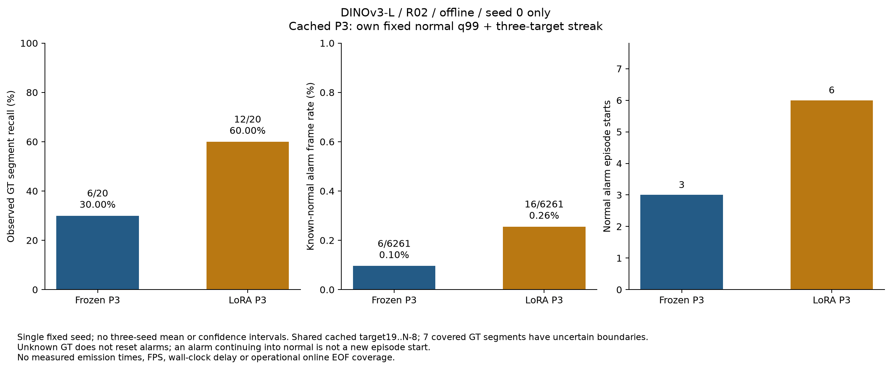

LoRA는 같은 정상 임계값 규칙에서 더 많은 관측 구간을 탐지했지만 정상 알람 프레임과 episode 시작도 증가했다. AUROC/AP **87.06/76.85%**가 관측 이벤트 전부의 탐지를 보장하지 않으며 LoRA는 8구간을 미탐했다. 한 seed의 점 추정치이며 세-seed 평균이나 탐지율 차이의 CI는 아니다. 백본/head/메모리/보정 전체 프로토콜의 비교이며 단일 손실·구성요소의 효과를 분리하지 않는다.

GT 구간 안의 알람 target가 하나라도 있으면 탐지로 센다. 이전 구간에서 계속된 알람도 구간 coverage에 포함한다. episode 시작은 미확정 GT를 제거하기 **전**에 계산하며, 미확정 GT는 알람 streak를 초기화하지 않는다. 이상에서 정상으로 이어진 알람은 정상 프레임 알람에는 포함되지만 새 정상 episode 시작은 아니다. 정상 알람 프레임 비율은 정상 **프레임** 수로 나눈 값이며 분당 오탐이나 실제 알림 수가 아니다. 캐시에는 emission 시간이 없으므로 실제 탐지 지연·FPS·운영 중 온라인 EOF 탐지를 계산하지 않았다.

[영상별 관측 구간·첫 알람 target·미탐·정상 알람·출처 해시](../results/stage05/cached_alarm_coverage/single_seed/dinov3-l/offline/R02/seed0/cached_alarm_pair.json), [fresh 선택 모델/메모리/보정/GT·점수·알람 감사](../results/stage05/cached_alarm_coverage/single_seed/dinov3-l/offline/R02/seed0/audit/T1/dinov3-l/offline/R02/seed0/condition_audit.json), [분석·CPU 검증·활성 학습 확인](../results/setup/R02_single_alarm_publication_check.json)을 제공한다. 두 조건을 같은 데이터로 묶는 검사는 서로 다른 seed·장비·모드·백본, 동일 총계 안의 영상별 coverage/GT 경계 차이, 빠진 영상, 잘못된 집계·임계값 표시를 거부한다. PNG/SVG를 모두 제공하며 모델·원본·특징 배열은 업로드하지 않는다.

```bash
PYTHONPATH=src:scripts python scripts/report_single_cached_alarm_pair.py \
  --model dinov3-l --mode offline --device R02 --seed 0 \
  --data-root "$IPAD_DATA_ROOT" \
  --out results/stage05/cached_alarm_coverage/single_seed/dinov3-l/offline/R02/seed0 \
  --figure docs/figures/stage05/cached_P3_dinov3-l_R02_offline_seed0_pair
```

위 기존 48 고정·6 LoRA 전체 캐시 보고서는 여섯 LoRA 조건의 역사적 그룹 snapshot으로 유지한다. 이번 보고서는 별도 경로의 **새 R02 단일 seed 쌍**이며 기존 세-seed 평균에 섞지 않는다. 전체 LoRA 48조건·240회 실제 런타임과 다른 계획된 실험은 계속 남아 있다.

## R02 seed 1의 고정 임계값 알람 비교

완료된 DINOv3-L 오프라인 R02 seed 1의 P3를 같은 seed의 고정 백본과 비교했다. [기존 단일 조건 비교 코드](../scripts/report_single_cached_alarm_pair.py)로 선택 adapter/joint head·메모리·정상 보정을 새로 감사하고, P0–P3 전체 CSV의 GT·시간·raw/보정 점수·고정 임계값·알람을 다시 검산했다. 각자의 **정상 calibration q99·연속 3개 유효 target** 규칙을 유지했으며 테스트를 보고 임계값을 바꾸지 않았다.

| R02 seed 1 P3 | 관측 이상 구간 탐지 / 미탐 | 관측 구간 탐지율 | 정상 알람 프레임 / 6,261 | 정상 알람 프레임 비율 | 정상 episode 시작 |
|---|---:|---:|---:|---:|---:|
| 고정 백본 | 8 / 12 | 40.00% | 88 | 1.4055% | 17 |
| LoRA | 7 / 13 | 35.00% | 9 | 0.1437% | 7 |

같은 15개 실제 영상의 inference target는 **9,228개**, 유효 GT target는 **9,210개**(이상 2,949·정상 6,261), unknown GT는 **18개**다. 관측 이상 구간 20개 모두 공통 평가 범위와 겹쳤으며, 이 중 7개 구간의 경계는 불확실하다. 이전 seed 0와 동일한 관측 GT 구간·target 범위를 사용하지만 모델과 보정은 각 seed별로 따로 학습했다.

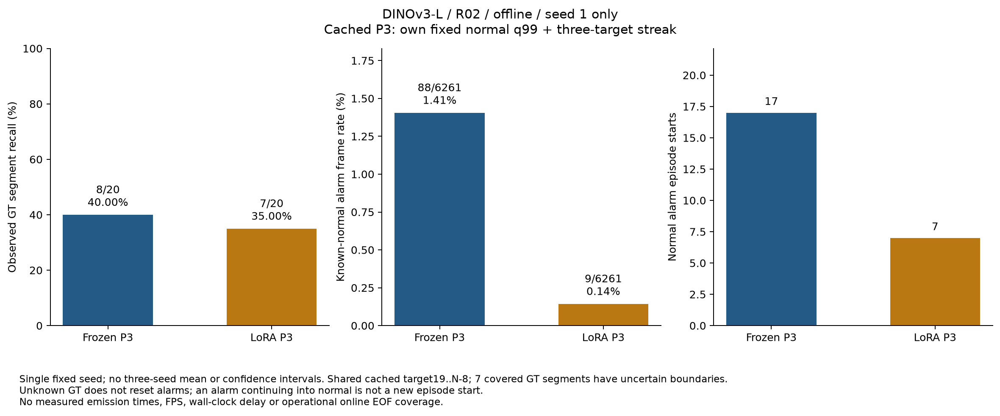

LoRA는 정상 알람 프레임과 정상 episode 시작이 줄었지만 관측 이상 구간 탐지도 1개 적었다. [전체 평가](STAGE04.md#dinov3-r02-오프라인-seed-1의-완료된-전체-평가)의 P3 AUROC/AP 차이 점 추정치는 양수였으나 두 CI는 0을 포함했다. Ranking 지표와 특정 정상 임계값의 탐지·오탐은 함께 살펴야 한다. Seed 0의 탐지 증가·정상 알람 증가와 이번 seed 1의 결과를 함께 보존하며, 테스트에 맞춘 모델/seed/임계값 선택을 하지 않았다.

GT 구간 안에 알람 target가 하나라도 있으면 관측 구간 탐지로 센다. 앞에서 시작해 구간 안으로 이어진 알람도 포함한다. 정상 episode 시작은 GT 필터 전 전체 알람 시퀀스의 시작에서 계산하며, 이상에서 정상으로 이어진 알람은 정상 프레임에 포함하지만 새로운 정상 시작으로 세지 않는다. Unknown GT는 알람 streak를 초기화하지 않는다. 공통 cached target19..N-8의 **단일 고정 seed** 결과이며 세-seed 평균·CI·실제 방출 시각·FPS·wall-clock 지연·온라인 EOF 탐지는 제공하지 않는다.

[전체 per-video 구간·정상/unknown 프레임·source/annotation 해시·검증 결과](../results/stage05/cached_alarm_coverage/single_seed/dinov3-l/offline/R02/seed1/cached_alarm_pair.json), [새 독립 LoRA 감사](../results/stage05/cached_alarm_coverage/single_seed/dinov3-l/offline/R02/seed1/audit/T1/dinov3-l/offline/R02/seed1/condition_audit.json), [게시 검증 기록](../results/setup/R02_seed1_single_alarm_publication_check.json)과 PNG/SVG를 제공한다. 기존 54조건 캐시 알람 group snapshot은 유지하며, R02 두 개 seed를 세-seed 평균에 섞지 않는다. 주 LoRA 완료 수는 **8/48조건**이다. 모델·원본 영상·특징 배열은 업로드하지 않는다.

```bash
PYTHONPATH=src:scripts python scripts/report_single_cached_alarm_pair.py \
  --model dinov3-l --mode offline --device R02 --seed 1 \
  --data-root ../IPAD_dataset/IPAD_dataset \
  --out results/stage05/cached_alarm_coverage/single_seed/dinov3-l/offline/R02/seed1 \
  --figure docs/figures/stage05/cached_P3_dinov3-l_R02_offline_seed1_pair
```

## R02 seed 2의 고정 임계값 알람 비교

완료된 DINOv3-L 오프라인 R02 seed 2를 같은 seed 고정 백본과 비교했다. 각자의 정상 calibration q99와 연속 3개 target 규칙을 유지했다. 선택 adapter/joint head·새 메모리·정상 보정을 독립 감사하고, P0–P3 전체 CSV의 GT·점수·임계값·원래 알람을 다시 검산했다.

| R02 seed 2 P3 | 관측 이상 구간 탐지 / 미탐 | 탐지율 | 정상 경보 프레임 / 6,261 | 정상 경보 프레임 비율 | 정상 episode 시작 |
|---|---:|---:|---:|---:|---:|
| 고정 백본 | 8 / 12 | 40.00% | 45 | 0.7187% | 7 |
| LoRA | 10 / 10 | 50.00% | 58 | 0.9264% | 17 |

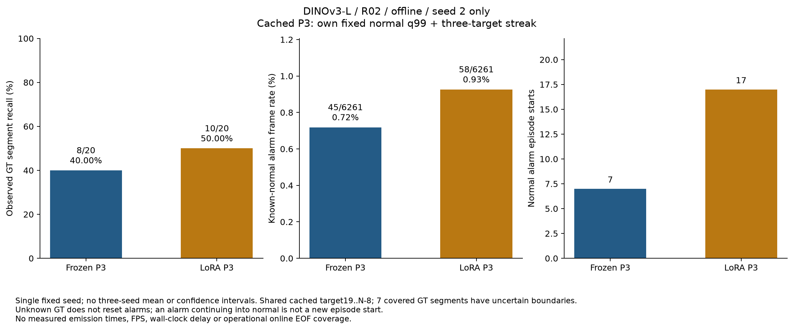

관측 구간 탐지는 늘었고 정상 경보도 늘었다. 같은 seed의 [AUROC/AP 차이](STAGE04.md#dinov3-r02-오프라인-seed-2의-완료된-전체-평가)는 음수 점 추정치이고 두 paired CI는 0을 포함했다. Ranking과 특정 정상 임계값의 경보 성능을 함께 기록하며 테스트에 맞춰 모델·seed·임계값을 선택하지 않았다.

15개 영상의 공통 cached target **19..N−8**은 9,228개이며 유효 GT 9,210개(이상 2,949·정상 6,261), unknown 18개다. 관측 이상 구간 20개 중 경계가 불확실한 구간은 7개이고 coverage 밖 구간은 0개다. GT 구간 안의 경보 target가 하나라도 있으면 탐지로 센다. 앞서 시작한 경보가 이어져 들어오는 경우도 포함한다. 정상 episode 시작은 GT 필터 전 원래 경보 시퀀스에서 계산한다. 이상에서 정상으로 이어지는 경보는 정상 프레임으로 세지만 새 정상 시작으로 세지 않으며 unknown GT는 streak를 초기화하지 않는다. 단일 고정 seed 결과로 CI·실제 방출 시각·FPS·wall-clock 지연·온라인 EOF 탐지는 제공하지 않는다.

[영상별 경계·탐지·미탐·경보 및 해시](../results/stage05/cached_alarm_coverage/single_seed/dinov3-l/offline/R02/seed2/cached_alarm_pair.json), [독립 감사](../results/stage05/cached_alarm_coverage/single_seed/dinov3-l/offline/R02/seed2/audit/T1/dinov3-l/offline/R02/seed2/condition_audit.json)를 제공한다.

```bash
PYTHONPATH=src:scripts python scripts/report_single_cached_alarm_pair.py \
  --model dinov3-l --mode offline --device R02 --seed 2 \
  --data-root ../IPAD_dataset/IPAD_dataset \
  --out results/stage05/cached_alarm_coverage/single_seed/dinov3-l/offline/R02/seed2 \
  --figure docs/figures/stage05/cached_P3_dinov3-l_R02_offline_seed2_pair
```

## R02 세 seed의 고정 임계값 알람 집계

새 보고서는 **48개 고정 백본·9개 완료 LoRA 조건**, 총 57조건의 P3를 정상 임계값·GT·점수·경보 재검산 후 집계했다. 완결된 세-seed 그룹은 고정 백본 16개·LoRA 3개다. 이전 54조건 보고서는 당시의 snapshot으로 보존했다. 새 결과는 별도 경로에 기록했다. 각 seed의 정상 q99와 streak를 유지하고 고정된 **seed 0/1/2 지표의 산술평균**을 사용했다. seed를 합쳐 새 경보 시퀀스로 만들지 않았다.

| DINOv3-L offline R02 P3 | seed 0 | seed 1 | seed 2 | 세 seed 평균 |
|---|---:|---:|---:|---:|
| 고정 관측 구간 탐지 / 20 | 6 | 8 | 8 | 7.33 |
| LoRA 관측 구간 탐지 / 20 | 12 | 7 | 10 | 9.67 |
| 고정 관측 구간 탐지율 (%) | 30.00 | 40.00 | 40.00 | 36.67 |
| LoRA 관측 구간 탐지율 (%) | 60.00 | 35.00 | 50.00 | 48.33 |
| 고정 정상 경보 프레임 / 6,261 | 6 | 88 | 45 | 46.33 |
| LoRA 정상 경보 프레임 / 6,261 | 16 | 9 | 58 | 27.67 |
| 고정 정상 경보 프레임 비율 (%) | 0.0958 | 1.4055 | 0.7187 | 0.7400 |
| LoRA 정상 경보 프레임 비율 (%) | 0.2556 | 0.1437 | 0.9264 | 0.4419 |
| 고정 정상 episode 시작 | 3 | 17 | 7 | 9.00 |
| LoRA 정상 episode 시작 | 6 | 7 | 17 | 10.00 |

평균 관측 구간 탐지율은 **+11.67%p**, 정상 경보 프레임 비율은 **−0.2981%p**다. 정상 episode 시작 평균은 **9→10개**로 늘었다. seed 0/2는 탐지·정상 경보가 함께 늘었고 seed 1은 함께 줄었다. 평균 개선이 모든 seed의 개선을 뜻하지 않으며 이번 경보 집계에는 CI나 seed 모집단에 대한 불확실성 추정을 제공하지 않는다.

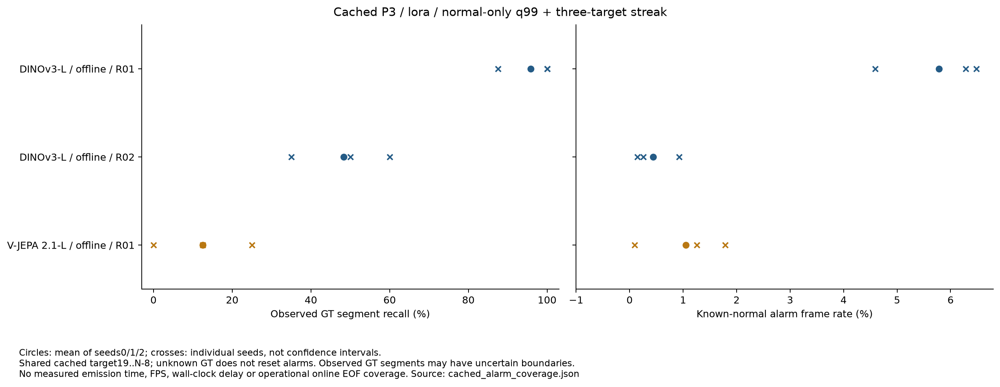


원은 세 seed 평균, ×는 각 seed 값이다. ×의 범위는 CI가 아니다. R02의 모든 seed·두 처리에서 실제 영상별 target·GT 구간 경계·coverage가 같은지 단일 쌍 보고서와 새 집계의 행을 직접 대조했다. 실제 annotation 66개와 공개 CSV·검증 출처를 고정했다. LoRA 8조건은 현재 배열의 독립 검증을 사용하며 삭제된 DINOv3 R01 seed 0의 배열 검사는 역사적 증거로 유지한다. 픽셀 재인코딩이나 PCA/검색을 새로 실행한 결과는 아니다.

R02 라벨 정렬은 여전히 미확정이며 기존 ±1 consensus·18 unknown target 제외 정책을 유지한다. 관측 구간/coverage 정의와 경계 불확실성도 위 단일 seed와 같다. 온라인 캐시의 마지막 7프레임은 공통 범위 밖이고 실제 스트리밍 EOF 탐지는 별도 측정한다. 이번 캐시 집계는 **실시간 FPS·방출 시각·지연·카메라 입력 성능**을 입증하지 않는다. 주 LoRA 정확도 완료 수는 **9/48조건·3/16그룹**이며 전체 계획을 계속 진행한다.

[57조건·영상별 결과·세-seed 평균·출처/annotation 해시](../results/stage05/cached_alarm_coverage_R01_R02/cached_alarm_coverage.json), [현재/보존 배열의 9조건 감사](../results/stage04/retained_matrix_audit_R01_R02/validation.json), [분석·그래프·게시 검증 기록](../results/setup/R02_seed2_and_group_alarm_publication_check.json)과 PNG/SVG를 제공한다. 원본 영상·모델·특징 배열은 업로드하지 않는다.

```bash
PYTHONPATH=src:scripts python scripts/report_cached_alarm_coverage.py \
  --root results/stage04/retained_matrix_audit_R01_R02 \
  --data-root ../IPAD_dataset/IPAD_dataset \
  --out results/stage05/cached_alarm_coverage_R01_R02 \
  --figures docs/figures/stage05/cached_alarm_R01_R02
```

## V-JEPA R02 seed 0의 고정 임계값 알람 비교

완료된 V-JEPA 2.1-L 오프라인 R02 seed 0의 P3를 같은 seed의 고정 백본과 비교했다. [기존 단일 조건 비교 코드](../scripts/report_single_cached_alarm_pair.py)로 선택 adapter/joint head·메모리·정상 보정을 새로 감사하고, P0–P3 전체 CSV의 GT·시간·raw/보정 점수·임계값·알람을 다시 검산했다. 각자의 **정상 calibration q99·연속 3개 유효 target** 규칙을 유지했다.

| R02 seed 0 P3 | 관측 이상 구간 탐지 / 미탐 | 관측 구간 탐지율 | 정상 경보 프레임 / 6,261 | 정상 경보 프레임 비율 | 정상 episode 시작 |
|---|---:|---:|---:|---:|---:|
| 고정 백본 | 3 / 17 | 15.00% | 1 | 0.0160% | 1 |
| LoRA | 13 / 7 | 65.00% | 9 | 0.1437% | 4 |

같은 15개 실제 영상의 inference target는 **9,228개**, 유효 GT target는 **9,210개**(이상 2,949·정상 6,261), unknown GT는 **18개**다. 관측 이상 구간 20개 모두 공통 평가 범위와 겹쳤으며 이 중 7개 구간의 경계는 불확실하다. R02/12·13·14의 기존 라벨 정렬 불확실성과 18프레임 제외 규칙을 유지했다.

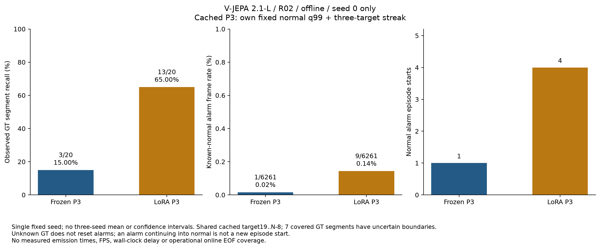

LoRA의 관측 구간 탐지는 **3→13개**로 늘었고 미탐은 **17→7개**로 줄었다. 정상 경보 프레임은 **1→9개**, 정상 episode 시작은 **1→4회**로 늘었다. [전체 평가](STAGE04.md#v-jepa-21-r02-오프라인-seed-0의-완료된-전체-평가)의 P3 AUROC/AP는 **62.54/43.48→67.82/56.80%**, 차이는 **+5.28/+13.31pp**이고 두 paired 95% CI는 양수였다. Ranking 지표와 이 고정 임계값의 탐지·정상 경보 결과를 함께 제공한다. 이 알람 구간 집계에는 CI를 산출하지 않았다. 테스트를 보고 임계값·epoch·seed를 다시 선택하지 않았다.

GT 구간 안에 알람 target가 하나라도 있으면 관측 구간 탐지로 센다. 앞에서 시작해 구간 안으로 이어진 알람도 포함한다. 정상 episode 시작은 GT 필터 전 전체 알람 시퀀스의 시작에서 계산하며, 이상에서 정상으로 이어진 알람은 정상 프레임에 포함하지만 새로운 정상 시작으로 세지 않는다. Unknown GT는 알람 streak를 초기화하지 않는다. 공통 cached target19..N-8의 **단일 고정 seed** 결과이며, 세-seed 평균·학습 seed 변동성·실제 방출 시각·FPS·wall-clock 지연·온라인 EOF 탐지는 아직 입증하지 않는다.

[전체 per-video 구간·정상/unknown 프레임·source/annotation 해시·검증 결과](../results/stage05/cached_alarm_coverage/single_seed/vjepa21-l/offline/R02/seed0/cached_alarm_pair.json), [새 독립 LoRA 감사](../results/stage05/cached_alarm_coverage/single_seed/vjepa21-l/offline/R02/seed0/audit/T1/vjepa21-l/offline/R02/seed0/condition_audit.json), [게시 검증 기록](../results/setup/vjepa_R02_seed0_single_alarm_publication_check.json)과 PNG/SVG를 제공한다. 기존 54조건·57조건 캐시 알람 group snapshot과 그래프를 보존하며, V-JEPA R02의 미완결 seed 그룹을 세-seed 평균에 섞지 않는다. 주 LoRA 정확도는 **10/48조건**, 완결된 세-seed 그룹은 **3/16그룹**이다. 모델·원본 영상·특징 배열은 업로드하지 않는다.

```bash
PYTHONPATH=src:scripts python scripts/report_single_cached_alarm_pair.py \
  --model vjepa21-l --mode offline --device R02 --seed 0 \
  --data-root ../IPAD_dataset/IPAD_dataset \
  --out results/stage05/cached_alarm_coverage/single_seed/vjepa21-l/offline/R02/seed0 \
  --figure docs/figures/stage05/cached_P3_vjepa21-l_R02_offline_seed0_pair
```

## V-JEPA R02 seed 0의 라벨 정렬 민감도

R02/12·13·14는 영상과 원본 라벨 길이가 1프레임 달라 정확한 정렬이 미확정이다. 완료된 V-JEPA 2.1-L 오프라인 seed 0의 **동일 점수 CSV**를 원본 라벨과 대조하고, 해당 세 영상에 한해 `label[t-1]`, `label[t]`, `label[t+1]` 가정으로 AUROC/AP를 다시 계산했다. 길이가 일치한 영상은 기존 index 정렬을 유지했다. 기존 독립 정상 보정·GT·점수·알람 감사의 source/annotation 해시를 확인하고, P0–P3 양쪽 방법의 **24개 민감도 수치**와 주 평가 8개를 모두 검산했다. 모델 추론·학습·PCA·메모리·임계값 선택을 다시 수행하지 않았다.

| P3 방법 | 정렬 가정 | 평가 target / 이상 target | AUROC (%) | AP (%) |
|---|---|---:|---:|---:|
| 고정 백본 | -1 | 9,228 / 2,959 | 62.518 | 43.499 |
| 고정 백본 | +0 | 9,228 / 2,958 | 62.554 | 43.522 |
| 고정 백본 | +1 | 9,228 / 2,957 | 62.537 | 43.496 |
| 고정 백본 | consensus 주 평가 | 9,210 / 2,949 | 62.543 | 43.485 |
| LoRA | -1 | 9,228 / 2,959 | 67.812 | 56.806 |
| LoRA | +0 | 9,228 / 2,958 | 67.827 | 56.811 |
| LoRA | +1 | 9,228 / 2,957 | 67.817 | 56.786 |
| LoRA | consensus 주 평가 | 9,210 / 2,949 | 67.821 | 56.799 |

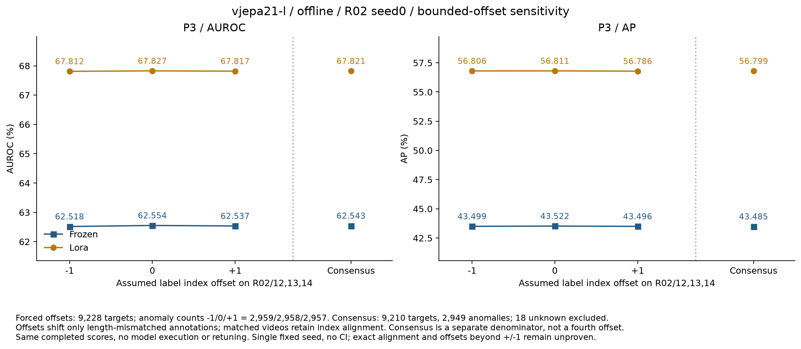

강제 offset 세 가정은 **9,228개** target를 사용하며 이상 target 수는 -1/0/+1에서 **2,959/2,958/2,957개**다. 주 평가 consensus는 세 가정의 라벨이 일치하는 **9,210개**(이상 2,949·정상 6,261)를 사용하고, 불일치한 **18개**를 제외한다. 따라서 consensus를 네 번째 offset으로 연결하거나, 서로 다른 분모를 동일한 평가 집합으로 해석하지 않는다.

이 단일 seed의 P3에서 ±1 가정에 따른 범위(max−min)는 고정 백본 AUROC **0.0357pp**, AP **0.0263pp**, LoRA AUROC **0.0152pp**, AP **0.0246pp**다. 이는 명시된 ±1 가정 안의 점수 민감도만 보여 준다. 정확한 정렬이나 ±1 밖의 오차, 학습 seed 변동성, 통계적 동등성·CI, 온라인 실시간 성능을 입증하지 않는다. 민감도 결과로 라벨·epoch·threshold·seed를 선택하지 않았고, 기존 주 평가와 실험 완료 수 **10/48조건·3/16그룹**을 유지한다.

[전체 P0–P3 수치 및 source/annotation 해시](../results/stage05/alignment_sensitivity/vjepa21-l/offline/R02/seed0/alignment_sensitivity.json), [CPU 재계산·시각 확인·게시 검증](../results/setup/vjepa_R02_seed0_alignment_publication_check.json), [재현 코드](../scripts/report_alignment_sensitivity.py)를 제공한다. 기존 결과와 그래프는 보존하며 모델·원본 라벨 배열·특징 배열은 업로드하지 않는다.

```bash
PYTHONPATH=src:scripts python scripts/report_alignment_sensitivity.py \
  --model vjepa21-l --mode offline --seed 0 \
  --data-root ../IPAD_dataset/IPAD_dataset \
  --audit-report results/stage05/cached_alarm_coverage/single_seed/vjepa21-l/offline/R02/seed0/cached_alarm_pair.json \
  --out results/stage05/alignment_sensitivity/vjepa21-l/offline/R02/seed0 \
  --figure docs/figures/stage05/alignment_vjepa21-l_R02_offline_seed0
```

## V-JEPA R02 seed 1의 고정 임계값 알람 비교

완료된 V-JEPA 2.1-L 오프라인 R02 seed 1의 P3를 같은 seed의 고정 백본과 비교했다. [기존 단일 조건 비교 코드](../scripts/report_single_cached_alarm_pair.py)로 선택 adapter/joint head·메모리·정상 보정을 새로 감사하고, P0–P3 전체 CSV의 GT·시간·raw/보정 점수·임계값·알람을 검산했다. 각자의 **정상 calibration q99·연속 3개 유효 target** 규칙을 유지했다.

| R02 seed 1 P3 | 관측 이상 구간 탐지 / 미탐 | 관측 구간 탐지율 | 정상 경보 프레임 / 6,261 | 정상 경보 프레임 비율 | 정상 episode 시작 |
|---|---:|---:|---:|---:|---:|
| 고정 백본 | 7 / 13 | 35.00% | 3 | 0.0479% | 3 |
| LoRA | 3 / 17 | 15.00% | 20 | 0.3194% | 17 |

같은 15개 실제 영상의 inference target는 **9,228개**, 유효 GT target는 **9,210개**(이상 2,949·정상 6,261), unknown GT는 **18개**다. 관측 이상 구간 20개 모두 공통 평가 범위와 겹쳤으며, 이 중 7개 구간의 경계는 불확실하다. R02/12·13·14의 기존 라벨 정렬 불확실성과 18프레임 제외 규칙을 유지했다.

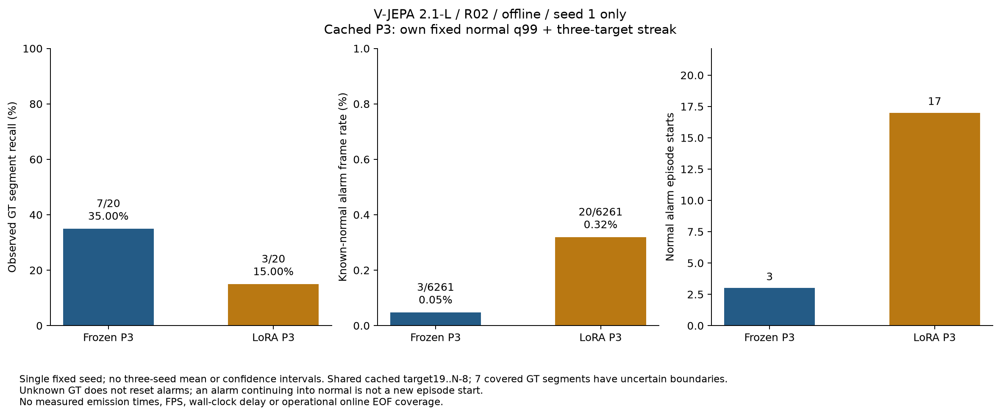

LoRA의 관측 구간 탐지는 **7→3개**(35→15%)로 줄었고 미탐은 **13→17개**로 늘었다. 정상 경보 프레임은 **3→20개**, 정상 episode 시작은 **3→17회**로 늘었다. 이 고정 q99의 탐지·정상 경보 결과는 불리했다. [전체 평가](STAGE04.md#v-jepa-21-r02-오프라인-seed-1의-완료된-전체-평가)의 P3 AUROC/AP는 **62.82/41.80→68.59/49.96%**, 차이는 **+5.78/+8.17pp**다. AP paired 95% CI는 **[+0.45,+15.30]pp**로 양수지만 AUROC CI **[-0.77,+12.06]pp**는 0을 포함했다. Ranking 개선이 이 고정 임계값의 구간 탐지와 정상 경보 개선으로 이어지지 않았음을 함께 보고한다. 이 알람 집계에는 CI를 산출하지 않았고, 테스트를 보고 임계값·epoch·seed·점수 부호를 바꾸지 않았다.

GT 구간 안에 알람 target가 하나라도 있으면 관측 구간 탐지로 센다. 앞에서 시작해 구간 안으로 이어진 알람도 포함한다. 정상 episode 시작은 GT 필터 전 전체 알람 시퀀스의 시작에서 계산하며, 이상에서 정상으로 이어진 알람은 정상 프레임에 포함하지만 새로운 정상 시작으로 세지 않는다. Unknown GT는 알람 streak를 초기화하지 않는다. 공통 cached target19..N-8의 **단일 고정 seed** 결과이며, 세-seed 평균·학습 seed 변동성·실제 방출 시각·FPS·wall-clock 지연·온라인 EOF 탐지는 아직 입증하지 않는다.

[전체 per-video 구간·정상/unknown 프레임·source/annotation 해시·검증 결과](../results/stage05/cached_alarm_coverage/single_seed/vjepa21-l/offline/R02/seed1/cached_alarm_pair.json), [새 독립 LoRA 감사](../results/stage05/cached_alarm_coverage/single_seed/vjepa21-l/offline/R02/seed1/audit/T1/vjepa21-l/offline/R02/seed1/condition_audit.json), [게시 검증 기록](../results/setup/vjepa_R02_seed1_single_alarm_publication_check.json)과 PNG/SVG를 제공한다. 기존 seed 0과 54조건·57조건 캐시 알람 snapshot 및 그래프는 보존한다. V-JEPA R02의 미완결 seed 그룹을 세-seed 평균에 섞지 않는다. 주 LoRA 정확도는 **11/48조건**, 완결된 세-seed 그룹은 **3/16그룹**이다. 모델·원본 영상·특징 배열은 업로드하지 않는다.

```bash
PYTHONPATH=src:scripts python scripts/report_single_cached_alarm_pair.py \
  --model vjepa21-l --mode offline --device R02 --seed 1 \
  --data-root ../IPAD_dataset/IPAD_dataset \
  --out results/stage05/cached_alarm_coverage/single_seed/vjepa21-l/offline/R02/seed1 \
  --figure docs/figures/stage05/cached_P3_vjepa21-l_R02_offline_seed1_pair
```

## V-JEPA R02 seed 1의 점수 분포와 q99 통과

[기존 단일 seed 감사 결과](../results/stage05/cached_alarm_coverage/single_seed/vjepa21-l/offline/R02/seed1/cached_alarm_pair.json)의 불리한 q99 탐지 결과를 기존 P3 점수에서 확인했다. [추가한 CPU 분석 코드](../scripts/report_cached_score_distributions.py)는 감사 당시의 source·annotation SHA를 다시 확인하고, 정상 calibration q99와 저장된 전체 알람을 원래의 **엄격한 `score > q99`·연속 3개 유효 target** 규칙으로 재현했다. Unknown GT를 제거하기 **전에** 전체 추론 target에서 알람을 계산했고, P3 AUROC/AP도 완료된 metrics와 일치하는지 확인했다. Encoder·PCA·프로토타입·head·보정을 다시 학습하거나 테스트로 임계값을 선택하지 않았다.

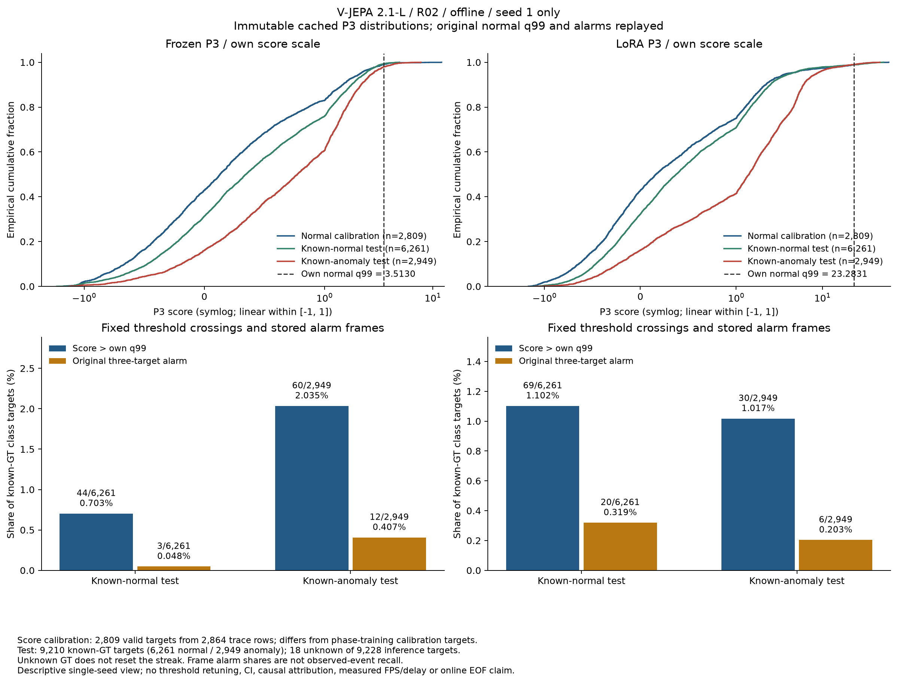

| R02 seed 1 P3 | 기존 정상 q99 | 정상 테스트 q99 초과 / 6,261 | 정상 테스트 최종 알람 / 6,261 | 이상 테스트 q99 초과 / 2,949 | 이상 테스트 최종 알람 / 2,949 |
|---|---:|---:|---:|---:|---:|
| 고정 백본 | 3.5130 | 44 (0.7028%) | 3 (0.0479%) | 60 (2.0346%) | 12 (0.4069%) |
| LoRA | 23.2831 | 69 (1.1021%) | 20 (0.3194%) | 30 (1.0173%) | 6 (0.2035%) |

정상 점수 calibration은 두 방법 모두 **2,864개 trace 행 중 유효 2,809개**이며, q99를 엄격히 초과한 target는 각각 **29개**다. 시간 점수의 준비 구간 때문에 정상 위상 학습 calibration의 2,864개 target와 점수 calibration 분모가 다르다. 테스트 분모는 기존과 같은 **유효 GT 9,210개**(정상 6,261·이상 2,949)이며, inference target 9,228개 중 unknown GT 18개는 기존대로 집계에서 제외한다.

그래프 상단은 정상 calibration·정상 테스트·이상 테스트의 누적 점수 분포다. 음수 점수와 긴 상위 꼬리를 함께 표시하려고 **symlog 축**(−1..1은 선형)을 사용했다. 각 방법의 보정 점수 단위와 정상 q99가 다르므로 임계값 숫자 크기를 직접적인 성능 차이 또는 실패 원인으로 해석하지 않는다. 하단은 해당 클래스 target 중 임계값 초과와 원래 연속 3개 알람이 실제로 차지한 비율이다. LoRA에서 이상 target의 임계값 초과는 **60→30개**, 최종 이상 알람 프레임은 **12→6개**로 줄었고 정상 알람은 **3→20프레임**으로 늘었다. 이 관측값은 앞서 보고한 **구간 탐지 7→3개·정상 경보 증가**와 함께 제공한다. 프레임 알람 비율과 구간 탐지율은 서로 다른 지표다.

**단일 고정 seed의 기존 점수에 대한 기술 분석**이다. 새로운 정확도 조건·세-seed 평균·추가 CI·원인 규명·임계값 튜닝·실제 FPS/방출 지연·온라인 EOF 범위의 증거로 세지 않는다. 기존 선택 tensor/메모리 감사 결과를 참조하며, 이번에 독립 PCA/prototype search나 픽셀 재인코딩을 수행했다는 뜻도 아니다. 주 LoRA 완결은 **11/48조건·3/16 세-seed 그룹**으로 유지한다.

[분포 요약·per-video 통과/알람 수·source/annotation 해시](../results/stage05/score_distributions/vjepa21-l/offline/R02/seed1/score_distributions.json), [게시 검증 기록](../results/setup/vjepa_R02_seed1_score_distributions_publication_check.json)과 PNG/SVG를 제공한다. 모델·원본·특징 배열은 업로드하지 않는다.

```bash
PYTHONPATH=src:scripts python scripts/report_cached_score_distributions.py \
  --audit-report results/stage05/cached_alarm_coverage/single_seed/vjepa21-l/offline/R02/seed1/cached_alarm_pair.json \
  --out results/stage05/score_distributions/vjepa21-l/offline/R02/seed1 \
  --figure docs/figures/stage05/score_distributions_vjepa21-l_R02_offline_seed1
```

## V-JEPA R02 seed 2의 고정 임계값 알람 비교

완료된 V-JEPA 2.1-L 오프라인 R02 seed 2의 P3를 같은 seed 고정 백본과 비교했다. 기존 [단일 조건 분석 코드](../scripts/report_single_cached_alarm_pair.py)로 선택 adapter/joint head·메모리·정상 보정과 41개 특징 cache provenance를 새로 감사하고, P0–P3 전체 CSV의 GT·시간·raw/보정 점수·임계값·알람을 검산했다. 각자의 **정상 calibration q99·연속 3개 유효 target** 규칙을 유지했다.

| R02 seed 2 P3 | 관측 이상 구간 탐지 / 미탐 | 관측 구간 탐지율 | 정상 경보 프레임 / 6,261 | 정상 경보 프레임 비율 | 정상 episode 시작 |
|---|---:|---:|---:|---:|---:|
| 고정 백본 | 5 / 15 | 25.00% | 20 | 0.3194% | 8 |
| LoRA | 4 / 16 | 20.00% | 3 | 0.0479% | 3 |

같은 15개 실제 영상의 inference target는 **9,228개**, 유효 GT target는 **9,210개**(이상 2,949·정상 6,261), unknown GT는 **18개**다. 관측 이상 구간 20개 모두 공통 평가 범위와 겹쳤으며 7개 구간의 경계는 불확실하다. R02/12·13·14의 라벨 정렬 불확실성과 공통 18프레임 제외 규칙을 유지했다.

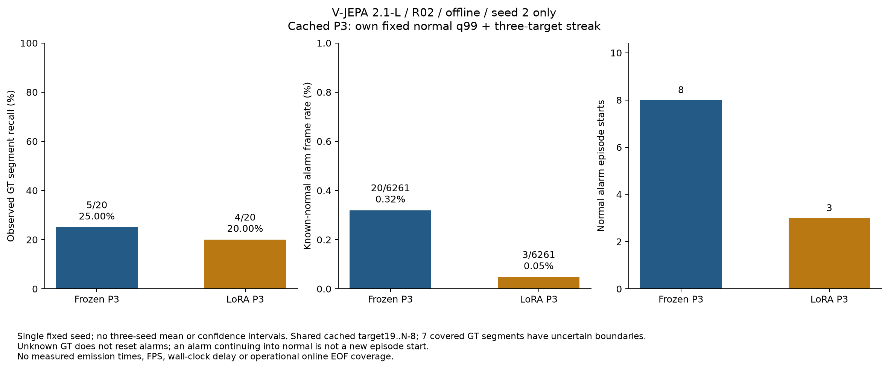

LoRA의 관측 이상 구간 탐지는 **5→4개**(25→20%)로 줄고 미탐은 **15→16개**로 늘었다. 정상 경보 프레임은 **20→3개**, 정상 episode 시작은 **8→3회**로 줄었다. 탐지 감소와 정상 경보 감소를 구분해 보고한다. [같은 seed의 전체 ranking 평가](STAGE04.md#v-jepa-21-r02-오프라인-seed-2의-완료된-전체-평가)는 P3 AUROC/AP **63.95/42.37→61.86/40.69%**, 차이 **−2.09/−1.68pp**로 두 paired 95% CI에 0을 포함했다. 이 고정 임계값의 알람 집계에는 CI를 산출하지 않았고 테스트를 보고 임계값·epoch·seed·점수 부호를 바꾸지 않았다.

GT 구간 안에 알람 target가 하나라도 있으면 관측 구간 탐지로 센다. 앞에서 시작해 구간 안으로 이어진 알람도 포함한다. 정상 episode 시작은 GT 필터 전 전체 알람 시퀀스에서 계산한다. 이상에서 정상으로 이어진 알람은 정상 프레임에 포함하지만 새 정상 시작으로 세지 않으며 unknown GT는 알람 streak를 초기화하지 않는다. 공통 cached target19..N-8의 **단일 고정 seed** 결과다. 실제 방출 시각·FPS·wall-clock 지연·온라인 EOF 탐지나 seed 변동성은 이 집계로 입증하지 않는다.

[영상별 구간·normal/unknown 프레임·source/annotation 해시](../results/stage05/cached_alarm_coverage/single_seed/vjepa21-l/offline/R02/seed2/cached_alarm_pair.json), [새 독립 LoRA 감사](../results/stage05/cached_alarm_coverage/single_seed/vjepa21-l/offline/R02/seed2/audit/T1/vjepa21-l/offline/R02/seed2/condition_audit.json), [게시 검증 기록](../results/setup/vjepa_R02_seed2_single_alarm_publication_check.json)과 PNG/SVG를 제공한다. 기존 모든 단일 seed 결과와 54조건·57조건 snapshot 및 그래프를 보존한다. [R02의 세-seed ranking 평균·paired 백본 비교](STAGE04.md#r02-오프라인-두-백본의-세-seed-lora-비교)는 별도이며, 고정 q99 세-seed 알람 평균은 새 검산 snapshot에서 제공한다. 주 LoRA 정확도 **12/48조건·4/16그룹** 완료 상태이며 나머지 전체 실험을 유지한다. 모델·원본 영상·특징 배열은 업로드하지 않는다.

```bash
PYTHONPATH=src:scripts python scripts/report_single_cached_alarm_pair.py \
  --model vjepa21-l --mode offline --device R02 --seed 2 \
  --data-root ../IPAD_dataset/IPAD_dataset \
  --out results/stage05/cached_alarm_coverage/single_seed/vjepa21-l/offline/R02/seed2 \
  --figure docs/figures/stage05/cached_P3_vjepa21-l_R02_offline_seed2_pair
```

## R02 V-JEPA의 세 seed 고정 임계값 알람 집계

V-JEPA 2.1-L 오프라인 R02 seeds 0/1/2의 실제 전체 평가·독립 감사를 완료한 뒤, 기존 정상 calibration q99와 연속 3개 유효 target의 P3 알람을 재검산했다. 같은 15개 영상·유효 GT 9,210개(이상 2,949·정상 6,261), inference target 9,228개와 unknown GT 18개를 사용했다. 관측 구간 20개 중 7개 경계의 불확실성과 R02/12·13·14의 라벨 정렬 규칙을 유지했다.

| 처리 | Seed | 탐지 / 20 | 구간 탐지율 | 정상 경보 / 6,261 | 정상 경보 비율 | 정상 episode 시작 |
|---|---:|---:|---:|---:|---:|---:|
| 고정 | 0 | 3 | 15.00% | 1 | 0.0160% | 1 |
| 고정 | 1 | 7 | 35.00% | 3 | 0.0479% | 3 |
| 고정 | 2 | 5 | 25.00% | 20 | 0.3194% | 8 |
| 고정 | 평균 | 5.0000 | 25.00% | 8.0000 | 0.1278% | 4.0000 |
| LoRA | 0 | 13 | 65.00% | 9 | 0.1437% | 4 |
| LoRA | 1 | 3 | 15.00% | 20 | 0.3194% | 17 |
| LoRA | 2 | 4 | 20.00% | 3 | 0.0479% | 3 |
| LoRA | 평균 | 6.6667 | 33.33% | 10.6667 | 0.1704% | 8.0000 |

평균 구간 탐지율은 **25.00→33.33%**로 늘었고 정상 경보 프레임 비율도 **0.1278→0.1704%**로 늘었다. Seed 0의 탐지 **3→13개**와 seed 1의 **7→3개**, seed 2의 **5→4개**를 함께 제공한다. 모든 seed에서 개선됐다고 해석하지 않는다. Seed 1의 정상 경보 **3→20프레임**과 seed 2의 **20→3프레임**을 보존한다. 평균은 고정 세 seed의 개별 지표를 산술 평균한 기술 통계이며 이 알람 집계에는 CI를 계산하지 않았다. 그래프의 ×는 개별 seed, 원은 평균이며 CI가 아니다.


[새 전체 60조건·20그룹의 영상별 결과·평균·source/annotation 해시](../results/stage05/cached_alarm_coverage_R01_R02_both_backbones/cached_alarm_coverage.json), [12조건 current/retained 독립 감사](../results/stage04/retained_matrix_audit_R01_R02_both_backbones/validation.json), [게시 검증 기록](../results/setup/R02_both_backbones_cached_alarm_publication_check.json)과 PNG/SVG를 제공한다. 고정 백본 48조건과 LoRA 12조건을 구분했다. 이전 54조건·57조건 snapshot과 모든 단일 seed 데이터·그래프를 보존한다. 주 LoRA 정확도는 **12/48조건·4/16그룹**으로 유지한다.

GT 구간 안의 알람 target로 관측 구간 탐지를 계산하며 앞에서 시작해 이어진 알람도 포함한다. 정상 episode 시작은 unknown GT 필터 전 전체 알람에서 계산하고 unknown GT는 streak를 초기화하지 않는다. 같은 cached target19..N-8 결과다. 온라인 캐시 조건 역시 운영 중 EOF 탐지나 실제 FPS·방출 시각·wall-clock 지연을 입증하지 않는다. R02 ranking의 두 백본 paired CI와 이 고정 임계값의 탐지·정상 경보를 구분한다. 테스트 기반 임계값 재선택·점수 부호 변경·유리한 seed 선택을 하지 않았다.

```bash
PYTHONPATH=src:scripts python scripts/report_cached_alarm_coverage.py \
  --root results/stage04/retained_matrix_audit_R01_R02_both_backbones \
  --data-root ../IPAD_dataset/IPAD_dataset \
  --out results/stage05/cached_alarm_coverage_R01_R02_both_backbones --figures docs/figures/stage05/cached_alarm_R01_R02_both_backbones
```

## DINOv3 R03 seed 0의 고정 임계값 알람 비교

완료된 DINOv3-L 오프라인 R03 seed 0 P3를 같은 seed 고정 백본과 비교했다. 기존 [단일 조건 분석 코드](../scripts/report_single_cached_alarm_pair.py)로 선택 adapter/joint head·메모리·정상 보정과 **36개 특징 cache**를 새로 감사하고, P0–P3 전체 CSV의 GT·시간·raw/보정 점수·임계값·알람을 검산했다. 각 조건의 **정상 calibration q99·연속 3개 유효 target** 규칙을 유지했다.

| R03 seed 0 P3 | 관측 이상 구간 탐지 / 미탐 | 관측 구간 탐지율 | 정상 경보 프레임 / 6,641 | 정상 경보 프레임 비율 | 정상 episode 시작 |
|---|---:|---:|---:|---:|---:|
| 고정 백본 | 6 / 11 | 35.29% | 45 | 0.6776% | 7 |
| LoRA | 10 / 7 | 58.82% | 107 | 1.6112% | 12 |

같은 **17개 실제 영상·11,563개 inference/유효 GT target**(이상 4,922·정상 6,641)을 비교했고 unknown GT는 0개다. 관측 이상 구간 17개 모두 공통 평가 범위와 겹쳤으며 **10개 구간의 경계가 불확실**하다. 이 결과로 불확실 경계의 정확한 시작·종료 시각을 확정하지 않는다.

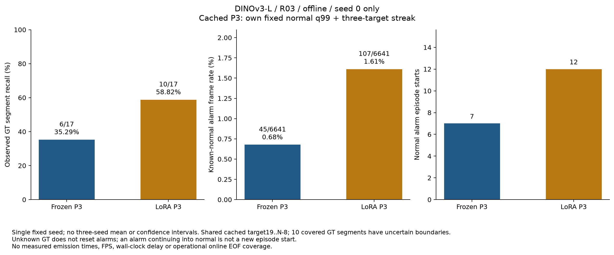

관측 이상 구간 탐지는 **6→10개**(35.29→58.82%)로 늘고 미탐은 **11→7개**로 줄었다. 정상 경보도 **45→107프레임**(0.6776→1.6112%), 정상 episode 시작 **7→12회**로 늘었다. 더 많은 구간 탐지와 더 많은 정상 경보를 함께 보고한다. [같은 seed의 전체 ranking 평가](STAGE04.md#dinov3-r03-오프라인-seed-0의-완료된-전체-평가)는 P3 AUROC/AP **61.09/52.43→62.66/56.68%**, 차이 **+1.58/+4.25pp**지만 두 paired 95% CI는 0을 포함했다. 고정 임계값 알람 집계의 CI는 산출하지 않았다. 테스트에 맞춰 임계값·epoch·seed·점수 부호를 바꾸지 않았다.

GT 구간 안에 알람 target가 하나라도 있으면 관측 구간 탐지로 센다. 앞에서 시작해 구간 안으로 이어진 알람도 포함한다. 정상 episode 시작은 GT 필터 전 전체 알람 시퀀스에서 계산한다. 이상에서 정상으로 이어진 알람은 정상 프레임에 포함하지만 새 정상 시작으로 세지 않으며 unknown GT는 알람 streak를 초기화하지 않는다. 공통 cached target19..N-8의 **단일 고정 seed** 결과다. 실제 방출 시각·FPS·wall-clock 지연·온라인 EOF 탐지나 학습 seed 변동성을 입증하지 않는다.

[영상별 구간·normal/unknown 프레임·source/annotation 해시](../results/stage05/cached_alarm_coverage/single_seed/dinov3-l/offline/R03/seed0/cached_alarm_pair.json), [새 독립 LoRA 감사](../results/stage05/cached_alarm_coverage/single_seed/dinov3-l/offline/R03/seed0/audit/T1/dinov3-l/offline/R03/seed0/condition_audit.json), [게시 검증 기록](../results/setup/dinov3_R03_seed0_single_alarm_publication_check.json)과 PNG/SVG를 제공한다. 기존 모든 단일 seed 결과·고정 백본/LoRA 집계 snapshot과 그래프를 보존한다. 이 분석은 새로운 정확도 조건이나 세-seed 그룹을 추가하지 않으며 주 LoRA **13/48조건·4/16그룹** 상태다. 후속 seed·두 백본·온라인·전체 기준선·추가 실험·실시간 측정 범위를 유지한다. 모델·원본 영상·특징 배열은 업로드하지 않는다.

```bash
PYTHONPATH=src:scripts python scripts/report_single_cached_alarm_pair.py \
  --model dinov3-l --mode offline --device R03 --seed 0 \
  --data-root ../IPAD_dataset/IPAD_dataset \
  --out results/stage05/cached_alarm_coverage/single_seed/dinov3-l/offline/R03/seed0 \
  --figure docs/figures/stage05/cached_P3_dinov3-l_R03_offline_seed0_pair
```

## DINOv3 R03 seed 0의 점수 분포와 q99 통과

완료된 DINOv3-L 오프라인 R03 seed 0의 기존 P3 점수에서 [고정 q99 알람 비교](#dinov3-r03-seed-0의-고정-임계값-알람-비교)를 보완했다. [CPU 분석 코드](../scripts/report_cached_score_distributions.py)는 감사된 source·annotation SHA를 확인하고, 원래 정상 calibration의 q99·엄격한 `score > q99`·연속 3개 유효 target 알람을 전체 추론 target에서 재현한다. GT 필터는 알람 재현 후 적용하며, 저장된 알람·모든 영상의 점수·완료된 P3 AUROC/AP를 검산한다. 실제 분모를 읽도록 코드를 확장했으며, 기존 V-JEPA R02 seed 1의 모든 분포 요약·영상별 수치를 새 CPU 실행으로 재현해 변화가 없음을 확인했다.

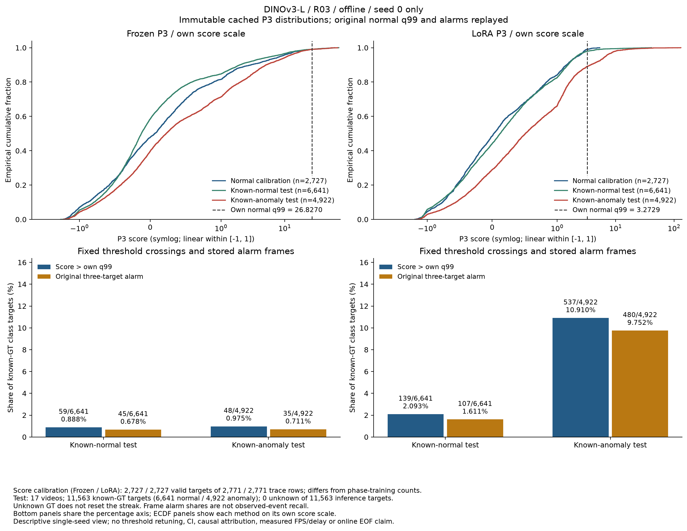

| R03 seed 0 P3 | 기존 정상 q99 | 정상 q99 초과 / 6,641 | 정상 최종 알람 / 6,641 | 이상 q99 초과 / 4,922 | 이상 최종 알람 / 4,922 |
|---|---:|---:|---:|---:|---:|
| 고정 백본 | 26.8270 | 59 (0.8884%) | 45 (0.6776%) | 48 (0.9752%) | 35 (0.7111%) |
| LoRA | 3.2729 | 139 (2.0931%) | 107 (1.6112%) | 537 (10.9102%) | 480 (9.7521%) |

정상 점수 calibration은 두 방법 모두 **2,771개 trace 행 중 유효 2,727개**, q99를 엄격히 초과한 target는 각각 **28개**다. 시간 점수 준비 구간 때문에 정상 위상 학습의 calibration 2,771개 target와 점수 calibration의 분모가 다르다. 테스트는 같은 **17개 영상·11,563개 유효 GT target**(정상 6,641·이상 4,922)이며 unknown GT는 0개다. 원래 학습·특징·PCA·메모리·임계값·점수 부호를 바꾸지 않았다.

상단은 정상 calibration·정상 테스트·이상 테스트의 누적 점수 분포다. 음수와 긴 상위 꼬리를 함께 표시한 **symlog 축**(−1..1은 선형)을 사용한다. 보정 점수 단위가 달라 각 방법의 점수 축을 따로 표시한다. q99 숫자의 크기를 성능 차이나 원인으로 해석하지 않는다. 하단의 알람 비율은 **공통 0 기준 세로축**으로 비교하고 분자·분모·비율을 함께 표기했다.

이상 target의 q99 초과는 **48→537개**, 최종 이상 알람은 **35→480프레임**으로 늘었다. 정상 q99 초과도 **59→139개**, 정상 알람은 **45→107프레임**으로 늘었다. 앞서 관측한 **구간 탐지 6→10/17개**와 함께 읽어야 하며, 프레임 알람 비율을 구간 탐지율로 바꾸어 해석하지 않는다. 단일 seed의 기술 분석으로, 임계값 튜닝·인과 설명·세-seed 평균·추가 CI·실제 FPS/지연·온라인 EOF 탐지의 증거로 세지 않는다. 같은 seed의 ranking 차이 **AUROC +1.58pp / AP +4.25pp**에 대한 두 paired CI는 0을 포함했다.

[영상별 분포·q99 통과·알람 수 및 source/annotation 해시](../results/stage05/score_distributions/dinov3-l/offline/R03/seed0/score_distributions.json), [게시 검증 기록](../results/setup/dinov3_R03_seed0_score_distributions_publication_check.json), PNG/SVG와 회귀 검산 테스트를 제공한다. 실제 전체 CPU 테스트는 **411개 통과**했다. 기존 모든 cached 알람 결과·점수 분포·그래프를 보존하며, 주 LoRA 완결은 **13/48조건·4/16 세-seed 그룹**으로 유지한다. 후속 seed·장비·온라인 비교·전체 기준선·추가 실험·실시간 측정 범위를 유지한다. 모델·원본 영상·특징 배열은 업로드하지 않는다.

```bash
PYTHONPATH=src:scripts python scripts/report_cached_score_distributions.py \
  --audit-report results/stage05/cached_alarm_coverage/single_seed/dinov3-l/offline/R03/seed0/cached_alarm_pair.json \
  --out results/stage05/score_distributions/dinov3-l/offline/R03/seed0 \
  --figure docs/figures/stage05/score_distributions_dinov3-l_R03_offline_seed0
```

## DINOv3 R03 seed 1의 고정 임계값 알람 비교

완료된 DINOv3-L 오프라인 R03 seed 1 P3를 같은 seed 고정 백본과 비교했다. 기존 [단일 조건 분석 코드](../scripts/report_single_cached_alarm_pair.py)로 선택 adapter/joint head·메모리·정상 보정과 **36개 특징 cache**를 새로 감사하고, P0–P3 전체 CSV의 GT·시간·raw/보정 점수·임계값·알람을 검산했다. 각 조건의 **정상 calibration q99·연속 3개 유효 target** 규칙을 유지했다.

| R03 seed 1 P3 | 관측 이상 구간 탐지 / 미탐 | 관측 구간 탐지율 | 정상 경보 프레임 / 6,641 | 정상 경보 프레임 비율 | 정상 episode 시작 |
|---|---:|---:|---:|---:|---:|
| 고정 백본 | 6 / 11 | 35.29% | 44 | 0.6626% | 7 |
| LoRA | 10 / 7 | 58.82% | 30 | 0.4517% | 10 |

같은 **17개 실제 영상·11,563개 inference/유효 GT target**(이상 4,922·정상 6,641)을 비교했고 unknown GT는 0개다. 관측 이상 구간 17개 모두 공통 평가 범위와 겹쳤으며 **10개 구간의 경계가 불확실**하다. 이 결과로 불확실 경계의 정확한 시작·종료 시각을 확정하지 않는다.

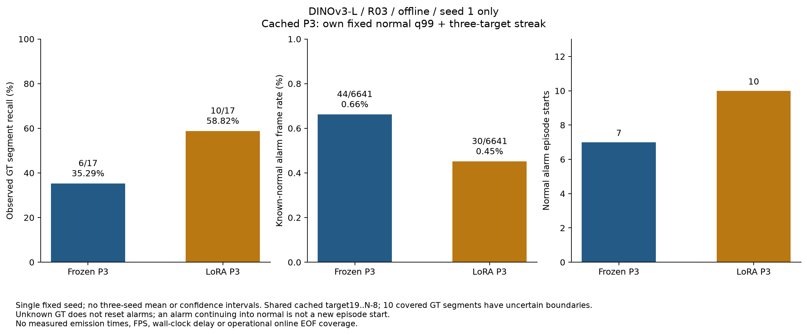

관측 이상 구간 탐지는 **6→10개**(35.29→58.82%), 미탐은 **11→7개**다. 정상 경보는 **44→30프레임**(0.6626→0.4517%), 정상 episode 시작 **7→10회**다. 구간 탐지와 정상 오탐을 함께 보고한다. [같은 seed의 전체 ranking 평가](STAGE04.md#dinov3-r03-오프라인-seed-1의-완료된-전체-평가)는 P3 AUROC/AP **60.12/51.63→61.22/54.29%**, 차이 **+1.10/+2.66pp**지만 두 paired 95% CI는 0을 포함했다. 고정 임계값 알람 집계의 CI는 산출하지 않았다. 테스트에 맞춰 임계값·epoch·seed·점수 부호를 바꾸지 않았다.

GT 구간 안에 알람 target가 하나라도 있으면 관측 구간 탐지로 센다. 앞에서 시작해 구간 안으로 이어진 알람도 포함한다. 정상 episode 시작은 GT 필터 전 전체 알람 시퀀스에서 계산한다. 이상에서 정상으로 이어진 알람은 정상 프레임에 포함하지만 새 정상 시작으로 세지 않으며 unknown GT는 알람 streak를 초기화하지 않는다. 공통 cached target19..N-8의 **단일 고정 seed** 결과다. 실제 방출 시각·FPS·wall-clock 지연·온라인 EOF 탐지나 학습 seed 변동성을 입증하지 않는다.

[영상별 구간·normal/unknown 프레임·source/annotation 해시](../results/stage05/cached_alarm_coverage/single_seed/dinov3-l/offline/R03/seed1/cached_alarm_pair.json), [새 독립 LoRA 감사](../results/stage05/cached_alarm_coverage/single_seed/dinov3-l/offline/R03/seed1/audit/T1/dinov3-l/offline/R03/seed1/condition_audit.json), [게시 검증 기록](../results/setup/dinov3_R03_seed1_single_alarm_publication_check.json)과 PNG/SVG를 제공한다. 기존 모든 단일 seed 결과·고정 백본/LoRA 집계 snapshot과 그래프를 보존한다. 이 분석은 새로운 정확도 조건이나 세-seed 그룹을 추가하지 않으며 주 LoRA **14/48조건·4/16그룹** 상태다. 후속 seed·두 백본·온라인·전체 기준선·추가 실험·실시간 측정 범위를 유지한다. 모델·원본 영상·특징 배열은 업로드하지 않는다.

```bash
PYTHONPATH=src:scripts python scripts/report_single_cached_alarm_pair.py \
  --model dinov3-l --mode offline --device R03 --seed 1 \
  --data-root ../IPAD_dataset/IPAD_dataset \
  --out results/stage05/cached_alarm_coverage/single_seed/dinov3-l/offline/R03/seed1 \
  --figure docs/figures/stage05/cached_alarm_pair_dinov3-l_R03_offline_seed1
```

## DINOv3 R03 seed 1의 점수 분포와 q99 통과

완료된 DINOv3-L 오프라인 R03 seed 1의 기존 P3 점수에서 [고정 q99 알람 비교](#dinov3-r03-seed-1의-고정-임계값-알람-비교)를 보완했다. [CPU 분석 코드](../scripts/report_cached_score_distributions.py)는 감사된 source·annotation SHA를 확인하고, 원래 정상 calibration의 q99·엄격한 `score > q99`·연속 3개 유효 target 알람을 전체 추론 target에서 재현한다. GT 필터는 알람 재현 후 적용하며, 저장된 알람·모든 영상의 점수·완료된 P3 AUROC/AP를 검산한다. 이전 단계에서 실제 분모·공통 비율 축·GT 필터 전 streak 재현을 검증한 동일 코드를 수정 없이 사용했다.

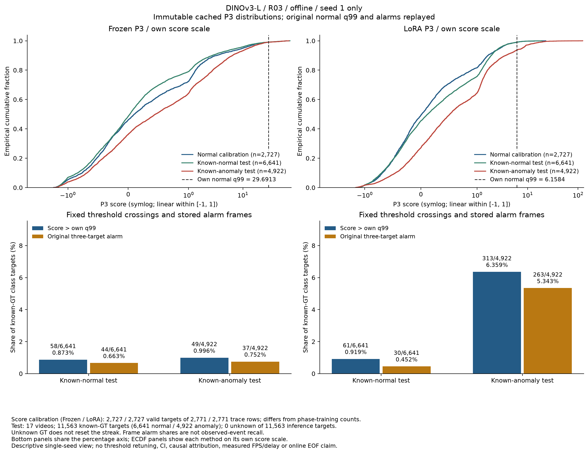

| R03 seed 1 P3 | 기존 정상 q99 | 정상 q99 초과 / 6,641 | 정상 최종 알람 / 6,641 | 이상 q99 초과 / 4,922 | 이상 최종 알람 / 4,922 |
|---|---:|---:|---:|---:|---:|
| 고정 백본 | 29.6913 | 58 (0.8734%) | 44 (0.6626%) | 49 (0.9955%) | 37 (0.7517%) |
| LoRA | 6.1584 | 61 (0.9185%) | 30 (0.4517%) | 313 (6.3592%) | 263 (5.3434%) |

정상 점수 calibration은 두 방법 모두 **2,771개 trace 행 중 유효 2,727개**, q99를 엄격히 초과한 target는 각각 **28개**다. 시간 점수 준비 구간 때문에 정상 위상 학습의 calibration 2,771개 target와 점수 calibration의 분모가 다르다. 테스트는 같은 **17개 영상·11,563개 유효 GT target**(정상 6,641·이상 4,922)이며 unknown GT는 0개다. 원래 학습·특징·PCA·메모리·임계값·점수 부호를 바꾸지 않았다.

상단은 정상 calibration·정상 테스트·이상 테스트의 누적 점수 분포다. 음수와 긴 상위 꼬리를 함께 표시한 **symlog 축**(−1..1은 선형)을 사용한다. 보정 점수 단위가 달라 각 방법의 점수 축을 따로 표시한다. q99 숫자의 크기를 성능 차이나 원인으로 해석하지 않는다. 하단의 알람 비율은 **공통 0 기준 세로축**으로 비교하고 분자·분모·비율을 함께 표기했다.

이상 target의 q99 초과는 **49→313개**, 최종 이상 알람은 **37→263프레임**으로 늘었다. 정상 q99 초과는 **58→61개**인데 최종 정상 알람은 **44→30프레임**이다. 단순 임계값 초과 수와 연속 3-target 알람 수를 구분해 보고한다. 앞서 관측한 **구간 탐지 6→10/17개**와 함께 읽어야 하며, 프레임 알람 비율을 구간 탐지율로 바꾸어 해석하지 않는다. 단일 seed의 기술 분석으로, 임계값 튜닝·인과 설명·세-seed 평균·추가 CI·실제 FPS/지연·온라인 EOF 탐지의 증거로 세지 않는다. 같은 seed의 ranking 차이 **AUROC +1.10pp / AP +2.66pp**에 대한 두 paired CI는 0을 포함했다.

[영상별 분포·q99 통과·알람 수 및 source/annotation 해시](../results/stage05/score_distributions/dinov3-l/offline/R03/seed1/score_distributions.json), [게시 검증 기록](../results/setup/dinov3_R03_seed1_score_distributions_publication_check.json), PNG/SVG와 회귀 검산 테스트를 제공한다. 동일 코드에 대한 이전 전체 CPU 테스트 **411개 통과** 기록을 확인했고, 이번 CPU 분석의 실제 종료 코드 0과 각 게시 커밋의 CI를 별도로 확인한다. 기존 모든 cached 알람 결과·점수 분포·그래프를 보존하며, 주 LoRA 완결은 **14/48조건·4/16 세-seed 그룹**으로 유지한다. 후속 seed·장비·온라인 비교·전체 기준선·추가 실험·실시간 측정 범위를 유지한다. 모델·원본 영상·특징 배열은 업로드하지 않는다.

```bash
PYTHONPATH=src:scripts python scripts/report_cached_score_distributions.py \
  --audit-report results/stage05/cached_alarm_coverage/single_seed/dinov3-l/offline/R03/seed1/cached_alarm_pair.json \
  --out results/stage05/score_distributions/dinov3-l/offline/R03/seed1 \
  --figure docs/figures/stage05/score_distributions_dinov3-l_R03_offline_seed1
```

## R03 두 seed를 포함한 전체 캐시 알람 재검증

새 14조건 독립 감사와 연결해 **고정 백본 48조건 + 완료 LoRA 14조건 = 62조건**의 정상 q99·3-target streak·GT·P0–P3 raw/보정 점수·저장 알람을 기존 CPU 코드로 재검산했다. source **4,226개**와 실제 annotation **66개**의 hash를 확인했다. 기존 **60조건의 모든 영상별 결과와 20개 완결 세-seed 그룹**은 새 결과에서 정확히 동일하다. R03 DINOv3 seeds 0·1은 이미 게시된 개별 q99 결과와도 일치했다.

| R03 DINOv3 오프라인 seed | 구간 탐지 고정→LoRA / 17 | 정상 경보 프레임 고정→LoRA / 6,641 | 정상 episode 시작 고정→LoRA |
|---|---:|---:|---:|
| 0 | 6→10 | 45→107 | 7→12 |
| 1 | 6→10 | 44→30 | 7→10 |

R03은 각 seed의 같은 **17개 테스트·11,563개 inference/유효 GT target(정상 6,641·이상 4,922·unknown 0개)**을 비교했다. 17개 관측 구간 중 10개는 경계가 불확실하다. Seed 0은 탐지와 정상 경보 프레임이 함께 늘었고, seed 1은 탐지가 늘며 정상 경보 프레임이 줄었지만 정상 episode 시작은 늘었다. 두 seed를 평균하거나 유리한 seed만 선택하지 않았다. 해당 ranking 차이의 두 paired CI는 각각 0을 포함하며, 이 알람 집계에는 CI를 산출하지 않았다.

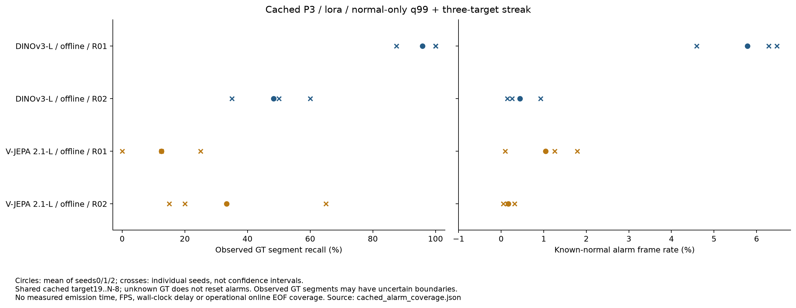


그래프의 원은 exact seeds 0/1/2 평균, ×는 개별 seed이며 CI가 아니다. **고정 16그룹·LoRA 4그룹**만 그림의 평균에 포함하며 R03 LoRA 평균은 아직 없다. 각 정상 calibration q99를 유지했고 같은 cached target19..N-8에서 GT 필터 전에 streak·episode 시작을 계산했다. Unknown GT는 streak를 초기화하지 않는다. 이 결과는 실제 방출 시각·FPS·wall-clock 지연·온라인 EOF 탐지나 새 학습 결과를 뜻하지 않는다. R02/12·13·14의 미확정 정렬과 기존 18개 GT 제외 규칙을 유지했다.

[새 62조건·20그룹의 영상별 결과와 source/annotation hash](../results/stage05/cached_alarm_coverage_R01_R02_R03_DINO_partial/cached_alarm_coverage.json), [연결된 14조건 독립 감사](../results/stage04/retained_matrix_audit_R01_R02_R03_DINO_partial/validation.json), [게시 검증](../results/setup/primary14_matrix_cached62_publication_check.json), PNG/SVG를 제공한다. 기존 54·57·60조건 snapshot과 개별 q99/점수 분포 결과를 모두 보존했다. 주 LoRA는 **14/48조건·4/16그룹**이며 전체 계획은 계속 진행 중이다. 원본 영상·특징 배열·모델은 업로드하지 않는다.

```bash
PYTHONPATH=src:scripts python scripts/report_cached_alarm_coverage.py \
  --root results/stage04/retained_matrix_audit_R01_R02_R03_DINO_partial --data-root ../IPAD_dataset/IPAD_dataset \
  --out results/stage05/cached_alarm_coverage_R01_R02_R03_DINO_partial --figures docs/figures/stage05/cached_R01_R02_R03_DINO_partial
```

## DINOv3 R03 seed 2의 고정 임계값 알람과 점수 분포

같은 seed 고정/LoRA P3의 **17개 테스트·11,563개 inference/유효 GT target(정상 6,641·이상 4,922·unknown 0)**을 기존 CPU 코드로 다시 검산했다. 정상-only 자체 q99와 원래 3-target streak를 유지하고 GT 필터 전에 전체 target19..N−8 trace에서 경보와 episode를 계산했다. 테스트 임계값·epoch·점수 부호를 재선택하지 않았다. 이상 구간은 17개 관측 GT 구간이며 10개는 경계가 불확실하다.

| P3 조건 | 구간 탐지 / 17 | 정상 경보 / 6,641 target | 정상 episode 시작 |
|---|---:|---:|---:|
| 고정 백본 | 6 (35.29%) | 46 (0.693%) | 7 |
| LoRA | 10 (58.82%) | 53 (0.798%) | 15 |

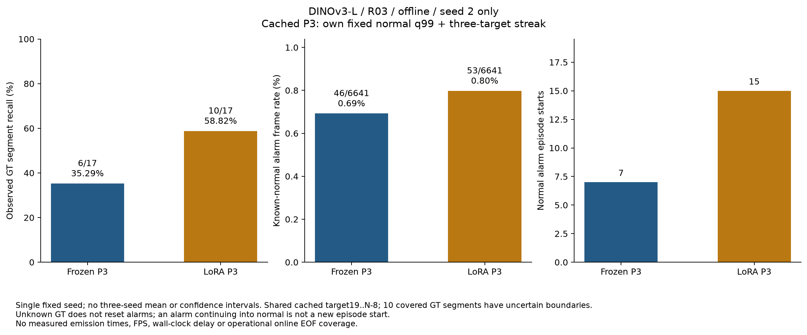

관측 구간 탐지가 늘었지만 정상 경보 프레임과 정상 episode 시작도 늘었다. 이 개별 seed의 경보 집계에는 CI를 산출하지 않았다. P3 ranking의 AUROC CI는 0을 포함하고 AP CI는 양수지만, ranking 개선이 자체 q99 아래 탐지·오탐 개선을 보장하지 않는다.

| 조건 | 자체 정상 q99 | 정상 q99 통과→streak 경보 / 6,641 | 이상 q99 통과→streak 경보 / 4,922 |
|---|---:|---:|---:|
| 고정 백본 | 30.340772 | 60→46 | 48→36 |
| LoRA | 3.790574 | 95→53 | 469→398 |

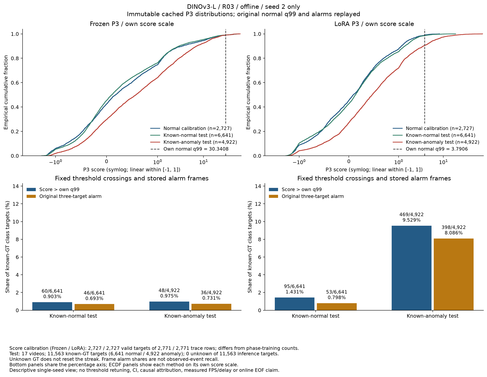

각 조건 calibration trace 2,771개 중 유효 점수 2,727개에서 원래 q99를 재계산했다. 정상 위상 학습 calibration clip 수와 유효 점수 수를 혼동하지 않았다. q99 크기는 서로 다른 정상 보정/특징 공간의 값이며 작은 값 자체가 성능이나 원인이 아니다. ECDF는 각 조건의 자체 점수 축, 아래 패널은 동일한 비율 축으로 비교했다. 정상/이상 프레임 경보 비율은 관측 구간 recall과 다르다. Unknown GT가 streak를 초기화하지 않으며 정상 구간으로 이어진 경보는 새 시작으로 세지 않는다.

원 선택 adapter/메모리·전체 점수·보정·GT·원 경보를 검산한 [pair·영상별 결과·독립 감사](../results/stage05/cached_alarm_coverage/single_seed/dinov3-l/offline/R03/seed2/cached_alarm_pair.json)와 [전체 분포·q99 통과·source/annotation hash](../results/stage05/score_distributions/dinov3-l/offline/R03/seed2/score_distributions.json), [게시 검증](../results/setup/lora_dinov3_R03_seed2_evaluation_publication_check.json)을 제공한다. 실제 CPU 두 분석의 종료 코드 0 및 두 PNG를 직접 검토했다. 이 분석은 임계값 재튜닝·teacher 손실만의 효과·학습 seed CI·측정 FPS·실제 방출 시각·wall-clock 지연·온라인 EOF 성능을 뜻하지 않는다. 이전 seed 0/1 결과와 snapshot은 보존했다.

```bash
PYTHONPATH=src:scripts python scripts/report_single_cached_alarm_pair.py --model dinov3-l --mode offline --device R03 --seed 2 --data-root ../IPAD_dataset/IPAD_dataset --out results/stage05/cached_alarm_coverage/single_seed/dinov3-l/offline/R03/seed2 --figure docs/figures/stage05/dinov3-l_R03_offline_seed2_single_cached_alarm_pair
PYTHONPATH=src:scripts python scripts/report_cached_score_distributions.py --audit-report results/stage05/cached_alarm_coverage/single_seed/dinov3-l/offline/R03/seed2/cached_alarm_pair.json --out results/stage05/score_distributions/dinov3-l/offline/R03/seed2 --figure docs/figures/stage05/dinov3-l_R03_offline_seed2_score_distributions
```

## R03 결과를 포함한 전체 64조건의 캐시 알람 재검증

새 독립 감사와 연결해 **고정 백본 48 + 완료 LoRA 16 = 64조건**의 정상 q99·3-target streak·GT·P0–P3 raw/보정 점수·저장 알람을 기존 CPU 코드로 재검산했다. Source **4,368개**와 실제 annotation **66개**의 hash를 확인했다. 이전 62조건의 모든 영상별 결과 및 20개 완결 세-seed 그룹은 정확히 동일하며, 완료된 DINOv3 R03 세 seeds의 LoRA 그룹만 추가해 **21그룹(고정 16·LoRA 5)**을 제공한다. V-JEPA R03 seed 0은 개별 결과만 제공한다.

| R03 오프라인 개별 조건 | 구간 탐지 고정→LoRA / 17 | 정상 경보 고정→LoRA / 6,641 | 정상 시작 고정→LoRA |
|---|---:|---:|---:|
| dinov3-l_seed0 | 6→10 | 45→107 | 7→12 |
| dinov3-l_seed1 | 6→10 | 44→30 | 7→10 |
| dinov3-l_seed2 | 6→10 | 46→53 | 7→15 |
| vjepa21-l_seed0 | 5→0 | 9→27 | 4→11 |

DINOv3 R03 세 seed의 LoRA 관측 구간 탐지는 각각 10/17개로 평균 **58.82%**다. 정상 경보 프레임은 107/30/53개로 평균 **0.954%**, 정상 episode 시작은 12/10/15회다. 고정 백본은 각각 6/17개로 평균 **35.29%**, 정상 경보 프레임 45/44/46개로 평균 **0.678%**, 정상 시작은 모두 7회다. 평균은 exact seeds0/1/2 산술평균이며 경보 집계에는 CI를 산출하지 않았다. 같은 그룹 P3 ranking 차이의 두 paired CI는 0을 포함한다. V-JEPA R03 seed 0의 탐지 감소·정상 경보 증가와 다른 seed들의 편차를 함께 보고한다.

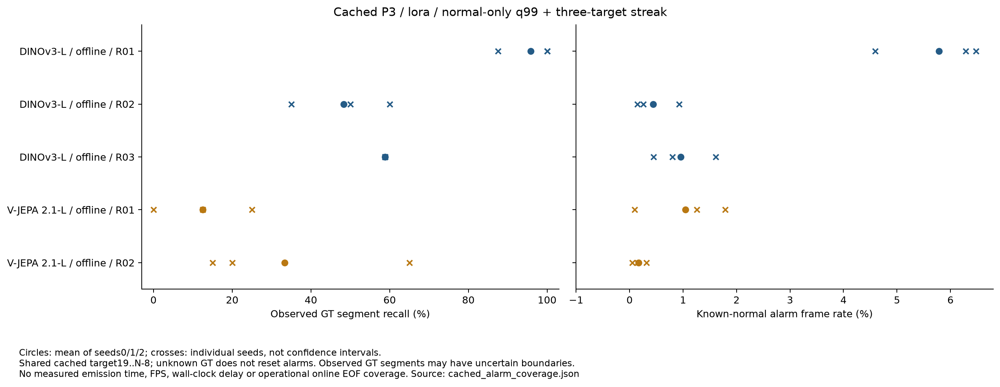


원은 exact 세-seed 평균, ×는 개별 seed이며 CI가 아니다. Cached target19..N−8에서 GT 필터 전 streak를 재생하며 unknown은 streak를 초기화하지 않는다. 관측 구간에는 경계 불확실성이 있다. R02/12·13·14 정렬 미확정 및 기존 18개 GT 제외 규칙을 유지했다. 실제 방출 시각·FPS·wall-clock 지연·온라인 EOF 성능을 주장하지 않는다.

[64조건·21그룹·영상별 결과·source/annotation hash](../results/stage05/cached_alarm_coverage_R01_R02_R03_partial/cached_alarm_coverage.json), [연결된 16조건 감사](../results/stage04/retained_matrix_audit_R01_R02_R03_partial/validation.json), [게시 검증](../results/setup/primary16_matrix_cached64_publication_check.json)을 제공한다. 이전 54·57·60·62조건 및 모든 개별 q99/분포 snapshot을 보존했다.

```bash
PYTHONPATH=src:scripts python scripts/report_cached_alarm_coverage.py --root results/stage04/retained_matrix_audit_R01_R02_R03_partial --data-root ../IPAD_dataset/IPAD_dataset --out results/stage05/cached_alarm_coverage_R01_R02_R03_partial --figures docs/figures/stage05/cached_R01_R02_R03_partial
```

## V-JEPA R03 seed 0의 고정 임계값 알람과 점수 분포

같은 seed 두 방법의 **17개 테스트·11,563개 유효 GT/inference target(정상 6,641·이상 4,922·unknown 0)**을 비교했다. 원 정상-only 자체 q99·3-target streak를 유지하고 원 선택 모델/메모리·GT·P3 점수·경보/시작을 검산했다. 관측 구간 17개 중 10개는 경계가 불확실하다.

| 조건 | 탐지 구간 / 17 | 정상 경보 / 6,641 | 정상 episode 시작 |
|---|---:|---:|---:|
| 고정 | 5 (29.41%) | 9 (0.136%) | 4 |
| LoRA | 0 (0.00%) | 27 (0.407%) | 11 |

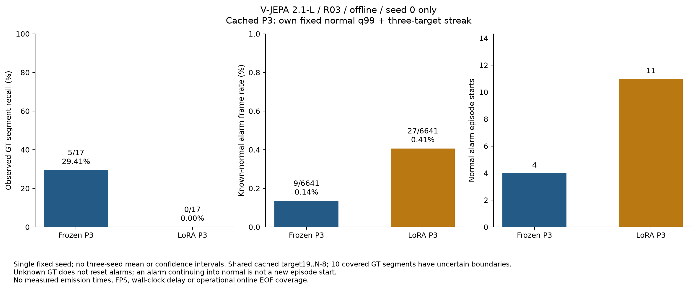

| 조건 | 원 정상 q99 | 정상 통과→streak 경보 / 6,641 | 이상 통과→streak 경보 / 4,922 |
|---|---:|---:|---:|
| 고정 | 16.675394 | 45→9 | 58→21 |
| LoRA | 1.321850 | 80→27 | 0→0 |

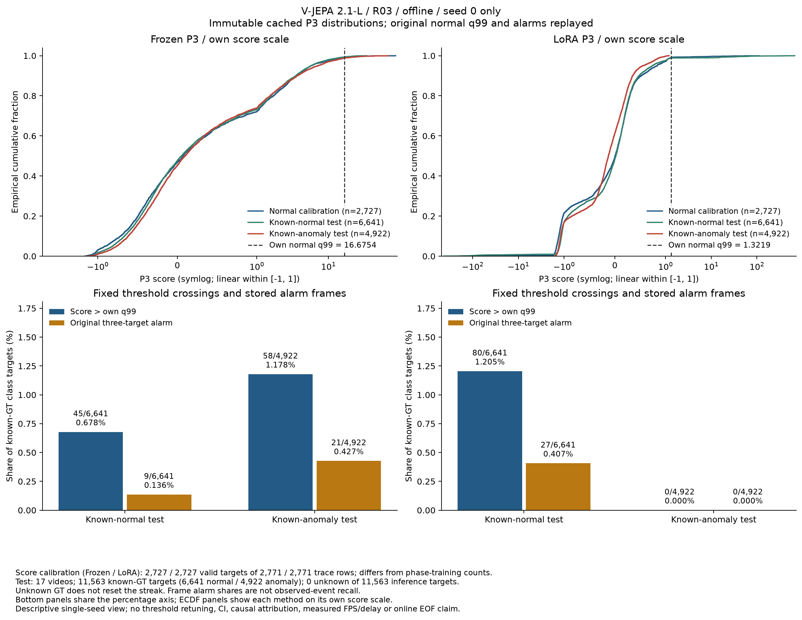

각 calibration trace 2,771개 중 유효 점수 2,727개로 원 q99를 재계산했다. LoRA는 유효 이상 target에서 원 q99 통과와 경보가 모두 0개였으며 정상 경보는 늘었다. P3 AP의 고정 대비 paired CI가 음수인 전체 ranking 결과와 함께 해석한다. 두 조건 점수 공간·보정이 다르므로 q99 크기의 감소를 성능이나 원인으로 해석하지 않는다. ECDF는 각 자체 점수 축, 아래 패널은 동일 비율 축을 사용한다. 정상 구간으로 이어진 경보는 새 episode 시작이 아니다. Threshold·점수 부호·epoch를 테스트로 재선택하지 않았다.

[개별 pair·감사·영상별 경보](../results/stage05/cached_alarm_coverage/single_seed/vjepa21-l/offline/R03/seed0/cached_alarm_pair.json), [분포·통과·source/annotation hash](../results/stage05/score_distributions/vjepa21-l/offline/R03/seed0/score_distributions.json), [게시 검증](../results/setup/primary16_matrix_cached64_publication_check.json)을 제공한다. 실제 두 CPU 분석의 종료 코드 0과 두 PNG 검토를 확인했다. 한 고정 seed의 기술통계이며 새 CI·학습 seed 변동·teacher 손실만의 원인·측정 FPS/지연·온라인 EOF 성능은 주장하지 않는다.

```bash
PYTHONPATH=src:scripts python scripts/report_single_cached_alarm_pair.py --model vjepa21-l --mode offline --device R03 --seed 0 --data-root ../IPAD_dataset/IPAD_dataset --out results/stage05/cached_alarm_coverage/single_seed/vjepa21-l/offline/R03/seed0 --figure docs/figures/stage05/vjepa21-l_R03_offline_seed0_single_cached_alarm_pair
PYTHONPATH=src:scripts python scripts/report_cached_score_distributions.py --audit-report results/stage05/cached_alarm_coverage/single_seed/vjepa21-l/offline/R03/seed0/cached_alarm_pair.json --out results/stage05/score_distributions/vjepa21-l/offline/R03/seed0 --figure docs/figures/stage05/vjepa21-l_R03_offline_seed0_score_distributions
```

## R03 결과를 포함한 전체 65조건의 캐시 알람 재검증

새 독립 감사와 연결해 **고정 백본 48 + 완료 LoRA 17 = 65조건**의 정상 q99·3-target streak·GT·P0–P3 raw/보정 점수·저장 알람을 기존 CPU 코드로 재검산했다. Source **4,439개**와 실제 annotation **66개**의 hash를 확인했다. 이전 64조건의 모든 영상별 결과 및 21개 완결 세-seed 그룹은 정확히 동일하며, 새 V-JEPA seed 1은 그룹 평균에 추가하지 않아 **21그룹(고정 16·LoRA 5)**을 제공한다. V-JEPA R03 seeds 0/1은 개별 결과만 제공한다.

| R03 오프라인 개별 조건 | 구간 탐지 고정→LoRA / 17 | 정상 경보 고정→LoRA / 6,641 | 정상 시작 고정→LoRA |
|---|---:|---:|---:|
| dinov3-l_seed0 | 6→10 | 45→107 | 7→12 |
| dinov3-l_seed1 | 6→10 | 44→30 | 7→10 |
| dinov3-l_seed2 | 6→10 | 46→53 | 7→15 |
| vjepa21-l_seed0 | 5→0 | 9→27 | 4→11 |
| vjepa21-l_seed1 | 7→5 | 3→12 | 3→10 |

DINOv3 R03 세 seed의 LoRA 관측 구간 탐지는 각각 10/17개로 평균 **58.82%**다. 정상 경보 프레임은 107/30/53개로 평균 **0.954%**, 정상 episode 시작은 12/10/15회다. 고정 백본은 각각 6/17개로 평균 **35.29%**, 정상 경보 프레임 45/44/46개로 평균 **0.678%**, 정상 시작은 모두 7회다. 평균은 exact seeds0/1/2 산술평균이며 경보 집계에는 CI를 산출하지 않았다. 같은 그룹 P3 ranking 차이의 두 paired CI는 0을 포함한다. V-JEPA R03 seeds 0/1의 탐지 감소·정상 경보 증가와 다른 seed들의 편차를 함께 보고한다.


원은 exact 세-seed 평균, ×는 개별 seed이며 CI가 아니다. Cached target19..N−8에서 GT 필터 전 streak를 재생하며 unknown은 streak를 초기화하지 않는다. 관측 구간에는 경계 불확실성이 있다. R02/12·13·14 정렬 미확정 및 기존 18개 GT 제외 규칙을 유지했다. 실제 방출 시각·FPS·wall-clock 지연·온라인 EOF 성능을 주장하지 않는다.

[65조건·21그룹·영상별 결과·source/annotation hash](../results/stage05/cached_alarm_coverage_R01_R02_R03_partial17/cached_alarm_coverage.json), [연결된 17조건 감사](../results/stage04/retained_matrix_audit_R01_R02_R03_partial17/validation.json), [게시 검증](../results/setup/primary17_matrix_cached65_publication_check.json)을 제공한다. 이전 54·57·60·62·64조건 및 모든 개별 q99/분포 snapshot을 보존했다.

```bash
PYTHONPATH=src:scripts python scripts/report_cached_alarm_coverage.py --root results/stage04/retained_matrix_audit_R01_R02_R03_partial17 --data-root ../IPAD_dataset/IPAD_dataset --out results/stage05/cached_alarm_coverage_R01_R02_R03_partial17 --figures docs/figures/stage05/cached_R01_R02_R03_partial17
```

## V-JEPA R03 seed 1의 고정 임계값 알람과 점수 분포

같은 seed 두 방법의 **17개 테스트·11,563개 유효 GT/inference target(정상 6,641·이상 4,922·unknown 0)**을 비교했다. 원 정상-only 자체 q99·3-target streak를 유지하고 원 선택 모델/메모리·GT·P3 점수·경보/시작을 검산했다. 관측 구간 17개 중 10개는 경계가 불확실하다.

| 조건 | 탐지 구간 / 17 | 정상 경보 / 6,641 | 정상 episode 시작 |
|---|---:|---:|---:|
| 고정 | 7 (41.18%) | 3 (0.045%) | 3 |
| LoRA | 5 (29.41%) | 12 (0.181%) | 10 |

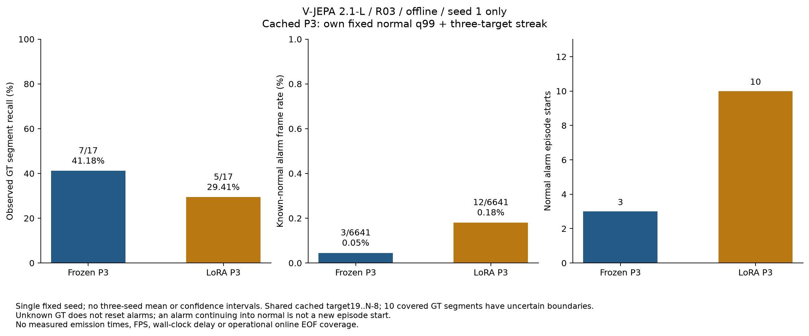

| 조건 | 원 정상 q99 | 정상 통과→streak 경보 / 6,641 | 이상 통과→streak 경보 / 4,922 |
|---|---:|---:|---:|
| 고정 | 16.154218 | 40→3 | 56→12 |
| LoRA | 123743.986951 | 79→12 | 58→6 |

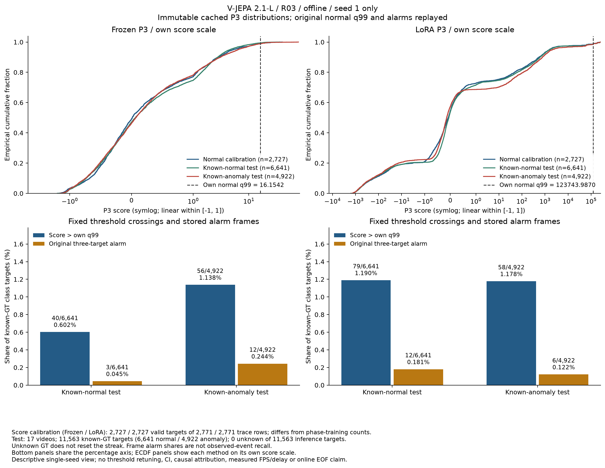

각 calibration trace 2,771개 중 유효 점수 2,727개로 원 q99를 재계산했다. LoRA의 이상 q99 통과는 56→58개지만 연속 경보는 12→6프레임으로 줄었으며 정상 경보는 늘었다. 전체 ranking 결과의 P3 AUROC/AP 고정 대비 paired CI는 모두 0을 포함했다. 두 조건 점수 공간·보정이 다르므로 q99 크기의 차이를 성능이나 원인으로 해석하지 않는다. ECDF는 각 자체 점수 축, 아래 패널은 동일 비율 축을 사용한다. 정상 구간으로 이어진 경보는 새 episode 시작이 아니다. Threshold·점수 부호·epoch를 테스트로 재선택하지 않았다.

[개별 pair·감사·영상별 경보](../results/stage05/cached_alarm_coverage/single_seed/vjepa21-l/offline/R03/seed1/cached_alarm_pair.json), [분포·통과·source/annotation hash](../results/stage05/score_distributions/vjepa21-l/offline/R03/seed1/score_distributions.json), [게시 검증](../results/setup/primary17_matrix_cached65_publication_check.json)을 제공한다. 실제 두 CPU 분석의 종료 코드 0과 두 PNG 검토를 확인했다. 한 고정 seed의 기술통계이며 새 CI·학습 seed 변동·teacher 손실만의 원인·측정 FPS/지연·온라인 EOF 성능은 주장하지 않는다.

```bash
PYTHONPATH=src:scripts python scripts/report_single_cached_alarm_pair.py --model vjepa21-l --mode offline --device R03 --seed 1 --data-root ../IPAD_dataset/IPAD_dataset --out results/stage05/cached_alarm_coverage/single_seed/vjepa21-l/offline/R03/seed1 --figure docs/figures/stage05/vjepa21-l_R03_offline_seed1_single_cached_alarm_pair
PYTHONPATH=src:scripts python scripts/report_cached_score_distributions.py --audit-report results/stage05/cached_alarm_coverage/single_seed/vjepa21-l/offline/R03/seed1/cached_alarm_pair.json --out results/stage05/score_distributions/vjepa21-l/offline/R03/seed1 --figure docs/figures/stage05/vjepa21-l_R03_offline_seed1_score_distributions
```

## R03 세 seed를 포함한 전체 66조건의 캐시 알람 재검증

고정 백본 **48 + LoRA 18 = 66조건**, 완결 세-seed **22그룹(고정 16·LoRA 6)**의 정상 q99·GT·P0–P3 점수·저장 알람을 원 CPU 코드로 재검산했다. 실제 annotation 66개와 source hash를 확인했다. 이전 65조건·21그룹의 모든 결과는 그대로 보존됐다.

| R03 오프라인 개별 조건 | 탐지 구간 고정→LoRA / 17 | 정상 경보 고정→LoRA / 6,641 | 정상 시작 고정→LoRA |
|---|---:|---:|---:|
| dinov3-l seed 0 | 6→10 | 45→107 | 7→12 |
| dinov3-l seed 1 | 6→10 | 44→30 | 7→10 |
| dinov3-l seed 2 | 6→10 | 46→53 | 7→15 |
| vjepa21-l seed 0 | 5→0 | 9→27 | 4→11 |
| vjepa21-l seed 1 | 7→5 | 3→12 | 3→10 |
| vjepa21-l seed 2 | 8→8 | 31→25 | 15→7 |


원은 exact 세-seed 평균, ×는 개별 seed이며 CI가 아니다. 고정 q99·3-target streak를 사용하고 unknown은 streak를 초기화하지 않는다. R02의 기존 정렬 미확정과 GT 제외 규칙을 유지했다. 경보 평균에 새 CI를 계산하지 않았다.

| Seed 2 조건 | 원 정상 q99 | 정상 통과→streak 경보 / 6,641 | 이상 통과→streak 경보 / 4,922 |
|---|---:|---:|---:|
| 고정 | 16.224263 | 74→31 | 67→28 |
| LoRA | 3.676252 | 119→25 | 345→251 |

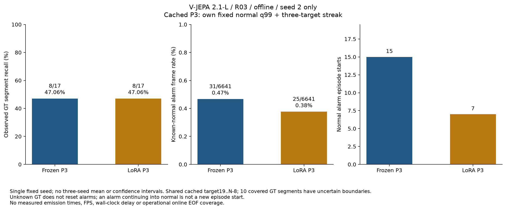

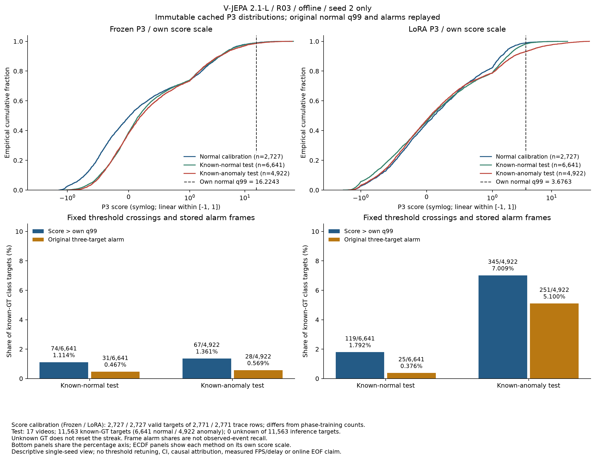

두 조건의 점수 공간·정상 보정이 다르므로 q99 크기를 성능이나 원인으로 비교하지 않는다. Calibration 2,771개 trace 중 유효 점수 2,727개로 원 q99를 재계산하며, 테스트 점수로 재설정하지 않았다. Target index와 cached 알람은 wall-clock 지연·FPS·실제 방출 시각·온라인 EOF 성능이 아니다. 관측 이벤트 경계의 불확실성을 유지했다.

[66조건·22그룹·개별 영상·source/annotation hash](../results/stage05/cached_alarm_coverage_R01_R02_R03_partial18/cached_alarm_coverage.json), [Seed 2 pair와 독립 감사](../results/stage05/cached_alarm_coverage/single_seed/vjepa21-l/offline/R03/seed2/cached_alarm_pair.json), [점수 분포·통과·경보](../results/stage05/score_distributions/vjepa21-l/offline/R03/seed2/score_distributions.json), [게시 검증](../results/setup/primary18_VJ_R03_seed2_matrix_cached66_publication_check.json)을 제공한다. 원 CPU 명령 7개의 실제 종료 코드 0, 원 전체 평가 plot의 실제 종료 코드 0, 총 PNG 16개 직접 검토를 확인했다. 이전 snapshot을 보존하며 전체 온라인·오프라인·실시간 비교는 계속 수행한다.

## R04 seed 0을 포함한 전체 67조건의 캐시 알람 재검증

고정 **48 + LoRA 19 = 67조건**, 완결 세-seed **22그룹(고정 16·LoRA 6)**을 실제 정상 보정·GT·점수·알람으로 재검산했다. 기존 **66조건·22그룹**은 그대로 유지한다. R04는 단일 seed이며 새 세-seed 평균을 만들지 않았다.

| R04 seed 0 P3 | 원 정상 q99 | 탐지 구간 / 전체 | 정상 경보 프레임 / 3,159 | 정상 경보 시작 |
|---|---:|---:|---:|---:|
| 고정 | 14.213017 | 7 / 26 | 7 | 5 |
| LoRA | 4.618483 | 13 / 26 | 12 | 5 |

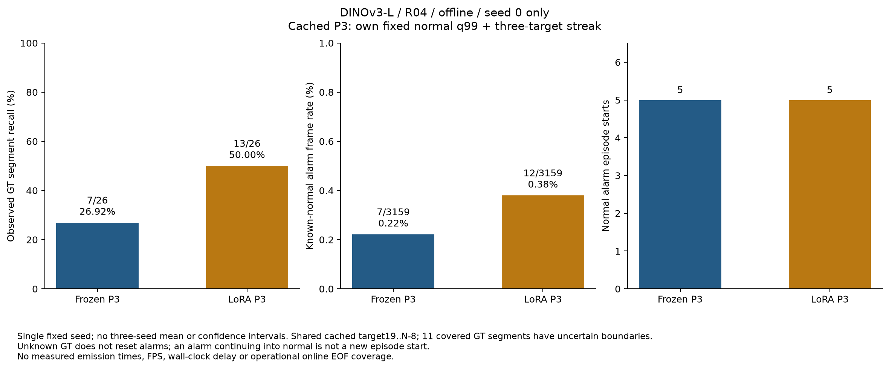


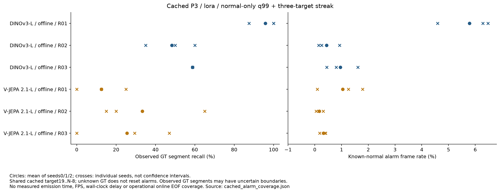


정상 전용 q99·3-target streak를 유지했으며 unknown에서 streak를 초기화하지 않는다. 자체 보정과 점수 공간이 다르므로 q99 크기를 원인이나 성능으로 비교하지 않는다. 공통 GT mask의 target-index cached 경보이며 실제 FPS·wall-clock 지연·방출 시각·온라인 EOF 성능을 뜻하지 않는다. Alarm 그룹 평균에는 새 CI를 계산하지 않았다. [67조건·22그룹과 영상별 결과](../results/stage05/cached_alarm_coverage_R01_R02_R03_R04_partial19/cached_alarm_coverage.json), [단일 pair 감사](../results/stage05/cached_alarm_coverage/single_seed/dinov3-l/offline/R04/seed0/cached_alarm_pair.json), [점수 분포](../results/stage05/score_distributions/dinov3-l/offline/R04/seed0/score_distributions.json), [게시 검증](../results/setup/primary19_DINO_R04_seed0_matrix_cached67_publication_check.json)을 제공한다. 원 CPU 보고 7개와 원 평가 plot의 실제 종료 코드 0, 총 PNG 16개 직접 검토를 확인한 뒤 게시한다.

## R04 seed 1을 포함한 전체 68조건의 캐시 알람 재검증

고정 **48 + LoRA 20 = 68조건**, 완결 세-seed **22그룹(고정 16·LoRA 6)**을 실제 정상 보정·GT·점수·알람으로 재검산했다. 기존 **67조건·22그룹**은 그대로 유지한다. R04는 두 seeds만 완료했으므로 새 세-seed 평균을 만들지 않았다.

| R04 seed 1 P3 | 원 정상 q99 | 탐지 구간 / 전체 | 정상 경보 프레임 / 3,159 | 정상 경보 시작 |
|---|---:|---:|---:|---:|
| 고정 | 12.513198 | 10 / 26 | 9 | 5 |
| LoRA | 6.225524 | 10 / 26 | 15 | 4 |

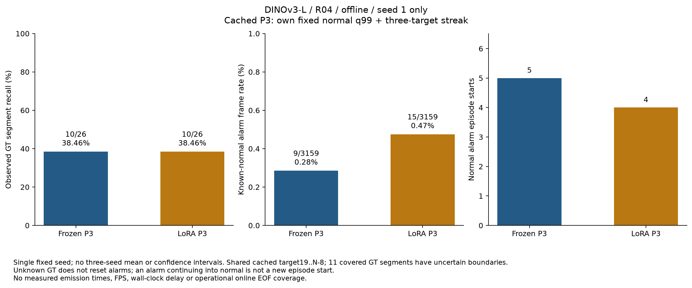

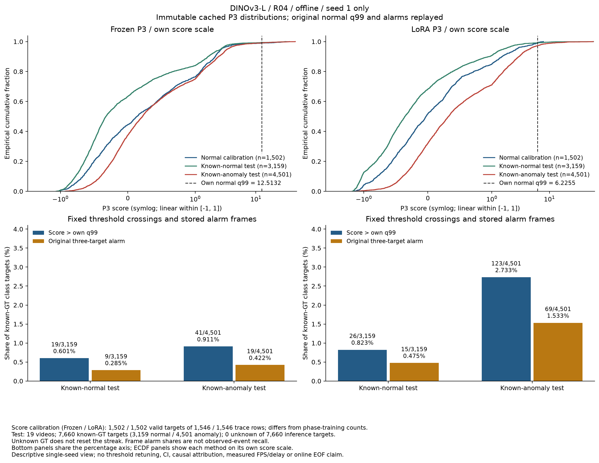


정상 전용 q99·3-target streak를 유지했으며 unknown에서 streak를 초기화하지 않는다. 자체 보정과 점수 공간이 다르므로 q99 크기를 원인이나 성능으로 비교하지 않는다. 공통 GT mask의 target-index cached 경보이며 실제 FPS·wall-clock 지연·방출 시각·온라인 EOF 성능을 뜻하지 않는다. Alarm 그룹 평균에는 새 CI를 계산하지 않았다. [68조건·22그룹과 영상별 결과](../results/stage05/cached_alarm_coverage_R01_R02_R03_R04_partial20/cached_alarm_coverage.json), [단일 pair 감사](../results/stage05/cached_alarm_coverage/single_seed/dinov3-l/offline/R04/seed1/cached_alarm_pair.json), [점수 분포](../results/stage05/score_distributions/dinov3-l/offline/R04/seed1/score_distributions.json), [게시 검증](../results/setup/primary20_DINO_R04_seed1_matrix_cached68_publication_check.json)을 제공한다. 원 CPU 보고 7개와 원 평가 plot의 실제 종료 코드 0, 총 PNG 16개 직접 검토를 확인한 뒤 게시한다.

## R04 세-seed를 포함한 전체 69조건의 캐시 알람 재검증

고정 **48 + LoRA 21 = 69조건**, 완결 세-seed **23그룹(고정 16·LoRA 7)**을 실제 정상 보정·GT·점수·알람으로 재검산했다. 기존 **68조건·22그룹**을 보존하고 DINOv3 R04 LoRA의 세-seed 그룹 하나를 추가했다.

| R04 seed 2 P3 | 원 정상 q99 | 탐지 구간 / 전체 | 정상 경보 프레임 / 3,159 | 정상 경보 시작 |
|---|---:|---:|---:|---:|
| 고정 | 14.983632 | 7 / 26 | 9 | 5 |
| LoRA | 5.700166 | 12 / 26 | 4 | 3 |

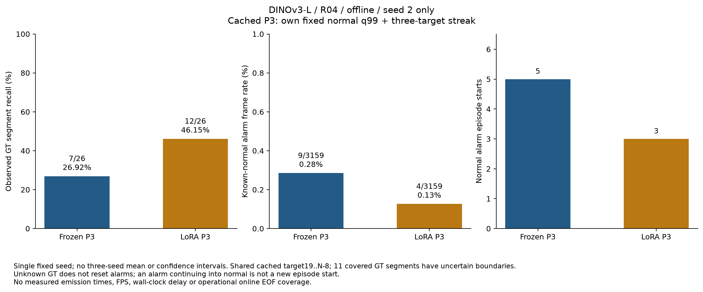

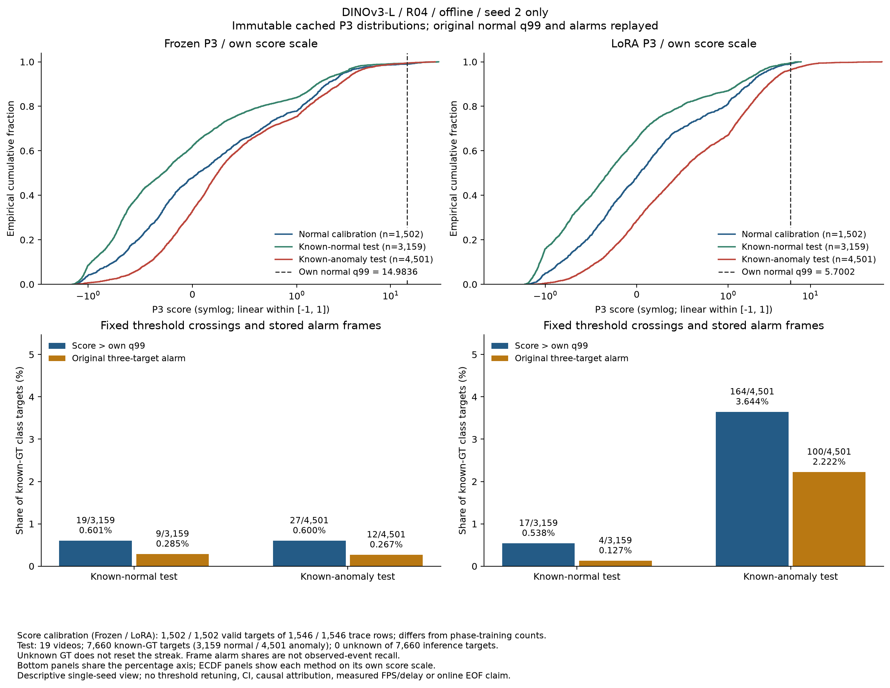


정상 전용 q99·3-target streak를 유지했으며 unknown에서 streak를 초기화하지 않는다. 자체 보정과 점수 공간이 다르므로 q99 크기를 원인이나 성능으로 비교하지 않는다. 공통 GT mask의 target-index cached 경보이며 실제 FPS·wall-clock 지연·방출 시각·온라인 EOF 성능을 뜻하지 않는다. Alarm 그룹 평균에는 새 CI를 계산하지 않았다. [69조건·23그룹과 영상별 결과](../results/stage05/cached_alarm_coverage_R01_R02_R03_R04_partial21/cached_alarm_coverage.json), [단일 pair 감사](../results/stage05/cached_alarm_coverage/single_seed/dinov3-l/offline/R04/seed2/cached_alarm_pair.json), [점수 분포](../results/stage05/score_distributions/dinov3-l/offline/R04/seed2/score_distributions.json), [게시 검증](../results/setup/primary21_DINO_R04_seed2_matrix_cached69_publication_check.json)을 제공한다. 원 CPU 보고 7개·별도 CPU Macro4 plot·원 평가 plot의 실제 종료 코드 0, 총 PNG 18개 직접 검토를 확인한 뒤 게시한다.

## V-JEPA R04 seed 0을 포함한 전체 70조건의 캐시 알람 재검증

고정 **48 + LoRA 22 = 70조건**, 완결 세-seed **23그룹(고정 16·LoRA 7)**을 실제 정상 보정·GT·점수·알람으로 재검산했다. 기존 **69조건·23그룹**을 보존하고 V-JEPA R04 seed 0의 LoRA 조건 하나만 추가했다. 세-seed 그룹 평균은 그대로다.

| V-JEPA R04 seed 0 P3 | 원 정상 q99 | 탐지 구간 / 전체 | 정상 경보 프레임 / 3,159 | 정상 경보 시작 |
|---|---:|---:|---:|---:|
| 고정 | 4.035735 | 12 / 26 | 10 | 3 |
| LoRA | 105.707058 | 0 / 26 | 0 | 0 |

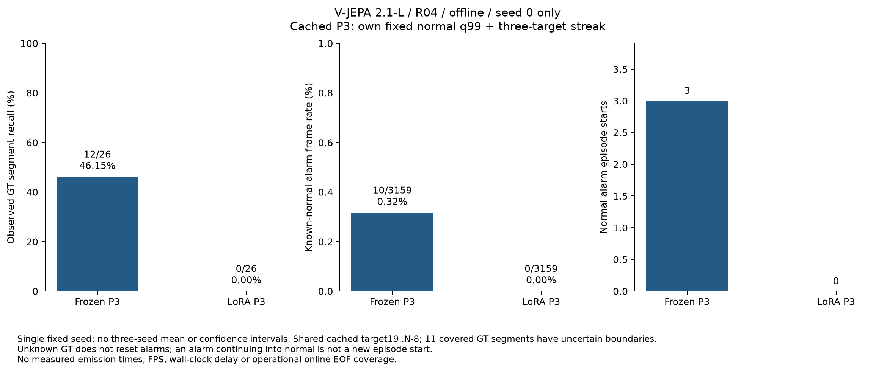

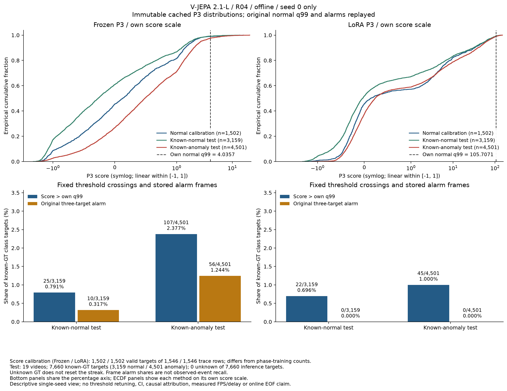

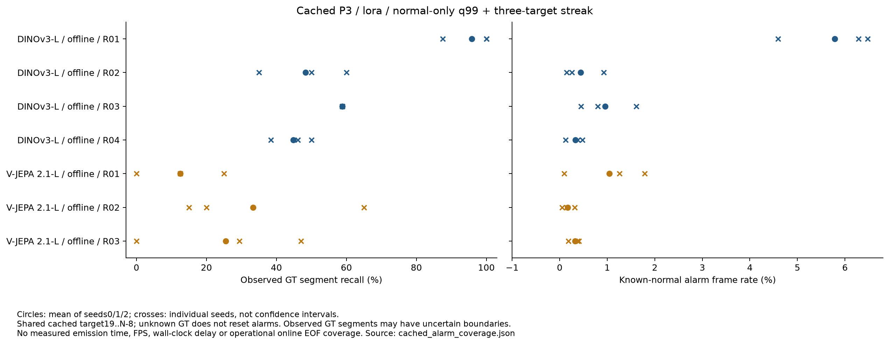

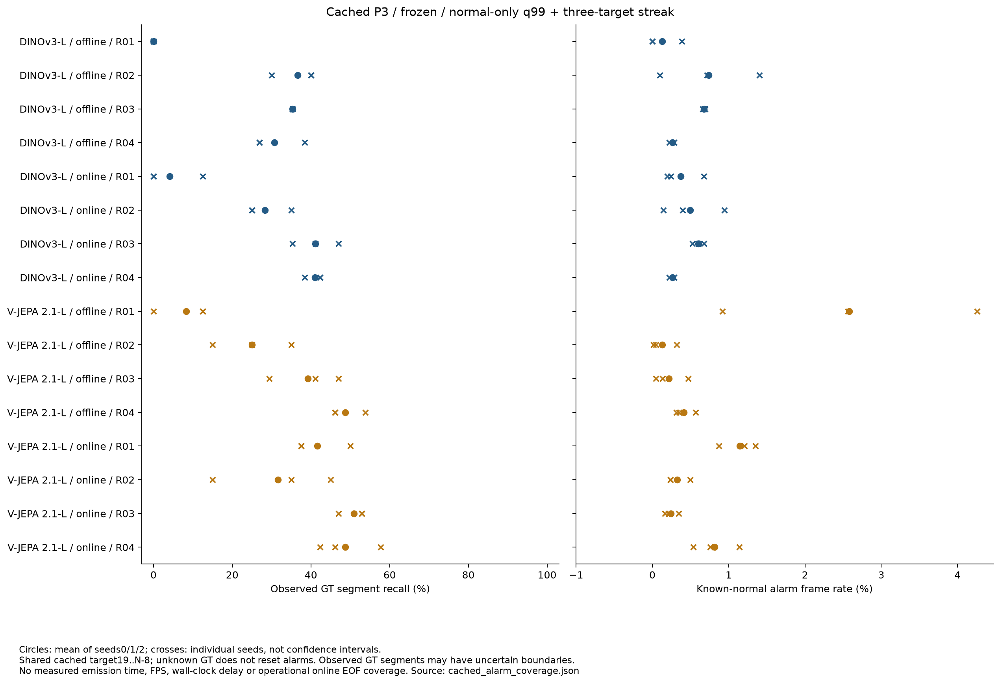

정상 전용 q99·3-target streak를 유지했으며 unknown에서 streak를 초기화하지 않는다. 자체 보정과 점수 공간이 다르므로 q99 크기를 원인이나 성능으로 비교하지 않는다. 공통 GT mask의 target-index cached 경보이며 실제 FPS·wall-clock 지연·방출 시각·온라인 EOF 성능을 뜻하지 않는다. Alarm 그룹 평균에는 새 CI를 계산하지 않았다. [70조건·23그룹과 영상별 결과](../results/stage05/cached_alarm_coverage_R01_R02_R03_R04_partial22/cached_alarm_coverage.json), [단일 pair 감사](../results/stage05/cached_alarm_coverage/single_seed/vjepa21-l/offline/R04/seed0/cached_alarm_pair.json), [점수 분포](../results/stage05/score_distributions/vjepa21-l/offline/R04/seed0/score_distributions.json), [게시 검증](../results/setup/primary22_VJ_R04_seed0_matrix_cached70_publication_check.json)을 제공한다. 원 CPU 보고 7개·별도 CPU Macro4 plot·원 평가 plot의 실제 종료 코드 0과 총 PNG 18개 직접 검토를 확인한 뒤 게시한다.
